# Claude Code Workspace — Arquitetura Completa

> Guia de referencia para navegar todas as skills, automacoes, integrações e mecanismos deste workspace.
> Atualizado: 2026-03-10

---

## Visao Geral

Este workspace e um **sistema operacional pessoal** construido sobre Claude Code. Ele combina skills customizadas, hooks de automacao, knowledge files, servicos FastAPI e um vault Obsidian para gerenciar trabalho, decisoes e conteudo.

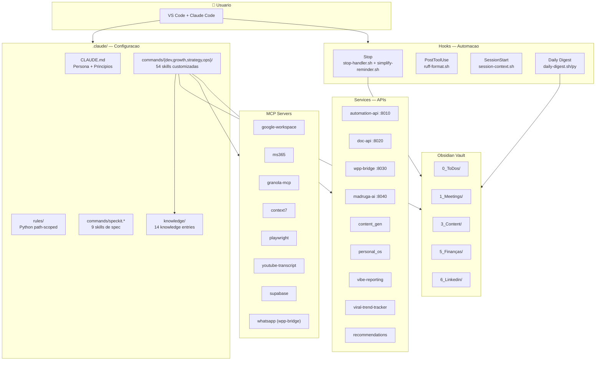

---

## Princípios de Design

| # | Princípio | Regra |
|---|-----------|-------|
| 1 | Obsidian = interface, Claude Code = motor | Obsidian pra ver/navegar. Claude Code pra processar/gerar. |
| 2 | Markdown é o contrato | Claude escreve formatos que Obsidian reconhece. Obsidian armazena o que Claude sabe ler. |
| 3 | Skills > MCP | MCP só para APIs real-time (email, calendario). Todo o resto vira Skill. |
| 4 | Draft first, act second | Nenhuma ação externa sem review do Gabriel. |
| 5 | Git é o undo universal | Todo arquivo no repo. Todo erro é reversível. |
| 6 | Token budget consciente | Cada MCP consome ~10k+ tokens. Skills carregam sob demanda. |
| 7 | Vault no OneDrive, repo no Git | Vault = backup automático + mobile. Repo = motor que manipula o vault. |

---

## Skills

### Skills Customizadas (54)

Organizadas em 4 categorias: `dev/` (15), `growth/` (9), `strategy/` (8), `ops/` (13) + `speckit` (9).

Invocadas com `/nome` ou `/categoria:nome` no chat. Cada skill tem frontmatter YAML com description, arguments e flags opcionais.

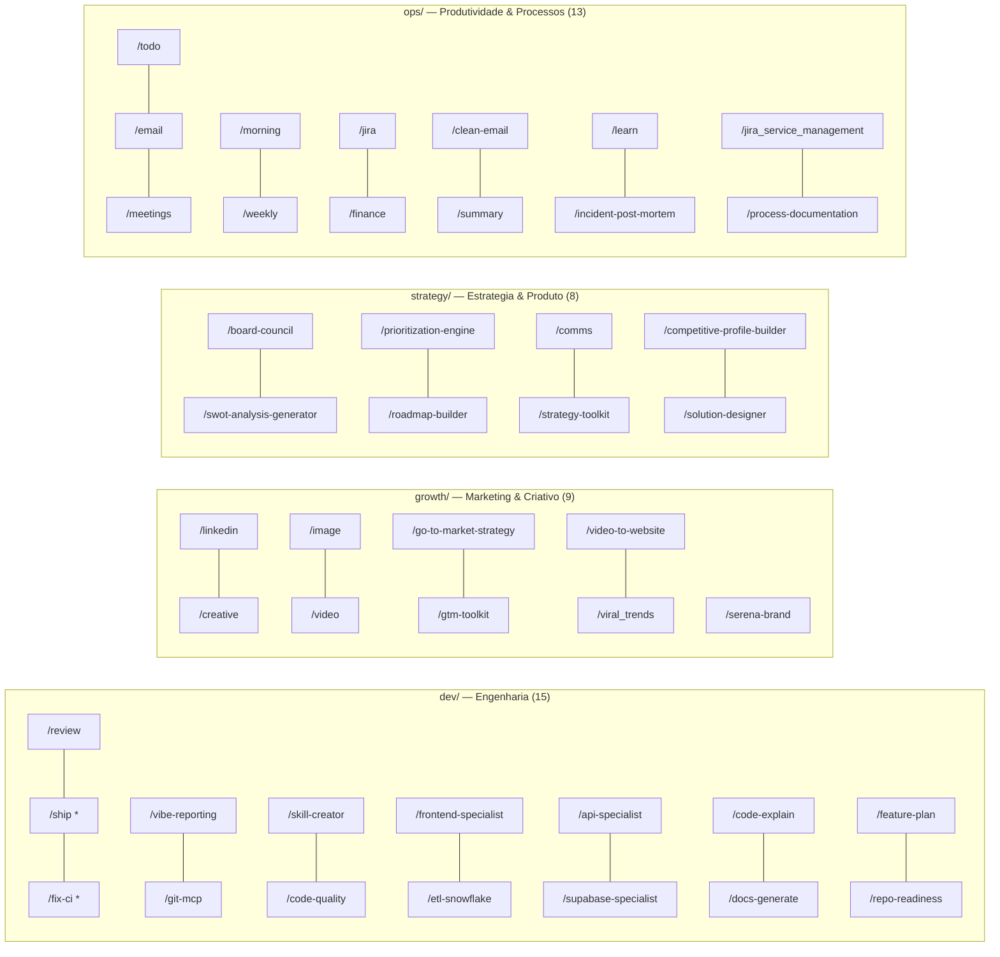

> \* = `disable-model-invocation: true` — Claude NAO invoca automaticamente (side effects irreversiveis)

| Skill | O que faz | Knowledge | Vault |
|-------|-----------|-----------|-------|
| `/todo` | Gerencia todos GTD no Kanban Obsidian | vault-knowledge | `0_ToDos/` |
| `/meetings` | Sincroniza Granola, atualiza Meeting Cards, cria todos | vault-knowledge | `1_Meetings/` |
| `/email` | Gerencia emails Gmail + Outlook com roteamento automatico | email-knowledge | — |
| `/clean-email` | Limpa inbox Gmail: newsletters, promos, classificacao | email-knowledge | — |
| `/morning` | Ritual matinal: clean-email + meetings sync + briefing | email-knowledge, vault-knowledge | — |
| `/weekly` | Revisao semanal: metricas GTD, carry-over, decisoes | vault-knowledge | `9_System/DailyLog/` |
| `/summary` | Resume conteudo (YouTube, audio, doc, link, texto) | — | `3_Content/Summarys/` |
| `/ship` \* | Commit + push seguindo Conventional Commits | — | — |
| `/fix-ci` \* | Diagnostica e corrige falhas de CI no GitHub Actions | — | — |
| `/review` | Code review antes de PR (modo harsh ou grill) | — | — |
| `/vibe-reporting` | Dashboard HTML de metricas DORA + reports executivos | — | — |
| `/git-mcp` | Operacoes GitHub via gh CLI (repos, PRs, issues, DORA) | — | — |
| `/repo-readiness` | Dashboard HTML com score de readiness por repo | — | — |
| `/etl-snowflake` | Guia para criar ETL pipelines para Snowflake | — | — |
| `/linkedin` | Conteudo LinkedIn: create, hooks, review, calendar, metrics | linkedin-knowledge | `6_Linkedin/` |
| `/viral_trends` | Coleta e analisa trends TikTok/YouTube | viral-frameworks | `7_Media/Trends/` |
| `/creative` | Diretor criativo visual: briefs, direcoes PRISM, moodboard | creative-knowledge | — |
| `/image` | Executor de imagens via Gemini: gera, edita, upscale | image-knowledge | — |
| `/video` | Gera videos via Veo 3.1: anima hero images (I2V) e clips (T2V) | video-knowledge | — |
| `/serena-brand` | Diretrizes de marca da Serena Energia | serena-brand/ (dir) | — |
| `/jira` | Consultar issues via JQL, extrair dados, analisar metricas | jira-knowledge | — |
| `/jira_service_management` | Dashboard HTML de KPIs de service desk | jira-knowledge | — |
| `/finance` | Portfolio pessoal: rebalance, FIRE, deep-dive, market | hamu-financials | `5_Finanças/` |
| `/learn` | Spaced repetition com SM-2: ensina, testa, salva cards | — | `3_Content/Learning/` |
| `/skill-creator` | Meta-skill: cria novas skills com convencoes embutidas | — | — |
| `/incident-post-mortem` | Post-mortem blameless com 5 Whys, timeline, action items | — | — |
| `/process-documentation` | Documenta processos como SOPs e runbooks | — | — |
| `/solution-designer` | Design de solucao com OKRs, epicos e decision log | — | — |
| `/competitive-profile-builder` | Perfil estrategico de concorrente com DHM + SWOT | — | — |
| `/api-specialist` | Cria, protege e testa endpoints Next.js (App Router + TS) | — | — |
| `/supabase-specialist` | Edge Functions (Deno) + TypeScript types do schema | — | — |
| `/code-explain` | Explica codigo com diagramas Mermaid e breakdown progressivo | — | — |
| `/code-quality` | Refactora, otimiza e lint de codigo | — | — |
| `/docs-generate` | Gera documentacao para codigo, APIs e componentes | — | — |
| `/feature-plan` | Planeja implementacao de features com specs tecnicas | — | — |
| `/frontend-specialist` | Orienta decisoes de UI, brand guidelines, orquestra plugins | — | — |

### SpecKit (9 skills)

Localizacao: `.claude/commands/speckit.*.md`

Framework de especificacao de features. Pipeline: specify → clarify → plan → tasks → implement.

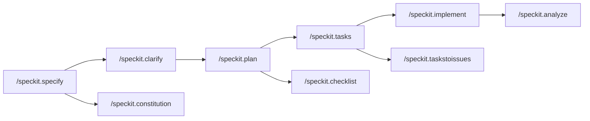

| Skill | O que faz |
|-------|-----------|
| `speckit.specify` | Cria/atualiza spec.md a partir de descricao natural |
| `speckit.clarify` | Identifica areas vagas na spec e faz perguntas |
| `speckit.plan` | Gera plano de implementacao (plan.md) |
| `speckit.tasks` | Gera tasks.md com dependencias ordenadas |
| `speckit.implement` | Executa todas as tasks do tasks.md |
| `speckit.taskstoissues` | Converte tasks em GitHub Issues |
| `speckit.analyze` | Analise de consistencia spec/plan/tasks |
| `speckit.checklist` | Gera checklist customizado para a feature |
| `speckit.constitution` | Cria/atualiza constituicao do projeto |

> Skills utilitarias (code-quality, api-specialist, etl-snowflake, etc.) estao em `dev/`.

### Plugins Claude (Anthropic + Marketplaces)

Plugins ativados via `settings.json` (`enabledPlugins`):

| Plugin | Marketplace | Skills incluidas |
|--------|------------|------------------|
| `document-skills` | `anthropic-agent-skills` | `/pdf`, `/pptx`, `/docx`, `/xlsx`, `/frontend-design`, `/canvas-design`, `/webapp-testing`, `/mcp-builder`, `/skill-creator` (Anthropic), `/theme-factory`, `/algorithmic-art`, `/doc-coauthoring`, `/web-artifacts-builder`, `/slack-gif-creator`, `/internal-comms`, `/brand-guidelines` |
| `financial-analysis` | `financial-services-plugins` | `/3-statement-model`, `/dcf`, `/lbo`, `/comps`, `/competitive-analysis`, `/check-deck`, `/ppt-template`, `/debug-model` |
| `equity-research` | `financial-services-plugins` | `/earnings`, `/earnings-preview`, `/initiate`, `/model-update`, `/sector`, `/thesis`, `/catalysts`, `/screen`, `/morning-note` |
| `investment-banking` | `financial-services-plugins` | `/cim`, `/teaser`, `/one-pager`, `/merger-model`, `/deal-tracker`, `/buyer-list`, `/process-letter` |
| `private-equity` | `financial-services-plugins` | `/screen-deal`, `/value-creation`, `/dd-checklist`, `/returns`, `/dd-prep`, `/ic-memo`, `/portfolio`, `/unit-economics`, `/source` |
| `wealth-management` | `financial-services-plugins` | `/proposal`, `/tlh`, `/financial-plan`, `/rebalance`, `/client-report`, `/client-review` |
| `operations` | `knowledge-work-plugins` | `/runbook`, `/change-request`, `/process-doc`, `/vendor-review`, `/status-report`, `/capacity-plan` |

---

## Hooks — Automacao Event-Driven

Configurados em `~/.claude/settings.json`. Executam automaticamente em resposta a eventos do Claude Code.

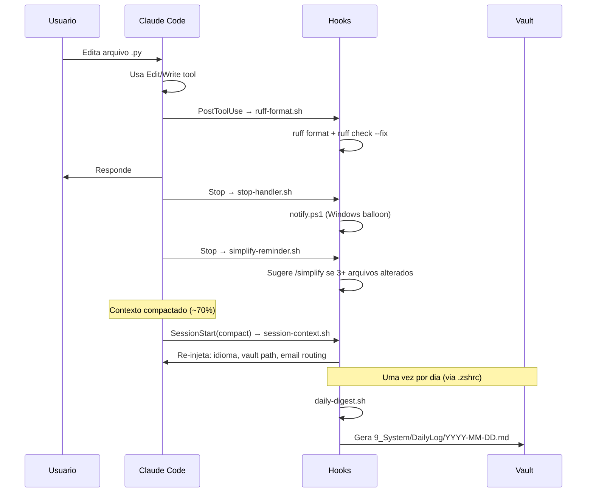

**Claude Code Hooks** (configurados em `settings.json`):

| Hook | Evento | Matcher | O que faz | Timeout |
|------|--------|---------|-----------|---------|
| `stop-handler.sh` | Stop | — | Notificacao Windows via PowerShell (pula se VS Code ativo) | 30s |
| `simplify-reminder.sh` | Stop | — | Sugere `/simplify` quando 3+ arquivos de codigo alterados | 10s |
| `ruff-format.sh` | PostToolUse | `Edit\|Write` | Auto-format + lint Python com ruff | 10s |
| `session-context.sh` | SessionStart | `compact` | Re-injeta contexto critico apos compactacao | 5s |

**Shell Automation** (roda via `.zshrc`, NAO e hook do Claude Code):

| Script | Trigger | O que faz | Timeout |
|--------|---------|-----------|---------|
| `daily-digest.sh` + `.py` | 1x/dia (primeiro shell aberto) | Escaneia transcripts Claude, gera digest com claude -p (Haiku), salva no vault | 120s |

### Arquivos de Hook

**Source of truth**: `scripts/hooks/` (no repo) — portavel entre maquinas.

```
scripts/hooks/                 # Source of truth (versionado no repo)
├── notify.ps1                 # Notificacao Windows (Win32 P/Invoke)
├── ruff-format.sh             # Auto-format Python
├── session-context.sh         # Re-inject pos-compactacao
├── simplify-reminder.sh       # Sugere /simplify quando 3+ arquivos alterados
├── daily-digest.sh            # Wrapper com lockfile
└── daily-digest.py            # Analisa transcripts → digest

~/.claude/                     # Destino (instalado por maquina)
├── settings.json              # Configuracao de hooks + permissions + plugins
├── notify.ps1                 # ← copiado de scripts/hooks/
└── hooks/
    ├── stop-handler.sh        # Gerado inline pelo install script
    ├── simplify-reminder.sh   # ← copiado de scripts/hooks/
    ├── ruff-format.sh         # ← copiado de scripts/hooks/
    ├── session-context.sh     # ← copiado de scripts/hooks/
    ├── daily-digest.sh        # ← copiado de scripts/hooks/
    └── daily-digest.py        # ← copiado de scripts/hooks/
```

**Setup em nova maquina**: `./scripts/9_hooks_install.sh` — copia todos os hooks, configura `settings.json` e `.zshrc`.

---

## Knowledge — Contexto Especializado

Localizacao: `.claude/knowledge/`

Arquivos que fornecem dados, configuracoes e frameworks para skills. Carregados sob demanda quando uma skill os referencia.

```mermaid
graph TB
    subgraph KN["Knowledge Files (14)"]
        vault["vault-knowledge.md"]
        email["email-knowledge.md"]
        mcpAuth["mcp-auth-knowledge.md"]
        jira["jira-knowledge.md"]
        viral["viral-frameworks.md"]
        linkedin["linkedin-knowledge.md"]
        hamu["hamu-financials.md"]
        wsl["wsl-knowledge.md"]
        creative["creative-knowledge.md"]
        imageKn["image-knowledge.md"]
        videoKn["video-knowledge.md"]
        serena["serena-brand/ (dir)"]
        serenaCtx["serena/ (dir)"]
        resenhai["ResenhAI/ (dir)"]
    end

    subgraph SK["Skills que Consomem"]
        todo["/todo"]
        meetings["/meetings"]
        emailSk["/email"]
        cleanEmail["/clean-email"]
        jiraSk["/jira"]
        jsmSk["/jira_service_management"]
        viralSk["/viral_trends"]
        linkedinSk["/linkedin"]
        financeSk["/finance"]
        serenaSk["/serena-brand"]
        creativeSk["/creative"]
        imageSk["/image"]
        videoSk["/video"]
    end

    vault --> todo
    vault --> meetings
    email --> emailSk
    email --> cleanEmail
    mcpAuth -.-> emailSk
    jira --> jiraSk
    jira --> jsmSk
    viral --> viralSk
    linkedin --> linkedinSk
    hamu --> financeSk
    serena --> serenaSk
    creative --> creativeSk
    imageKn --> imageSk
    videoKn --> videoSk
    wsl -.-> |"abrir arquivos<br/>em Windows"| jsmSk
```

| Arquivo | Conteudo | Usado por |
|---------|----------|-----------|
| `vault-knowledge.md` | Estrutura do vault, GTD flow, plugins, tags | `/todo`, `/meetings` |
| `email-knowledge.md` | Contas (Gmail/Outlook), roteamento, labels | `/email`, `/clean-email` |
| `mcp-auth-knowledge.md` | Guia de autenticacao dos MCPs | `/email` e outros |
| `jira-knowledge.md` | Instancia, credenciais, workflows, campos custom | `/jira`, `/jira_service_management` |
| `viral-frameworks.md` | Taxonomia de hooks, STEPPS, cliente atual | `/viral_trends` |
| `linkedin-knowledge.md` | Posicionamento, headline, estrategia | `/linkedin` |
| `hamu-financials.md` | Portfolio, metas FIRE, perfil investidor | `/finance` |
| `creative-knowledge.md` | Frameworks criativos, PRISM, moodboard | `/creative` |
| `image-knowledge.md` | Config Gemini, estilos, personagens | `/image` |
| `video-knowledge.md` | Config Veo 3.1, I2V/T2V, formatos | `/video` |
| `wsl-knowledge.md` | Comandos WSL2/Windows cross-platform | Skills que abrem browser |
| `serena-brand/` (dir) | Brand guidelines, cores, tipografia, assets | `/serena-brand` |
| `serena/` (dir) | Contexto estrategico e masterplan tech da Serena | `/jira`, skills Serena |
| `ResenhAI/` (dir) | Brand, pricing, competidores, pontuacao, ideias | Skills do ResenhAI |

---

## Memory — Persistencia Entre Sessoes

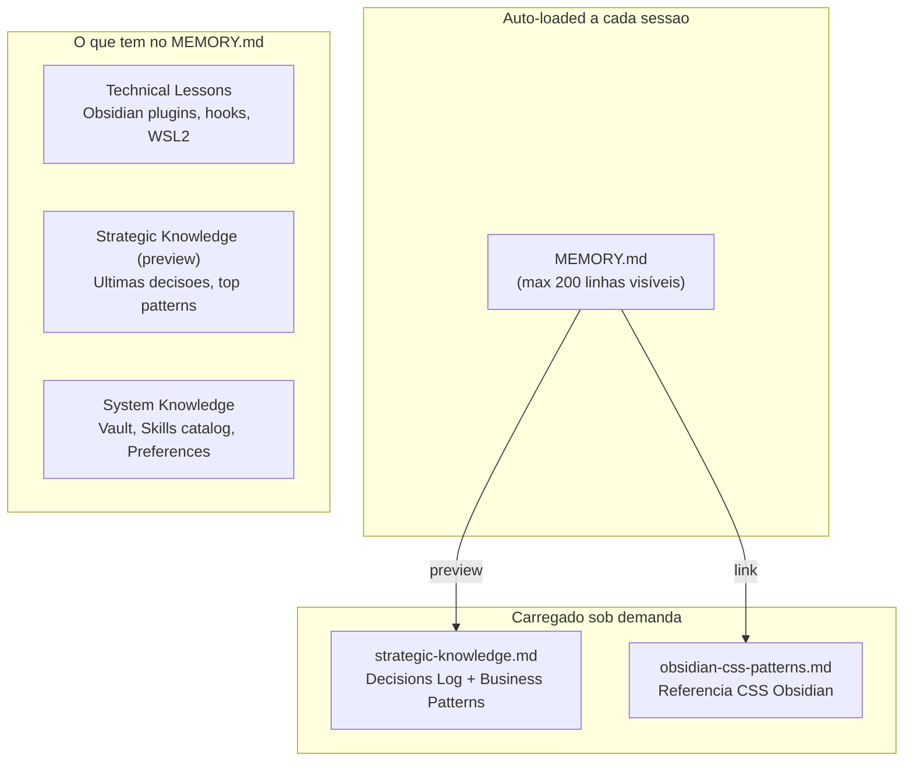

Localizacao: `~/.claude/projects/-home-gabrielhamu-repos-paceautomations-general/memory/`

| Arquivo | Carregamento | Conteudo |
|---------|-------------|----------|
| `MEMORY.md` | Automatico (toda sessao) | Technical lessons, preview estrategico, skills catalog, preferences |
| `strategic-knowledge.md` | Sob demanda | Decisions Log cronologico + Business Patterns validados |
| `obsidian-css-patterns.md` | Sob demanda | Referencia CSS para temas e plugins Obsidian |

### Captura Semi-Automatica

Claude sugere persistir memorias ao detectar:
- Decisao tecnica em fim de conversa → "Salvar no Decisions Log?"
- Decisao estrategica em `/meetings` → linha na tabela de confirmacao
- Licao de debugging (>3 tentativas) → "Salvar em Technical Lessons?"
- Padrao de negocio recorrente (2+ reunioes) → "Adicionar a Business Patterns?"

> NUNCA grava sem aprovacao do usuario.

---

## Governance — CLAUDE.md

Dois niveis de governance controlam o comportamento do Claude:

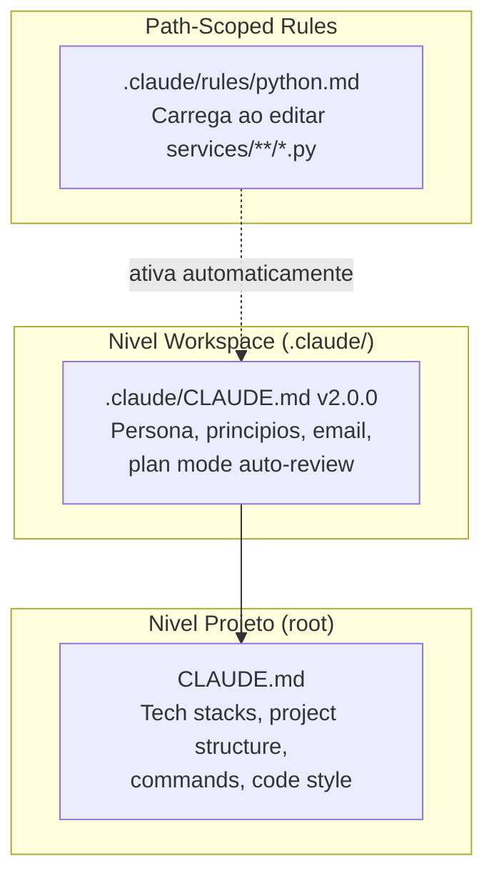

### Persona & Principios (CLAUDE.md v2.0.0)

| Principio | Regra |
|-----------|-------|
| Pragmatismo | "Funciona e entrega valor" > "elegante mas lento" |
| Automatize | Se faz 3x, crie script. Busque APIs/MCPs primeiro |
| Conhecimento estruturado | Contextos atualizados, templates, historico |
| Acao rapida | Prototipe primeiro, ship imperfeito hoje |
| Trade-offs | Sempre apresente alternativas com pros/contras |
| Honestidade brutal | Sem elogios vazios, aponte problemas cedo |

### Plan Mode Auto-Review

Antes de apresentar qualquer plano ao usuario:
1. Subagent "staff engineer" revisa o plano (harsh + direct)
2. Classifica issues: BLOCKER / WARNING / NIT
3. Incorpora feedback automaticamente
4. Apresenta plano melhorado com "Review notes"

### Auto-Simplify

Apos completar task de implementacao com 3+ arquivos alterados:
1. Roda `/simplify` nos arquivos alterados
2. Corrige BLOCKERs antes de apresentar
3. Menciona WARNING/NIT no output
4. Skip para: one-liners, config changes, docs, scripts one-off

### Rules Python (path-scoped)

Ativadas automaticamente ao editar `services/**/*.py` ou `scripts/**/*.py`:
- Linter/formatter: `ruff`
- Logging: `structlog` (nunca print/logging stdlib)
- HTTP: `httpx` async (nunca requests em code novo)
- Config: `pydantic-settings`
- Error handling: nunca `except Exception` generico

---

## Obsidian Vault

Symlink: `./obsidian-vault/` → `/mnt/c/Users/.../OneDrive/obsidian-vault`

O vault e o hub central onde skills salvam output e o usuario consome informacao.

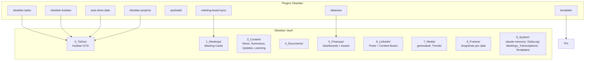

### GTD Flow

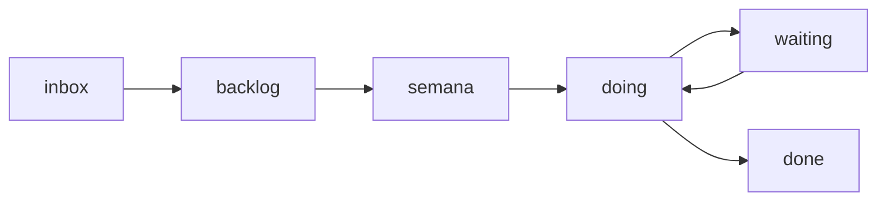

- `auto-done-date`: seta `done_date` automaticamente, sincroniza `next_action`, arquiva apos 7 dias
- `meeting-board-sync`: sincroniza primeira task pendente de `## 📌 Pauta proximo papo` para `_Meetings_board.md`

### Vault ↔ Skills

| Diretorio | Skill | Workflow |
|-----------|-------|---------|
| `0_ToDos/` | `/todo` | Cria, lista, move todos entre colunas GTD |
| `1_Meetings/` | `/meetings` | Granola → meeting card → todos |
| `9_System/DailyLog/` | Hook daily-digest | Gera digest automatico de sessoes Claude |
| `3_Content/News_Updates/` | `/clean-email` | Doc consolidado: newsletters + updates pessoais |
| `3_Content/Summarys/` | `/summary` | Resumos de conteudo |
| `3_Content/Learning/` | `/learn` | Cards de spaced repetition |
| `7_Media/Trends/` | `/viral_trends` | Reports de trends virais |
| `5_Finanças/` | `/finance` | Dashboards + assets com frontmatter YAML |
| `6_Linkedin/` | `/linkedin` | Posts + content board |
| `9_System/Meetings_Transcriptions/` | `/meetings` | Transcricoes completas de reuniao |

---

## Services — APIs e Pipelines

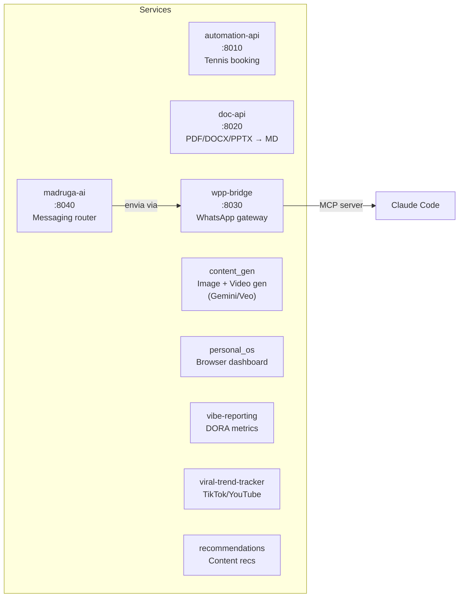

| Servico | Porta | Stack | Descricao |
|---------|-------|-------|-----------|
| `automation-api` | :8010 | Python 3.12, FastAPI, httpx | Automacao de booking de tenis |
| `doc-api` | :8020 | Python 3.11, FastAPI, Docling | Converte PDF/DOCX/PPTX para Markdown |
| `wpp-bridge` | :8030 | Python 3.11, FastAPI, pydantic-settings | Gateway WhatsApp: send + receive + MCP server |
| `madruga-ai` | :8040 | Python 3.11, FastAPI, pydantic-settings | Router de mensagens multi-repo com smart match |
| `content_gen` | — | Python 3.11, google-genai, Pillow | Geracao de imagens (Gemini) e videos (Veo 3.1) |
| `personal_os` | — | Python 3.11, FastAPI | Dashboard browser para executar skills |
| `vibe-reporting-service` | — | Python 3.11 | Gera dashboards DORA + reports executivos |
| `viral-trend-tracker` | — | Python 3.11, Patchright, Whisper | Pipeline de coleta e analise de trends virais |
| `recommendations` | — | Python 3.11 | Motor de recomendacoes de conteudo |

---

## Tools — Ecossistema Completo

### MCP Servers

Servidores que conectam Claude a servicos externos:

**Global** (configurados em `~/.claude/settings.json` — via plugin/workspace):

| MCP | Protocolo | Usado por | Funcao |
|-----|-----------|-----------|--------|
| `google-workspace` | Gmail, Drive, Calendar, Apps Script | `/email`, `/clean-email` | Email pessoal (gabrielhamu@gmail.com) |
| `ms365` | Outlook, Teams, Calendar | `/email` | Email profissional (gabriel.hamu@srna.co) |
| `granola-mcp` | Granola API | `/meetings` | Transcricoes de reuniao |
| `context7` | Library docs | Qualquer skill | Documentacao atualizada de bibliotecas |
| `playwright` | Browser automation | `/webapp-testing` | Teste de aplicacoes web |
| `youtube-transcript` | YouTube API | `/summary` | Transcricoes de video |

**Projeto** (configurados em `.mcp.json`):

| MCP | Tipo | Funcao |
|-----|------|--------|
| `supabase` | HTTP (`mcp.supabase.com`) | Database management |
| `whatsapp` | Stdio (`wpp-bridge/run-mcp.sh`) | Envio de mensagens WhatsApp via wpp-bridge |

**Desabilitados** (em `.claude/settings.local.json`): `perplexity`, `firecrawl`, `sequential-thinking`

### Scripts Utilitarios

Localizacao: `scripts/`

| Script | Tipo | Funcao |
|--------|------|--------|
| `1_setup-obsidian-vault.sh` | Setup | Configura symlink WSL2 ↔ OneDrive vault |
| `2_mcp_install.sh` | Setup | Instala MCP servers |
| `3_whisper_installation.sh` | Setup | Instala Whisper para transcricao |
| `4_youtube_transcript.sh` | Setup | Configura MCP YouTube transcript |
| `5_claude_skills.sh` | Setup | Instala Claude Skills plugins (Documents, Financial, Operations) |
| `6_github_cli.sh` | Setup | Configura GitHub CLI (gh) |
| `7_aws_cli.sh` | Setup | Configura AWS CLI com SSO |
| `8_remote_access.sh` | Setup | Configura acesso remoto (Tailscale + SSH + tmux) |
| `9_hooks_install.sh` | Setup | Instala TODOS os hooks + configura settings.json + .zshrc |
| `10_install-personal-os.sh` | Setup | Instala servico personal_os |
| `11_install-wpp-bridge.sh` | Setup | Instala e configura wpp-bridge |
| `12_vscode_extensions.sh` | Setup | Instala extensoes Cursor/VS Code (idempotente) |
| `deploy-recommendations.sh` | Deploy | Deploy do servico recommendations |
| `services.sh` | Util | Gerencia servicos (start/stop/status) |
| `wpp.sh` | Util | Wrapper para operacoes WhatsApp |
| `gmail_fetch.py` | Util | Coleta Gmail via batch API |
| `jira_full_extract.py` | Util | Extracao completa do Jira com changelog |
| `jira_explorer.py` | Util | Exploracao interativa de issues Jira |
| `github_metrics.py` | Util | Coleta metricas GitHub |
| `gh_repo_inventory.py` | Util | Inventario de repos da org |
| `transcribe.py` | Util | Transcricao de audio via Whisper |

### Bibliotecas Principais

| Lib | Versao | Onde | Para que |
|-----|--------|------|---------|
| FastAPI | 0.115+ | Todos os services | Web framework |
| Pydantic | 2.10+ | Todos os services | Validacao de dados |
| pydantic-settings | 2.1+ | Services com config | Config via .env |
| structlog | 24.1+ | Todos os services | Logging estruturado |
| httpx | 0.27+ | automation-api, madruga-ai, viral-trend-tracker | HTTP async client |
| google-genai | 1.56+ | content_gen | Gemini API (imagens + video) |
| Pillow | 10.0+ | content_gen | Processamento de imagens |
| Docling | 2.0+ | doc-api | Conversao de documentos |
| Patchright | — | viral-trend-tracker | Browser automation (TikTok) |
| faster-whisper | 1.2+ | viral-trend-tracker | Transcricao de audio |
| ruff | — | Hook + regra Python | Linter + formatter |
| pytest | — | Todos os services | Testes |

### CLIs

| Tool | Funcao |
|------|--------|
| `gh` | GitHub CLI — PRs, issues, repos, actions |
| `ruff` | Python linter + formatter |
| `aws` | AWS CLI com SSO |
| `claude` | Claude Code CLI (usado pelo daily-digest) |

---

## Specs — Feature Specifications

Localizacao: `specs/`

Gerados pelo SpecKit. Cada feature tem seu diretorio com spec.md, plan.md, tasks.md.

| Spec | Descricao |
|------|-----------|
| `001-personal-os` | Dashboard browser para skills |
| `001-tennis-booking-automation` | Automacao de booking de tenis |
| `002-automation-api` | API unificada de automacoes |
| `008-doc-converter-api` | API de conversao de documentos |
| `009-pdf-password-crack` | Crack de senha de PDF |
| `010-github-metrics-snowflake` | Metricas GitHub → Snowflake |
| `011-split-etl-reporting` | ETL split para reporting |
| `012-viral-trend-tracker` | Pipeline de trends virais |
| `013-image-gen-system` | Sistema de geracao de imagens |
| `014-madruga-phase0` | Madruga AI fase 0 — messaging router |

---

## Estrutura de Arquivos

```
general/
├── .claude/
│   ├── CLAUDE.md                          # Governance: persona + principios (v2.0.0)
│   ├── README.md                          # ← VOCE ESTA AQUI
│   ├── settings.local.json                # Permissions + MCP toggles (local)
│   ├── commands/
│   │   ├── dev/                           # 15 skills — engenharia, CI/CD, devops
│   │   ├── growth/                        # 9 skills — marketing, criativo, GTM
│   │   ├── strategy/                      # 8 skills — estrategia, produto, decisoes
│   │   ├── ops/                           # 13 skills — produtividade, processos
│   │   └── speckit.*.md                   # 9 skills SpecKit
│   ├── knowledge/                         # 14 knowledge entries
│   │   ├── vault-knowledge.md
│   │   ├── email-knowledge.md
│   │   ├── mcp-auth-knowledge.md
│   │   ├── jira-knowledge.md
│   │   ├── viral-frameworks.md
│   │   ├── linkedin-knowledge.md
│   │   ├── hamu-financials.md
│   │   ├── creative-knowledge.md
│   │   ├── image-knowledge.md
│   │   ├── video-knowledge.md
│   │   ├── wsl-knowledge.md
│   │   ├── serena-brand/                  # Diretorio com guidelines + assets
│   │   ├── serena/                        # Contexto estrategico + masterplan tech
│   │   └── ResenhAI/                      # Brand, pricing, competidores, pontuacao
│   └── rules/
│       └── python.md                      # Path-scoped: services/**/*.py
├── .mcp.json                              # MCP servers do projeto (supabase, whatsapp)
├── CLAUDE.md                              # Dev guidelines (auto-generated)
├── .env / .env.example                    # Credenciais e config (gitignored)
├── install.sh                             # Instalador completo (--all para tudo)
├── services/
│   ├── automation-api/                    # :8010 — Tennis booking
│   ├── doc-api/                           # :8020 — Doc converter
│   ├── wpp-bridge/                        # :8030 — WhatsApp gateway + MCP
│   ├── madruga-ai/                        # :8040 — Messaging router
│   ├── content_gen/                       # Image gen (Gemini) + Video gen (Veo)
│   ├── personal_os/                       # Browser dashboard
│   ├── vibe-reporting-service/            # DORA metrics
│   ├── viral-trend-tracker/               # TikTok/YouTube trends
│   └── recommendations/                   # Content recommendations
├── scripts/                               # 21 scripts (setup + util + deploy)
│   └── hooks/                             # Source of truth para hooks (portavel)
├── specs/                                 # 10 feature specs (SpecKit)
├── GranolaMCP/                            # Clone do Granola MCP server (gitignored)
├── obsidian-vault/ → OneDrive             # Symlink para vault Obsidian
│   ├── 0_ToDos/                           # GTD Kanban
│   ├── 1_Meetings/                        # Meeting Cards
│   ├── 3_Content/                         # News, Summarys, Updates, Learning
│   ├── 4_Documents/                       # Documentos gerais
│   ├── 5_Finanças/                        # Dashboards financeiros
│   ├── 6_Linkedin/                        # Content board
│   ├── 7_Media/                           # generated/, Trends/
│   ├── 8_Frames/                          # Snapshots por data
│   └── 9_System/                          # DailyLog, claude-memory, Templates/, Meetings_Transcriptions/
│
│   # Config global do usuario (separada do repo)
└── ~/.claude/
    ├── settings.json                      # Hooks + permissions + plugins + marketplaces
    ├── notify.ps1                         # Windows notification
    └── hooks/                             # Instalados via scripts/9_hooks_install.sh
        ├── stop-handler.sh                # Post-response → notify
        ├── simplify-reminder.sh           # Sugere /simplify se 3+ arquivos
        ├── ruff-format.sh                 # Auto-format Python
        ├── session-context.sh             # Re-inject pos-compactacao
        ├── daily-digest.sh                # Daily digest wrapper
        └── daily-digest.py                # Transcript analyzer
```

---

## Fluxos Completos

### Dia Tipico de Trabalho

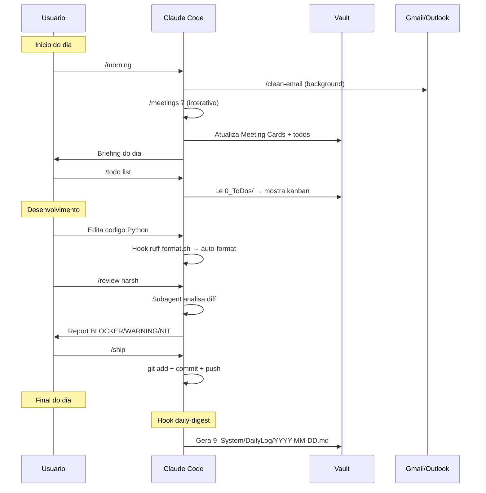

### Criacao de Nova Feature (SpecKit)

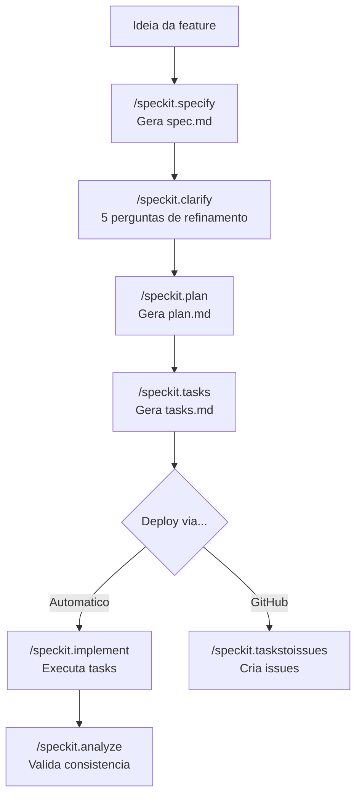

### Pipeline de Conteudo

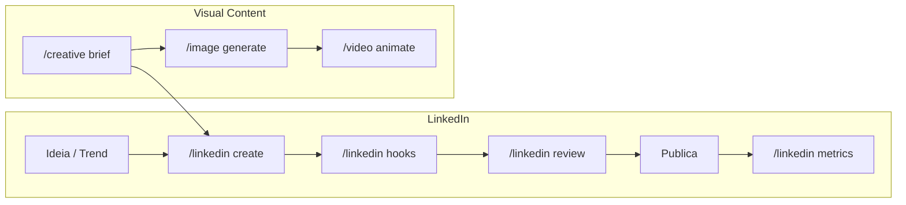

### Messaging (Madruga AI + wpp-bridge)

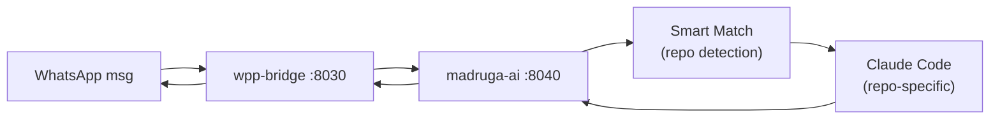

---

## Convencoes e Boas Praticas

### Para Skills

| Convencao | Regra |
|-----------|-------|
| Description | 3a pessoa, PT-BR, 1 frase concisa |
| `disable-model-invocation` | `true` para side effects (push, email, deploy) |
| `context: fork` | NUNCA usar — AskUserQuestion quebra em subagents |
| Tamanho | < 500 linhas. Mover detalhes para knowledge file |
| Arguments | Sempre com `name`, `description`, `required`. Default quando possivel |
| Naming | `kebab-case.md` |
| Invocacao | SEMPRE nome qualificado no Skill tool: `ops:email`, `dev:review` |

### Para Python

| Convencao | Regra |
|-----------|-------|
| Linter | `ruff check .` + `ruff format .` |
| Logging | `structlog` — nunca `print()` ou `logging` |
| HTTP | `httpx.AsyncClient` — nunca `requests` em code novo |
| Config | `pydantic-settings` via `.env` |
| Errors | Nunca `except Exception` generico |

### Para Vault

| Convencao | Regra |
|-----------|-------|
| Path | SEMPRE `./obsidian-vault/` — NUNCA `/home/.../obsidian-vault/` |
| Status | Lowercase no frontmatter: `inbox`, `doing`, `done` |
| Frontmatter | YAML com `date`, `type`, `tags` |
| Templates | Prefixo `tpl-` em `9_System/Templates/` |

---

## Seguranca

| Regra | Detalhe |
|-------|---------|
| Credentials fora do repo | `.env` no `.gitignore`. API keys em env vars |
| Email draft-only | Nenhum envio sem review explicito do Gabriel |
| Git como undo | Todo arquivo versionado. `git revert` para qualquer erro |
| VPS SSH-only | Sem password auth |
| Vault encriptado em transit | OneDrive sync automatico |
| MCP permissions | Whitelist explicita em `settings.local.json` |

---

## Setup — Primeira Instalacao

Instalador automatico: `./install.sh` (interativo) ou `./install.sh --all` (sem prompts)

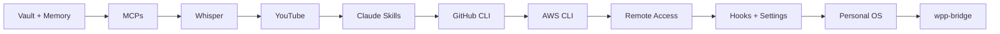

```bash
cp .env.example .env && nano .env          # Preencher credenciais primeiro

bash scripts/1_setup-obsidian-vault.sh     # Vault symlink + memory sync
bash scripts/2_mcp_install.sh              # MCPs (google-workspace, ms365, granola, context7, playwright, youtube)
bash scripts/3_whisper_installation.sh     # Whisper para transcricao (opcional)
bash scripts/4_youtube_transcript.sh       # YouTube CLI fallback (opcional)
bash scripts/5_claude_skills.sh            # Claude Skills plugins (Documents, Financial, Operations)
bash scripts/6_github_cli.sh              # gh CLI + autenticacao
bash scripts/7_aws_cli.sh                 # AWS CLI + SSO Serena (opcional)
bash scripts/8_remote_access.sh           # Tailscale + SSH (opcional)
bash scripts/9_hooks_install.sh           # TODOS os hooks + settings.json + .zshrc
bash scripts/10_install-personal-os.sh    # Servico systemd (opcional)
bash scripts/11_install-wpp-bridge.sh     # WhatsApp gateway (opcional)
```

Notas:
- `GranolaMCP/` e clonado automaticamente pelo script de MCP
- Scripts suportam `INSTALL_MODE=update` para pular o que ja esta instalado
- `.mcp.json` configura MCPs de projeto (supabase, whatsapp)

---

## Quick Reference — Comandos Mais Usados

```bash
# Daily workflow
/morning                # Ritual completo (email + meetings + briefing)
/todo list              # Ver kanban
/todo criar "Tarefa"    # Nova tarefa
/meetings 7             # Sync ultimos 7 dias
/clean-email            # Limpar inbox
/email read             # Ver emails
/weekly                 # Revisao semanal

# Desenvolvimento
/review harsh           # Code review automatico
/review grill           # Code review interativo
/ship                   # Commit + push
/fix-ci                 # Corrigir CI falhando

# Conteudo
/summary <url>          # Resumir conteudo
/linkedin create        # Novo post
/viral_trends full      # Coletar + analisar trends
/creative brief         # Brief criativo
/image generate         # Gerar imagem via Gemini
/video animate          # Gerar video via Veo

# Analytics
/jira query "..."       # Consultar Jira
/jira_service_management analyze  # Dashboard service desk
/finance analyze        # Portfolio overview
/vibe-reporting         # Dashboard DORA

# Meta
/learn <topico>         # Aprender novo topico
/skill-creator          # Criar nova skill
```
