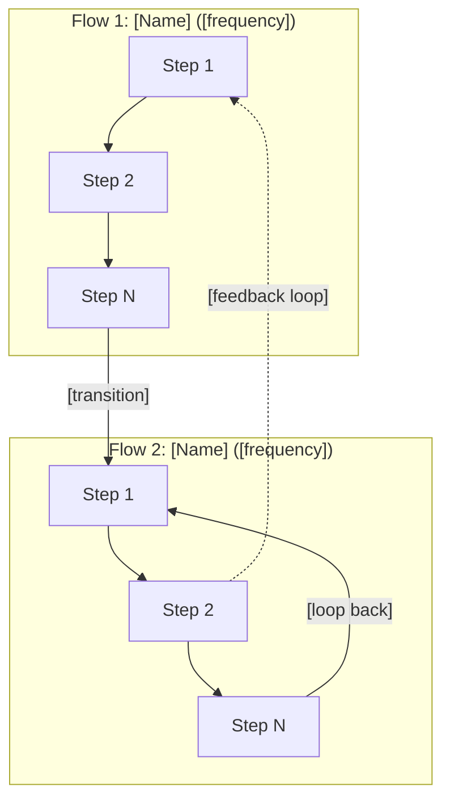
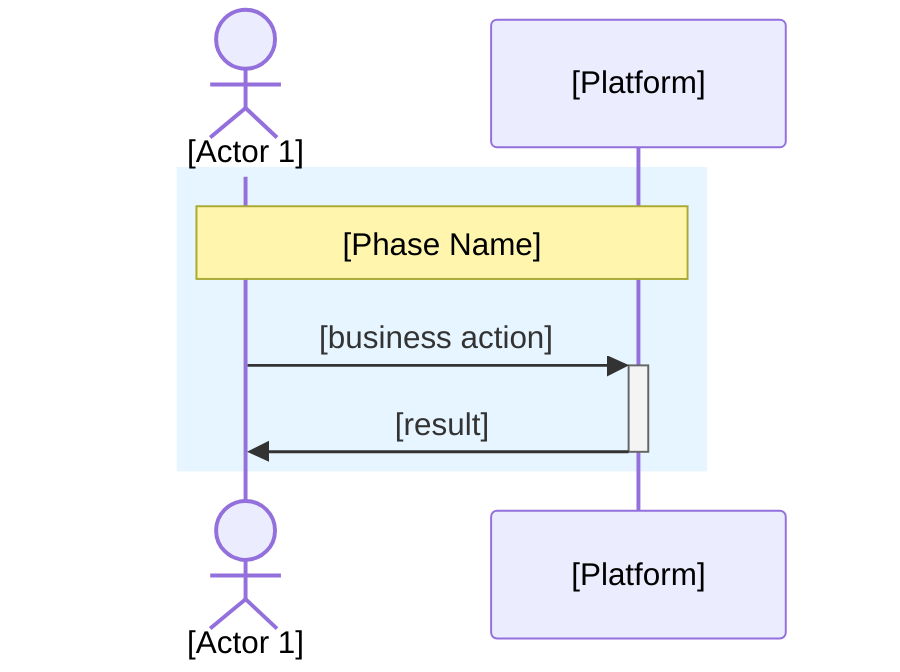
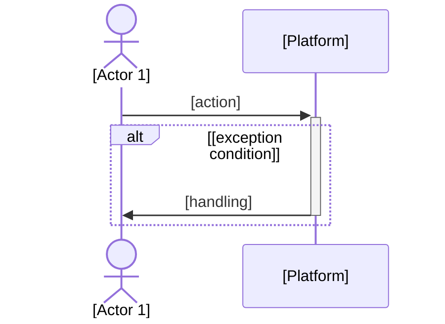

# Business Process — Business Flows

Generate a mapping of 3-5 main business flows as Mermaid sequence diagrams, each with a happy path and an exception path. Output is purely business-oriented — zero technical jargon.

## Cardinal Rule: ZERO Technical Content

This document describes **how the business works from the perspective of the actors involved**. Technical decisions, architecture, and implementation belong in other artifacts.

**NEVER include in the output:**
- Technology names, frameworks, languages, databases, libraries (e.g., Python, FastAPI, Redis, Supabase, pgvector, React, Docker)
- Architecture terms (e.g., RLS, API, SDK, middleware, cache, queue, webhook, endpoint, microservice, pipeline, module)
- References to ADRs, technical specs, C4 diagrams, or numbered epics
- Infrastructure details (e.g., deploy, CI/CD, server, container, cloud provider)
- Internal development tool names
- Technical participants in diagrams (e.g., "Backend", "Database", "Queue", "Cache")

**Permitted exceptions:** proper names of products/companies and common business terms (e.g., "platform", "channel", "automation", "dashboard").

**When in doubt:** if a participant or flow step only makes sense to an engineer, rewrite it in language a small business owner would understand. E.g., "System processes payment" instead of "Payment microservice calls Stripe API".

> **Contract**: Follow `.claude/knowledge/pipeline-contract-base.md` + `.claude/knowledge/pipeline-contract-business.md`.

## Usage

- `/business-process fulano` — Generate business flows for the "fulano" platform
- `/business-process` — Prompt for platform name and collect context

## Output Directory

Save to `platforms/<name>/business/process.md`. Create the directory if it does not exist.

## Instructions

### 1. Collect Context

**If `$ARGUMENTS.platform` exists:** use it as the platform name.
**If empty:** prompt for the name.

Check if a file already exists at `platforms/<name>/business/process.md`. If it does, read it as a base.

Read the following (required):
- `platforms/<name>/business/vision.md` — extract personas, critical battles, segments
- `platforms/<name>/business/solution-overview.md` — extract features, journeys, priorities

Identify implicit assumptions in the documents and present structured questions (ask all at once):

| Category | Question | Example |
|----------|----------|---------|
| **Assumptions** | "In the vision, [Persona X] does [action Y]. I assume the main flow is [Z]. Correct?" | "I assume the SMB owner configures the agent alone, without technical support. Correct?" |
| **Assumptions** | "The solution-overview lists [Feature]. I assume it participates in flow [W]. Correct?" | "I assume 'transfer to human' interrupts the automated flow. Correct?" |
| **Trade-offs** | "Flow [A] can be detailed (5+ steps) or summarized (3 steps). Which level?" | "Onboarding: detail each configuration step or summarize as 'configure and activate'?" |
| **Gaps** | "I did not find how [situation X] is handled. Do you define it or should I propose?" | "I did not find what happens when the customer does not respond. Do you define it or should I propose?" |
| **Challenge** | "[Obvious flow] seems essential, but [alternative] might generate more value because [reason]." | "'Manual configuration' flow seems obvious, but 'automated guided setup' could reduce churn by 40% because it eliminates complexity." |

Present a candidate list of 5-7 flows and ask the user to prioritize 3-5.

Wait for answers BEFORE generating.

### 2. Generate process.md

Write the document with **3-5 business flows**. Structure: **End-to-End vision first**, then deep dives into each flow.

```markdown
---
title: "Business Process"
updated: YYYY-MM-DD
---
# <Name> — Business Flows

> Mapeamento dos fluxos de negocio ponta a ponta. Comeca pela visao end-to-end e depois detalha cada etapa. Ultima atualizacao: YYYY-MM-DD.

---

## Visao End-to-End

> [1-2 sentences: how all flows connect in the complete lifecycle]



---

## Flow Overview

| # | Flow | Actors | Frequency | Impact |
|---|------|--------|-----------|--------|
| 1 | **[Flow Name]** | [who participates] | [estimate] | [why it matters] |
| 2 | ... | ... | ... | ... |

---

## Deep Dive — Flow 1: [Name]

> [1 sentence: what this flow resolves and why it is critical]

### Happy Path



### Exceptions



**Assumptions for this flow:**
- [assumption 1] `[VALIDATE]` if not confirmed
- [assumption 2]

---

## Deep Dive — Flow 2: [Name]
[same pattern: Happy Path + Exceptions + Assumptions]

---

## Global Assumptions

| # | Assumption | Status |
|---|-----------|--------|
| 1 | [assumption affecting multiple flows] | [VALIDATE] or Confirmed |

---

## Actor Glossary

| Actor | Who they are | Appears in flows |
|-------|-------------|-----------------|
| **[Actor 1]** | [short description] | 1, 2, 3 |
```

### Generation Rules:

1. **Structure: E2E first, deep dives second.** The document ALWAYS starts with a `## Visao End-to-End` flowchart showing how all flows connect, feedback loops, and lifecycle. Only after the E2E overview come the `## Deep Dive — Flow N` sections.
2. **Participants:** only business actors (people, roles, "Platform" as a black box). NEVER technical components.
3. **Actions:** business language. "Sends message", not "POST /api/messages". "Verifies payment", not "Queries payment_status table".
4. **Deep dives use phases:** group steps into `rect` blocks with `note over` labels (e.g., "Fase 1 — Negocio"). Each phase should be visually distinct.
5. **Exceptions:** every exception must have clear handling from the user's perspective. "What happens when X fails?"
6. **Frequency/Impact:** quantify when possible. Mark `[VALIDATE]` if estimated.
7. **Feedback loops:** the E2E diagram MUST show feedback arrows (dotted lines) where outputs of later flows retroaliment earlier docs (e.g., reconcile → business docs).
8. **3-5 flows:** prioritized by business impact. Most critical flow first.

### Auto-Review Additions

| # | Check | Action on Failure |
|---|-------|-------------------|
| 1 | Does the document START with `## Visao End-to-End` flowchart? | Move E2E to top, deep dives below |
| 2 | Does the E2E diagram show feedback loops (dotted lines) between flows? | Add retroalimentacao arrows |
| 3 | Zero technical terms (grep: API, SDK, framework, database, backend, frontend, deploy, server, endpoint, middleware, cache, queue, Python, Redis, Docker, Supabase, pgvector, webhook, microservice, CI/CD, ADR, pipeline, module, POST, GET, SQL, JSON) | Rewrite in business language |
| 4 | Does every deep dive have a happy path AND an exception path? | Add the missing one |
| 5 | Are participants business actors, not technical components? | Rename to business role |
| 6 | 3-5 flows (no more, no fewer without justification)? | Group or expand |
| 7 | Every assumption marked [VALIDATE] or confirmed? | Mark it |
| 8 | Flow Overview table present with frequency and impact? | Complete it |
| 9 | Actor Glossary present? | Add it |
| 10 | Deep dives use phase grouping (rect blocks with notes)? | Add phases |

## Error Handling

| Problem | Action |
|---------|--------|
| User does not know which flows to prioritize | Ask: "Without which flow does the business stop functioning?" (priority 1) / "Which flow differentiates you from competitors?" (priority 2) |
| Too many candidate flows (>7) | Group similar ones. E.g., "Registration" + "Activation" = "Complete Onboarding" |
| Flow too complex (>15 steps) | Abstract into sub-flows. Keep max 8-10 steps per diagram |
| Vision/solution-overview do not exist | ERROR: missing dependencies. Run `/solution-overview <name>` first |
| Platform already has process.md | Read as base; ask whether to rewrite from scratch or iterate |
| Exception without clear handling | Ask the user: "When [X] happens, what does the [actor] do?" |

---
handoff:
  from: business-process
  to: tech-research
  context: "Processos mapeados. Tech research deve avaliar alternativas. WARNING: 1-way-door."
  blockers: []
