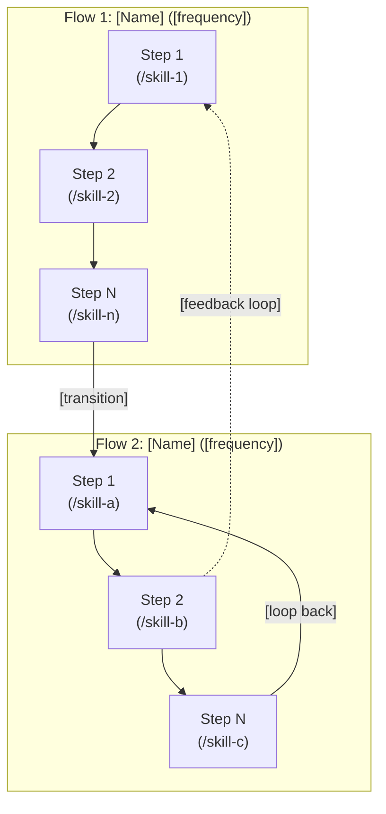
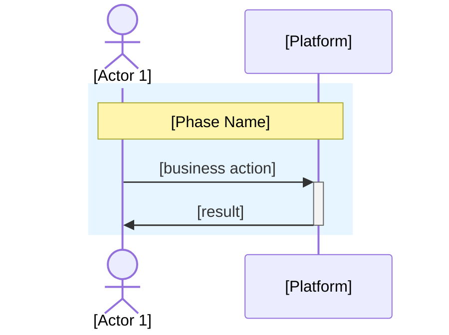
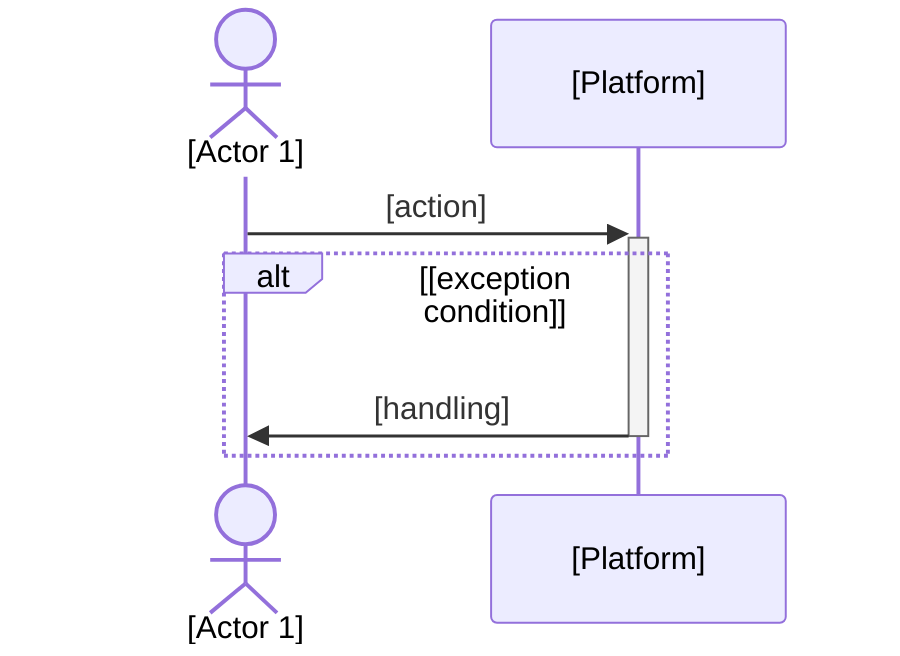
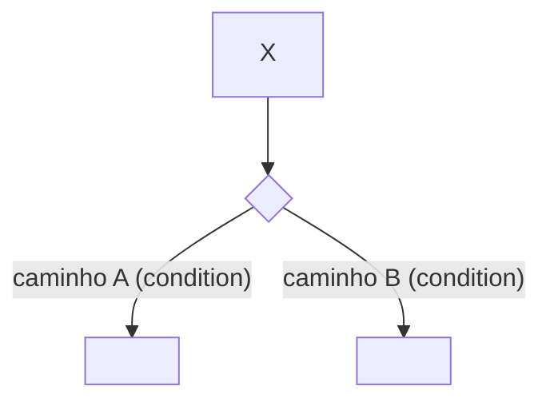

# Business Process — Business Flows

> **Contract**: Follow `.claude/knowledge/pipeline-contract-base.md` + `.claude/knowledge/pipeline-contract-business.md`.

Generate a business-process mapping for the platform. The output format adapts to the **platform archetype** (user-journey, pipeline, or hybrid) detected during Step 1.5. Every archetype produces business-readable prose — pipeline/hybrid archetypes additionally use domain vocabulary (canonical models, routing actions, content kinds) because for these platforms the pipeline IS the business.

## Cardinal Rule: Implementation-Free Documentation

This document describes **what the platform does from a business/domain perspective**. Implementation detail (code, frameworks, infrastructure) belongs elsewhere — in engineering docs, ADRs, or code itself.

**NEVER include, regardless of archetype** (implementation detail):
- Language/runtime: Python, TypeScript, Node, library versions, class/method/function signatures, import statements, decorators, type hints, npm/pip commands
- Infrastructure: Docker, Kubernetes, Compose files, env var names, port numbers, CI/CD commands
- Code mechanics: SQL queries, `@decorators`, exception class hierarchies, internal module paths
- Transport: verbose endpoint specs beyond resource names, HTTP header lists beyond `X-Webhook-Secret`

**Local override of Layer Rule #1** (`pipeline-contract-business.md`): when `archetype=pipeline|hybrid`, **domain-level technical vocabulary is PERMITTED** because the pipeline IS the business. Explicit allow-list:

- Canonical data model names (e.g., `CanonicalInboundMessage`, `ContentBlock`)
- Domain enums (e.g., `ContentKind`, `Action`, `EventKind`)
- Cryptographic/algorithmic concepts (sha256, HMAC, idempotency key, signed URL)
- Pipeline/processing concepts (debounce, backpressure, circuit breaker, fan-out, multi-message merge)
- External provider names when they ARE the product choice (OpenAI Whisper, Evolution, Meta Cloud, Phoenix)
- ADR references and epic numbers (context, not clutter — permitted in all archetypes)

**Rule of thumb**: if the term appears in the platform's `solution-overview.md` or ADR titles, it is domain and permitted. If it only appears in code imports or Dockerfile, it is implementation and blocked.

**When in doubt for `archetype=user-journey`**: rewrite in language a small business owner would understand. E.g., "System processes payment" instead of "Payment microservice calls Stripe API".

## Persona

Business analyst — maps real-world flows, challenges unrealistic happy paths. For `archetype=pipeline|hybrid`, combines business analyst with a data-flow architect perspective: obsesses over "what enters, what transforms, what exits, what persists, what is discarded" at every phase. Write all generated artifact content in Brazilian Portuguese (PT-BR).

## Usage

- `/madruga:business-process prosauai` — Generate business flows for the "prosauai" platform
- `/madruga:business-process` — Prompt for platform name and collect context

## Output Directory

Save to `platforms/<name>/business/process.md`. Create the directory if it does not exist.

---

## Instructions

### 1. Collect Context

If `$ARGUMENTS.platform` exists, use it as the platform name. If empty, prompt for the name.

Check if a file already exists at `platforms/<name>/business/process.md`. If it does, read it as a base and ask: rewrite from scratch or iterate?

Read (required):
- `platforms/<name>/business/vision.md` — personas, critical battles, segments
- `platforms/<name>/business/solution-overview.md` — features, journeys, priorities

Read (optional — signals for archetype detection):
- `platforms/<name>/engineering/containers.md` (if exists) — adapters, queues, workers suggest pipeline
- `platforms/<name>/engineering/blueprint.md` (if exists) — topology
- `platforms/<name>/decisions/` (if any ADR titles) — idempotency, debounce, canonical models suggest pipeline
- `platforms/<name>/epics/*/reconcile-report.md` (for status badge accuracy — see check #21)

### 1.5 Detect Platform Archetype

Classify the platform into one of three archetypes:

| Archetype | Core Signal | Examples |
|---|---|---|
| **user-journey** | "Human role interacts with product"; flows have actor + result; onboarding/configuration/usage are distinct | SaaS admin portals, CRM, e-commerce, operational dashboards |
| **pipeline** | "Receive → process → respond" continuous; adapters, webhooks, queues, streams; ADRs on idempotency, ordering, debounce | Message bots, ETL, event processors, webhook handlers |
| **hybrid** | Has both: pipeline at core + user-journey in admin/onboarding/ops | Message platform with admin UI (e.g., ProsaUAI: pipeline + 8 admin tabs + multi-tenant lifecycle) |

**Detection signals:**

- `solution-overview` mentions "receive/process/respond" as core loop → pipeline or hybrid
- `containers.md` lists adapters, webhooks, queues, streams → pipeline or hybrid
- ADRs about canonical models, idempotency, routing, debounce, fire-and-forget → pipeline
- `vision` describes user roles (admin, end-user, operator) with distinct journeys → user-journey or hybrid
- Both patterns present → hybrid

Present the detected archetype to the user for confirmation:

```
Detectei **<archetype>**: <1-2 sentences justifying>.

Sinais detectados:
- <signal 1>
- <signal 2>

Confirma? (ou corrija: user-journey | pipeline | hybrid)
```

Wait for confirmation. If user corrects, use user's choice.

### 1.6 Ask Structured Questions

Identify implicit assumptions and present structured questions (ask all at once, numbered 1, 2, 3…).

**For `archetype=user-journey`**:

| Category | Pattern |
|----------|---------|
| Premissas | "In the vision, [Persona X] does [action Y]. I assume the main flow is [Z]. Correct?" |
| Premissas | "The solution-overview lists [Feature]. I assume it participates in flow [W]. Correct?" |
| Trade-offs | "Flow [A] can be detailed (5+ steps) or summarized (3 steps). Which level?" |
| Gaps | "I did not find how [situation X] is handled. Do you define it or should I propose?" |
| Challenge | "[Obvious flow] seems essential, but [alternative] might generate more value because [reason]." |

Present a candidate list of 5–7 flows and ask user to prioritize 3–5.

**For `archetype=pipeline|hybrid`**:

| Category | Pattern |
|----------|---------|
| Premissas | "Assumo que o pipeline recebe [X] e responde com [Y]. O caminho principal é [Z]. Correto?" |
| Premissas | "Assumo que [ContentKind/Event X] é processado por [Y]. Confirma?" |
| Trade-offs | "Pipeline tem N fases — cada uma com diagrama dedicado ou só as críticas?" |
| Gaps | "Não identifiquei comportamento quando [edge case X]. Você define ou proponho?" |
| Challenge | "[Abstração X] parece óbvia, mas [alternativa Y] pode servir melhor porque [razão]." |
| Invariantes | "Identifiquei candidatos a 'regra de ouro': [lista]. Quer que vire callout explícito?" |

Present a candidate list of 8–14 phases for pipeline, or pipeline-phases + operator/admin-journeys for hybrid.

Wait for answers BEFORE generating.

---

### 2. Generate process.md

Structure adapts to the confirmed archetype. **Universal building blocks (§2.1)** apply to all archetypes. **Archetype-specific templates (§2.2, §2.3, §2.4)** define the skeleton. **Pipeline/hybrid-only building blocks (§2.5)** apply only when `archetype != user-journey`.

#### 2.1 Universal Building Blocks (ALL archetypes)

**Frontmatter** (output MUST use this shape):

```yaml
---
title: "Business Process"
description: '<1-line summary of what this document covers>'
archetype: pipeline | user-journey | hybrid
updated: YYYY-MM-DD
sidebar:
  order: 3
---
```

The `archetype` field is machine-readable — portal, reconcile, and reverse-reconcile can detect archetype without parsing prose.

**Status badges** — append to section/subsection titles when describing a specific capability:

- ✅ **IMPLEMENTADO** — code in HEAD of active branch
- 🔄 **EM EVOLUÇÃO** — partially delivered; detail per section
- 📋 **PLANEJADO** — roadmap, no code yet

Example: `### 1.2 Meta Cloud API (WhatsApp oficial) ✅ — epic 009 PR-C`

Include a legend near the document top: `> **Legenda**: ✅ IMPLEMENTADO · 🔄 EM EVOLUÇÃO · 📋 PLANEJADO`.

**Regra de ouro callout** — when a section has a business invariant, open with:

```markdown
> **Regra de ouro**: <affirmation>. <known-exception-or-gap-explicit>.
```

Example: "Regra de ouro da saída: resposta sai pelo mesmo canal que recebeu a mensagem. Outbound Meta Cloud não implementado — pendência do PR-C epic 009."

**Collapsible Mermaid** — for any Mermaid block with more than 15 lines, wrap in `<details>`:

````markdown
<details>
<summary>📊 <DiagramType> — <1-line description></summary>

```mermaid
...
```

</details>
````

DiagramType vocabulary: `Sequência`, `Fluxograma`, `Estrutura`, `Máquina de estados`, `Timeline`.

Small diagrams (≤15 lines) stay visible inline — don't force collapsing if the content is essential at-glance.

**Mermaid syntax gotchas** — enforce on every generated diagram:

- Edge labels containing `( ) : # [ ]` or `&` MUST be wrapped in double quotes:
  - ❌ `A -->|foo (bar)| B` → parse error in astro-mermaid (renderer interprets `(` as node shape delimiter)
  - ✅ `A -->|"foo (bar)"| B`
- Line breaks in node labels: always `<br/>`, never `\n`
- Emojis in labels are permitted (`🎙️ audio`, `✅ Evolution`) but must be tested in the target renderer
- Node shape delimiters reserved (never use unquoted in labels): `[...]`, `(...)`, `((...))`, `{...}`, `>...]`, `[/.../]`, `[(...)]`

#### 2.2 Template — `archetype: user-journey`

Existing template (preserved for backward compatibility). Structure:

````markdown
# <Name> — Business Flows

## Visao End-to-End

> [1–2 sentences: how all flows connect in the complete lifecycle]



---

## Flow Overview

| # | Flow | Actors | Frequency | Impact |
|---|------|--------|-----------|--------|
| 1 | **[Flow Name]** | [who participates] | [estimate] | [why it matters] |

---

### Skill Map — Flow N: [Name]

| # | Passo | Ator | Skill / Comando | Artefato | Gate |
|---|-------|------|-----------------|----------|------|
| 1 | [step] | [actor] | `/skill-name` | [artifact path] | [gate type] |

---

## Deep Dive — Flow 1: [Name]

> [1 sentence: what this flow resolves and why it is critical]

### Happy Path

<details>
<summary>📊 Sequência — happy path Flow 1</summary>



</details>

### Exceptions

<details>
<summary>📊 Sequência — exceções Flow 1</summary>



</details>

**Assumptions for this flow:**
- [assumption 1] `[VALIDAR]` if not confirmed

---

## Global Assumptions

| # | Assumption | Status |
|---|-----------|--------|

---

## Actor Glossary

| Actor | Who they are | Appears in flows |
|-------|-------------|-----------------|
````

**User-journey generation rules:**

1. E2E first, deep dives second.
2. 3–5 flows (most critical first).
3. Participants are business actors + "Platform" (black box). NEVER technical components.
4. Actions in business language. "Sends message", not "POST /api/messages".
5. Deep dives use phases (rect blocks with note-over labels).
6. Every exception has clear handling from the user's perspective.
7. E2E diagram MUST show feedback arrows (dotted lines).
8. Frequency/Impact quantified when possible, `[VALIDAR]` otherwise.
9. Skill annotations in E2E nodes: `<br/>(/command)` inline.
10. Skill Map table per flow when skills map to pipeline commands.

#### 2.3 Template — `archetype: pipeline`

For continuous data/message processing platforms. Structure:

````markdown
---
title: "Business Process"
description: '<1-line>'
archetype: pipeline
updated: YYYY-MM-DD
sidebar:
  order: 3
---

# <Name> — Business Process

> <1-paragraph explanation of what this document is + reference to solution-overview for catalog and engineering/blueprint for architecture>
>
> **Legenda**: ✅ IMPLEMENTADO · 🔄 EM EVOLUÇÃO · 📋 PLANEJADO

---

## 0. Visão Geral — o fluxo inteiro em uma tela

[Single compact `flowchart LR` with 7±2 top-level nodes representing each phase. Shows main forward path + major branches (e.g., routing decisions) + observability side-channel. NOT inside `<details>`.]

<details>
<summary>🔍 Ver diagrama interno expandido (componentes de cada fase)</summary>

[More detailed flowchart with each phase expanded into its internal components. Use `direction LR` inside each subgraph to avoid vertical overflow.]

</details>

> **Regra de ouro**: <business invariant>. <known gap>.

**O que entra**: <1–2 sentences>
**O que sai**: <1–2 sentences + routing rule if applicable>
**Multi-tenant por construção**: <brief>
**Observabilidade passiva**: <brief — failures don't block critical path>

---

## 1..N. Fases numeradas

### N.M <Subphase title> ✅|🔄|📋

<details>
<summary>📊 <DiagramType> — <1-line diagram description></summary>

```mermaid
<diagram>
```

</details>

<1–2 paragraphs explaining the phase>

**Entra**: <input shape>
**Transforma**: <core operation>
**Sai**: <output shape>
**Persiste**: <table(s) and when, or "— nada persiste aqui">
**Descarta**: <conditions and reason, or "— nenhum descarte nesta fase">

[Optional: Cenário concreto block — see §2.5]
[Optional: "O que NÃO faz" list — see §2.5]
[Optional: Decision tree for critical decisions — see §2.5]

---

## {N+1}. O que NÃO está entregue ainda 📋

| Epic | Feature | Trigger |
|------|---------|---------|
| 014 | **Handoff Engine** (state machine + WebSocket) | Primeiro cliente externo onde handoff é contratual |
| 015 | **Triggers proativos** (PG LISTEN/NOTIFY + Jinja2) | Lembretes, follow-ups |

---

## Apêndice A — Glossário de Dados

| Termo | Definição |
|-------|-----------|
| **<Term>** | <definition> |

## Apêndice B — ADRs relevantes

| ADR | Título | Relevância neste documento |
|-----|--------|-----------------------------|
| [NNN](../decisions/ADR-NNN-*.md) | <title> | <1-line relevance> |
````

**Pipeline generation rules:**

1. §0 Visão Geral is the first section after H1. Contains 1 compact top-level Mermaid + optional expanded version in `<details>`.
2. Phases numbered 1..N (no prefix letters like "M1-M14" — just the number).
3. Every phase has the 5 data-flow labels (Entra/Transforma/Sai/Persiste/Descarta) — use "—" when N/A, never omit.
4. Status badges on every subphase title.
5. Collapsible `<details>` for diagrams > 15 lines; inline for small ones.
6. Each ADR relevant to the phase is linked inline (not only in Appendix B).
7. Section for "Planejado" (not implemented) is consolidated near the end before appendices, with explicit Trigger column.
8. Glossary in Appendix A — short (10–20 entries max).
9. Typical length: 800–1800 lines depending on platform complexity. Don't truncate substance to hit an arbitrary line count.

#### 2.4 Template — `archetype: hybrid`

Use the pipeline template (§2.3) as the base, with user-journey-style subsections inserted where the platform has distinct operator/admin/ops journeys. Common breakdown:

- §1..N — pipeline phases (§2.3 template)
- §N+1 — Admin / Operator UI (user-journey-style, can be simpler than full §2.2 template — a table of tabs/routes + a small architecture diagram is often enough)
- §N+2 — Multi-tenant lifecycle (phases labeled "Fase 1 hoje ✅", "Fase 2 planejado 📋", "Fase 3 planejado 📋")
- §N+3 — Retention & compliance (if relevant)
- § O que NÃO está entregue (§2.3 convention)
- § Apêndices

Hybrid is the most common archetype for production-grade platforms that have both a runtime pipeline and human operators.

#### 2.5 Building Blocks — Pipeline/Hybrid ONLY

These blocks are forbidden in user-journey archetype (too implementation-adjacent) but required/recommended in pipeline/hybrid:

**Data Flow Block** — append to every phase:

```markdown
**Entra**: <input shape with the concrete canonical type or enum>
**Transforma**: <what the phase does — 1 sentence>
**Sai**: <output shape>
**Persiste**: <table name + retention + when, or "— nada persiste aqui">
**Descarta**: <when input is dropped + reason, or "— nenhum descarte nesta fase">
```

Use "—" (em dash) for N/A rather than omitting a label. The 5 labels together are the data-flow contract; readers MUST see them on every phase.

**"O que NÃO faz" list** — for components where a common misunderstanding exists:

```markdown
**O que o <component> de hoje NÃO faz**:
- ❌ <what a naive reader might assume it does>
- ❌ <another>
```

Example: evaluator is heuristic, not LLM — "O que NÃO faz: ❌ Não avalia fit à intent; ❌ Não detecta tópicos críticos".

**Cenário concreto with real values** — at least one per complex phase:

```markdown
**Cenário**: <concrete user scenario with specific inputs>.
Output consolidado: `<actual string or shape produced>`
Custo deste step: $<calculated>
```

Example: "Cliente manda foto + áudio (15s) + texto '12345' em 3s. Output consolidado: `[imagem: ...]\n\n[áudio 00:15]: ...\n\n12345`. Custo: $0.0145".

**Decision tree for critical decisions** — `flowchart TD` when branching is business-relevant:



Use for: routing decisions, evaluator outcomes, budget/circuit breaker branches, cache hit/miss paths, retry/fallback flows.

**Regra de ouro** (already in §2.1 universal) — use generously in pipeline/hybrid where invariants matter (outbound routing, idempotency, tenant isolation, fire-and-forget guarantees).

---

### Auto-Review Additions

Run these checks after generation. Failing BLOCKER items means re-generate; WARNING items get flagged for the user; NIT items are best-effort.

| # | Check | Severity | Archetype scope | Action on Failure |
|---|-------|----------|-----------------|-------------------|
| 1 | Document starts with `## Visao End-to-End` (user-journey) or `## 0. Visão Geral` (pipeline/hybrid) | BLOCKER | all | Move to top |
| 2 | E2E/Overview shows feedback loops OR main dataflow arrows | BLOCKER | all | Add them |
| 3 | Zero implementation vocabulary: Python, TypeScript, Docker, Kubernetes, SQL queries, library versions, function signatures, class names, `@decorators`, `npm`, `pip` | BLOCKER | all | Rewrite |
| 4 | Every deep dive has happy path AND exception path | BLOCKER | user-journey | Add missing one |
| 5 | Participants are business actors, never technical components | BLOCKER | user-journey | Rename to business role |
| 6 | 3–5 flows (justified if outside range) | WARNING | user-journey | Group or expand |
| 7 | Every assumption marked `[VALIDAR]` or confirmed | NIT | all | Mark it |
| 8 | Flow Overview table with frequency + impact | WARNING | user-journey | Complete |
| 9 | Actor Glossary present | NIT | user-journey | Add it |
| 10 | Deep dives use phase grouping (rect blocks) | NIT | user-journey | Add phases |
| 11 | E2E nodes have inline skill annotations `<br/>(/command)` where applicable | NIT | user-journey | Add from pipeline-dag-knowledge.md |
| 12 | Skill Map table per flow with skills | NIT | user-journey | Add table |
| 13 | Frontmatter has `archetype: pipeline\|user-journey\|hybrid` | BLOCKER | all | Add field |
| 14 | Every phase has the 5 data-flow labels (Entra/Transforma/Sai/Persiste/Descarta) — use "—" for N/A, never omit | BLOCKER | pipeline, hybrid | Add labels |
| 15 | Status badges ✅🔄📋 on subsections describing a specific capability | WARNING | all | Apply badges |
| 16 | Section "O que NÃO está entregue ainda 📋" present with Trigger column | BLOCKER | pipeline, hybrid | Create section |
| 17 | Every Mermaid block > 15 lines wrapped in `<details>/<summary>` | WARNING | all | Wrap |
| 18 | Mermaid edge labels with `( ) : # [ ]` are wrapped in double quotes | BLOCKER | all | Wrap in `"..."` |
| 19 | Glossário de Dados present in Apêndice A | WARNING | pipeline, hybrid | Add |
| 20 | Regra de ouro callout used for each critical business invariant | NIT | pipeline, hybrid | Add where applicable |
| 21 | Status of delivered epics consistent with `epics/<NNN>/reconcile-report.md` existence | WARNING | all | Cross-check and correct |
| 22 | ADRs referenced in body are linked via relative path `../decisions/ADR-NNN-*.md` | NIT | all | Fix links |
| 23 | `<details>` summaries use `📊 <DiagramType> — <description>` pattern | NIT | all | Normalize |

---

## Error Handling

| Problem | Action |
|---------|--------|
| Archetype unclear from signals | Ask user directly with 2 short examples: "Platform X resembles a user-journey (like e-commerce admin)? Or pipeline (like a message bot)? Or hybrid?" |
| User disagrees with detected archetype | Use user's classification — no second guess |
| User does not know which flows/phases to prioritize (user-journey) | Ask: "Without which flow does the business stop functioning?" (priority 1) / "Which flow differentiates you from competitors?" (priority 2) |
| Too many candidate flows (user-journey, >7) | Group similar ones. E.g., "Registration" + "Activation" = "Complete Onboarding" |
| Too many phases (pipeline, >15) | Combine or move detail to sub-subsections; keep ≤12 top-level phases |
| Flow/Phase too complex (>15 steps) | Abstract into sub-flows. Max 8–10 steps per diagram |
| Vision/solution-overview do not exist | ERROR: missing dependencies. Run `/solution-overview <name>` first |
| Platform already has process.md | Read as base; ask whether to rewrite from scratch or iterate |
| Exception without clear handling (user-journey) | Ask user: "When [X] happens, what does the [actor] do?" |
| Pipeline: data-flow label genuinely has no value | Use "—" (em dash) — never omit the label |
| Mermaid render fails in portal | Check edge-label quoting (check #18); check for unescaped `( ) : # [ ]` in labels |
| Unsure if a term is domain or implementation | Check if it appears in `solution-overview.md` or ADR titles — if yes, domain (permitted). If only in code imports, implementation (blocked). |
