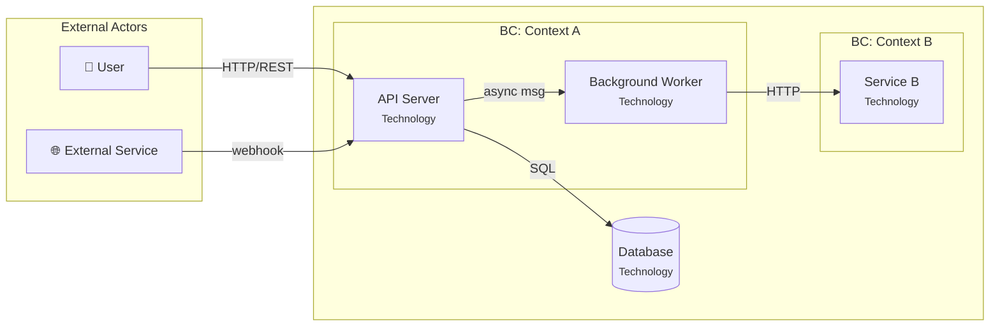

# Containers — C4 Level 2 Architecture

Generate container architecture (~200 lines) with C4 L2 Mermaid diagram, container table, communication protocols, and per-container NFRs.

## Cardinal Rule: ZERO Containers Without Clear Responsibility

One container = one reason to exist. If two containers do the same thing, merge them. If one container does everything, split it.

**NEVER:**
- Create a "utils" or "shared" container as a separate runtime
- Split into microservices without scale/team justification
- Omit communication protocols between containers
- Create a container without a clear owner (which bounded context it belongs to)

> **Contract**: Follow `.claude/knowledge/pipeline-contract-base.md` + `.claude/knowledge/pipeline-contract-engineering.md`.

## Persona

Platform engineer — one responsibility per container, explicit protocols. Write generated artifacts in Brazilian Portuguese (PT-BR).

## Usage

- `/containers prosauai` — Generate containers for "prosauai"
- `/containers` — Prompt for name

## Output Directory

Save to `platforms/<name>/engineering/containers.md`.

## Instructions

### 1. Collect Context + Ask Questions

**Required reading:**
- `engineering/domain-model.md` — bounded contexts and aggregates
- `engineering/blueprint.md` — stack, NFRs, topology
- `decisions/ADR-*.md` — stack decisions that impact containers

**Structured Questions:**

| Category | Question |
|----------|----------|
| **Assumptions** | "I assume [N] containers based on the bounded contexts. Correct?" |
| **Trade-offs** | "Modular monolith (simple, 1 deploy) or microservices (complex, independent deploy)?" |
| **Gaps** | "Blueprint does not specify [messaging pattern]. Define it?" |
| **Challenge** | "Do you really need [N] containers? Start with a modular monolith and split later." |

Wait for answers BEFORE generating.

### 2. Generate Artifact

Generate `engineering/containers.md` with the following structure:

````markdown
---
title: "Containers"
updated: YYYY-MM-DD
sidebar:
  order: 4
---
# <Name> — Container Architecture (C4 Level 2)

> Container decomposition with responsibilities, technologies, protocols, and NFRs.

---

## Container Diagram



---

## Container Matrix

<!-- Tech choices justified in Blueprint — list technology here without justification -->

| # | Container | Bounded Context | Technology | Responsibility | Protocol In | Protocol Out |
|---|-----------|----------------|------------|----------------|-------------|-------------|
| 1 | API Server | Context A | [tech] | [1 sentence] | HTTP/REST | SQL, async msg |
| 2 | Worker | Context A | [tech] | [1 sentence] | async msg | HTTP |
| 3 | Database | (shared) | [tech] | Persistent state | SQL | — |

---

## Communication Protocols

| From | To | Protocol | Pattern | Why |
|------|-----|----------|---------|-----|
| API | Worker | [protocol] | [sync/async/pub-sub] | [justification] |
| API | Database | SQL | sync | [justification] |

---

## Scaling Strategy

| Container | Strategy | Trigger | Notes |
|-----------|----------|---------|-------|
| API Server | [horizontal/vertical/none] | [condition] | [notes] |
| Worker | [strategy] | [condition] | [notes] |

> NFRs globais e targets mensuráveis → ver [blueprint.md](../blueprint/)

---

## Assumptions and Decisions

| # | Decision | Alternatives Considered | Justification |
|---|---------|------------------------|---------------|
| 1 | [decision] | [alt A] vs [alt B] | [why] |
````

**Mermaid diagram guidelines:**
- Use `graph LR` (left-to-right) for container diagrams
- Group containers by bounded context using `subgraph`
- Use `<br/><small>Technology</small>` for technology annotations
- Databases use cylinder notation: `DB[("Database")]`
- External actors in a separate subgraph
- Label every edge with the protocol
- Keep diagrams under 40 lines — split into detail views if needed

### Auto-Review Additions

| # | Check | Action on Failure |
|---|-------|-------------------|
| 1 | Does every container have a single responsibility? | Merge or justify |
| 2 | Are there any orphan containers (disconnected)? | Connect or remove |
| 3 | Are protocols defined for every communication? | Add them |
| 4 | Does Scaling Strategy avoid duplicating NFR targets from Blueprint? | Remove targets, keep only strategy/trigger |
| 5 | Does the Mermaid diagram render correctly? | Fix syntax |
| 6 | Are all bounded contexts from domain-model represented? | Add missing containers |
| 7 | Container count <= 8? | Challenge: "Do you have a team to maintain this many?" |
| 8 | Does Container Matrix avoid justifying technology choices? (Blueprint owns stack) | Remove justifications |

## Error Handling

| Issue | Action |
|-------|--------|
| Domain model with 1 bounded context | Generate 1 container (monolith) — do not force a split |
| Too many containers (>8) | Challenge: "Do you have a team to maintain 8 services?" |
| Mermaid syntax error | Validate diagram syntax before saving |
| Conflict with blueprint topology | Align with blueprint, propose update if needed |

---
