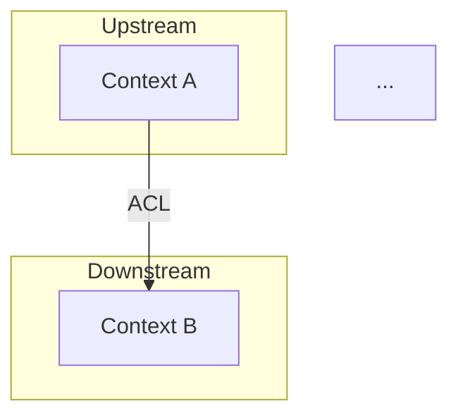

# Context Map — DDD Context Map

Generate a context map (~150 lines) with relationships between bounded contexts using DDD patterns (upstream/downstream, ACL, shared kernel, conformist, customer/supplier).

## Cardinal Rule: ZERO Relationships Without a DDD Pattern

Every integration between bounded contexts MUST have an explicitly named DDD pattern. No vague relationships like "they communicate."

**NEVER:**
- Define a relationship without naming the DDD pattern
- Use "shared kernel" as the default pattern for everything (it creates the strongest coupling)
- Ignore upstream/downstream direction
- Create a relationship without business justification

> **Contract**: Follow `.claude/knowledge/pipeline-contract-base.md` + `.claude/knowledge/pipeline-contract-engineering.md`.

## Persona

Integration architect — every relationship has a named DDD pattern and direction. Write generated artifacts in Brazilian Portuguese (PT-BR).

## Usage

- `/context-map fulano` — Generate context map for "fulano"
- `/context-map` — Prompt for name

## Output Directory

Save to `platforms/<name>/engineering/context-map.md`.

## Instructions

### 1. Collect Context + Ask Questions

**Required reading:**
- `engineering/domain-model.md` — bounded contexts, aggregates
- `engineering/containers.md` — how contexts map to containers

**Structured Questions:**

| Category | Question |
|----------|----------|
| **Assumptions** | "I assume [context A] is upstream of [context B]. Correct?" |
| **Trade-offs** | "ACL (decoupled, more code) or Conformist (coupled, less code) for [relationship]?" |
| **Gaps** | "The relationship between [X] and [Y] is unclear. How do they communicate?" |
| **Challenge** | "Shared Kernel between [A] and [B] creates strong coupling. Is the trade-off worth it?" |

Wait for answers BEFORE generating.

### 2. Generate Context Map

Check whether a template exists at `.specify/templates/platform/template/engineering/context-map.md.jinja`.

```markdown
---
title: "Context Map"
updated: YYYY-MM-DD
---
# <Name> — Context Map

> Relationships between bounded contexts. Explicit DDD patterns.

---

## Context Diagram



---

## Relationship Table

| Upstream | Downstream | Pattern | Direction | Justification |
|----------|-----------|---------|-----------|--------------|
| [Context A] | [Context B] | ACL | A -> B | [why ACL and not conformist] |
| [Context C] | [Context D] | Customer/Supplier | C -> D | [justification] |
| ... | ... | ... | ... | ... |

---

## Patterns Used

| Pattern | Description | When to Use | Used In |
|---------|------------|------------|---------|
| **Shared Kernel** | Shared code between contexts | When 2 contexts evolve together | [if applicable] |
| **ACL (Anti-Corruption Layer)** | Translates external model to internal | When upstream has a different model | [relationships] |
| **Conformist** | Downstream adopts upstream's model | When upstream is stable and reliable | [relationships] |
| **Customer/Supplier** | Upstream adapts to downstream | When downstream has negotiation power | [relationships] |
| **Open Host Service** | Standardized public API | When there are many consumers | [relationships] |
| **Published Language** | Standard integration language | When a neutral format is needed | [relationships] |

---

## Anti-Patterns to Avoid

| Anti-Pattern | Risk | How to Detect |
|-------------|------|--------------|
| Big Ball of Mud | No clear boundaries | All contexts communicate with all |
| Excessive Shared Kernel | Strong coupling | >2 contexts sharing a kernel |
| God Context | 1 context does everything | Context with >5 aggregates |
```

### Auto-Review Additions

| # | Check | Action on Failure |
|---|-------|-------------------|
| 1 | Does every relationship have a named DDD pattern? | Name it |
| 2 | Is the upstream/downstream direction clear? | Define it |
| 3 | Does every relationship have a justification? | Justify |
| 4 | Are patterns appropriate (not "shared kernel for everything")? | Re-evaluate |
| 5 | Does the Mermaid diagram render? | Fix |
| 6 | Max 150 lines? | Condense |
| 7 | Are all contexts from the domain model present? | Add missing ones |
| 8 | DDD relationships use typed labels in Mermaid (`-->|"ACL"|`, `-->|"Conformist"|`, etc.)? | Fix — no unlabeled arrows for DDD |

## Error Handling

| Issue | Action |
|-------|--------|
| Only 1 bounded context | Trivial context map — 0 relationships. Suggest whether more contexts are needed |
| Circular relationships | Identify and resolve — indicates wrong boundary |
| Isolated context (no relationships) | Question: is it truly independent? |
| Conflict between domain-model and containers | Align — contexts should map to containers |

