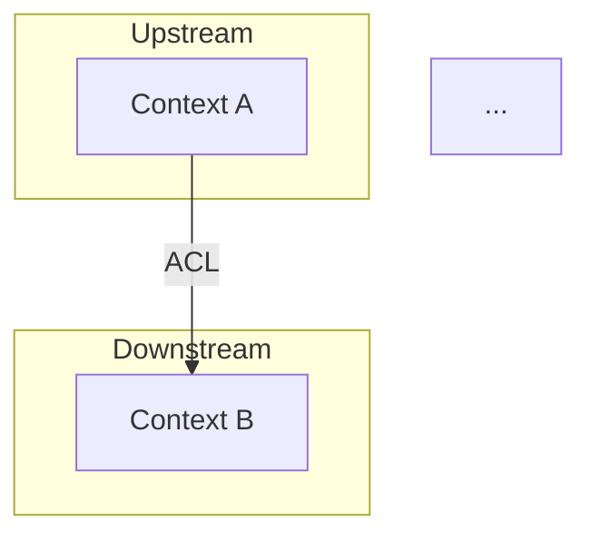

# Context Map — Mapa de Contextos DDD

Gera context map (~150 linhas) com relacoes entre bounded contexts usando padroes DDD (upstream/downstream, ACL, shared kernel, conformist, customer/supplier).

## Regra Cardinal: ZERO Relacao sem Padrao DDD

Toda integracao entre bounded contexts DEVE ter padrao DDD explicito nomeado. Nenhuma relacao vaga tipo "se comunicam".

**NUNCA:**
- Definir relacao sem nomear o padrao DDD
- Usar "shared kernel" como padrao para tudo (e o mais acoplado)
- Ignorar direcao upstream/downstream
- Criar relacao sem justificativa de negocio

## Persona

Staff Engineer / DDD Expert. Foco em desacoplamento e boundaries claras. Portugues BR.

## Uso

- `/context-map fulano` — Gera context map para "fulano"
- `/context-map` — Pergunta nome

## Diretorio

Salvar em `platforms/<nome>/engineering/context-map.md`.

## Instrucoes

### 0. Pre-requisitos

Rodar `.specify/scripts/bash/check-platform-prerequisites.sh --json --platform <nome> --skill context-map` e parsear JSON.
- Se `ready: false`: ERROR listando dependencias faltantes.
- Se `ready: true`: ler artefatos em `available`.
- Ler `.specify/memory/constitution.md`.

### 1. Coletar Contexto + Questionar

**Leitura obrigatoria:**
- `engineering/domain-model.md` — bounded contexts, agregados
- `engineering/containers.md` — como contexts mapeiam para containers
- `model/ddd-contexts.likec4` — naming de contexts para consistencia

**Perguntas Estruturadas:**

| Categoria | Pergunta |
|-----------|----------|
| **Premissas** | "Assumo que [contexto A] e upstream de [contexto B]. Correto?" |
| **Trade-offs** | "ACL (desacoplado, mais codigo) ou Conformist (acoplado, menos codigo) para [relacao]?" |
| **Gaps** | "Relacao entre [X] e [Y] nao esta clara. Como se comunicam?" |
| **Provocacao** | "Shared Kernel entre [A] e [B] cria acoplamento forte. Vale o trade-off?" |

Aguardar respostas ANTES de gerar.

### 2. Gerar Context Map

Verificar se template existe em `.specify/templates/platform/template/engineering/context-map.md.jinja`.

```markdown
---
title: "Context Map"
updated: YYYY-MM-DD
---
# <Nome> — Context Map

> Relacoes entre bounded contexts. Padroes DDD explicitos.

---

## Diagrama de Contextos



---

## Tabela de Relacoes

| Upstream | Downstream | Padrao | Direcao | Justificativa |
|----------|-----------|--------|---------|--------------|
| [Context A] | [Context B] | ACL | A → B | [por que ACL e nao conformist] |
| [Context C] | [Context D] | Customer/Supplier | C → D | [justificativa] |
| ... | ... | ... | ... | ... |

---

## Padroes Utilizados

| Padrao | Descricao | Quando Usar | Usado Em |
|--------|-----------|------------|----------|
| **Shared Kernel** | Codigo compartilhado entre contexts | Quando 2 contexts evoluem juntos | [se aplicavel] |
| **ACL (Anti-Corruption Layer)** | Traduz modelo externo para interno | Quando upstream tem modelo diferente | [relacoes] |
| **Conformist** | Downstream adota modelo do upstream | Quando upstream e estavel e confiavel | [relacoes] |
| **Customer/Supplier** | Upstream se adapta ao downstream | Quando downstream tem poder de negociacao | [relacoes] |
| **Open Host Service** | API publica padronizada | Quando muitos consumers | [relacoes] |
| **Published Language** | Linguagem padrao de integracao | Quando precisa de formato neutro | [relacoes] |

---

## Anti-Padroes a Evitar

| Anti-Padrao | Risco | Como Detectar |
|-------------|-------|--------------|
| Big Ball of Mud | Sem boundaries claras | Todos contexts se comunicam com todos |
| Shared Kernel excessivo | Acoplamento forte | >2 contexts compartilhando kernel |
| God Context | 1 context faz tudo | Context com >5 agregados |
```

### 3. Auto-Review

| # | Check | Acao se falhar |
|---|-------|---------------|
| 1 | Toda relacao tem padrao DDD nomeado? | Nomear |
| 2 | Direcao upstream/downstream clara? | Definir |
| 3 | Nenhuma relacao sem justificativa? | Justificar |
| 4 | Padrao apropriado (nao "shared kernel para tudo")? | Reavaliar |
| 5 | Diagrama Mermaid renderiza? | Corrigir |
| 6 | Max 150 linhas? | Condensar |
| 7 | Todos os contexts do domain-model presentes? | Adicionar faltantes |
| 8 | Toda decisao tem >=2 alternativas documentadas? | Adicionar |
| 9 | Trade-offs explicitos? | Adicionar pros/cons |
| 10 | Premissas marcadas [VALIDAR] ou com dado? | Marcar [VALIDAR] |

### 4. Gate de Aprovacao: Human

Apresentar ao usuario:

**Resumo do Context Map:**
- Bounded Contexts: [N]
- Relacoes: [N]
- Padroes usados: [lista]

**Perguntas de validacao:**
1. Direcoes upstream/downstream fazem sentido?
2. Padroes escolhidos sao os mais adequados?
3. Alguma relacao esta faltando?
4. Shared kernel (se usado) e realmente necessario?

Aguardar aprovacao antes de salvar.

### 5. Salvar + Relatorio

```
## Context Map gerado

**Arquivo:** platforms/<nome>/engineering/context-map.md
**Linhas:** <N>
**Relacoes:** <N>
**Padroes usados:** [lista]

### Checks
[x] Toda relacao com padrao DDD
[x] Direcoes upstream/downstream claras
[x] Justificativas presentes
[x] Todos contexts cobertos

### Proximo Passo
`/epic-breakdown <nome>` — Quebrar em epicos Shape Up.
ATENCAO: Gate 1-way-door — escopo dos epicos define toda implementacao.
```

## Tratamento de Erros

| Problema | Acao |
|----------|------|
| Apenas 1 bounded context | Context map trivial — 0 relacoes. Sugerir se precisa de mais contexts |
| Relacoes circulares | Identificar e resolver — indica boundary errada |
| Contexto sem relacoes (isolado) | Questionar: e realmente independente? |
| Conflito domain-model vs containers | Alinhar — contexts devem mapear para containers |
