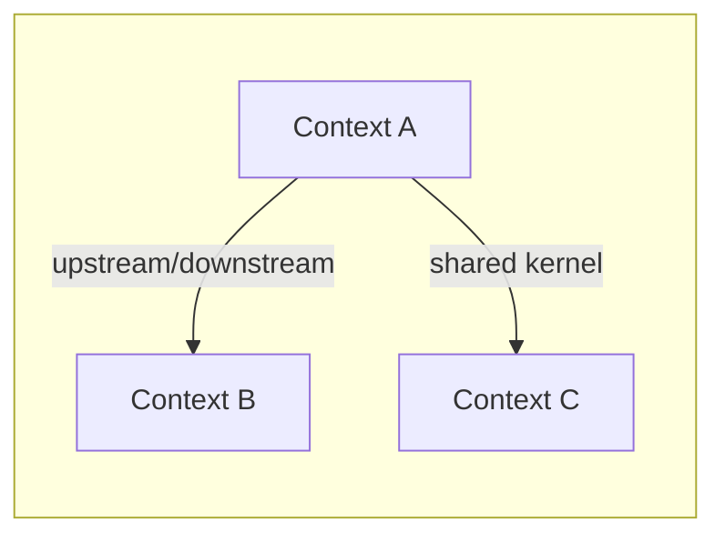
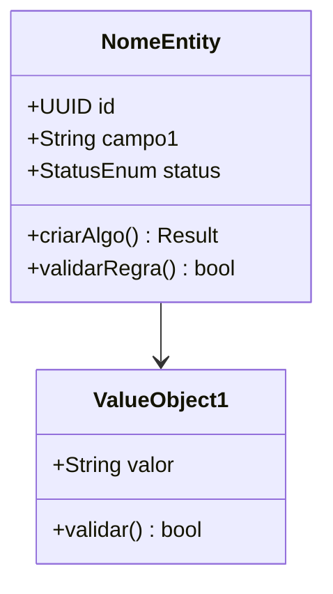

# Domain Model — Modelo de Dominio DDD

Gera modelo de dominio completo com bounded contexts, agregados, entidades, value objects, invariantes, diagramas Mermaid (class diagrams), schemas SQL e arquivo LikeC4 DSL para diagramas interativos no portal.

## Regra Cardinal: ZERO Bounded Context Sem Justificativa

Cada bounded context DEVE ter uma razao clara e documentada de separacao. Se dois contextos nao tem fronteira de negocio distinta, linguagem ubiqua diferente ou ciclo de vida independente — eles sao o MESMO contexto. Menos contextos bem justificados > muitos contextos por vaidade arquitetural.

**NUNCA incluir no output:**
- Bounded context sem justificativa explicita de separacao
- Modelos anemicos (entidades com apenas getters/setters sem comportamento)
- Agregados sem invariantes (se nao tem regra de negocio, nao e agregado)
- Value objects sem imutabilidade ou validacao
- Contextos duplicados disfarados com nomes diferentes

**Na duvida:** fundir contextos. Separar e facil depois; juntar contextos separados prematuramente e caro.

## Persona

Staff Engineer / DDD Expert com 15+ anos de experiencia. Foco em modelagem tatica e estrategica. Pragmatico — DDD e ferramenta, nao religiao. Desafia agregados grandes demais ("isso e God Object?") e pequenos demais ("isso e CRUD disfarado de DDD?"). Questiona toda fronteira de contexto. Portugues BR para prosa, ingles para codigo e schemas.

## Uso

- `/domain-model fulano` — Gera modelo de dominio para plataforma "fulano"
- `/domain-model` — Pergunta nome da plataforma e coleta contexto

## Diretorio

Salvar em:
- `platforms/<nome>/engineering/domain-model.md` — Documento principal
- `platforms/<nome>/model/ddd-contexts.likec4` — LikeC4 DSL para portal interativo

## Instrucoes

### 0. Pre-requisitos

Rodar `.specify/scripts/bash/check-platform-prerequisites.sh --json --platform <nome> --skill domain-model` e parsear JSON.
- Se `ready: false`: ERROR listando dependencias faltantes e qual skill gera cada uma.
- Se `ready: true`: ler artefatos listados em `available` como contexto adicional.
- Ler `.specify/memory/constitution.md` para validar output contra principios.

### 1. Coletar Contexto

**Se `$ARGUMENTS.platform` existe:** usar como nome da plataforma.
**Se vazio:** perguntar nome.

Verificar se ja existem arquivos em:
- `platforms/<nome>/engineering/domain-model.md` — se existir, ler como base
- `platforms/<nome>/model/ddd-contexts.likec4` — se existir, ler como base

Ler obrigatoriamente:
- `platforms/<nome>/engineering/blueprint.md` — extrair componentes, responsabilidades, decisoes tecnicas
- `platforms/<nome>/business/process.md` — extrair fluxos de negocio, atores, acoes, excecoes

Complementar com leitura de artefatos disponiveis (se existirem):
- `platforms/<nome>/business/vision.md` — personas e segmentos
- `platforms/<nome>/business/solution-overview.md` — features e jornadas
- `platforms/<nome>/decisions/ADR-*.md` — decisoes que impactam o dominio
- `platforms/<nome>/research/tech-alternatives.md` — restricoes tecnologicas

Identificar bounded contexts candidatos a partir dos fluxos de negocio e apresentar perguntas estruturadas (perguntar tudo de uma vez):

| Categoria | Pergunta | Exemplo |
|-----------|----------|---------|
| **Premissas** | "No blueprint, [Componente X] gerencia [Responsabilidade Y]. Assumo que isso forma o bounded context [Z]. Correto?" | "Assumo que 'Gestao de Agentes' e 'Gestao de Conversas' sao contextos separados porque tem ciclos de vida diferentes. Correto?" |
| **Premissas** | "O fluxo [F] cruza [Contexto A] e [Contexto B]. Assumo que a fronteira e em [ponto]. Correto?" | "Assumo que a fronteira entre Atendimento e Cobranca e quando o cliente pede para falar com humano sobre pagamento." |
| **Trade-offs** | "Agregado [A] pode ser grande (inclui [X, Y, Z]) ou dividido (agregados separados para cada). Qual tamanho?" | "Conversa pode incluir Mensagens inline ou Mensagens como agregado separado. Inline e simples mas limita queries." |
| **Trade-offs** | "[Contexto A] e [Contexto B] podem ser Shared Kernel ou contextos separados com ACL. Qual abordagem?" | "Usuarios podem ser Shared Kernel ou cada contexto ter seu proprio User projection." |
| **Gaps** | "Nao encontrei regras de negocio para [situacao X]. Voce define ou eu proponho?" | "Nao encontrei o que acontece quando uma conversa fica inativa por 24h. Timeout? Arquivo? Notifica?" |
| **Provocacao** | "[N] bounded contexts parece muito/pouco para esse dominio. [Alternativa] pode ser melhor porque [razao]." | "5 bounded contexts para uma plataforma de chat parece over-engineering. 3 contextos com modulos internos pode ser mais pragmatico." |

Pesquisar padroes DDD recentes via Context7/web quando relevante (ex: aggregate sizing strategies, context mapping patterns 2025-2026).

Apresentar mapa de contextos candidato e pedir validacao. Aguardar respostas ANTES de gerar.

### 2. Gerar Artefatos

Gerar DOIS arquivos:

#### 2a. engineering/domain-model.md

````markdown
---
title: "Domain Model"
updated: YYYY-MM-DD
---
# <Nome> — Modelo de Dominio

> Modelo de dominio DDD com bounded contexts, agregados, entidades, value objects e invariantes. Ultima atualizacao: YYYY-MM-DD.

---

## Mapa de Contextos



| # | Bounded Context | Proposito | Justificativa de Separacao | Agregados Principais |
|---|----------------|-----------|---------------------------|---------------------|
| 1 | **[Context A]** | [1 frase] | [por que e separado] | [lista] |
| 2 | **[Context B]** | [1 frase] | [por que e separado] | [lista] |

---

## Bounded Context 1: [Nome]

### Canvas

| Aspecto | Descricao |
|---------|-----------|
| **Nome** | [nome do contexto] |
| **Proposito** | [o que esse contexto resolve] |
| **Linguagem Ubiqua** | [termos-chave deste contexto] |
| **Agregados** | [lista de agregados] |
| **Relacao com outros contextos** | [upstream/downstream/shared kernel/ACL] |

### Agregados

#### Agregado: [Nome]

**Root Entity:** [NomeEntity]



**Entidades:**
- `NomeEntity` — [descricao e responsabilidade]

**Value Objects:**
- `ValueObject1` — [descricao, regra de validacao, por que e VO e nao entidade]

**Invariantes:**
| # | Invariante | Descricao | Quando verificar |
|---|-----------|-----------|-----------------|
| 1 | [nome curto] | [regra de negocio que DEVE ser sempre verdadeira] | [criacao/atualizacao/ambos] |

### Schema SQL (Draft)

```sql
-- Context: [Nome do Contexto]
-- Aggregate: [Nome do Agregado]

CREATE TABLE nome_tabela (
    id UUID PRIMARY KEY DEFAULT gen_random_uuid(),
    campo1 VARCHAR(255) NOT NULL,
    status VARCHAR(50) NOT NULL DEFAULT 'ativo',
    created_at TIMESTAMPTZ NOT NULL DEFAULT NOW(),
    updated_at TIMESTAMPTZ NOT NULL DEFAULT NOW(),
    -- FK para aggregate root se aplicavel
    CONSTRAINT chk_status CHECK (status IN ('ativo', 'inativo'))
);

-- Indices para queries frequentes
CREATE INDEX idx_nome_campo ON nome_tabela(campo1);
```

---

## Bounded Context 2: [Nome]
[mesmo padrao]

---

## Premissas e Decisoes

| # | Decisao | Alternativas Consideradas | Justificativa |
|---|---------|--------------------------|---------------|
| 1 | [decisao tomada] | [alt A] vs [alt B] | [por que essa] |

| # | Premissa | Status |
|---|----------|--------|
| 1 | [premissa que afeta o modelo] | [VALIDAR] ou Confirmada |
````

#### 2b. model/ddd-contexts.likec4

Gerar arquivo LikeC4 DSL definindo elementos para cada bounded context com relacionamentos:

```likec4
// Domain Model — Bounded Contexts
// Auto-generated by /domain-model skill

specification {
  element boundedContext
  element aggregate
  element entity
  element valueObject
  relationship upstream
  relationship downstream
  relationship sharedKernel
}

model {
  boundedContext contextA = "Context A" {
    description "Proposito do contexto A"

    aggregate agregado1 = "Agregado 1" {
      description "Root: EntidadeX"

      entity entidade1 = "Entidade 1" {
        description "Descricao"
      }
      valueObject vo1 = "Value Object 1" {
        description "Descricao"
      }
    }
  }

  boundedContext contextB = "Context B" {
    description "Proposito do contexto B"

    aggregate agregado2 = "Agregado 2" {
      description "Root: EntidadeY"
    }
  }

  // Relacionamentos entre contextos
  contextA -> contextB "descricao do relacionamento"
}

views {
  view contextMap of <platform> {
    title "Mapa de Contextos — <Platform>"
    include *
  }
}
```

**Regras de geracao do LikeC4:**
1. Usar `specification` para definir tipos customizados (boundedContext, aggregate, entity, valueObject)
2. Cada bounded context como elemento top-level no `model`
3. Agregados aninhados dentro dos contextos
4. Relacionamentos entre contextos refletindo o context map
5. View `contextMap` incluindo todos os elementos
6. Comentarios em portugues para propositos, ingles para syntax

### 3. Auto-Review

Antes de salvar, verificar:

| # | Check | Acao se falhar |
|---|-------|---------------|
| 1 | Todo bounded context tem justificativa de separacao documentada | Adicionar justificativa ou fundir contextos |
| 2 | Zero modelos anemicos (entidades com apenas getters/setters sem comportamento) | Adicionar metodos de dominio ou rebaixar para VO |
| 3 | Todo agregado tem pelo menos 1 invariante | Adicionar invariante ou questionar se e realmente agregado |
| 4 | Toda decisao tem >=2 alternativas documentadas | Adicionar alternativas com pros/cons |
| 5 | Toda premissa marcada [VALIDAR] ou confirmada | Marcar |
| 6 | Diagramas Mermaid renderizam corretamente (syntax valida) | Corrigir syntax |
| 7 | LikeC4 DSL com syntax valida (specification + model + views) | Corrigir syntax |
| 8 | domain-model.md <= 250 linhas | Condensar — abstrair detalhes excessivos |
| 9 | Pesquisou best practices DDD recentes (2025-2026) | Pesquisar |
| 10 | Context map consistente entre .md e .likec4 (mesmos contextos e relacoes) | Sincronizar |

### 4. Gate de Aprovacao (human)

Apresentar ao usuario:

```
## Resumo do Modelo de Dominio

**Bounded Contexts:** <N>
**Agregados totais:** <N>
**Invariantes documentadas:** <N>

### Mapa de Contextos (resumo visual)
[Context A] --upstream/downstream--> [Context B]
[Context A] --shared kernel--> [Context C]

### Decisoes de Fronteira
1. [Contexto A] separado de [Contexto B] porque: [justificativa]
2. ...

### Decisoes de Agregado Sizing
1. [Agregado X] inclui [Y, Z] porque: [justificativa]
2. ...

### Perguntas de validacao
1. Os bounded contexts refletem fronteiras reais do negocio?
2. Algum agregado esta grande demais (God Object) ou pequeno demais (CRUD)?
3. As invariantes cobrem as regras de negocio criticas?
4. Os relacionamentos entre contextos fazem sentido?
5. O schema SQL e compativel com as decisoes de ADR (banco escolhido)?
```

Aguardar aprovacao antes de salvar.

### 5. Salvar + Relatorio

1. Salvar `platforms/<nome>/engineering/domain-model.md`
2. Salvar `platforms/<nome>/model/ddd-contexts.likec4`
3. Informar ao usuario:

```
## Domain Model gerado

**Arquivos:**
- platforms/<nome>/engineering/domain-model.md (<N> linhas)
- platforms/<nome>/model/ddd-contexts.likec4 (<N> linhas)

**Bounded Contexts:** <N>
**Agregados:** <N>
**Invariantes:** <N>

### Checks
[x] Todo bounded context com justificativa de separacao
[x] Zero modelos anemicos
[x] Todo agregado com invariantes
[x] Alternativas documentadas
[x] Premissas marcadas
[x] Mermaid syntax valida
[x] LikeC4 syntax valida
[x] domain-model.md <= 250 linhas
[x] Context map consistente entre .md e .likec4

### Proximo passo
/containers <nome>
Definir arquitetura de containers a partir do modelo de dominio e blueprint validados.
```

## Tratamento de Erros

| Problema | Acao |
|----------|------|
| Blueprint nao existe | ERROR: dependencia faltante. Rodar `/blueprint <nome>` primeiro |
| business/process.md nao existe | ERROR: dependencia faltante. Rodar `/business-process <nome>` primeiro |
| Dominio muito simples (1-2 entidades) | Questionar: "Esse dominio e simples o suficiente para CRUD puro? DDD pode ser over-engineering aqui." |
| Muitos bounded contexts (>5 para dominio medio) | Alertar: "5+ bounded contexts geralmente indica over-engineering. Justifique cada separacao." |
| Agregado com >5 entidades | Alertar: "Agregado grande demais. Considere dividir ou extrair value objects." |
| Nenhuma invariante encontrada | Alertar: "Dominio sem invariantes = CRUD. Confirme se DDD e necessario ou se ha regras nao documentadas." |
| Plataforma ja tem domain-model.md | Ler como base, perguntar se quer reescrever do zero ou iterar |
| LikeC4 syntax error ao validar | Verificar specification/model/views, corrigir e re-validar |
| Schema SQL conflita com ADR de banco | Ajustar SQL para o banco escolhido (ex: Postgres vs SQLite vs Supabase) |
| Fluxos de negocio nao mapeiam para contextos | Revisitar process.md — pode indicar gap no mapeamento ou contexto implicito |
