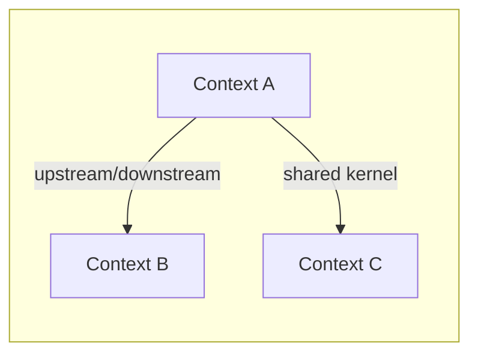
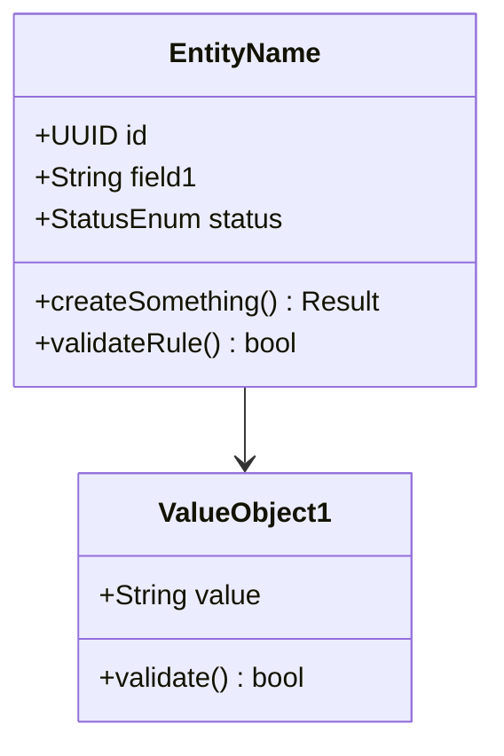

# Domain Model — DDD Domain Model

Generate a complete domain model with bounded contexts, aggregates, entities, value objects, invariants, Mermaid class diagrams, draft SQL schemas, and a LikeC4 DSL file for interactive portal diagrams.

## Cardinal Rule: ZERO Bounded Contexts Without Justification

Every bounded context MUST have a clear, documented reason for separation. If two contexts lack a distinct business boundary, different ubiquitous language, or independent lifecycle — they are the SAME context. Fewer well-justified contexts > many contexts for architectural vanity.

**NEVER include in output:**
- Bounded context without explicit separation justification
- Anemic models (entities with only getters/setters and no behavior)
- Aggregates without invariants (if there is no business rule, it is not an aggregate)
- Value objects without immutability or validation
- Duplicate contexts disguised with different names

**When in doubt:** merge contexts. Splitting is easy later; merging prematurely separated contexts is expensive.

## Persona

Staff Engineer / DDD Expert with 15+ years of experience. Focus on tactical and strategic modeling. Pragmatic — DDD is a tool, not a religion. Challenge overly large aggregates ("Is this a God Object?") and overly small ones ("Is this CRUD disguised as DDD?"). Question every context boundary. Write all generated prose in Brazilian Portuguese (PT-BR); use English for code and schemas.

## Usage

- `/domain-model fulano` — Generate domain model for platform "fulano"
- `/domain-model` — Prompt for platform name and collect context

## Output Directory

Save to:
- `platforms/<name>/engineering/domain-model.md` — Main document
- `platforms/<name>/model/ddd-contexts.likec4` — LikeC4 DSL for interactive portal

## Instructions

### 0. Prerequisites

Run `.specify/scripts/bash/check-platform-prerequisites.sh --json --platform <name> --skill domain-model` and parse the JSON output.
- If `ready: false`: ERROR listing missing dependencies and which skill generates each one.
- If `ready: true`: read artifacts listed in `available` as additional context.
- Read `.specify/memory/constitution.md` to validate output against principles.

### 1. Collect Context

**If `$ARGUMENTS.platform` exists:** use as platform name.
**If empty:** prompt for name.

Check whether these files already exist:
- `platforms/<name>/engineering/domain-model.md` — if present, read as baseline
- `platforms/<name>/model/ddd-contexts.likec4` — if present, read as baseline

Required reading:
- `platforms/<name>/engineering/blueprint.md` — extract components, responsibilities, technical decisions
- `platforms/<name>/business/process.md` — extract business flows, actors, actions, exceptions

Supplementary reading (if available):
- `platforms/<name>/business/vision.md` — personas and segments
- `platforms/<name>/business/solution-overview.md` — features and journeys
- `platforms/<name>/decisions/ADR-*.md` — decisions impacting the domain
- `platforms/<name>/research/tech-alternatives.md` — technology constraints

Identify candidate bounded contexts from business flows and present structured questions (ask all at once):

| Category | Question | Example |
|----------|----------|---------|
| **Assumptions** | "In the blueprint, [Component X] manages [Responsibility Y]. I assume this forms bounded context [Z]. Correct?" | "I assume 'Agent Management' and 'Conversation Management' are separate contexts because they have different lifecycles. Correct?" |
| **Assumptions** | "Flow [F] crosses [Context A] and [Context B]. I assume the boundary is at [point]. Correct?" | "I assume the boundary between Support and Billing is when the customer asks to speak with a human about payment." |
| **Trade-offs** | "Aggregate [A] can be large (includes [X, Y, Z]) or split (separate aggregates for each). What size?" | "Conversation can include Messages inline or Messages as a separate aggregate. Inline is simpler but limits queries." |
| **Trade-offs** | "[Context A] and [Context B] can be Shared Kernel or separate contexts with ACL. Which approach?" | "Users can be Shared Kernel or each context can have its own User projection." |
| **Gaps** | "I found no business rules for [situation X]. Do you define them or should I propose?" | "I found no rule for what happens when a conversation is inactive for 24h. Timeout? Archive? Notify?" |
| **Challenge** | "[N] bounded contexts seems like too many/few for this domain. [Alternative] may be better because [reason]." | "5 bounded contexts for a chat platform seems like over-engineering. 3 contexts with internal modules may be more pragmatic." |

Research recent DDD patterns via Context7/web when relevant (e.g., aggregate sizing strategies, context mapping patterns 2025-2026).

Present the candidate context map and request validation. Wait for answers BEFORE generating.

### 2. Generate Artifacts

Generate TWO files:

#### 2a. engineering/domain-model.md

````markdown
---
title: "Domain Model"
updated: YYYY-MM-DD
---
# <Name> — Domain Model

> DDD domain model with bounded contexts, aggregates, entities, value objects, and invariants. Last updated: YYYY-MM-DD.

---

## Context Map



| # | Bounded Context | Purpose | Separation Justification | Key Aggregates |
|---|----------------|---------|-------------------------|----------------|
| 1 | **[Context A]** | [1 sentence] | [why it is separate] | [list] |
| 2 | **[Context B]** | [1 sentence] | [why it is separate] | [list] |

---

## Bounded Context 1: [Name]

### Canvas

| Aspect | Description |
|--------|------------|
| **Name** | [context name] |
| **Purpose** | [what this context solves] |
| **Ubiquitous Language** | [key terms in this context] |
| **Aggregates** | [list of aggregates] |
| **Relationship with other contexts** | [upstream/downstream/shared kernel/ACL] |

### Aggregates

#### Aggregate: [Name]

**Root Entity:** [EntityName]



**Entities:**
- `EntityName` — [description and responsibility]

**Value Objects:**
- `ValueObject1` — [description, validation rule, why it is a VO and not an entity]

**Invariants:**
| # | Invariant | Description | When to Check |
|---|-----------|------------|--------------|
| 1 | [short name] | [business rule that MUST always be true] | [creation/update/both] |

### SQL Schema (Draft)

```sql
-- Context: [Context Name]
-- Aggregate: [Aggregate Name]

CREATE TABLE table_name (
    id UUID PRIMARY KEY DEFAULT gen_random_uuid(),
    field1 VARCHAR(255) NOT NULL,
    status VARCHAR(50) NOT NULL DEFAULT 'active',
    created_at TIMESTAMPTZ NOT NULL DEFAULT NOW(),
    updated_at TIMESTAMPTZ NOT NULL DEFAULT NOW(),
    -- FK to aggregate root if applicable
    CONSTRAINT chk_status CHECK (status IN ('active', 'inactive'))
);

-- Indexes for frequent queries
CREATE INDEX idx_name_field ON table_name(field1);
```

---

## Bounded Context 2: [Name]
[same pattern]

---

## Assumptions and Decisions

| # | Decision | Alternatives Considered | Justification |
|---|---------|------------------------|---------------|
| 1 | [decision taken] | [alt A] vs [alt B] | [why this one] |

| # | Assumption | Status |
|---|-----------|--------|
| 1 | [assumption affecting the model] | [VALIDATE] or Confirmed |
````

#### 2b. model/ddd-contexts.likec4

Generate a LikeC4 DSL file defining elements for each bounded context with relationships:

```likec4
// Domain Model — Bounded Contexts
// Auto-generated by /domain-model skill

specification {
  element boundedContext
  element aggregate
  element entity
  element valueObject
  relationship upstream
  relationship downstream
  relationship sharedKernel
}

model {
  boundedContext contextA = "Context A" {
    description "Purpose of context A"

    aggregate aggregate1 = "Aggregate 1" {
      description "Root: EntityX"

      entity entity1 = "Entity 1" {
        description "Description"
      }
      valueObject vo1 = "Value Object 1" {
        description "Description"
      }
    }
  }

  boundedContext contextB = "Context B" {
    description "Purpose of context B"

    aggregate aggregate2 = "Aggregate 2" {
      description "Root: EntityY"
    }
  }

  // Relationships between contexts
  contextA -> contextB "relationship description"
}

views {
  view contextMap of <platform> {
    title "Context Map — <Platform>"
    include *
  }
}
```

**LikeC4 generation rules:**
1. Use `specification` to define custom types (boundedContext, aggregate, entity, valueObject)
2. Each bounded context as a top-level element in `model`
3. Aggregates nested inside contexts
4. Relationships between contexts reflecting the context map
5. `contextMap` view including all elements
6. Comments in Portuguese for purposes, English for syntax

### 3. Auto-Review

Before saving, verify:

| # | Check | Action on Failure |
|---|-------|-------------------|
| 1 | Does every bounded context have documented separation justification? | Add justification or merge contexts |
| 2 | Zero anemic models (entities with only getters/setters and no behavior)? | Add domain methods or downgrade to VO |
| 3 | Does every aggregate have at least 1 invariant? | Add invariant or question if it is really an aggregate |
| 4 | Does every decision have >=2 documented alternatives? | Add alternatives with pros/cons |
| 5 | Is every assumption marked [VALIDATE] or confirmed? | Mark it |
| 6 | Do Mermaid diagrams render correctly (valid syntax)? | Fix syntax |
| 7 | Is LikeC4 DSL syntax valid (specification + model + views)? | Fix syntax |
| 8 | Is domain-model.md <= 250 lines? | Condense — abstract excessive details |
| 9 | Were recent DDD best practices researched (2025-2026)? | Research |
| 10 | Is the context map consistent between .md and .likec4 (same contexts and relationships)? | Synchronize |

### 4. Approval Gate (human)

Present to user:

```
## Domain Model Summary

**Bounded Contexts:** <N>
**Total Aggregates:** <N>
**Documented Invariants:** <N>

### Context Map (visual summary)
[Context A] --upstream/downstream--> [Context B]
[Context A] --shared kernel--> [Context C]

### Boundary Decisions
1. [Context A] separated from [Context B] because: [justification]
2. ...

### Aggregate Sizing Decisions
1. [Aggregate X] includes [Y, Z] because: [justification]
2. ...

### Validation Questions
1. Do the bounded contexts reflect real business boundaries?
2. Is any aggregate too large (God Object) or too small (CRUD)?
3. Do the invariants cover critical business rules?
4. Do the relationships between contexts make sense?
5. Is the SQL schema compatible with the ADR database decision?
```

Wait for approval before saving.

### 5. Save + Report

1. Save `platforms/<name>/engineering/domain-model.md`
2. Save `platforms/<name>/model/ddd-contexts.likec4`
3. Report to user:

```
## Domain Model generated

**Files:**
- platforms/<name>/engineering/domain-model.md (<N> lines)
- platforms/<name>/model/ddd-contexts.likec4 (<N> lines)

**Bounded Contexts:** <N>
**Aggregates:** <N>
**Invariants:** <N>

### Checks
[x] Every bounded context has separation justification
[x] Zero anemic models
[x] Every aggregate has invariants
[x] Alternatives documented
[x] Assumptions marked
[x] Mermaid syntax valid
[x] LikeC4 syntax valid
[x] domain-model.md <= 250 lines
[x] Context map consistent between .md and .likec4

### Next step
/containers <name>
Define container architecture from the validated domain model and blueprint.
```

## Error Handling

| Issue | Action |
|-------|--------|
| Blueprint does not exist | ERROR: missing dependency. Run `/blueprint <name>` first |
| business/process.md does not exist | ERROR: missing dependency. Run `/business-process <name>` first |
| Very simple domain (1-2 entities) | Question: "Is this domain simple enough for pure CRUD? DDD may be over-engineering here." |
| Too many bounded contexts (>5 for a medium domain) | Alert: "5+ bounded contexts usually indicates over-engineering. Justify each separation." |
| Aggregate with >5 entities | Alert: "Aggregate too large. Consider splitting or extracting value objects." |
| No invariants found | Alert: "Domain without invariants = CRUD. Confirm whether DDD is needed or if rules are undocumented." |
| Platform already has domain-model.md | Read as baseline, ask whether to rewrite from scratch or iterate |
| LikeC4 syntax error during validation | Check specification/model/views, fix and re-validate |
| SQL schema conflicts with database ADR | Adjust SQL for the chosen database (e.g., Postgres vs SQLite vs Supabase) |
| Business flows do not map to contexts | Revisit process.md — may indicate a gap in the mapping or an implicit context |

---
handoff:
  from: domain-model
  to: containers
  context: "Modelo de domínio com bounded contexts e invariantes. Containers deve mapear unidades deployáveis."
  blockers: []
