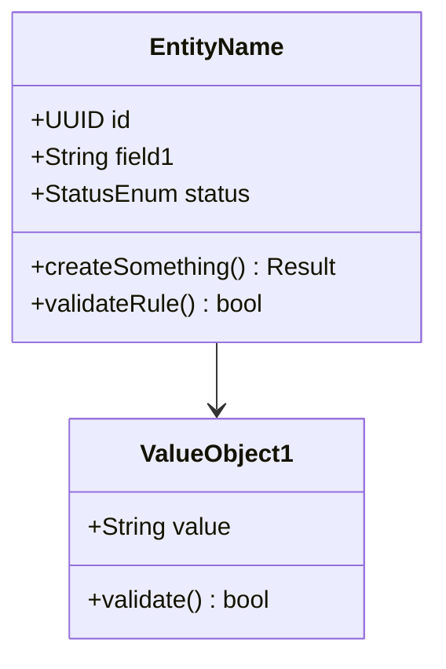

# Domain Model — DDD Domain Model

Generate a complete domain model with bounded contexts, aggregates, entities, value objects, invariants, Mermaid class diagrams, and draft SQL schemas.

## Cardinal Rule: ZERO Bounded Contexts Without Justification

Every bounded context MUST have a clear, documented reason for separation. If two contexts lack a distinct business boundary, different ubiquitous language, or independent lifecycle — they are the SAME context. Fewer well-justified contexts > many contexts for architectural vanity.

**NEVER include in output:**
- Bounded context without explicit separation justification
- Anemic models (entities with only getters/setters and no behavior)
- Aggregates without invariants (if there is no business rule, it is not an aggregate)
- Value objects without immutability or validation
- Duplicate contexts disguised with different names

**When in doubt:** merge contexts. Splitting is easy later; merging prematurely separated contexts is expensive.

> **Contract**: Follow `.claude/knowledge/pipeline-contract-base.md` + `.claude/knowledge/pipeline-contract-engineering.md`.

## Persona

DDD practitioner — fewer contexts is better, real invariants, zero anemic models. Write generated artifacts in Brazilian Portuguese (PT-BR).

## Usage

- `/domain-model fulano` — Generate domain model for platform "fulano"
- `/domain-model` — Prompt for platform name and collect context

## Output Directory

Save to `platforms/<name>/engineering/domain-model.md`.

## Instructions

### 1. Collect Context

**If `$ARGUMENTS.platform` exists:** use as platform name.
**If empty:** prompt for name.

Check whether `platforms/<name>/engineering/domain-model.md` already exists — if present, read as baseline.

Required reading:
- `platforms/<name>/engineering/blueprint.md` — extract components, responsibilities, technical decisions
- `platforms/<name>/business/process.md` — extract business flows, actors, actions, exceptions

Supplementary reading (if available):
- `platforms/<name>/business/vision.md` — personas and segments
- `platforms/<name>/business/solution-overview.md` — features and journeys
- `platforms/<name>/decisions/ADR-*.md` — decisions impacting the domain
- `platforms/<name>/research/tech-alternatives.md` — technology constraints

Identify candidate bounded contexts from business flows and present structured questions (ask all at once):

| Category | Question | Example |
|----------|----------|---------|
| **Assumptions** | "In the blueprint, [Component X] manages [Responsibility Y]. I assume this forms bounded context [Z]. Correct?" | "I assume 'Agent Management' and 'Conversation Management' are separate contexts because they have different lifecycles. Correct?" |
| **Assumptions** | "Flow [F] crosses [Context A] and [Context B]. I assume the boundary is at [point]. Correct?" | "I assume the boundary between Support and Billing is when the customer asks to speak with a human about payment." |
| **Trade-offs** | "Aggregate [A] can be large (includes [X, Y, Z]) or split (separate aggregates for each). What size?" | "Conversation can include Messages inline or Messages as a separate aggregate. Inline is simpler but limits queries." |
| **Trade-offs** | "[Context A] and [Context B] can be Shared Kernel or separate contexts with ACL. Which approach?" | "Users can be Shared Kernel or each context can have its own User projection." |
| **Gaps** | "I found no business rules for [situation X]. Do you define them or should I propose?" | "I found no rule for what happens when a conversation is inactive for 24h. Timeout? Archive? Notify?" |
| **Challenge** | "[N] bounded contexts seems like too many/few for this domain. [Alternative] may be better because [reason]." | "5 bounded contexts for a chat platform seems like over-engineering. 3 contexts with internal modules may be more pragmatic." |

Research recent DDD patterns via Context7/web when relevant (e.g., aggregate sizing strategies, context mapping patterns 2025-2026).

Present the candidate context map and request validation. Wait for answers BEFORE generating.

### 2. Generate Artifact

````markdown
---
title: "Domain Model"
updated: YYYY-MM-DD
sidebar:
  order: 2
---
# <Name> — Domain Model

> DDD domain model with bounded contexts, aggregates, entities, value objects, and invariants. Last updated: YYYY-MM-DD.

---

## Bounded Contexts

| # | Bounded Context | Purpose | Separation Justification | Key Aggregates |
|---|----------------|---------|-------------------------|----------------|
| 1 | **[Context A]** | [1 sentence] | [why it is separate] | [list] |
| 2 | **[Context B]** | [1 sentence] | [why it is separate] | [list] |

> Relacionamentos entre contextos e padrões DDD → ver [context-map.md](../context-map/)

---

## Bounded Context 1: [Name]

### Canvas

| Aspect | Description |
|--------|------------|
| **Name** | [context name] |
| **Purpose** | [what this context solves] |
| **Ubiquitous Language** | [key terms in this context] |
| **Aggregates** | [list of aggregates] |

### Aggregates

#### Aggregate: [Name]

**Root Entity:** [EntityName]



**Entities:**
- `EntityName` — [description and responsibility]

**Value Objects:**
- `ValueObject1` — [description, validation rule, why it is a VO and not an entity]

**Invariants:**
| # | Invariant | Description | When to Check |
|---|-----------|------------|--------------|
| 1 | [short name] | [business rule that MUST always be true] | [creation/update/both] |

### SQL Schema (Draft)

```sql
-- Context: [Context Name]
-- Aggregate: [Aggregate Name]

CREATE TABLE table_name (
    id UUID PRIMARY KEY DEFAULT gen_random_uuid(),
    field1 VARCHAR(255) NOT NULL,
    status VARCHAR(50) NOT NULL DEFAULT 'active',
    created_at TIMESTAMPTZ NOT NULL DEFAULT NOW(),
    updated_at TIMESTAMPTZ NOT NULL DEFAULT NOW(),
    -- FK to aggregate root if applicable
    CONSTRAINT chk_status CHECK (status IN ('active', 'inactive'))
);

-- Indexes for frequent queries
CREATE INDEX idx_name_field ON table_name(field1);
```

---

## Bounded Context 2: [Name]
[same pattern]

---

## Assumptions and Decisions

| # | Decision | Alternatives Considered | Justification |
|---|---------|------------------------|---------------|
| 1 | [decision taken] | [alt A] vs [alt B] | [why this one] |

| # | Assumption | Status |
|---|-----------|--------|
| 1 | [assumption affecting the model] | [VALIDAR] or Confirmed |
````

### Auto-Review Additions

| # | Check | Action on Failure |
|---|-------|-------------------|
| 1 | Does every bounded context have documented separation justification? | Add justification or merge contexts |
| 2 | Zero anemic models (entities with only getters/setters and no behavior)? | Add domain methods or downgrade to VO |
| 3 | Does every aggregate have at least 1 invariant? | Add invariant or question if it is really an aggregate |
| 4 | Do Mermaid diagrams render correctly (valid syntax)? | Fix syntax |
| 5 | Is domain-model.md <= 250 lines? | Condense — abstract excessive details |
| 6 | Were recent DDD best practices researched (2025-2026)? | Research |
| 7 | Does NOT contain a Context Map Mermaid diagram? (owned by context-map.md) | Remove diagram, add cross-ref |
| 8 | Does the Canvas table omit "Relationship with other contexts"? (owned by context-map.md) | Remove row |

## Error Handling

| Issue | Action |
|-------|--------|
| Blueprint does not exist | ERROR: missing dependency. Run `/blueprint <name>` first |
| business/process.md does not exist | ERROR: missing dependency. Run `/business-process <name>` first |
| Very simple domain (1-2 entities) | Question: "Is this domain simple enough for pure CRUD? DDD may be over-engineering here." |
| Too many bounded contexts (>5 for a medium domain) | Alert: "5+ bounded contexts usually indicates over-engineering. Justify each separation." |
| Aggregate with >5 entities | Alert: "Aggregate too large. Consider splitting or extracting value objects." |
| No invariants found | Alert: "Domain without invariants = CRUD. Confirm whether DDD is needed or if rules are undocumented." |
| Platform already has domain-model.md | Read as baseline, ask whether to rewrite from scratch or iterate |
| SQL schema conflicts with database ADR | Adjust SQL for the chosen database (e.g., Postgres vs SQLite vs Supabase) |
| Business flows do not map to contexts | Revisit process.md — may indicate a gap in the mapping or an implicit context |

