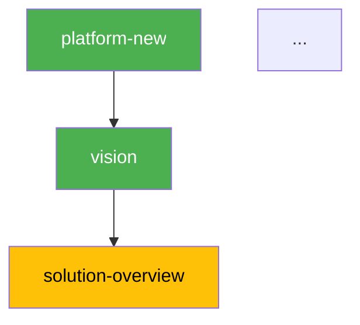

# Pipeline Status — Visibilidade do Pipeline

Skill read-only. Mostra status de todos os nos do pipeline DAG com tabela, diagrama Mermaid colorido e progresso.

## Regra: Read-Only

Esta skill NAO gera artefatos. Apenas le status e apresenta.

## Persona

Pipeline Observer. Factual, visual. Portugues BR.

## Uso

- `/pipeline-status fulano` — Status do pipeline de "fulano"
- `/pipeline-status` — Pergunta plataforma

## Instrucoes

### 1. Coletar Status

Rodar: `.specify/scripts/bash/check-platform-prerequisites.sh --json --status --platform <nome>`

Parsear JSON com nodes, status (done/ready/blocked), progress.

Alem do JSON de status, ler `platforms/<nome>/platform.yaml` para obter as relacoes `depends` de cada node (necessario para construir o Mermaid DAG — o JSON de --status nao inclui edges).

### 2. Renderizar

**Tabela de Status:**

```
| # | Skill | Status | Layer | Gate | Missing Deps |
|---|-------|--------|-------|------|-------------|
| 1 | vision | ✅ done | business | human | — |
| 2 | blueprint | 🟡 ready | engineering | human | — |
| 3 | containers | 🔴 blocked | engineering | human | domain-model |
| 4 | codebase-map | ⬜ skipped | research | auto | — |
```

**Mermaid DAG colorido:**



**Progresso:** N/<total> done | M ready | K blocked
(Usar `progress.total` do JSON retornado pelo script)

**Para recomendacao do proximo passo:** `/pipeline-next <nome>`

### 3. Apresentar

Mostrar tabela + Mermaid + progresso + sugestao de proximo. NAO executar nada.

## Tratamento de Erros

| Problema | Acao |
|----------|------|
| Script falha (python3 nao encontrado) | ERROR: pre-requisito python3 nao instalado |
| Platform.yaml nao existe | ERROR: plataforma nao encontrada. Rodar `/platform-new` primeiro |
| Pipeline section ausente no platform.yaml | ERROR: platform.yaml sem secao `pipeline:`. Rodar `copier update` na plataforma |
| Nome de plataforma invalido | Perguntar nome correto |
