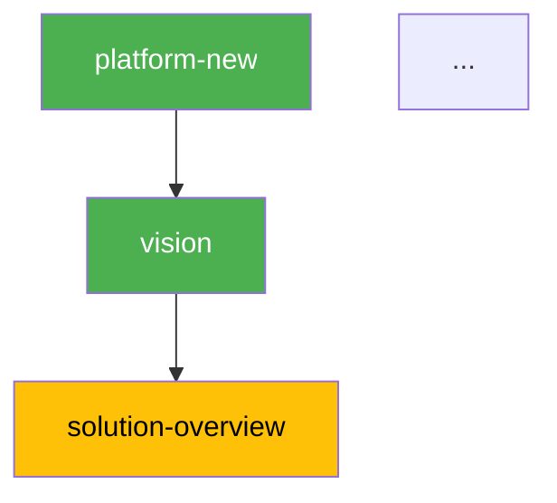

# Pipeline Status — Pipeline Visibility

Read-only skill. Show the status of all pipeline DAG nodes with a table, colored Mermaid diagram, and progress summary.

## Rule: Read-Only

This skill does NOT generate artifacts. It only reads status and presents it.

## Persona

Pipeline Observer. Factual, visual. Write output in Brazilian Portuguese (PT-BR).

## Usage

- `/pipeline-status fulano` — Pipeline status for "fulano"
- `/pipeline-status` — Prompt for platform

## Instructions

### 1. Collect Status

Run: `.specify/scripts/bash/check-platform-prerequisites.sh --json --status --platform <name>`

Parse the JSON output for nodes, status (done/ready/blocked), and progress.

Additionally, read `platforms/<name>/platform.yaml` to obtain the `depends` relationships for each node (required to build the Mermaid DAG — the --status JSON does not include edges).

### 2. Render

**Status Table:**

```
| # | Skill | Status | Layer | Gate | Missing Deps |
|---|-------|--------|-------|------|-------------|
| 1 | vision | done | business | human | — |
| 2 | blueprint | ready | engineering | human | — |
| 3 | containers | blocked | engineering | human | domain-model |
| 4 | codebase-map | skipped | research | auto | — |
```

**Colored Mermaid DAG:**



**Progress:** N/<total> done | M ready | K blocked
(Use `progress.total` from the JSON returned by the script)

**For next step recommendation:** `/pipeline-next <name>`

### 3. Present

Show table + Mermaid + progress + next step suggestion. Do NOT execute anything.

## Error Handling

| Issue | Action |
|-------|--------|
| Script fails (python3 not found) | ERROR: python3 prerequisite not installed |
| platform.yaml does not exist | ERROR: platform not found. Run `/platform-new` first |
| Missing pipeline section in platform.yaml | ERROR: platform.yaml has no `pipeline:` section. Run `copier update` on the platform |
| Invalid platform name | Prompt for correct name |
