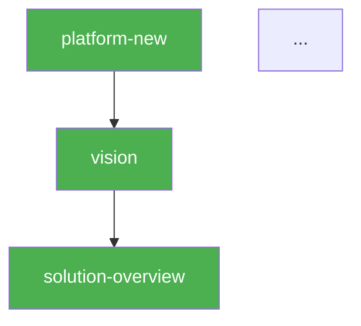
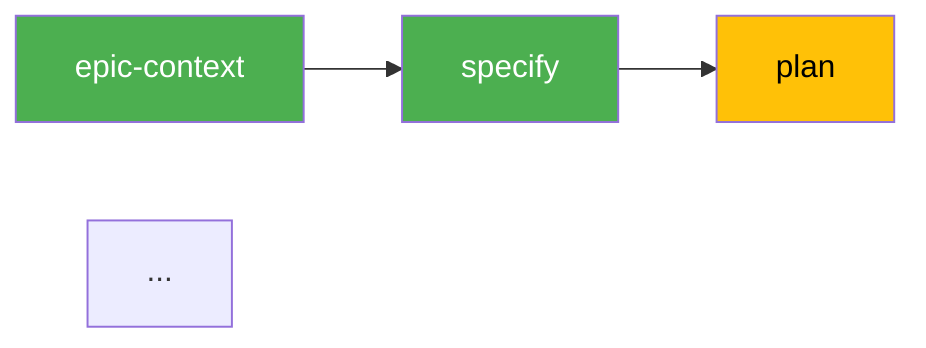

# Pipeline — Status + Next Step

> **Contract**: Follow step 0 from `.claude/knowledge/pipeline-contract-base.md`.

Unified read-only skill. Shows pipeline DAG status at both levels (L1: platform, L2: epic cycle) with tables, colored Mermaid diagrams, progress summary, and next step recommendation.

## Rule: Read-Only, NEVER Auto-Execute

This skill does NOT generate artifacts and does NOT execute pipeline steps. It only reads status and presents it with a recommendation. The user decides when and whether to execute.

## Persona

Pipeline Observer + Advisor. Factual, visual, concise. Write output in Brazilian Portuguese (PT-BR).

## Usage

- `/pipeline fulano` — Full pipeline status for "fulano"
- `/pipeline` — Prompt for platform

## Instructions

### 1. Collect L1 Status (Platform DAG)

Run: `.specify/scripts/bash/check-platform-prerequisites.sh --json --status --platform <name>`

If `--use-db` is available (`.pipeline/madruga.db` exists), also run with `--use-db` for enhanced status with hashes and staleness.

Parse the JSON output for nodes, status (done/ready/blocked/skipped/stale), and progress.

Additionally, read `platforms/<name>/platform.yaml` to obtain `depends` relationships for each node (required for Mermaid edges).

### 2. Collect L2 Status (Epic Cycle)

Check if `platforms/<name>/platform.yaml` has `epic_cycle` section.

For each epic directory in `platforms/<name>/epics/*/`:
- Run: `.specify/scripts/bash/check-platform-prerequisites.sh --json --epic <epic-slug> --status --platform <name>`
- Or if DB exists: add `--use-db` for DB-enhanced status

### 3. Render L1

**Status Table:**

```
## Pipeline L1 — Platform DAG (<N>/<total> done)

| # | Skill | Status | Layer | Gate | Est. | Missing Deps |
|---|-------|--------|-------|------|------|-------------|
| 1 | platform-new | done | business | human | ~15 min | — |
| 2 | vision | done | business | human | ~30 min | — |
| 3 | solution-overview | ready | business | human | ~30 min | — |
| ... | ... | ... | ... | ... | ... | ... |

**Time estimates per skill**: platform-new ~15min, vision ~30min, solution-overview ~30min, business-process ~30min, tech-research ~45min, codebase-map ~30min, adr ~45min, blueprint ~30min, domain-model ~45min, containers ~45min, context-map ~30min, epic-breakdown ~45min, roadmap ~30min. **Total pipeline: ~7h.**
```

**Colored Mermaid DAG:**



### 4. Render L2 (per epic)

For each epic with status data:

```
## Pipeline L2 — Epic <NNN-slug> (<N>/10 done)

| # | Step | Status | Gate |
|---|------|--------|------|
| 1 | epic-context | done | human |
| 2 | specify | done | human |
| 3 | plan | ready | human |
| ... |
```

**Colored Mermaid (linear flow):**



### 5. Next Step Recommendation

**Filter all nodes (L1 + L2) with status=ready.**

**Priority logic:**
1. L1 nodes before L2 (complete platform DAG first)
2. Non-optional before optional (critical path first)
3. Most downstream dependents first (unblocks more work)
4. Layer as tiebreaker: business > research > engineering > planning

**If 1 ready:**
```
## Próximo Passo Recomendado

**`/<skill> <platform>`**
- O que faz: [1-line description]
- Dependências: [já satisfeitas]
- Gate: [human/auto/1-way-door]

Para executar: `/<skill> <platform>`
```

**If multiple ready:**
List all and recommend the highest-priority one.

**If none ready AND all done (L1 + all L2):**
```
## Pipeline Completo!

L1: <N>/<N> nós completos.
L2: <M> epics com ciclo completo.
```

**If none ready AND some blocked:**
```
## Nenhum Step Disponível

| Skill | Bloqueado por |
|-------|--------------|
| ... | ... |

Resolva os bloqueios primeiro.
```

### 6. Present

Show L1 table + Mermaid + L2 tables + Mermaid + progress + next step. Do NOT execute anything.

## Error Handling

| Issue | Action |
|-------|--------|
| Script fails (python3 not found) | ERROR: python3 prerequisite not installed |
| platform.yaml does not exist | ERROR: platform not found. Run `/platform-new` first |
| Missing pipeline section in platform.yaml | ERROR: platform.yaml has no `pipeline:` section. Run `copier update` on the platform |
| No epic_cycle section | Skip L2, show only L1 |
| No epics exist | Skip L2, show only L1 with note "No epics found" |
| DB not available | Fallback to filesystem-only status |
| Invalid platform name | Prompt for correct name |

---
handoff:
  from: pipeline
  to: null
  context: "Read-only skill. No handoff — user decides next action based on recommendation."
  blockers: []
