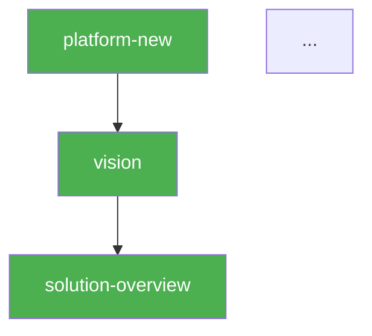
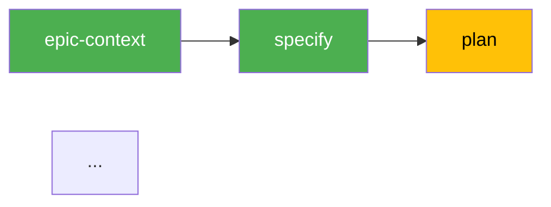

# Pipeline — Status + Next Step

> **Contract**: Follow step 0 from `.claude/knowledge/pipeline-contract-base.md`.

Unified read-only skill. Shows pipeline DAG status at both levels (L1: platform, L2: epic cycle) with tables, colored Mermaid diagrams, progress summary, and next step recommendation.

## Rule: Read-Only, NEVER Auto-Execute

This skill does NOT generate artifacts and does NOT execute pipeline steps. It only reads status and presents it with a recommendation. The user decides when and whether to execute.

## Persona

Pipeline Observer + Advisor. Factual, visual, concise. Write output in Brazilian Portuguese (PT-BR).

## Usage

- `/pipeline prosauai` — Full pipeline status for "prosauai"
- `/pipeline` — Prompt for platform

## Instructions

### 1. Collect L1 Status (Platform DAG)

**Primary: Query DB** (if `.pipeline/madruga.db` exists):
```bash
python3 -c "
import sys; sys.path.insert(0, '.specify/scripts')
from db import get_conn, get_pipeline_nodes, get_platform_status, get_stale_nodes
import json, yaml

conn = get_conn()
nodes = get_pipeline_nodes(conn, '<platform>')
status = get_platform_status(conn, '<platform>')

# Load DAG edges for staleness check
from config import load_pipeline
pipeline = load_pipeline()
edges = {n['id']: n.get('depends', []) for n in pipeline.get('nodes', [])}
stale = get_stale_nodes(conn, '<platform>', edges)

print(json.dumps({'nodes': nodes, 'status': status, 'stale': [s['node_id'] for s in stale]}))
conn.close()
"
```

**Fallback** (if DB not available): Run `.specify/scripts/bash/check-platform-prerequisites.sh --json --status --platform <name>`

Additionally, load the pipeline definition from `.specify/pipeline.yaml` (via `load_pipeline()` in `config.py`) to obtain `depends` relationships for each node (required for Mermaid edges).

### 2. Collect L2 Status (Epic Cycle)

Check if `.specify/pipeline.yaml` has `epic_cycle` section.

**Primary: Query DB** for each epic:
```bash
python3 -c "
import sys; sys.path.insert(0, '.specify/scripts')
from db import get_conn, get_epics, get_epic_nodes, get_epic_status
import json

conn = get_conn()
epics = get_epics(conn, '<platform>')
for e in epics:
    nodes = get_epic_nodes(conn, '<platform>', e['epic_id'])
    status = get_epic_status(conn, '<platform>', e['epic_id'])
    print(json.dumps({'epic': e['epic_id'], 'title': e['title'], 'nodes': nodes, 'status': status}))
conn.close()
"
```

**Fallback**: For each epic directory in `platforms/<name>/epics/*/`, check file existence to infer status.

### 3. Render L1

**Status Table:**

```
## Pipeline L1 — Platform DAG (<N>/<total> done)

| # | Skill | Status | Layer | Gate | Est. | Missing Deps |
|---|-------|--------|-------|------|------|-------------|
| 1 | platform-new | done | business | human | ~15 min | — |
| 2 | vision | done | business | human | ~30 min | — |
| 3 | solution-overview | ready | business | human | ~30 min | — |
| ... | ... | ... | ... | ... | ... | ... |

**Time estimates per skill**: platform-new ~15min, vision ~30min, solution-overview ~30min, business-process ~30min, tech-research ~45min, codebase-map ~30min, adr ~45min, blueprint ~30min, domain-model ~45min, containers ~45min, context-map ~30min, roadmap ~60min (1-way-door: defines + sequences epics). **Total pipeline: ~7h.**
```

**Colored Mermaid DAG:**



### 3b. Render Drafted Epics

Query DB for epics with `status='drafted'`:

```python
drafted = [e for e in epics if e['status'] == 'drafted']
```

If any drafted epics exist, render a separate section:

```
## Epics Rascunhados (Draft)

| Epic | Titulo | Rascunhado em | Ativavel? |
|------|--------|---------------|-----------|
| 017-nome | ... | 2026-04-02 | Sim (nenhum epic in_progress) |

Para ativar: `/epic-context <platform> <epic-number>` (delta review + branch)
```

The "Ativavel?" column checks if any other epic is currently `in_progress` for the same platform (self-ref sequential constraint).

### 4. Render L2 (per epic)

For each epic with status data (exclude `drafted` — those are shown in 3b):

```
## Pipeline L2 — Epic <NNN-slug> (<N>/10 done)

| # | Step | Status | Gate |
|---|------|--------|------|
| 1 | epic-context | done | human |
| 2 | specify | done | human |
| 3 | plan | ready | human |
| ... |
```

**Colored Mermaid (linear flow):**



### 5. Next Step Recommendation

**Filter all nodes (L1 + L2) with status=ready.**

**Priority logic:**
1. L1 nodes before L2 (complete platform DAG first)
2. Non-optional before optional (critical path first)
3. Most downstream dependents first (unblocks more work)
4. Layer as tiebreaker: business > research > engineering > planning

**Namespace rule for command references:**
- L1 skills + L2 madruga skills (epic-context, verify, qa, reconcile) → `/madruga:<skill>`
- L2 speckit skills → `/speckit.<skill>`
- Use the **Skill** column from the DAG tables (e.g., `madruga:epic-context`, `speckit.specify`)

**If 1 ready:**
```
## Próximo Passo Recomendado

**`/madruga:<skill> <platform>`** (or `/speckit.<skill> <platform>` for SpecKit nodes)
- O que faz: [1-line description]
- Dependências: [já satisfeitas]
- Gate: [human/auto/1-way-door]

Para executar: `/madruga:<skill> <platform>` (or `/speckit.<skill> <platform>`)
```

**If multiple ready:**
List all and recommend the highest-priority one.

**If none ready AND all done (L1 + all L2):**
```
## Pipeline Completo!

L1: <N>/<N> nós completos.
L2: <M> epics com ciclo completo.
```

**If none ready AND some blocked:**
```
## Nenhum Step Disponível

| Skill | Bloqueado por |
|-------|--------------|
| ... | ... |

Resolva os bloqueios primeiro.
```

### 6. Present

Show L1 table + Mermaid + L2 tables + Mermaid + progress + next step. Do NOT execute anything.

## Error Handling

| Issue | Action |
|-------|--------|
| Script fails (python3 not found) | ERROR: python3 prerequisite not installed |
| platform.yaml does not exist | ERROR: platform not found. Run `/platform-new` first |
| Missing pipeline definition | ERROR: `.specify/pipeline.yaml` not found or has no `nodes:` section |
| No epic_cycle section | Skip L2, show only L1 |
| No epics exist | Skip L2, show only L1 with note "No epics found" |
| DB not available | Fallback to filesystem-only status |
| Invalid platform name | Prompt for correct name |

