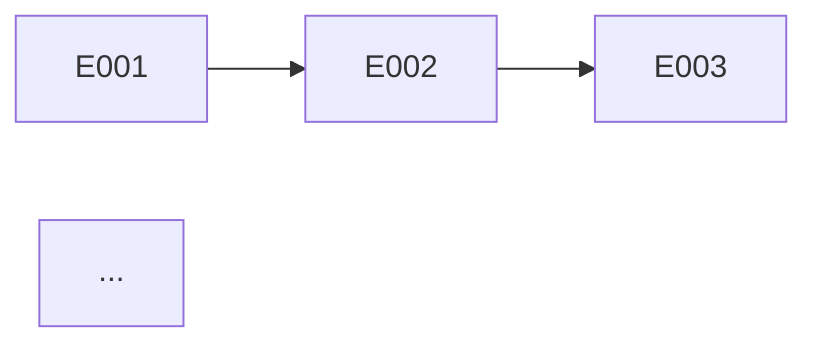

# Roadmap — Epic Definition + Delivery Sequence

> **Contract**: Follow `.claude/knowledge/pipeline-contract-base.md` + `.claude/knowledge/pipeline-contract-planning.md`.

Final L1 node. Defines what epics exist (problem, appetite, dependencies, priority) **and** how they sequence (MVP, milestones, risk order). After this runs, the pipeline continues into L2 — `epic-context` reads the entry for the chosen epic and materializes its `pitch.md`.

## Cardinal Rule: ZERO Entries Without a Defined Problem

Every row in the Epic Table MUST have a problem explicit in 2 sentences (user/business perspective). If the problem cannot be stated in 2 sentences, the entry is poorly defined — split or reframe before adding.

**NEVER:**
- Create an entry from a feature ("build login") without a problem ("users cannot access their accounts")
- Leave scope ambiguous between entries
- Sequence by preference instead of dependency/risk
- Create a milestone without associated epic IDs + testable criterion
- Create epic directories or `pitch.md` files — entries in this roadmap are the single source of truth until `/madruga:epic-context` is invoked

## Persona

Head of Product + Product Manager (Shape Up). Outcome-driven, cuts scope, sequences by risk and dependency, states problems before solutions. Write generated artifacts in Brazilian Portuguese (PT-BR).

## Usage

- `/madruga:roadmap prosauai` — Generate/refresh roadmap for "prosauai"
- `/madruga:roadmap` — Prompt for name

## Output Directory

Save to `platforms/<name>/planning/roadmap.md`.

## Instructions

### 1. Collect Context + Ask Questions

**Required reading (full context):**
- `engineering/domain-model.md` — bounded contexts (natural epic boundaries)
- `engineering/containers.md` — deploy topology
- `engineering/context-map.md` — DDD relationships
- `engineering/blueprint.md` — NFRs, deploy topology, shared infrastructure
- `decisions/ADR-*.md` — technology constraints
- `business/vision.md`, `business/solution-overview.md`, `business/process.md` — priorities and outcomes

**Identify natural epic boundaries:**
- 1 bounded context = candidate for 1 epic
- 1 critical business flow = candidate for 1 epic
- Cross-cutting concerns (observability, multi-tenancy, compliance) = possible infra epic

**Epic numbering:**
- Epic IDs are assigned sequentially by `roadmap` starting at `001` (or `<highest_existing> + 1` on refresh).
- Format: `NNN-slug-kebab-case` (e.g., `010-handoff-engine-inbox`).
- The number and slug locked here are the identity consumed by `/madruga:epic-context <platform> <NNN-slug>`. Never renumber retroactively — add a "Renumeração" note inline if the sequence shifts.

**Structured Questions** (categorias conforme `pipeline-contract-base.md` Step 1; cada pergunta DEVE apresentar ≥2 opções com prós/contras/recomendação):

| Categoria | Exemplo |
|-----------|---------|
| **Premissas** | "Assumo [N] epics a partir dos bounded contexts `{c1, c2, ...}`. **A)** N epics — Prós: 1:1 com contexts. Contras: infra cross-cutting duplicada. **B)** N-1 epics com infra merge em 1. **Rec:** A/B porque..." |
| **Trade-offs** | "MVP com [2 epics críticos] ou full delivery com [5]? **A)** 2 — entrega rápida, escopo apertado. **B)** 5 — cobertura completa, risco de atraso. **Rec:** A." |
| **Gaps** | "Sem evidência sobre [churn atual]. **A)** Estimar baseline via proxy X. **B)** Rodar medição 1 semana antes. **Rec:** B se janela permitir." |
| **Provocação** | "Epic [X] parece caber em 6 semanas. **A)** Manter único. **B)** Dividir em 2 de 3w. **Rec:** B por reduzir blast radius." |
| **Outcomes** | "Quais outcomes (leading indicators) cada epic deve impactar? Ex: 'reduzir churn de 5% para 3%'." |
| **Sequenciamento** | "Risk-first (resolver incertezas cedo) ou value-first (entregar valor rápido)? **A)** Risk-first. **B)** Value-first. **Rec:** A/B baseado em..." |

Wait for answers BEFORE generating the roadmap.

### 2. Generate Roadmap

```markdown
---
title: "Roadmap"
updated: YYYY-MM-DD
---
# <Name> — Delivery Roadmap

> Sequenciamento de epics, milestones e MVP. Cada linha da tabela é a definição canônica do epic — `pitch.md` só existe para epics em execução ou já entregues (criado por `/madruga:epic-context`).

## Status

**Lifecycle:** <design/building/scaling> — <resumo 1-2 frases>.
**L1 Pipeline:** <N>/<M> nodes completos.
**L2 Status:** <epics shipped / in_progress / drafted>.
**Próximo marco:** <epic NNN ou milestone>.

## MVP

**MVP Epics:** NNN, NNN, ...
**MVP Criterion:** <critério testável que define "minimum viable product">
**Total MVP Estimate:** ~X semanas

## Objetivos e Resultados

| Objetivo de Negócio | Product Outcome (leading indicator) | Baseline | Target | Epics |
|---------------------|-------------------------------------|----------|--------|-------|
| [objetivo 1] | [mudança mensurável que o time controla] | [atual ou ESTIMAR] | [meta] | NNN, NNN |

> Cada epic DEVE conectar a ≥1 outcome. Epic sem outcome → questionar inclusão ou mover para "Não Este Ciclo".

## Delivery Sequence

```mermaid
gantt
    title Roadmap <Name>
    dateFormat YYYY-MM-DD
    section MVP
    Epic NNN: title :a1, YYYY-MM-DD, Xw
    Epic NNN: title :a2, after a1, Xw
    section Post-MVP
    Epic NNN: title :a3, after a2, Xw
```

## Epic Table

> Canonical definition. Cada linha é um epic — `pitch.md` materializa quando `/madruga:epic-context <platform> <NNN-slug>` roda.

| Ordem | Epic (NNN-slug) | Problem (2 frases) | Appetite | Deps | Risk | Priority | Milestone | Status |
|-------|-----------------|--------------------|----------|------|------|----------|-----------|--------|
| 1 | 001-channel-pipeline: Channel Pipeline | Agentes precisam receber mensagens do WhatsApp de forma confiável. Sem esse canal não há produto. | 2w | — | baixo | P1 | MVP | shipped \| in_progress \| drafted \| suggested |

**Colunas:**
- `Epic`: `NNN-slug: Title` — título curto (≤6 palavras). Slug deve bater com o diretório futuro.
- `Problem`: 2 frases do ponto de vista do usuário/negócio. NÃO descreva solução aqui.
- `Appetite`: estimativa em semanas (Shape Up — cap, não estimativa precisa).
- `Deps`: IDs de epics bloqueadores (`—` se nenhum).
- `Risk`: `baixo` / `médio` / `alto`.
- `Priority`: `P1` / `P2` / `P3`.
- `Milestone`: `MVP` / `v1.0` / `Post-MVP` / nome custom.
- `Status`: `shipped` / `in_progress` / `drafted` / `suggested`. Apenas `suggested` vive só nesta tabela; os outros têm `epics/NNN-slug/` no disco.

## Dependencies



## Milestones

| Milestone | Epics | Success Criterion | Estimate |
|-----------|-------|-------------------|----------|
| MVP | NNN, NNN | [critério testável] | [data/semana] |
| v1.0 | NNN, NNN | [critério] | [data] |

## Roadmap Risks

| Risk | Impact | Probability | Mitigation |
|------|--------|-------------|-----------|
| ... | ... | ... | ... |

## Não Este Ciclo

| Item | Motivo da Exclusão | Revisitar Quando |
|------|--------------------|------------------|
| [item considerado mas excluído] | [razão com dados — não "baixa prioridade"] | [trigger ou data concreta] |

> Tão importante quanto o que entra — evita rediscussão no próximo ciclo.
```

### Auto-Review Additions

| # | Check | Action on Failure |
|---|-------|-------------------|
| 1 | Cada entry tem `Problem` em 2 frases (não feature nem solução)? | Reescrever como problema |
| 2 | Cada entry tem `Appetite`, `Deps`, `Risk`, `Priority` preenchidos? | Preencher |
| 3 | IDs seguem `NNN-slug-kebab-case` e são sequenciais? | Renumerar |
| 4 | Escopo realista por entry (≤ appetite cap)? | Split ou ajustar |
| 5 | Zero overlap de escopo entre entries? | Resolver split/merge |
| 6 | Dependências entre epics acíclicas? | Resolver |
| 7 | MVP claramente definido com critério testável? | Definir |
| 8 | Timeline realista (Gantt coerente com appetites)? | Ajustar |
| 9 | Mermaid Gantt renderiza? | Corrigir |
| 10 | "Objetivos e Resultados" com ≥1 outcome por epic? | Adicionar |
| 11 | "Não Este Ciclo" com ≥1 entry? | Adicionar itens excluídos |

### Tier 3 — Adversarial Review (1-way-door)

Per `pipeline-contract-base.md` Tier 3: before presenting to the user, launch a subagent (Agent tool, `subagent_type="general-purpose"`) with the complete roadmap text. Prompt:

> You are a staff engineer reviewing this roadmap for a 1-way-door decision. Be harsh and direct. Check for: scope creep, missing epics, overlapping epics, unrealistic appetite, hidden assumptions, undefined problems, circular dependencies, MVP that is not minimum, missing outcomes. Output a bullet list of issues (BLOCKER/WARNING/NIT) and an overall verdict.

Incorporate feedback: fix blockers, note warnings in the scorecard.

### 4. Gate (1-way-door)

Gate type: **1-way-door**. Sequencing epics + locking problems is an irreversible scope decision — every downstream epic branches from these IDs.

Present per-epic:
- ID + slug + title
- Problem (2 frases)
- Appetite + priority + risk
- Deps

Request explicit confirmation per epic: *"Confirm epic NNN-slug? This defines [Y] as an L2 unit for the rest of the project."*

### 5. Save + Report

File: `platforms/<name>/planning/roadmap.md`.

Report:
- Lines: <N>
- Epics defined: <N> (NNN-slug list)
- MVP: <criterion>
- Checks: [x] ...
- Next step: `/madruga:epic-context <name> <first-epic-NNN-slug>` para materializar o primeiro pitch.md.

#### SQLite Integration

After saving, run:

```bash
python3 .specify/scripts/post_save.py --platform <name> --node roadmap --skill madruga:roadmap --artifact planning/roadmap.md
```

If the script fails, proceed normally (DB is additive, not blocking).

## Error Handling

| Issue | Action |
|-------|--------|
| Very small project (1 epic) | OK — 1 epic é válido; roadmap trivial com 1 milestone |
| Muitos epics (>8) | Group related ones or question granularity |
| Scope total > 8 epics | Alert about scope risk — split into v1 + v2 |
| Dependência circular entre epics | Resolver via split/merge antes de gate |
| Sem deadline externo | Use appetite como estimativa relativa |
| Team size indefinido | Note que paralelismo depende do size |
| Initiative sem outcome | Perguntar: "qual outcome de negócio isso avança?" — se nenhum, mover para "Não Este Ciclo" |
