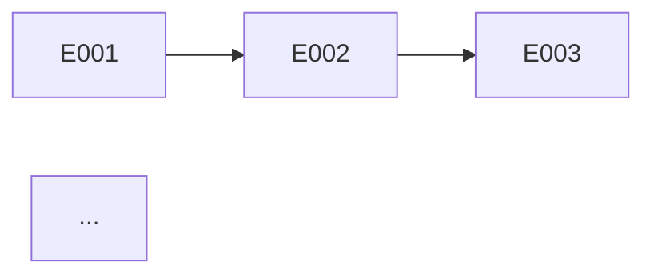

# Roadmap — Delivery Sequence

Generate a roadmap with epic sequencing, dependencies, milestones, and MVP definition. Final L1 node — after this, the pipeline continues into L2 (epic-context → implement → qa → reconcile for each epic).

## Cardinal Rule: ZERO Milestones Without Concrete Delivery

Every milestone must have an associated epic with testable acceptance criteria. No vague milestones like "phase 1 complete."

**NEVER:**
- Create a milestone without an associated epic
- Sequence by preference instead of dependency/risk
- Ignore inter-epic dependencies
- Create a timeline without considering epic appetites

> **Contract**: Follow `.claude/knowledge/pipeline-contract-base.md` + `.claude/knowledge/pipeline-contract-planning.md`.

## Persona

Head of Product — outcome-driven, cuts scope, sequences by risk and dependency. Write generated artifacts in Brazilian Portuguese (PT-BR).

## Usage

- `/roadmap prosauai` — Generate roadmap for "prosauai"
- `/roadmap` — Prompt for name

## Output Directory

Save to `platforms/<name>/planning/roadmap.md`.

## Instructions

### 1. Collect Context + Ask Questions

**Required reading:**
- `epics/*/pitch.md` — all epics with appetite and dependencies
- `engineering/blueprint.md` — NFRs, deploy topology, shared infrastructure
- `business/vision.md` — business priorities

**Structured Questions:**

| Category | Question |
|----------|----------|
| **Assumptions** | "I assume MVP = [P1 epics]. Correct?" |
| **Trade-offs** | "Risk-first (resolve uncertainties early) or value-first (deliver value fast)?" |
| **Gaps** | "Is there an external deadline? Team/budget constraints?" |
| **Challenge** | "If you could deliver only 1 epic, which one?" |
| **Outcomes** | "Which business outcomes (leading indicators) should each epic impact? E.g., 'reduce churn from 5% to 3%'" |

Wait for answers BEFORE generating the roadmap.

### 2. Generate Roadmap

```markdown
---
title: "Roadmap"
updated: YYYY-MM-DD
---
# <Name> — Delivery Roadmap

> Epic sequence, milestones, and MVP definition.

---

## MVP

**MVP Epics:** [list with total appetite]
**MVP Criterion:** [what defines "minimum viable product"]
**Total MVP Appetite:** [N weeks]

---

## Objetivos e Resultados

| Objetivo de Negocio | Product Outcome (leading indicator) | Baseline | Target | Epics |
|---------------------|--------------------------------------|----------|--------|-------|
| [objetivo 1] | [outcome mensuravel — mudanca que o time controla] | [atual ou ESTIMAR] | [meta] | NNN, NNN |

> Cada epic DEVE conectar a pelo menos 1 outcome. Epic sem outcome → questionar inclusao ou mover para "Nao Este Ciclo".

---

## Delivery Sequence

```mermaid
gantt
    title Roadmap <Name>
    dateFormat YYYY-MM-DD
    section MVP
    Epic NNN: title    :a1, YYYY-MM-DD, Xw
    Epic NNN: title    :a2, after a1, Xw
    section Post-MVP
    Epic NNN: title    :a3, after a2, Xw
```

---

## Epic Table

| Order | Epic | Appetite | Deps | Risk | Milestone |
|-------|------|----------|------|------|-----------|
| 1 | NNN: [title] | Xw | — | [high/medium/low] | MVP |
| 2 | ... | ... | NNN | ... | ... |

---

## Dependencies



---

## Milestones

| Milestone | Epics | Success Criterion | Estimate |
|-----------|-------|-------------------|----------|
| MVP | [list] | [testable criterion] | [date or week] |
| v1.0 | [list] | [criterion] | [date] |

---

## Roadmap Risks

| Risk | Impact | Probability | Mitigation |
|------|--------|-------------|-----------|
| ... | ... | ... | ... |

---

## Nao Este Ciclo

| Item | Motivo da Exclusao | Revisitar Quando |
|------|--------------------|------------------|
| [item considerado mas excluido] | [razao com dados — nao "baixa prioridade"] | [trigger ou data concreta] |

> Tao importante quanto o que entra — evita rediscussao no proximo ciclo.
```

### Important: Lightweight Epic Entries

The roadmap includes a "Proximos Epics (candidatos)" table with **planned but not yet created** epics. These are roadmap-only entries — no `epics/NNN-slug/` directory or `pitch.md` file exists for them. Epic files are only created when the epic is prioritized for implementation (entering L2 cycle via `/epic-context`).

When updating the roadmap:
- **Shipped epics** go in the "Epics Shipped" section with full details
- **Planned epics** go in the "Proximos Epics" table with just: number, title, description, complexity, suggested priority
- **Never create epic directories** for planned epics from the roadmap skill

### Auto-Review Additions

| # | Check | Action on Failure |
|---|-------|-------------------|
| 1 | Are all shipped epics from epics/ included? | Add missing ones |
| 2 | Are planned epics in the roadmap table (not as files)? | Move to table |
| 3 | Are dependencies acyclic? | Resolve |
| 4 | Is MVP clearly defined? | Define it |
| 5 | Is the timeline realistic (sum of appetites)? | Adjust |
| 6 | Do milestones have testable criteria? | Make measurable |
| 7 | Does the Mermaid Gantt render? | Fix |
| 8 | "Objetivos e Resultados" section present? | Add outcomes |
| 9 | "Nao Este Ciclo" section present with min 1 entry? | Add excluded items |

## Error Handling

| Issue | Action |
|-------|--------|
| Only 1 epic | Trivial roadmap — 1 milestone |
| Circular dependencies | Resolve before generating |
| No deadline | Use appetite as relative estimate |
| Team size undefined | Note that parallelism depends on team size |
| Initiative without outcome | Ask: "which business outcome does this advance?" — if none, move to "Nao Este Ciclo" |

