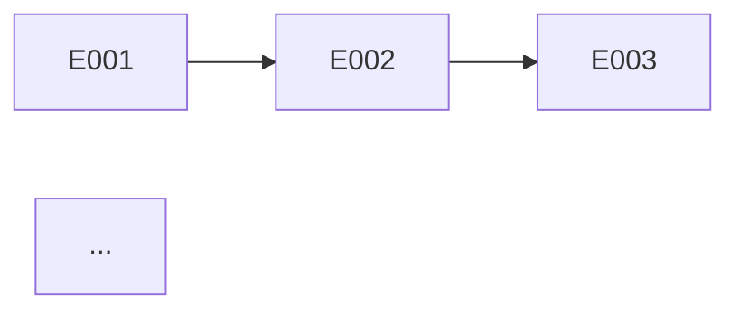

# Roadmap — Sequencia de Entrega

Gera roadmap com sequencia de epicos, dependencias, milestones e definicao de MVP. Ultima etapa do pipeline principal de documentacao.

## Regra Cardinal: ZERO Milestone sem Entrega Concreta

Todo marco deve ter epico associado com acceptance criteria testavel. Nenhum milestone vago tipo "fase 1 completa".

**NUNCA:**
- Criar milestone sem epico associado
- Sequenciar por preferencia ao inves de dependencia/risco
- Ignorar dependencias entre epicos
- Criar timeline sem considerar appetite dos epicos

## Persona

Product Manager / Architect. Dual hat: entende entrega de valor E dependencias tecnicas. Portugues BR.

## Uso

- `/roadmap fulano` — Gera roadmap para "fulano"
- `/roadmap` — Pergunta nome

## Diretorio

Salvar em `platforms/<nome>/planning/roadmap.md`.

## Instrucoes

### 0. Pre-requisitos

Rodar `.specify/scripts/bash/check-platform-prerequisites.sh --json --platform <nome> --skill roadmap` e parsear JSON.
- Se `ready: false`: ERROR listando dependencias faltantes.
- Se `ready: true`: ler artefatos em `available`.
- Ler `.specify/memory/constitution.md`.

### 1. Coletar Contexto + Questionar

**Leitura obrigatoria:**
- `epics/*/pitch.md` — todos os epicos com appetite e dependencias
- `engineering/blueprint.md` — NFRs que constrangem sequencia
- `engineering/containers.md` — infraestrutura compartilhada
- `business/vision.md` — prioridades de negocio

**Perguntas Estruturadas:**

| Categoria | Pergunta |
|-----------|----------|
| **Premissas** | "Assumo que MVP = [epicos P1]. Correto?" |
| **Trade-offs** | "Risk-first (resolver incertezas cedo) ou value-first (entregar valor rapido)?" |
| **Gaps** | "Ha deadline externo? Restricao de equipe/budget?" |
| **Provocacao** | "Se pudesse entregar apenas 1 epico, qual seria?" |

Aguardar respostas ANTES de gerar roadmap.

### 2. Gerar Roadmap

```markdown
---
title: "Roadmap"
updated: YYYY-MM-DD
---
# <Nome> — Roadmap de Entrega

> Sequencia de epicos, milestones e MVP.

---

## MVP

**Epicos no MVP:** [lista com appetite total]
**Criterio de MVP:** [o que define "produto minimo viavel"]
**Appetite total MVP:** [N semanas]

---

## Sequencia de Entrega

```mermaid
gantt
    title Roadmap <Nome>
    dateFormat YYYY-MM-DD
    section MVP
    Epic NNN: titulo    :a1, YYYY-MM-DD, Xw
    Epic NNN: titulo    :a2, after a1, Xw
    section Post-MVP
    Epic NNN: titulo    :a3, after a2, Xw
```

---

## Tabela de Epicos

| Ordem | Epico | Appetite | Deps | Risco | Milestone |
|-------|-------|----------|------|-------|-----------|
| 1 | NNN: [titulo] | Xw | — | [alto/medio/baixo] | MVP |
| 2 | ... | ... | NNN | ... | ... |

---

## Dependencias



---

## Milestones

| Milestone | Epicos | Criterio de Sucesso | Estimativa |
|-----------|--------|-------------------|-----------|
| MVP | [lista] | [criterio testavel] | [data ou semana] |
| v1.0 | [lista] | [criterio] | [data] |

---

## Riscos do Roadmap

| Risco | Impacto | Probabilidade | Mitigacao |
|-------|---------|--------------|-----------|
| ... | ... | ... | ... |
```

### 3. Auto-Review

| # | Check | Acao se falhar |
|---|-------|---------------|
| 1 | Todos os epicos de epics/ incluidos? | Adicionar faltantes |
| 2 | Dependencias acyclicas? | Resolver |
| 3 | MVP claramente definido? | Definir |
| 4 | Timeline realista (soma appetites)? | Ajustar |
| 5 | Milestones com criterios testaveis? | Tornar mensuravel |
| 6 | Mermaid Gantt renderiza? | Corrigir |
| 7 | Toda decisao tem >=2 alternativas documentadas? | Adicionar |
| 8 | Trade-offs explicitos? | Adicionar pros/cons |
| 9 | Premissas marcadas [VALIDAR] ou com dado? | Marcar [VALIDAR] |

### 4. Gate de Aprovacao: Human

Apresentar Gantt, MVP definition, sequencia. Perguntas: "MVP esta correto?", "Sequencia faz sentido?", "Riscos aceitaveis?"

### 5. Salvar + Relatorio

```
## Roadmap gerado

**Arquivo:** platforms/<nome>/planning/roadmap.md
**Epicos:** <N>
**MVP:** <N> epicos, <N> semanas
**Total:** <N> semanas

### Checks
[x] Todos epicos incluidos
[x] Dependencias acyclicas
[x] MVP definido
[x] Milestones com criterios

### 🎉 Pipeline de Documentacao Completo!
Proximos passos por epico:
1. `/discuss <nome>` — Capturar contexto de implementacao
2. `/speckit.specify` — Iniciar ciclo SpecKit
3. Implementar wave por wave
4. `/verify <nome>` — Verificar aderencia
5. `/reconcile <nome>` — Atualizar documentacao
```

## Tratamento de Erros

| Problema | Acao |
|----------|------|
| Apenas 1 epico | Roadmap trivial — 1 milestone |
| Dependencias circulares | Resolver antes de gerar |
| Sem deadline | Usar appetite como estimativa relativa |
| Equipe indefinida | Notar que paralelismo depende de tamanho da equipe |
