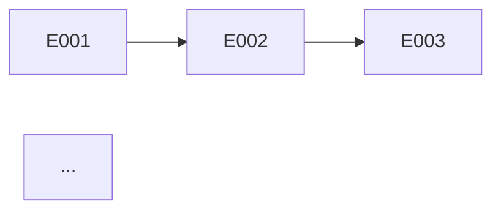

# Roadmap — Delivery Sequence

Generate a roadmap with epic sequencing, dependencies, milestones, and MVP definition. Final stage of the main documentation pipeline.

## Cardinal Rule: ZERO Milestones Without Concrete Delivery

Every milestone must have an associated epic with testable acceptance criteria. No vague milestones like "phase 1 complete."

**NEVER:**
- Create a milestone without an associated epic
- Sequence by preference instead of dependency/risk
- Ignore inter-epic dependencies
- Create a timeline without considering epic appetites

## Persona

Product Manager / Architect. Dual hat: understands value delivery AND technical dependencies. Write all generated artifact content in Brazilian Portuguese (PT-BR).

## Usage

- `/roadmap fulano` — Generate roadmap for "fulano"
- `/roadmap` — Prompt for name

## Output Directory

Save to `platforms/<name>/planning/roadmap.md`.

## Instructions

### 0. Prerequisites

Run `.specify/scripts/bash/check-platform-prerequisites.sh --json --platform <name> --skill roadmap` and parse the JSON output.
- If `ready: false`: ERROR listing missing dependencies.
- If `ready: true`: read artifacts listed in `available`.
- Read `.specify/memory/constitution.md`.

### 1. Collect Context + Ask Questions

**Required reading:**
- `epics/*/pitch.md` — all epics with appetite and dependencies
- `engineering/blueprint.md` — NFRs that constrain sequencing
- `engineering/containers.md` — shared infrastructure
- `business/vision.md` — business priorities

**Structured Questions:**

| Category | Question |
|----------|----------|
| **Assumptions** | "I assume MVP = [P1 epics]. Correct?" |
| **Trade-offs** | "Risk-first (resolve uncertainties early) or value-first (deliver value fast)?" |
| **Gaps** | "Is there an external deadline? Team/budget constraints?" |
| **Challenge** | "If you could deliver only 1 epic, which one?" |

Wait for answers BEFORE generating the roadmap.

### 2. Generate Roadmap

```markdown
---
title: "Roadmap"
updated: YYYY-MM-DD
---
# <Name> — Delivery Roadmap

> Epic sequence, milestones, and MVP definition.

---

## MVP

**MVP Epics:** [list with total appetite]
**MVP Criterion:** [what defines "minimum viable product"]
**Total MVP Appetite:** [N weeks]

---

## Delivery Sequence

```mermaid
gantt
    title Roadmap <Name>
    dateFormat YYYY-MM-DD
    section MVP
    Epic NNN: title    :a1, YYYY-MM-DD, Xw
    Epic NNN: title    :a2, after a1, Xw
    section Post-MVP
    Epic NNN: title    :a3, after a2, Xw
```

---

## Epic Table

| Order | Epic | Appetite | Deps | Risk | Milestone |
|-------|------|----------|------|------|-----------|
| 1 | NNN: [title] | Xw | — | [high/medium/low] | MVP |
| 2 | ... | ... | NNN | ... | ... |

---

## Dependencies



---

## Milestones

| Milestone | Epics | Success Criterion | Estimate |
|-----------|-------|-------------------|----------|
| MVP | [list] | [testable criterion] | [date or week] |
| v1.0 | [list] | [criterion] | [date] |

---

## Roadmap Risks

| Risk | Impact | Probability | Mitigation |
|------|--------|-------------|-----------|
| ... | ... | ... | ... |
```

### 3. Auto-Review

| # | Check | Action on Failure |
|---|-------|-------------------|
| 1 | Are all epics from epics/ included? | Add missing ones |
| 2 | Are dependencies acyclic? | Resolve |
| 3 | Is MVP clearly defined? | Define it |
| 4 | Is the timeline realistic (sum of appetites)? | Adjust |
| 5 | Do milestones have testable criteria? | Make measurable |
| 6 | Does the Mermaid Gantt render? | Fix |
| 7 | Does every decision have >=2 documented alternatives? | Add |
| 8 | Are trade-offs explicit? | Add pros/cons |
| 9 | Are assumptions marked [VALIDATE] or backed by data? | Mark [VALIDATE] |

### 4. Approval Gate: Human

Present Gantt, MVP definition, sequence. Questions: "Is the MVP correct?", "Does the sequence make sense?", "Are risks acceptable?"

### 5. Save + Report

```
## Roadmap generated

**File:** platforms/<name>/planning/roadmap.md
**Epics:** <N>
**MVP:** <N> epics, <N> weeks
**Total:** <N> weeks

### Checks
[x] All epics included
[x] Dependencies acyclic
[x] MVP defined
[x] Milestones with criteria

### Documentation Pipeline Complete!
Next steps per epic:
1. `/discuss <name>` — Capture implementation context
2. `/speckit.specify` — Start SpecKit cycle
3. Implement wave by wave
4. `/verify <name>` — Verify adherence
5. `/test-ai` — (opcional) QA test if app is running
6. `/reconcile <name>` — Update documentation
```

## Error Handling

| Issue | Action |
|-------|--------|
| Only 1 epic | Trivial roadmap — 1 milestone |
| Circular dependencies | Resolve before generating |
| No deadline | Use appetite as relative estimate |
| Team size undefined | Note that parallelism depends on team size |
