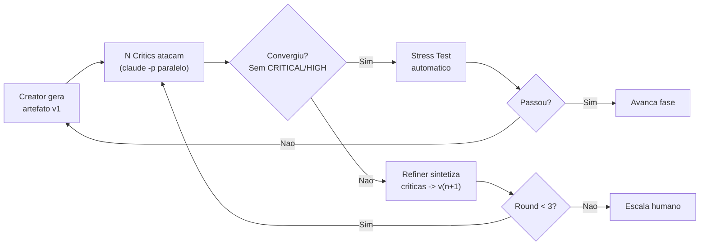
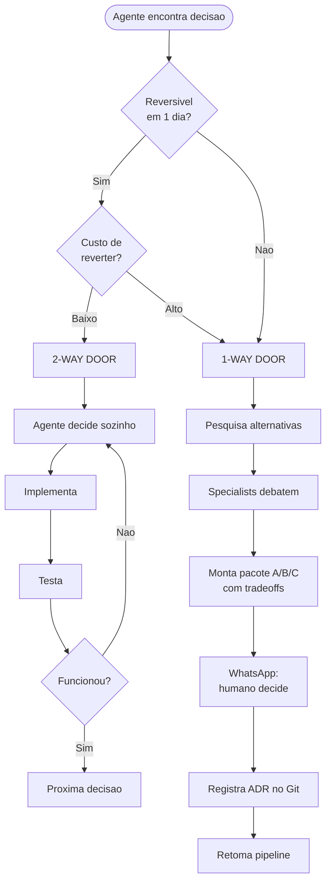

# Madruga — Orquestrador Autonomo 24/7

> `git blame: madruga, 04:32am`

> **Versao**: 1.0.0 | **Data**: 2026-03-01 | **Status**: RFC (Request for Comments)

**Ships code while you sleep.** | **Madruga pra voce nao precisar.**

Agente autonomo que evolui produto de software 24/7 usando Spec-Driven Development, debate loops adversariais, stress testing progressivo e framework de decisao 1-Way/2-Way Door.


---

## 0. Decisao Arquitetural: 100% Claude Code Max

**Tudo roda no Claude Code Max plan — custo adicional de API = R$0.**

O orquestrador usa **Claude Code headless** (`claude -p`) e **Claude Agent SDK** (`query()`) para todas as chamadas LLM. Ambos rodam sob o plano Max ja contratado.

| Componente | Como roda | Billing |
|-----------|-----------|---------|
| **Builder (escreve codigo)** | Agent SDK `query()` | Max plan |
| **Debate loops (critics)** | `claude -p` headless | Max plan |
| **Orchestrator/Phases** | `claude -p` headless | Max plan |
| **Integrations** | Python direto (httpx) — sem LLM | $0 |

### Por que Claude Code headless?

`claude -p` e o modo programatico do Claude Code. Aceita prompt via stdin/flag, retorna resposta, e roda sob a mesma assinatura Max. Nao precisa de API key separada.

```bash
# Exemplo: critic de spec rodando headless (Opus — tarefa estrategica)
claude -p "Analise esta spec como QA senior. Liste issues CRITICAL/HIGH/MEDIUM..." \
  --model opus --output-format json
```

### Trade-offs vs API direta

| Aspecto | Claude Code Max (escolhido) | API direta (descartado) |
|---------|---------------------------|------------------------|
| **Custo mensal** | R$0 extra (ja pago) | ~R$2.400/mes |
| **Batch API 50% off** | Nao disponivel | Disponivel |
| **Model routing** | `--model` flag por call | Total |
| **Prompt caching** | Automatico pelo CLI | Manual `cache_control` |
| **Rate limit** | Pode throttle em uso pesado | Rate limits da API (altos) |
| **Paralelismo** | Multiplos processos `claude -p` | `asyncio.gather` sem cap |

**Trade-off aceito:** Perde Batch API (50% off em critics) e model routing granular. Mas esses savings so importam quando se paga por token — com Max, o custo e fixo. Se throttle virar problema, daemon para e espera (sem fallback pra API).

---

## 1. Principios

1. **Spec e o contrato.** Codigo e a expressao dela.
2. **Humano define O QUE.** Agente resolve O COMO.
3. **Cada fase tem debate adversarial** antes de avancar.
4. **1-Way Doors sao do humano.** 2-Way Doors o agente resolve sozinho.
5. **Humano sempre aprova merge** para producao.
6. **Claude Code Max** — tudo via `claude -p` e Agent SDK. Custo extra = R$0.
7. **O agente nunca para** — se espera decisao humana, continua no que nao depende dela.
8. **Constitution.md e lei** — pre-decide 1-way doors, agente respeita sem perguntar.

---

## 2. Fluxo Completo

```mermaid
flowchart TD
    %% ============================================================
    %% MADRUGA — FLUXO COMPLETO (Processo + Tecnico)
    %% Cada no mostra: Agente/Acao + arquivo(s) + modelo LLM
    %% ============================================================

    START(["Humano envia objetivo\n(WhatsApp / Obsidian)"])

    %% -- FASE 0: OBJETIVO -> SPEC CARD
    START --> VA

    subgraph FASE0["FASE 0 — OBJETIVO -> SPEC CARD"]
        direction TB
        VA["<b>Vision Agent</b> expande objetivo\n<i>phases/vision.py</i> . Opus"]
        VA --> MATCH["<b>Smart Match</b> resolve target_repo\nkeywords/domains do config.yaml\n<i>integrations/repos.py</i>"]
        MATCH --> AMB{Ambiguo?}
        AMB -->|Sim| WPP_Q["WhatsApp: pergunta repo/escopo\n<i>integrations/whatsapp.py</i>"]
        WPP_Q --> VA
        AMB -->|Nao| CARD["Cria card INBOX no Kanban\ncom spec + criterios + repo\n<i>integrations/obsidian.py</i>\n<i>Agent24-7/_Madruga_Board.md</i>"]
    end

    %% -- HUMANO REVISA
    CARD --> WAIT_APPROVE

    subgraph APPROVE["HUMANO REVISA (Obsidian)"]
        direction TB
        WAIT_APPROVE["Card em INBOX\naguarda humano"]
        WAIT_APPROVE --> HREV{Humano revisa}
        HREV -->|Ajusta| WAIT_APPROVE
        HREV -->|Aprova| APPROVED["Move para APPROVED"]
    end

    %% -- DAEMON 24/7
    APPROVED --> DL

    subgraph DAEMON["DAEMON 24/7"]
        direction TB
        DL["Poll Kanban 30s\n<i>daemon.py</i> . asyncio loop"]
        DL --> CHK{APPROVED + deps ok\n+ cap ok + slots ok?}
        CHK -->|Nao| DL
        CHK -->|Sim| REPO["<b>RepoManager</b>\nclone/fetch + worktree\n<i>integrations/repos.py</i>\n<i>integrations/git.py</i>"]
        REPO --> PERS{Personas existem?\n<i>.madruga/personas/</i>}
        PERS -->|Sim| GO["Move card para DOING\n<i>orchestrator.py</i>"]
        PERS -->|Nao| PGEN["<b>Persona Generator</b>\nanalisa repo + cria personas\n<i>phases/personas.py</i> . Opus"]
        PGEN --> GO
    end

    %% -- FASE 1: SPECIFY
    GO --> PMG

    subgraph SPECIFY["FASE 1 — SPECIFY"]
        direction TB
        PMG["<b>PM Agent</b> gera spec.md\n<i>phases/specify.py</i> . Opus\ntemplate: .specify/templates/"]
        PMG --> SD["<b>Personas do repo</b> debatem\n<i>debate/runner.py</i> . Opus paralelo\n<i>target_repo/.madruga/personas/*.md</i>"]
        SD --> SREF["Refiner sintetiza v2"]
        SREF --> S1W{1-WAY?\n<i>decisions/classifier.py</i>}
        S1W -->|Sim| SH["WhatsApp: humano decide\n<i>integrations/whatsapp.py</i>"]
        SH --> SST
        S1W -->|Nao| SST["<b>Stress Test</b>\n<i>stress/spec_test.py</i>"]
        SST --> SOK{Passou?}
        SOK -->|round < 3| PMG
        SOK -->|round = 3| SESC["Escala humano"]
        SOK -->|Sim| SDONE["SPEC READY"]
    end

    %% -- FASE 2: PLAN
    SDONE --> AG

    subgraph PLAN["FASE 2 — PLAN"]
        direction TB
        AG["<b>Architect</b> gera plan.md\n<i>phases/plan.py</i> . Opus\nextended thinking"]
        AG --> PD["<b>5 Specialists</b> debatem\n<i>debate/runner.py</i> . Opus paralelo\n<i>prompts/specialists/*.md</i>"]
        PD --> PREF["Refiner sintetiza + ADRs"]
        PREF --> P1W{1-WAY? DB/Auth/Infra\n<i>decisions/classifier.py</i>}
        P1W -->|Sim| PH["WhatsApp: opcoes A/B/C\n<i>integrations/whatsapp.py</i>"]
        PH --> PST
        P1W -->|Nao| PST["<b>Arch Fitness Test</b>\n<i>stress/arch_fitness.py</i>"]
        PST --> POK{Passou?}
        POK -->|round < 3| AG
        POK -->|round = 3| PESC["Escala humano"]
        POK -->|Sim| PDONE["PLAN READY"]
    end

    %% -- FASE 3: TASKS
    PDONE --> TG

    subgraph TASKS["FASE 3 — TASKS"]
        direction TB
        TG["<b>Task Agent</b> gera tasks.md\n<i>phases/tasks.py</i> . Sonnet\nRegra: max ~200 LOC/task"]
        TG --> TM["<b>Coverage Matrix</b>\nspec criteria para tasks\n+ size check (>200 LOC = decompor)\n<i>stress/coverage_matrix.py</i>"]
        TM --> TOK{100% coverage?}
        TOK -->|Nao| TG
        TOK -->|Sim| TDONE["TASKS READY"]
    end

    %% -- FASE 4: IMPLEMENT
    TDONE --> PICK

    subgraph IMPL["FASE 4 — IMPLEMENT"]
        direction TB
        PICK["Proxima task\n<i>orchestrator.py</i>\n<i>memory/db.py task_progress</i>"]
        PICK --> TC{1-WAY?\n<i>decisions/classifier.py</i>}
        TC -->|Nao| CODE["<b>Builder</b>: TDD no worktree\n<i>phases/implement.py</i>\nAgent SDK . Sonnet\ncwd = target repo worktree"]
        TC -->|Sim| IH["WhatsApp: humano aprova"]
        IH --> CODE
        CODE --> CRIT["<b>4 Code Critics</b>\n<i>debate/runner.py</i> . Sonnet paralelo\n<i>prompts/code_critics/*.md</i>"]
        CRIT --> CFIX{Issues criticas?}
        CFIX -->|Sim| CODE
        CFIX -->|Nao| UTEST["Unit + lint\n<i>stress/test_runner.py</i>"]
        UTEST --> MORE{Mais tasks?}
        MORE -->|Sim| PICK
        MORE -->|Todas| FULL["FULL SUITE\nE2E + Security + Load\n<i>stress/test_runner.py</i>"]
    end

    %% -- FULL SUITE CHECK
    FULL --> FOK{Passou?}
    FOK -->|Retry ate 3| CODE
    FOK -->|Falhou 3x| ESC["Escala humano\nvia WhatsApp"]

    %% -- FASE 5: REVIEW
    FOK -->|Sim| RVW

    subgraph REVIEW["FASE 5 — REVIEW"]
        direction TB
        RVW["<b>3 Reviewers</b>\nIntegration . Regression . UX\n<i>phases/review.py</i> . Opus\n<i>prompts/reviewers/*.md</i>"]
        RVW --> RFIX{Issues criticas?}
        RFIX -->|Sim| BFIX["Builder corrige"]
        BFIX --> RVW
        RFIX -->|Nao| PRCR["<b>PR criado</b> no target repo\ngh pr create --repo org/repo\n<i>integrations/github.py</i>\nMove card para REVIEW"]
    end

    %% -- MERGE (1-WAY)
    PRCR --> MG

    subgraph MERGESUB["1-WAY: MERGE"]
        direction TB
        MG["WhatsApp: PR pronto\n<i>integrations/whatsapp.py</i>"]
        MG --> HM{Humano revisa GitHub}
        HM -->|Feedback| MG
        HM -->|Aprova| MERGED["Merged\nMove card para DONE"]
    end

    %% -- FASE 6: RETRO
    MERGED --> RT

    subgraph RETRO["FASE 6 — RETROSPECTIVA"]
        direction TB
        RT["<b>Retro Agent</b>\nmetricas + patterns\n<i>memory/learning.py</i> . Opus"]
        RT --> UP["Atualiza SQLite patterns\n<i>memory/db.py</i>\n<i>memory/patterns.py</i>"]
        UP --> CLEAN["Cleanup worktree\n<i>integrations/repos.py</i>\n<i>integrations/git.py</i>"]
    end

    CLEAN --> DL

    %% -- INFRA TRANSVERSAL (legenda)
    subgraph INFRA["INFRA TRANSVERSAL"]
        direction TB
        SDK["<b>api/client.py</b>\nclaude -p headless wrapper\nrouting + throttle"]
        THRT["<b>api/throttle.py</b>\nmax 3 paralelos + backoff"]
        DB["<b>memory/db.py</b>\nSQLite: epics . debates\ndecisions . task_progress\n<b>epics/</b> artefatos .md"]
        CFG["<b>config.py</b> + <b>config.yaml</b>\nrepo registry . models\nthrottle . always_2way"]
        HEALTH["<b>health.py</b> :8040\n<b>cli.py</b> start/stop/status"]
    end

    %% -- STYLES
    style FASE0 fill:#1a1a2e,stroke:#e94560,color:#eee
    style APPROVE fill:#0d1b2a,stroke:#778da9,color:#eee
    style DAEMON fill:#0f3460,stroke:#16213e,color:#eee
    style SPECIFY fill:#1a1a2e,stroke:#0f3460,color:#eee
    style PLAN fill:#1a1a2e,stroke:#0f3460,color:#eee
    style TASKS fill:#1a1a2e,stroke:#0f3460,color:#eee
    style IMPL fill:#1a1a2e,stroke:#e94560,color:#eee
    style REVIEW fill:#1a1a2e,stroke:#0f3460,color:#eee
    style MERGESUB fill:#533483,stroke:#e94560,color:#eee
    style RETRO fill:#1a1a2e,stroke:#0f3460,color:#eee
    style INFRA fill:#0d1b2a,stroke:#415a77,color:#eee,stroke-dasharray: 5 5
```



### Como ler o diagrama

Cada no mostra 3 camadas de informacao:
- **Negrito** = agente/acao (o QUE)
- *Italico* = arquivo(s) Python (o ONDE no codigo)
- Texto normal = modelo LLM ou detalhe tecnico (o COMO)

O bloco **INFRA TRANSVERSAL** lista os modulos que sao usados por todas as fases (claude -p wrapper, throttle, SQLite, config).

### Resumo do fluxo

| Fase | O que acontece | Quem age | Arquivos chave |
|------|---------------|----------|----------------|
| **0 — Spec Card** | Objetivo vira card com spec no Kanban INBOX | Agent cria, humano aprova | `vision.py`, `repos.py`, `obsidian.py` |
| **Daemon** | Poll Kanban, clone repo, cria worktree, gera personas se necessario | Agent | `daemon.py`, `orchestrator.py`, `repos.py`, `git.py`, `personas.py` |
| **1 — Specify** | Spec.md com debate adversarial (personas do repo) | Agent + humano (1-way) | `specify.py`, `runner.py`, `target_repo/.madruga/personas/*.md` |
| **2 — Plan** | Plan.md com Opus + debate (5 specialists) | Agent + humano (1-way) | `plan.py`, `runner.py`, `specialists/*.md` |
| **3 — Tasks** | Tasks.md com coverage matrix + size check (~200 LOC max/task) | Agent | `tasks.py`, `coverage_matrix.py` |
| **4 — Implement** | TDD no worktree do target repo + 4 critics | Agent + humano (1-way) | `implement.py`, `runner.py`, `code_critics/*.md` |
| **5 — Review** | 3 reviewers + PR no target repo | Agent cria PR, humano merge | `review.py`, `github.py`, `reviewers/*.md` |
| **6 — Retro** | Patterns no SQLite + cleanup worktree | Agent | `learning.py`, `patterns.py`, `repos.py` |

---

## 3. Debate Loop Engine

Toda fase tem o mesmo ciclo interno — o debate runner e reutilizado:



**Convergencia:** Quando nenhum critic encontra issue CRITICAL/HIGH, ou apos 3 rounds (escala para humano).

**Paralelismo:** Critics rodam como processos `claude -p` paralelos (ou Agent SDK subagents). Sem Batch API, mas sem custo por token — Max plan absorve tudo.

---

## 4. Mapa de Agentes e Models

### Routing Strategy

Todos rodam via Claude Code Max (`claude -p --model X` ou Agent SDK). Apenas **Opus** e **Sonnet**.

**Regra de routing:** Opus quando precisa pensar bem (scopo, planejamento, critica estrategica, visao do todo). Sonnet para execucao operacional. Se esgotar creditos Max, o daemon **para e espera** — sem fallback pra API.

| Funcao | Model | Via | Justificativa |
|--------|-------|----|---------------|
| **Vision Agent** | **Opus** | `claude -p` | Define escopo e target_repo — decisao estrategica |
| **PM Agent (Specify)** | **Opus** | `claude -p` | Spec precisa de visao holistica do produto |
| **Architect (Plan)** | **Opus** | `claude -p` | Design complexo, trade-offs arquiteturais |
| **Critics (Specify)** | **Opus** | `claude -p` paralelo | Criticar spec requer olhar pro todo |
| **Critics (Plan)** | **Opus** | `claude -p` paralelo | Criticar arquitetura requer reasoning profundo |
| **Code Reviewer final** | **Opus** | `claude -p` | Analise profunda de integration + regression |
| **Retro Agent** | **Opus** | `claude -p` | Extrair patterns requer visao estrategica |
| **Persona Generator** | **Opus** | `claude -p` | Criar personas requer entender produto, users e contexto |
| **Task Agent** | Sonnet | `claude -p` | Decomposicao operacional de tasks |
| **Builder** | Sonnet | Agent SDK `query()` | Execucao: TDD, implementar, refatorar |
| **Code Critics (Implement)** | Sonnet | `claude -p` paralelo | Review operacional: naming, SRP, security |
| **Orchestrator** | Sonnet | `claude -p` | Coordenacao operacional do pipeline |

### Mapa Completo por Fase

| Fase | Creator | Critics | Stress Test |
|------|---------|---------|-------------|
| **Vision** | Vision (**Opus**) | — | — |
| **Specify** | PM Agent (**Opus**) | Personas do repo (**Opus**, paralelo) | Spec Consistency |
| **Plan** | Architect (**Opus**) | 5 specialists (**Opus**, paralelo) | Arch Fitness |
| **Tasks** | Task Agent (Sonnet) | 3 analyzers (Sonnet) | Coverage Matrix + Size Check |
| **Implement** | Builder (Sonnet, Agent SDK) | 4 critics/task (Sonnet, paralelo) | Unit/Integ/E2E |
| **Review** | — | 3 reviewers (**Opus**) | Full suite |
| **Retro** | Retro Agent (**Opus**) | — | — |

**Regra de tamanho do Task Agent:** Cada task deve ser implementavel em ~200 linhas de codigo ou menos. Se uma task requer mais, o Task Agent decompoe em sub-tasks.

### Personas para Specify — por repo

Cada repo define suas proprias personas em `.madruga/personas/*.md`. Se o repo ainda nao tem personas, o **Persona Generator** (Opus) cria automaticamente antes do primeiro debate.

### Specialists para Plan (5)

| Specialist | Foco |
|-----------|------|
| DDD Specialist | Bounded contexts, aggregates, ubiquitous language |
| Performance Engineer | Query plans, indices, cache, paginacao |
| Security Architect | RLS, input validation, OWASP Top 10 |
| DevOps Critic | Health checks, logging, deploy strategy |
| Cost Analyst | Over-engineering, custo infra, alternativas baratas |

### Code Critics para Implement (4)

| Critic | Foco |
|--------|------|
| Code Reviewer | Naming, SRP, DRY, complexidade |
| Security Scanner | SQL param, XSS, tenant isolation |
| Perf Profiler | N+1 queries, missing indexes |
| Spec Compliance | Criteria implementada? Edge cases? |

---

## 5. Framework 1-Way / 2-Way Door

Baseado no framework Bezos (Amazon, 2016). O agente classifica TODA decisao antes de agir.



### Classificacao por Fase

| Fase | 2-WAY (agente resolve) | 1-WAY (humano decide) |
|------|------------------------|----------------------|
| **Specify** | Texto stories, priorizacao, criteria, formato | Scope MVP, monetizacao, publico-alvo |
| **Plan** | Pastas, naming, libs utilitarias, cache, logs | Domain model, schema DB, auth, APIs externas |
| **Implement** | Funcoes, refactoring, CSS, testes, feature flags | Migrations destrutivas, contratos externos |
| **Review** | Ajustes codigo, bugs, perf, refactor | Merge para main, trade-off seguranca |

### Regras de Ouro

1. Na duvida, trata como 1-way. Melhor pausar do que criar divida irreversivel.
2. O agente tenta **transformar 1-way em 2-way** (ex: interface abstrata + adapter em vez de lock no banco).
3. Constitution.md **pre-decide** 1-way doors. Se diz "banco = PostgreSQL", agente nao pergunta.
4. ~70% das decisoes sao 2-way. Agente roda rapido nelas.
5. Humano pode promover 2-way para 1-way via config.
6. **Allowlist hardcoded** de patterns 2-way em `config.yaml` (`always_2way`).

---

## 6. Interfaces: WhatsApp + Obsidian + GitHub

### Visao Geral

| Acao | Canal | Direcao |
|------|-------|---------|
| Criar epico rapido | WhatsApp texto | Human -> Agent |
| Criar epico estruturado | Card no Kanban com `#madruga` | Human -> Agent |
| Ver fila e prioridade | Kanban (visual, arrasta) | Human <- Agent |
| Decisoes 1-way | WhatsApp — responde A/B/C | Agent <-> Human |
| Status rapido | WhatsApp: `/status` | Human <-> Agent |
| Ver detalhes e logs | Obsidian `vault/agent/` | Human <- Agent |
| Aprovar PR | GitHub review | Human -> Agent |
| Notificacoes | WhatsApp (push) | Agent -> Human |

---

## 7. Custo e Rate Limits

### Custo: R$0 extra

Tudo roda no **Claude Code Max plan** ja contratado.

### Throttle Caps

```yaml
throttle:
  max_parallel_claude_p: 3
  max_parallel_epics: 2
  delay_between_critics_ms: 500
  backoff_on_throttle_s: 30
```

---

## 8. State Management & Crash Recovery

### SQLite como Single Source of Truth

```sql
CREATE TABLE epics (
    id TEXT PRIMARY KEY,
    title TEXT NOT NULL,
    priority TEXT DEFAULT 'P2',
    target_repo TEXT DEFAULT 'general',
    phase TEXT DEFAULT 'inbox',
    status TEXT DEFAULT 'pending',
    spec_path TEXT,
    plan_path TEXT,
    tasks_path TEXT,
    pr_number INTEGER,
    created_at TIMESTAMP DEFAULT CURRENT_TIMESTAMP,
    updated_at TIMESTAMP DEFAULT CURRENT_TIMESTAMP
);

CREATE TABLE debates (
    id INTEGER PRIMARY KEY AUTOINCREMENT,
    epic_id TEXT REFERENCES epics(id),
    phase TEXT NOT NULL,
    round INTEGER NOT NULL,
    critic TEXT NOT NULL,
    severity TEXT NOT NULL,
    finding TEXT NOT NULL,
    resolved BOOLEAN DEFAULT FALSE,
    created_at TIMESTAMP DEFAULT CURRENT_TIMESTAMP
);

CREATE TABLE decisions (
    id INTEGER PRIMARY KEY AUTOINCREMENT,
    epic_id TEXT REFERENCES epics(id),
    phase TEXT NOT NULL,
    door_type TEXT NOT NULL,
    description TEXT NOT NULL,
    options TEXT,
    chosen TEXT,
    rationale TEXT,
    decided_by TEXT DEFAULT 'agent',
    adr_path TEXT,
    created_at TIMESTAMP DEFAULT CURRENT_TIMESTAMP
);

CREATE TABLE patterns (
    id INTEGER PRIMARY KEY AUTOINCREMENT,
    epic_type TEXT,
    phase TEXT,
    pattern TEXT NOT NULL,
    outcome TEXT,
    score REAL DEFAULT 0.5,
    times_used INTEGER DEFAULT 0,
    created_at TIMESTAMP DEFAULT CURRENT_TIMESTAMP,
    updated_at TIMESTAMP DEFAULT CURRENT_TIMESTAMP
);

CREATE TABLE usage_log (
    id INTEGER PRIMARY KEY AUTOINCREMENT,
    epic_id TEXT REFERENCES epics(id),
    phase TEXT,
    model TEXT NOT NULL,
    call_type TEXT NOT NULL,
    duration_ms INTEGER,
    throttled BOOLEAN DEFAULT FALSE,
    created_at TIMESTAMP DEFAULT CURRENT_TIMESTAMP
);

CREATE TABLE task_progress (
    id INTEGER PRIMARY KEY AUTOINCREMENT,
    epic_id TEXT REFERENCES epics(id),
    task_index INTEGER NOT NULL,
    task_title TEXT NOT NULL,
    status TEXT DEFAULT 'pending',
    worktree_path TEXT,
    started_at TIMESTAMP,
    completed_at TIMESTAMP
);
```

### Crash Recovery

Cada mudanca de fase atualiza o SQLite ANTES de iniciar a proxima. Se o daemon crashar, ele retoma da ultima fase completa.

---

## 9. Arquitetura do Codigo

```
madruga.ai/
├── src/
│   └── madruga/
│       ├── __init__.py
│       ├── daemon.py                    # Loop 24/7 (asyncio)
│       ├── orchestrator.py              # Maquina de estados dos epicos
│       ├── config.py                    # pydantic-settings (config.yaml + .env)
│       ├── cli.py                       # start, stop, status, logs
│       ├── health.py                    # Health check HTTP (:8040)
│       │
│       ├── api/
│       │   ├── client.py                # Wrapper claude -p headless
│       │   └── throttle.py              # Rate limit: semaforo, backoff, delay
│       │
│       ├── phases/
│       │   ├── vision.py                # Fase 0: objetivo -> spec card
│       │   ├── personas.py              # Auto-gera personas por repo
│       │   ├── specify.py               # Fase 1: spec.md
│       │   ├── plan.py                  # Fase 2: plan.md
│       │   ├── tasks.py                 # Fase 3: tasks.md
│       │   ├── implement.py             # Fase 4: TDD + build
│       │   └── review.py               # Fase 5: review + PR
│       │
│       ├── debate/
│       │   └── runner.py                # Core: Creator -> Critics -> Refiner
│       │
│       ├── stress/
│       │   ├── spec_test.py
│       │   ├── arch_fitness.py
│       │   ├── coverage_matrix.py
│       │   └── test_runner.py
│       │
│       ├── decisions/
│       │   └── classifier.py            # 1-way / 2-way door
│       │
│       ├── memory/
│       │   ├── db.py                    # SQLite
│       │   ├── learning.py              # Retro patterns
│       │   └── patterns.py
│       │
│       └── integrations/
│           ├── obsidian.py              # Kanban board
│           ├── whatsapp.py              # Escalation humano
│           ├── github.py                # PRs, repos
│           ├── git.py                   # Clone, worktree
│           └── repos.py                 # Repo registry + smart match
│
├── prompts/
│   ├── constitution.md
│   ├── specialists/                     # 5 specialists para Plan
│   ├── code_critics/                    # 4 critics para Implement
│   └── reviewers/                       # 3 reviewers para Review
│
├── epics/                               # Artefatos permanentes por epico
├── tests/
├── config.yaml
├── pyproject.toml
└── README.md
```

---

## 10. Multi-Repo Strategy

### Repo Registry (`config.yaml`)

```yaml
repos:
  general:
    github: paceautomations/general
    path: ~/repos/paceautomations/general
    description: "Automacoes pessoais, scripts, skills Claude Code"
    domains: [automacao, scripts, skills, infra]
    keywords: [booking, tennis, pdf, document, metrics, github, dora, agent]
    personas_dir: .madruga/personas/
    setup: pip install -r requirements.txt
    test: pytest

  resenhai-expo:
    github: paceautomations/resenhai-expo
    path: ~/repos/paceautomations/resenhai-expo
    description: "App mobile React Native/Expo"
    domains: [mobile, app, frontend, area-logada, usuario]
    keywords: [login, signup, perfil, resenha, feed, chat, notificacao, expo, react-native, tela]
    personas_dir: .madruga/personas/
    setup: npm install
    test: npm test
```

---

## 11. Self-Learning

```
1. REGISTRA apos cada fase — o que foi decidido, se funcionou
2. CONSULTA antes de cada fase — busca patterns similares, injeta no system prompt
3. EVOLUI — score > 0.8 vira sugestao forte, score < 0.3 e depreciado
```

Match por `epic_type` + `phase` + tags com scoring. Sem ML, sem embeddings.
