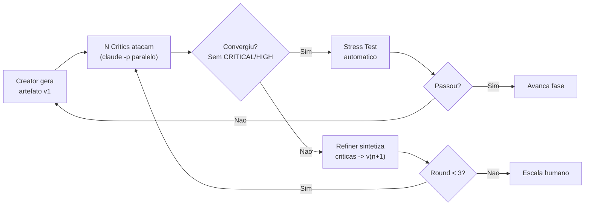
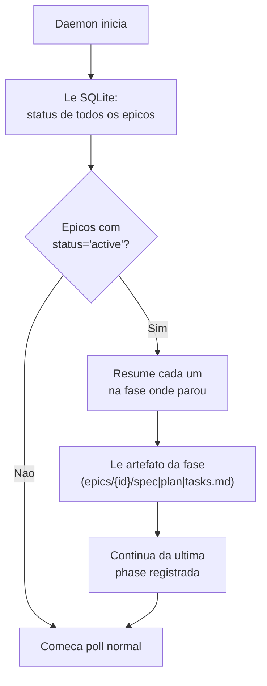
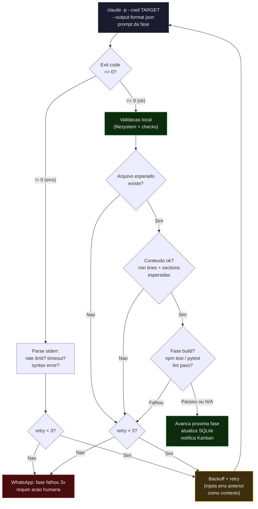

# Madruga — Orquestrador Autonomo 24/7

> `git blame: madruga, 04:32am`

> **Versao**: 1.0.0 | **Data**: 2026-03-01 | **Status**: RFC (Request for Comments)

**Ships code while you sleep.** | **Madruga pra voce nao precisar.**

Agente autonomo que evolui produto de software 24/7 usando Spec-Driven Development, debate loops adversariais, stress testing progressivo e framework de decisao 1-Way/2-Way Door.

---

## 0. Decisao Arquitetural: 100% Claude Code Max

**Tudo roda no Claude Code Max plan — custo adicional de API = R$0.**

O orquestrador usa **Claude Code headless** (`claude -p`) e **Claude Agent SDK** (`query()`) para todas as chamadas LLM. Ambos rodam sob o plano Max ja contratado.

| Componente | Como roda | Billing |
|-----------|-----------|---------|
| **Builder (escreve codigo)** | Agent SDK `query()` | Max plan |
| **Debate loops (critics)** | `claude -p` headless | Max plan |
| **Orchestrator/Phases** | `claude -p` headless | Max plan |
| **Integrations** | Python direto (httpx) — sem LLM | $0 |

### Por que Claude Code headless?

`claude -p` e o modo programatico do Claude Code. Aceita prompt via stdin/flag, retorna resposta, e roda sob a mesma assinatura Max. Nao precisa de API key separada.

```bash
# Exemplo: critic de spec rodando headless (Opus — tarefa estrategica)
claude -p "Analise esta spec como QA senior. Liste issues CRITICAL/HIGH/MEDIUM..." \
  --model opus --output-format json
```

### Trade-offs vs API direta

| Aspecto | Claude Code Max (escolhido) | API direta (descartado) |
|---------|---------------------------|------------------------|
| **Custo mensal** | R$0 extra (ja pago) | ~R$2.400/mes |
| **Batch API 50% off** | Nao disponivel | Disponivel |
| **Model routing** | `--model` flag por call | Total |
| **Prompt caching** | Automatico pelo CLI | Manual `cache_control` |
| **Rate limit** | Pode throttle em uso pesado | Rate limits da API (altos) |
| **Paralelismo** | Multiplos processos `claude -p` | `asyncio.gather` sem cap |

**Trade-off aceito:** Perde Batch API (50% off em critics) e model routing granular. Mas esses savings so importam quando se paga por token — com Max, o custo e fixo. Se throttle virar problema, daemon para e espera (sem fallback pra API).

---

## 1. Principios

1. **Spec e o contrato.** Codigo e a expressao dela.
2. **Humano define O QUE.** Agente resolve O COMO.
3. **Cada fase tem debate adversarial** antes de avancar.
4. **1-Way Doors sao do humano.** 2-Way Doors o agente resolve sozinho.
5. **Humano sempre aprova merge** para producao.
6. **Claude Code Max** — tudo via `claude -p` e Agent SDK. Custo extra = R$0.
7. **O agente nunca para** — se espera decisao humana, continua no que nao depende dela.
8. **Constitution.md e lei** — pre-decide 1-way doors, agente respeita sem perguntar.

---

## 2. Fluxo Completo

```mermaid
flowchart TD
    %% ============================================================
    %% MADRUGA — FLUXO COMPLETO (Processo + Tecnico)
    %% Cada no mostra: Agente/Acao + arquivo(s) + modelo LLM
    %% ============================================================

    START(["Humano envia objetivo\n(WhatsApp / Obsidian)"])

    %% -- FASE 0: OBJETIVO -> SPEC CARD
    START --> VA

    subgraph FASE0["FASE 0 — OBJETIVO -> SPEC CARD"]
        direction TB
        VA["<b>Vision Agent</b> expande objetivo\n<i>phases/vision.py</i> . Opus"]
        VA --> MATCH["<b>Smart Match</b> resolve target_repo\nkeywords/domains do config.yaml\n<i>integrations/repos.py</i>"]
        MATCH --> AMB{Ambiguo?}
        AMB -->|Sim| WPP_Q["WhatsApp: pergunta repo/escopo\n<i>integrations/whatsapp.py</i>"]
        WPP_Q --> VA
        AMB -->|Nao| CARD["Cria card INBOX no Kanban\ncom spec + criterios + repo\n<i>integrations/obsidian.py</i>\n<i>Agent24-7/_Madruga_Board.md</i>"]
    end

    %% -- HUMANO REVISA
    CARD --> WAIT_APPROVE

    subgraph APPROVE["HUMANO REVISA (Obsidian)"]
        direction TB
        WAIT_APPROVE["Card em INBOX\naguarda humano"]
        WAIT_APPROVE --> HREV{Humano revisa}
        HREV -->|Ajusta| WAIT_APPROVE
        HREV -->|Aprova| APPROVED["Move para APPROVED"]
    end

    %% -- DAEMON 24/7
    APPROVED --> DL

    subgraph DAEMON["DAEMON 24/7"]
        direction TB
        DL["Poll Kanban 30s\n<i>daemon.py</i> . asyncio loop"]
        DL --> CHK{APPROVED + deps ok\n+ cap ok + slots ok?}
        CHK -->|Nao| DL
        CHK -->|Sim| REPO["<b>RepoManager</b>\nclone/fetch + worktree\n<i>integrations/repos.py</i>\n<i>integrations/git.py</i>"]
        REPO --> PERS{Personas existem?\n<i>.madruga/personas/</i>}
        PERS -->|Sim| GO["Move card para DOING\n<i>orchestrator.py</i>"]
        PERS -->|Nao| PGEN["<b>Persona Generator</b>\nanalisa repo + cria personas\n<i>phases/personas.py</i> . Opus"]
        PGEN --> GO
    end

    %% -- FASE 1: SPECIFY
    GO --> PMG

    subgraph SPECIFY["FASE 1 — SPECIFY"]
        direction TB
        PMG["<b>PM Agent</b> gera spec.md\n<i>phases/specify.py</i> . Opus\ntemplate: .specify/templates/"]
        PMG --> SD["<b>Personas do repo</b> debatem\n<i>debate/runner.py</i> . Opus paralelo\n<i>target_repo/.madruga/personas/*.md</i>"]
        SD --> SREF["Refiner sintetiza v2"]
        SREF --> S1W{1-WAY?\n<i>decisions/classifier.py</i>}
        S1W -->|Sim| SH["WhatsApp: humano decide\n<i>integrations/whatsapp.py</i>"]
        SH --> SST
        S1W -->|Nao| SST["<b>Stress Test</b>\n<i>stress/spec_test.py</i>"]
        SST --> SOK{Passou?}
        SOK -->|round < 3| PMG
        SOK -->|round = 3| SESC["Escala humano"]
        SOK -->|Sim| SDONE["SPEC READY"]
    end

    %% -- FASE 2: PLAN
    SDONE --> AG

    subgraph PLAN["FASE 2 — PLAN"]
        direction TB
        AG["<b>Architect</b> gera plan.md\n<i>phases/plan.py</i> . Opus\nextended thinking"]
        AG --> PD["<b>5 Specialists</b> debatem\n<i>debate/runner.py</i> . Opus paralelo\n<i>prompts/specialists/*.md</i>"]
        PD --> PREF["Refiner sintetiza + ADRs"]
        PREF --> P1W{1-WAY? DB/Auth/Infra\n<i>decisions/classifier.py</i>}
        P1W -->|Sim| PH["WhatsApp: opcoes A/B/C\n<i>integrations/whatsapp.py</i>"]
        PH --> PST
        P1W -->|Nao| PST["<b>Arch Fitness Test</b>\n<i>stress/arch_fitness.py</i>"]
        PST --> POK{Passou?}
        POK -->|round < 3| AG
        POK -->|round = 3| PESC["Escala humano"]
        POK -->|Sim| PDONE["PLAN READY"]
    end

    %% -- FASE 3: TASKS
    PDONE --> TG

    subgraph TASKS["FASE 3 — TASKS"]
        direction TB
        TG["<b>Task Agent</b> gera tasks.md\n<i>phases/tasks.py</i> . Sonnet\nRegra: max ~200 LOC/task"]
        TG --> TM["<b>Coverage Matrix</b>\nspec criteria para tasks\n+ size check (>200 LOC = decompor)\n<i>stress/coverage_matrix.py</i>"]
        TM --> TOK{100% coverage?}
        TOK -->|Nao| TG
        TOK -->|Sim| TDONE["TASKS READY"]
    end

    %% -- FASE 4: IMPLEMENT
    TDONE --> PICK

    subgraph IMPL["FASE 4 — IMPLEMENT"]
        direction TB
        PICK["Proxima task\n<i>orchestrator.py</i>\n<i>memory/db.py task_progress</i>"]
        PICK --> TC{1-WAY?\n<i>decisions/classifier.py</i>}
        TC -->|Nao| CODE["<b>Builder</b>: TDD no worktree\n<i>phases/implement.py</i>\nAgent SDK . Sonnet\ncwd = target repo worktree"]
        TC -->|Sim| IH["WhatsApp: humano aprova"]
        IH --> CODE
        CODE --> CRIT["<b>4 Code Critics</b>\n<i>debate/runner.py</i> . Sonnet paralelo\n<i>prompts/code_critics/*.md</i>\nmax_turns: 40"]
        CRIT --> CFIX{Issues criticas?}
        CFIX -->|Sim| CODE
        CFIX -->|Nao| UTEST["Unit + lint\n<i>stress/test_runner.py</i>"]
        UTEST --> MORE{Mais tasks?}
        MORE -->|Sim| PICK
        MORE -->|Todas| FULL["FULL SUITE\nE2E + Security + Load\n<i>stress/test_runner.py</i>"]
    end

    %% -- FULL SUITE CHECK
    FULL --> FOK{Passou?}
    FOK -->|Retry ate 3| CODE
    FOK -->|Falhou 3x| ESC["Escala humano\nvia WhatsApp"]

    %% -- FASE 4.5: PERSONA INTERVIEW
    FOK -->|Sim| PINTV

    subgraph PERSONA_INTERVIEW["FASE 4.5 — PERSONA INTERVIEW"]
        direction TB
        PINTV["<b>Persona Interviewer</b>\ncarrega personas do repo\n<i>phases/persona_interview.py</i> . Opus"]
        PINTV --> PGUIDE["Gera discussion guide\nbaseado no tipo de feature\n(new_screen/api/refactor/bugfix)"]
        PGUIDE --> PRUN["<b>Personas avaliam produto</b>\ndiff + spec + screenshots\n<i>claude -p paralelo</i> . Opus\npain_points[] + delights[] + score"]
        PRUN --> PFUP["<b>Follow-ups adaptativos</b>\npain point de 1 persona\nvira pergunta para as outras"]
        PFUP --> PSYNTH["<b>Synthesizer</b>\nagrupa temas + consensus\n<i>phases/persona_interview.py</i>"]
        PSYNTH --> PACT{Action items\ncriticos?}
        PACT -->|Sim| PFIX["Builder corrige\n(2-way door)"]
        PFIX --> PRUN
        PACT -->|Nao| PFEED["Gera persona_feedback.md\n<i>epics/{id}/persona_feedback.md</i>"]
    end

    %% -- FASE 5: REVIEW
    PFEED --> RVW

    subgraph REVIEW["FASE 5 — REVIEW"]
        direction TB
        RVW["<b>3 Reviewers</b>\nIntegration . Regression . UX\n<i>phases/review.py</i> . Opus\n<i>prompts/reviewers/*.md</i>"]
        RVW --> RFIX{Issues criticas?}
        RFIX -->|Sim| BFIX["Builder corrige"]
        BFIX --> RVW
        RFIX -->|Nao| PRCR["<b>PR criado</b> no target repo\ngh pr create --repo org/repo\n<i>integrations/github.py</i>\nMove card para REVIEW"]
    end

    %% -- MERGE (1-WAY)
    PRCR --> MG

    subgraph MERGESUB["1-WAY: MERGE"]
        direction TB
        MG["WhatsApp: PR pronto\n<i>integrations/whatsapp.py</i>"]
        MG --> HM{Humano revisa GitHub}
        HM -->|Feedback| MG
        HM -->|Aprova| MERGED["Merged\nMove card para DONE"]
    end

    %% -- FASE 6: RETRO
    MERGED --> RT

    subgraph RETRO["FASE 6 — RETROSPECTIVA"]
        direction TB
        RT["<b>Retro Agent</b>\nmetricas + patterns\n<i>memory/learning.py</i> . Opus"]
        RT --> PACC["<b>Persona Accuracy</b>\ncompara predictions vs feedback humano\n<i>memory/persona_accuracy.py</i>"]
        PACC --> UP["Atualiza SQLite patterns\n+ persona_accuracy\n<i>memory/db.py</i>\n<i>memory/patterns.py</i>"]
        UP --> CLEAN["Cleanup worktree\n<i>integrations/repos.py</i>\n<i>integrations/git.py</i>"]
    end

    CLEAN --> DL

    %% -- INFRA TRANSVERSAL (legenda)
    subgraph INFRA["INFRA TRANSVERSAL"]
        direction TB
        SDK["<b>api/client.py</b>\nclaude -p headless wrapper\nrouting + throttle"]
        THRT["<b>api/throttle.py</b>\nmax 3 paralelos + backoff"]
        DB["<b>memory/db.py</b>\nSQLite: epics . debates\ndecisions . task_progress\n<b>epics/</b> artefatos .md"]
        CFG["<b>config.py</b> + <b>config.yaml</b>\nrepo registry . models\nthrottle . always_2way"]
        HEALTH["<b>health.py</b> :8040\n<b>cli.py</b> start/stop/status"]
    end

    %% -- STYLES
    style FASE0 fill:#1a1a2e,stroke:#e94560,color:#eee
    style APPROVE fill:#0d1b2a,stroke:#778da9,color:#eee
    style DAEMON fill:#0f3460,stroke:#16213e,color:#eee
    style SPECIFY fill:#1a1a2e,stroke:#0f3460,color:#eee
    style PLAN fill:#1a1a2e,stroke:#0f3460,color:#eee
    style TASKS fill:#1a1a2e,stroke:#0f3460,color:#eee
    style IMPL fill:#1a1a2e,stroke:#e94560,color:#eee
    style PERSONA_INTERVIEW fill:#1a1a2e,stroke:#533483,color:#eee
    style REVIEW fill:#1a1a2e,stroke:#0f3460,color:#eee
    style MERGESUB fill:#533483,stroke:#e94560,color:#eee
    style RETRO fill:#1a1a2e,stroke:#0f3460,color:#eee
    style INFRA fill:#0d1b2a,stroke:#415a77,color:#eee,stroke-dasharray: 5 5
```



### Como ler o diagrama

Cada no mostra 3 camadas de informacao:
- **Negrito** = agente/acao (o QUE)
- *Italico* = arquivo(s) Python (o ONDE no codigo)
- Texto normal = modelo LLM ou detalhe tecnico (o COMO)

O bloco **INFRA TRANSVERSAL** lista os modulos que sao usados por todas as fases (claude -p wrapper, throttle, SQLite, config).

### Resumo do fluxo

| Fase | O que acontece | Quem age | Arquivos chave |
|------|---------------|----------|----------------|
| **0 — Spec Card** | Objetivo vira card com spec no Kanban INBOX | Agent cria, humano aprova | `vision.py`, `repos.py`, `obsidian.py` |
| **Daemon** | Poll Kanban, clone repo, cria worktree, gera personas se necessario | Agent | `daemon.py`, `orchestrator.py`, `repos.py`, `git.py`, `personas.py` |
| **1 — Specify** | Spec.md com debate adversarial (personas do repo) | Agent + humano (1-way) | `specify.py`, `runner.py`, `target_repo/.madruga/personas/*.md` |
| **2 — Plan** | Plan.md com Opus + debate (5 specialists) | Agent + humano (1-way) | `plan.py`, `runner.py`, `specialists/*.md` |
| **3 — Tasks** | Tasks.md com coverage matrix + size check (~200 LOC max/task) | Agent | `tasks.py`, `coverage_matrix.py` |
| **4 — Implement** | TDD no worktree do target repo + 4 critics | Agent + humano (1-way) | `implement.py`, `runner.py`, `code_critics/*.md` |
| **4.5 — Persona Interview** | Personas "usam" produto acabado, follow-ups adaptativos, synthesis | Agent (Builder corrige action items criticos) | `persona_interview.py`, `target_repo/.madruga/personas/*.md` |
| **5 — Review** | 3 reviewers + PR (com persona_feedback.md) | Agent cria PR, humano merge | `review.py`, `github.py`, `reviewers/*.md` |
| **6 — Retro** | Patterns + persona accuracy no SQLite + cleanup | Agent | `learning.py`, `persona_accuracy.py`, `patterns.py`, `repos.py` |

---

## 3. Debate Loop Engine

Toda fase tem o mesmo ciclo interno — o debate runner e reutilizado:



**Convergencia:** Quando nenhum critic encontra issue CRITICAL/HIGH, ou apos 3 rounds (escala para humano).

**Paralelismo:** Critics rodam como processos `claude -p` paralelos (ou Agent SDK subagents). Sem Batch API, mas sem custo por token — Max plan absorve tudo.

---

## 4. Mapa de Agentes e Models

### Routing Strategy

Todos rodam via Claude Code Max (`claude -p --model X` ou Agent SDK). Apenas **Opus** e **Sonnet**.

**Regra de routing:** Opus quando precisa pensar bem (scopo, planejamento, critica estrategica, visao do todo). Sonnet para execucao operacional. Se esgotar creditos Max, o daemon **para e espera** — sem fallback pra API.

| Funcao | Model | Via | Justificativa |
|--------|-------|----|---------------|
| **Vision Agent** | **Opus** | `claude -p` | Define escopo e target_repo — decisao estrategica |
| **PM Agent (Specify)** | **Opus** | `claude -p` | Spec precisa de visao holistica do produto |
| **Architect (Plan)** | **Opus** | `claude -p` | Design complexo, trade-offs arquiteturais |
| **Critics (Specify)** | **Opus** | `claude -p` paralelo | Criticar spec requer olhar pro todo |
| **Critics (Plan)** | **Opus** | `claude -p` paralelo | Criticar arquitetura requer reasoning profundo |
| **Code Reviewer final** | **Opus** | `claude -p` | Analise profunda de integration + regression |
| **Retro Agent** | **Opus** | `claude -p` | Extrair patterns requer visao estrategica |
| **Persona Generator** | **Opus** | `claude -p` | Criar personas requer entender produto, users e contexto |
| **Persona Interviewer** | **Opus** | `claude -p` paralelo | Simular uso real requer empatia + contexto profundo |
| **Persona Synthesizer** | **Opus** | `claude -p` | Agregar feedback cross-persona requer visao holistica |
| **Task Agent** | Sonnet | `claude -p` | Decomposicao operacional de tasks |
| **Builder** | Sonnet | Agent SDK `query()` | Execucao: TDD, implementar, refatorar. **max_turns: 40** |
| **Code Critics (Implement)** | Sonnet | `claude -p` paralelo | Review operacional: naming, SRP, security |
| **Orchestrator** | Sonnet | `claude -p` | Coordenacao operacional do pipeline |

### Mapa Completo por Fase

| Fase | Creator | Critics | Stress Test |
|------|---------|---------|-------------|
| **Vision** | Vision (**Opus**) | — | — |
| **Specify** | PM Agent (**Opus**) | Personas do repo (**Opus**, paralelo) | Spec Consistency |
| **Plan** | Architect (**Opus**) | 5 specialists (**Opus**, paralelo) | Arch Fitness |
| **Tasks** | Task Agent (Sonnet) | 3 analyzers (Sonnet) | Coverage Matrix + Size Check |
| **Implement** | Builder (Sonnet, Agent SDK) | 4 critics/task (Sonnet, paralelo) | Unit/Integ/E2E |
| **Persona Interview** | Persona Interviewer (**Opus**) | Personas do repo (**Opus**, paralelo) + follow-ups | Synthesizer: consensus + action items |
| **Review** | — | 3 reviewers (**Opus**) | Full suite |
| **Retro** | Retro Agent (**Opus**) | — | Persona Accuracy tracking |

**Regra de tamanho do Task Agent:** Cada task deve ser implementavel em ~200 linhas de codigo ou menos. Se uma task requer mais, o Task Agent decompoe em sub-tasks.

### Personas para Specify — por repo

Cada repo define suas proprias personas em `.madruga/personas/*.md`. Se o repo ainda nao tem personas, o **Persona Generator** (Opus) cria automaticamente antes do primeiro debate, baseado em:

1. `description` e `domains` do repo registry (`config.yaml`)
2. README.md e CLAUDE.md do repo target
3. Codigo existente (rotas, models, componentes) — scan rapido

**Estrutura do arquivo de persona:**

```markdown
# Maria — Dona de casa B2C
- **Idade:** 45, Android barato, internet lenta
- **Contexto:** Usa o app para pagar contas e agendar servicos
- **Ataca:** Jargao tecnico, fluxos com muitos passos, fontes pequenas
- **Frase tipica:** "Se eu nao entender em 3 segundos, fecho o app"
```

**Fluxo de auto-geracao:**

```
Orchestrator verifica: target_repo tem .madruga/personas/?
  -> Sim: carrega personas existentes
  -> Nao: Persona Generator (Opus) analisa repo -> gera 5 personas -> salva .madruga/personas/
           -> commit no worktree: "chore: add Madruga personas"
           -> Humano pode ajustar depois (personas sao versionadas com o repo)
```

**Regras:**
- Minimo 3, maximo 7 personas por repo
- Pelo menos 1 persona **end-user nao-tecnico** e 1 persona **tecnica/QA**
- Personas sao **versionadas no repo target** (nao no Madruga) — times podem customizar
- Persona Generator roda 1x por repo, depois so atualiza se humano pedir

### Specialists para Plan (5)

| Specialist | Foco |
|-----------|------|
| DDD Specialist | Bounded contexts, aggregates, ubiquitous language |
| Performance Engineer | Query plans, indices, cache, paginacao |
| Security Architect | RLS, input validation, OWASP Top 10 |
| DevOps Critic | Health checks, logging, deploy strategy |
| Cost Analyst | Over-engineering, custo infra, alternativas baratas |

### Code Critics para Implement (4)

| Critic | Foco |
|--------|------|
| Code Reviewer | Naming, SRP, DRY, complexidade |
| Security Scanner | SQL param, XSS, tenant isolation |
| Perf Profiler | N+1 queries, missing indexes |
| Spec Compliance | Criteria implementada? Edge cases? |

### Persona Interview — Fase 4.5 (inspirado em Reforge Prototype Testing)

Apos Full Suite passar e antes do Review, as mesmas personas que debateram a spec na Fase 1 "usam" o produto acabado. Inspirado no Reforge AI User Interviewer — entrevistas por IA que simulam uso real com follow-ups adaptativos.

**Por que existe:** Personas na Fase 1 atacam intencao (spec no papel). Na Fase 4.5 atacam resultado (codigo implementado). Sao complementares — concept testing vs prototype testing.

**Workflow:**

```
1. Gerar discussion guide baseado no tipo de feature
   - new_screen: primeira impressao, navegacao, CTAs, tempo para completar
   - api_endpoint: naming, error messages, docs, edge cases
   - refactor: algo quebrou? Performance perceptivel?
   - bugfix: bug original resolvido? Novos problemas?

2. Para cada persona do repo (paralelo, Opus):
   Input: persona profile + spec original + diff completo + screenshots (se frontend)
   Prompt: "Voce e [persona]. Analise como se estivesse usando. O que frustra? O que encanta?"
   Output: { pain_points[], delights[], questions[], score: 1-10 }

3. Follow-ups adaptativos (1 round):
   Se persona A levanta pain point -> pergunta para personas B, C sobre o mesmo ponto
   Ex: Ana diz "botao parece desabilitado" -> A11y Advocate avalia contraste

4. Synthesizer agrega:
   - Consensus: issues mencionados por 2+ personas
   - Pain points ranqueados por frequencia x severity
   - Action items: CRITICAL (Builder corrige agora) vs MEDIUM/LOW (registra no PR)

5. Se action items CRITICAL:
   - Builder corrige (2-way door, sem escalar humano)
   - Re-roda interview APENAS nas personas que apontaram o issue
   - Max 2 rounds de fix

6. Gera persona_feedback.md no epico (vai junto no PR)
```

**Output — persona_feedback.md:**

```markdown
## Persona Feedback — Epic #{id}

### Consensus (N/M personas concordam)
- [Issue que 2+ personas levantaram]

### Pain Points
| Persona | Issue | Severity | Status |
|---------|-------|----------|--------|
| Ana | Botao parece desabilitado | HIGH | Fixed |
| A11y | Contraste CTA < 4.5:1 | MEDIUM | Pendente |

### Delights
- Roberto: "Finalmente consigo ver o total antes de pagar"

### Score medio: X/10
### Action items: N total (K resolvidos, J pendentes)
```

**Custo:** 3-7 personas x 1 call Opus + 1 follow-up round + 1 synthesis = ~10-15 calls. Dentro do Max plan = R$0 extra. Adiciona ~2-5 min ao pipeline por epico.

**Persona Accuracy (Retro — Fase 6):**

Apos merge, o Retro Agent compara:
- Pain points preditos pelas personas vs feedback real do humano no PR review
- Persona acertou -> `score_delta +0.1`
- False positive (persona reclamou, humano discordou) -> `score_delta -0.05`
- Personas com accuracy alta ganham mais peso em debates futuros
- Personas com accuracy persistentemente baixa sao flaggadas para revisao humana

---

## 5. Framework 1-Way / 2-Way Door

Baseado no framework Bezos (Amazon, 2016). O agente classifica TODA decisao antes de agir.


### Classificacao por Fase

| Fase | 2-WAY (agente resolve) | 1-WAY (humano decide) |
|------|------------------------|----------------------|
| **Specify** | Texto stories, priorizacao, criteria, formato | Scope MVP, monetizacao, publico-alvo |
| **Plan** | Pastas, naming, libs utilitarias, cache, logs | Domain model, schema DB, auth, APIs externas |
| **Implement** | Funcoes, refactoring, CSS, testes, feature flags | Migrations destrutivas, contratos externos |
| **Review** | Ajustes codigo, bugs, perf, refactor | Merge para main, trade-off seguranca |

### Formato WhatsApp para 1-WAY

```
1-WAY DOOR — Epic #003 PLAN

Decisao: Gateway de pagamento

A) MercadoPago — custodia nativa, 4.99%
B) Stripe — API melhor, Pix beta, 3.99%
C) Iugu — mais barato, 2.51%

Recomendo: A (custodia e critical path)

Detalhes: vault/agent/decisions/003-payment.md

Responda A, B, C ou ?
```

### Regras de Ouro

1. Na duvida, trata como 1-way. Melhor pausar do que criar divida irreversivel.
2. O agente tenta **transformar 1-way em 2-way** (ex: interface abstrata + adapter em vez de lock no banco).
3. Constitution.md **pre-decide** 1-way doors. Se diz "banco = PostgreSQL", agente nao pergunta.
4. ~70% das decisoes sao 2-way. Agente roda rapido nelas.
5. Humano pode promover 2-way para 1-way via config.
6. **Allowlist hardcoded** de patterns 2-way em `config.yaml` (`always_2way`). Tudo fora da lista = 1-way por default. LLM classifier e sugestao, nao decisor final.

---

## 6. Interfaces: WhatsApp + Obsidian + GitHub

### Visao Geral

| Acao | Canal | Direcao |
|------|-------|---------|
| Criar epico rapido | WhatsApp texto (audio Fase 5) | Human -> Agent |
| Criar epico estruturado | Card no Kanban com `#madruga` | Human -> Agent |
| Criar varios de uma vez | Obsidian `inbox/` | Human -> Agent |
| Ver fila e prioridade | Kanban (visual, arrasta) | Human <- Agent |
| Decisoes 1-way | WhatsApp — responde A/B/C | Agent <-> Human |
| Status rapido | WhatsApp: `/status` | Human <-> Agent |
| Ver detalhes e logs | Obsidian `vault/agent/` | Human <- Agent |
| Aprovar PR | GitHub review | Human -> Agent |
| Notificacoes | WhatsApp (push) | Agent -> Human |

### 6.1 WhatsApp (via wpp-bridge)

**Ja temos o design completo em `integracaowpp.md`** — wpp-bridge FastAPI (:8030) + n8n + Evolution API com HMAC-SHA256.

**Comandos do agente:**

| Comando | O que faz |
|---------|----------|
| `/status` | O que esta rodando |
| `/status #003` | Detalhe do epico |
| `/pause` / `/resume` | Pausa/retoma daemon |
| `/cancel #003` | Cancela epico |
| `/cost` | Custo hoje/semana/mes |
| `/fila` | Mostra fila de epicos |
| `/ask <pergunta>` | Pergunta generica ao Claude |

**Audio** (Fase 5): Transcricao via Whisper planejada para polish. Inicialmente WhatsApp so texto.

**Alertas proativos (Agent -> Human):**

O daemon envia alertas push sem o humano pedir:

| Alerta | Trigger | Nivel |
|--------|---------|-------|
| `Throttle ativo — daemon pausado. Retoma automatico.` | `orchestrator.py` detecta rate limit persistente | warning |
| `Epic #{id} bloqueado em {fase}. Falhou 3x. Requer acao.` | `orchestrator.py` fase falha 3 rounds | critical |
| `PR pronto: {url}` | `phases/review.py` cria PR com sucesso | info |

Implementacao em `integrations/whatsapp.py`:

```python
async def alert(self, level: str, message: str):
    """Alerta proativo. Levels: info, warning, critical."""
    emoji = {"info": "i", "warning": "!", "critical": "X"}
    await self.send(f"[{emoji[level]}] Madruga: {message}")
```

### 6.2 Obsidian (Kanban Agent24-7 + Vault)

**Board separado do Kanban pessoal.** Pasta `obsidian-vault/Agent24-7/`, arquivo `_Madruga_Board.md`. **SQLite e source of truth** — Kanban e view-only (daemon escreve para display, humano interage movendo cards, daemon detecta mudanca e atualiza SQLite).

**5 colunas:**

| Coluna | Quem move | Significado |
|--------|-----------|-------------|
| **Inbox** | Agent cria | Card com spec gerada pelo agent. Aguarda humano revisar |
| **Approved** | Humano move | Humano revisou a spec e aprovou. Agent pode puxar quando tiver slot |
| **Doing** | Agent move | Agent esta implementando (tag `#phase-specify`, `#phase-plan`, `#phase-implement`) |
| **Review** | Agent move | PR criado, aguarda review humano no GitHub |
| **Done** | Humano move | Merged. Agent faz retro e arquiva |

```markdown
## Inbox
- [ ] Tela de login social (Google + Apple) #P1 #resenhai-expo #madruga

  **Objetivo**: Permitir login via Google e Apple ID no app
  **Repo**: resenhai-expo
  **Escopo**:
  - Botoes Google/Apple na tela de login
  - Integracao com expo-auth-session
  - Salvar token no SecureStore
  **Criterios de aceite**:
  - [ ] Login Google funcional (Android + iOS)
  - [ ] Login Apple funcional (iOS)
  - [ ] Token persistido entre sessoes
  - [ ] Erro tratado (rede, cancel, account disabled)
  **Estimativa**: ~8 tasks, ~$12
  **Deps**: Nenhuma

## Approved
- [ ] Busca e filtros de resenhas #P1 #resenhai-expo #madruga

## Doing
- [ ] Checkout MercadoPago #P1 #resenhai-expo #madruga #epic-003 #phase-implement

## Review
- [ ] Catalogo de cartas #P1 #resenhai-expo #madruga #epic-001 #pr-14

## Done
- [x] Setup CI/CD #P2 #general #madruga #epic-000
```

**Tags**: `#madruga` (agent pega), `#P1`/`#P2`/`#P3` (prioridade), `#resenhai-expo`/`#general` (target repo), `#epic-003` (agent adiciona), `#pr-14` (agent adiciona), `#phase-implement` (fase atual), `#blocked` (dependencia).

**Vault — estado completo:**

```
obsidian-vault/Agent24-7/
  _Madruga_Board.md       — Kanban board (obsidian-kanban plugin)
  dashboard.md            — Status geral, atualizado a cada fase
  costs.md                — Custos acumulados por epico/dia/mes
  decisions/              — ADRs com contexto completo
  epics/                  — Status, debate logs, metricas por epico
  retros/                 — Aprendizados e patterns
```

### 6.3 GitHub (merge + PRs)

PR vem com spec chain completa em `.specify/`: `spec.md` + `plan.md` + `tasks.md` + codigo + testes. Reviewer humano ve artefatos + codigo no mesmo PR.

---

## 7. Custo e Rate Limits

### Custo: R$0 extra

Tudo roda no **Claude Code Max plan** ja contratado. Sem API keys, sem billing por token.

| Item | Custo |
|------|-------|
| Claude Code Max (ja pago) | Incluido na assinatura |
| Infra (WSL2 local) | $0 |
| GitHub, Obsidian | $0 |
| **Total extra** | **R$0** |

### Rate Limits — o risco real

O Max plan tem rate limits (nao publicos, variam). Com o agent rodando critics em paralelo + Builder, pode throttle.

**Mitigacoes:**

| Tecnica | Como |
|---------|------|
| **Serializar critics** | Em vez de 5 paralelos, rodar 2-3 por vez com intervalo |
| **Self-learning** | Menos rounds de debate quando pattern conhecido (~20% menos calls) |
| **Max 2 epicos paralelos** | Limitar processos `claude -p` simultaneos |
| **Backoff automatico** | Se throttled, daemon espera e retenta |
| **Stop & Wait** | Se rate limit persistir, daemon para o epico e espera creditos voltarem (sem fallback pra API) |

### Throttle Caps

```yaml
throttle:
  max_parallel_claude_p: 3
  max_parallel_epics: 2
  delay_between_critics_ms: 500
  backoff_initial_s: 5
  backoff_max_s: 300
  backoff_multiplier: 2
  backoff_jitter: true
```

**Backoff:** Exponencial com jitter. Comeca em 5s, dobra a cada throttle, max 5min. Jitter evita thundering herd quando multiplos processos `claude -p` sao throttled simultaneamente.

### Migracao futura para API (se necessario)

Se o rate limit do Max virar gargalo, a migracao e cirurgica:
1. Critics (`claude -p`) -> Anthropic Client SDK + Batch API (50% off)
2. Builder (Agent SDK) **fica no Max** (e o mais caro, e ja funciona)
3. Custo estimado da migracao parcial: ~$50-100/mes (so critics)

---

## 8. State Management & Crash Recovery

### SQLite como Single Source of Truth

```sql
-- Estado dos epicos
CREATE TABLE epics (
    id TEXT PRIMARY KEY,
    title TEXT NOT NULL,
    priority TEXT DEFAULT 'P2',
    target_repo TEXT DEFAULT 'general',
    phase TEXT DEFAULT 'inbox',
    status TEXT DEFAULT 'pending',
    milestone_id TEXT,
    spec_path TEXT,
    plan_path TEXT,
    tasks_path TEXT,
    pr_number INTEGER,
    cost_usd REAL DEFAULT 0.0,
    created_at TIMESTAMP DEFAULT CURRENT_TIMESTAMP,
    updated_at TIMESTAMP DEFAULT CURRENT_TIMESTAMP
);

-- Debate logs
CREATE TABLE debates (
    id INTEGER PRIMARY KEY AUTOINCREMENT,
    epic_id TEXT REFERENCES epics(id),
    phase TEXT NOT NULL,
    round INTEGER NOT NULL,
    critic TEXT NOT NULL,
    severity TEXT NOT NULL,
    finding TEXT NOT NULL,
    resolved BOOLEAN DEFAULT FALSE,
    created_at TIMESTAMP DEFAULT CURRENT_TIMESTAMP
);

-- Decisoes (1-way + 2-way)
CREATE TABLE decisions (
    id INTEGER PRIMARY KEY AUTOINCREMENT,
    epic_id TEXT REFERENCES epics(id),
    phase TEXT NOT NULL,
    door_type TEXT NOT NULL,
    description TEXT NOT NULL,
    options TEXT,
    chosen TEXT,
    rationale TEXT,
    decided_by TEXT DEFAULT 'agent',
    adr_path TEXT,
    created_at TIMESTAMP DEFAULT CURRENT_TIMESTAMP
);

-- Self-learning patterns
CREATE TABLE patterns (
    id INTEGER PRIMARY KEY AUTOINCREMENT,
    epic_type TEXT,
    phase TEXT,
    pattern TEXT NOT NULL,
    outcome TEXT,
    score REAL DEFAULT 0.5,
    times_used INTEGER DEFAULT 0,
    created_at TIMESTAMP DEFAULT CURRENT_TIMESTAMP,
    updated_at TIMESTAMP DEFAULT CURRENT_TIMESTAMP
);

-- Usage tracking (volume, nao custo — Max plan e flat)
CREATE TABLE usage_log (
    id INTEGER PRIMARY KEY AUTOINCREMENT,
    epic_id TEXT REFERENCES epics(id),
    phase TEXT,
    model TEXT NOT NULL,
    call_type TEXT NOT NULL,
    duration_ms INTEGER,
    throttled BOOLEAN DEFAULT FALSE,
    prompt_hash TEXT,
    created_at TIMESTAMP DEFAULT CURRENT_TIMESTAMP
);

-- Persona accuracy tracking (Fase 4.5 -> Retro feedback loop)
CREATE TABLE persona_accuracy (
    id INTEGER PRIMARY KEY AUTOINCREMENT,
    epic_id TEXT REFERENCES epics(id),
    persona_file TEXT NOT NULL,
    predicted_issue TEXT,
    severity TEXT,
    was_real_issue BOOLEAN,
    score_delta REAL,
    created_at TIMESTAMP DEFAULT CURRENT_TIMESTAMP
);

-- Checkpoint por task (resume intra-fase se crash)
CREATE TABLE task_progress (
    id INTEGER PRIMARY KEY AUTOINCREMENT,
    epic_id TEXT REFERENCES epics(id),
    task_index INTEGER NOT NULL,
    task_title TEXT NOT NULL,
    status TEXT DEFAULT 'pending',
    worktree_path TEXT,
    turns_used INTEGER DEFAULT 0,
    progress_log TEXT,
    started_at TIMESTAMP,
    completed_at TIMESTAMP
);
```

### Crash Recovery Flow



**Principio:** Cada mudanca de fase atualiza o SQLite ANTES de iniciar a proxima. Se o daemon crashar, ele retoma da ultima fase completa.

### Progress Tracking Intra-Task

Progresso granular de cada task fica no SQLite (coluna `progress_log` em `task_progress`), nao em arquivos no worktree. Evita sujar o repo e mantem o SQLite como unica fonte de verdade.

---

## 9. Arquitetura do Codigo

### Estrutura

```
madruga.ai/
├── src/
│   └── madruga/
│       ├── __init__.py
│       ├── daemon.py                    # Loop 24/7 (asyncio, ~100 linhas)
│       ├── orchestrator.py              # Maquina de estados dos epicos
│       ├── config.py                    # pydantic-settings (config.yaml + .env)
│       ├── cli.py                       # start, stop, status, logs
│       ├── health.py                    # Health check HTTP (:8040)
│       │
│       ├── api/
│       │   ├── client.py                # Wrapper claude -p headless (routing, throttle)
│       │   └── throttle.py              # Rate limit: semaforo, backoff, delay
│       │
│       ├── phases/
│       │   ├── base.py                  # Phase interface
│       │   ├── vision.py                # Objetivo -> PRD -> Milestones
│       │   ├── personas.py              # Auto-gera personas se repo nao tem (.madruga/personas/)
│       │   ├── specify.py               # PM Agent + debate com personas do repo
│       │   ├── plan.py                  # Architect + debate com specialists
│       │   ├── tasks.py                 # Task Agent + coverage matrix
│       │   ├── implement.py             # Builder + critics por task
│       │   ├── persona_interview.py     # Fase 4.5: personas "usam" produto + follow-ups + synthesis
│       │   └── review.py               # Review board + PR creation
│       │
│       ├── debate/
│       │   ├── runner.py                # Core: Creator -> Critics -> Refiner (~80 linhas)
│       │   ├── convergence.py           # Logica de convergencia
│       │   └── prompts/                 # System prompts (.md)
│       │       ├── personas/            # fallback generico — repos usam .madruga/personas/
│       │       ├── specialists/         # 5 specialists para Plan
│       │       ├── code_critics/        # 4 critics para Implement
│       │       └── reviewers/           # 3 reviewers para Review
│       │
│       ├── decisions/
│       │   ├── classifier.py            # Classifica 1-way / 2-way
│       │   └── gates.py                 # Le config, parseia tags do output
│       │
│       ├── stress/
│       │   ├── spec_test.py             # Completude + consistencia da spec
│       │   ├── arch_fitness.py          # DDD consistency + spec alignment
│       │   ├── coverage_matrix.py       # Spec criteria -> tasks mapping
│       │   └── test_runner.py           # Unit/Integ/E2E via subprocess
│       │
│       ├── memory/
│       │   ├── db.py                    # SQLite: estado, logs, decisions (artefatos em epics/)
│       │   ├── learning.py              # Self-learning: outcomes -> patterns
│       │   ├── persona_accuracy.py      # Tracking: predictions vs realidade pos-merge
│       │   └── patterns.py              # Consulta patterns por similarity
│       │
│       └── integrations/
│           ├── whatsapp.py              # wpp-bridge client (HTTP)
│           ├── obsidian.py              # Kanban poll + vault write (Agent24-7/)
│           ├── github.py                # PRs, branches via gh CLI
│           ├── git.py                   # Worktrees, commits, branches
│           └── repos.py                 # RepoManager: clone, fetch, worktree multi-repo
│
├── prompts/                             # System prompts do Madruga
│   ├── constitution.md                  # Path configuravel em config.yaml
│   ├── specialists/                     # 5 specialists para Plan
│   ├── code_critics/                    # 4 critics para Implement
│   └── reviewers/                       # 3 reviewers para Review
│
├── epics/                               # Artefatos permanentes por epico (historico)
│   └── 003-login-social/               # Exemplo
│       ├── spec.md
│       ├── plan.md
│       ├── tasks.md
│       ├── persona_feedback.md          # Output da Fase 4.5 (vai no PR)
│       └── debate-log.md               # Resumo das rounds de debate
│
├── tests/
├── config.yaml
├── pyproject.toml
└── README.md
```

### Artefatos: onde vivem (dual storage)

Artefatos (`spec.md`, `plan.md`, `tasks.md`) vivem em **dois lugares**:

| Local | Proposito | Lifecycle |
|-------|-----------|-----------|
| `madruga.ai/epics/{epic_id}/` | **Historico permanente** — persiste apos merge | Permanente |
| `target_repo/.specify/` (dentro do worktree) | **Contexto pro Builder** — le como se fosse speckit | Deletado com worktree |

**Fluxo:**

```
1. specify.py gera spec.md
   -> Salva em madruga.ai/epics/003-login-social/spec.md
   -> SQLite: epics.spec_path = "epics/003-login-social/spec.md"

2. plan.py gera plan.md
   -> Salva em madruga.ai/epics/003-login-social/plan.md

3. tasks.py gera tasks.md
   -> Salva em madruga.ai/epics/003-login-social/tasks.md

4. ANTES do Builder comecar:
   -> orchestrator.py copia artefatos para o worktree:
     epics/003-login-social/*.md -> resenhai-expo/.worktrees/epic-003/.specify/
   -> Builder le .specify/spec.md, .specify/plan.md naturalmente

5. APOS merge + retro:
   -> Worktree deletado (artefatos do worktree somem)
   -> epics/003-login-social/ permanece em madruga.ai (historico)
```

**Por que dois lugares?**
- Builder trabalha igual ao speckit — le `.specify/` no repo, sem saber do Madruga
- Historico centralizado em madruga.ai — pode consultar specs de epicos antigos
- PR inclui artefatos em `.specify/` (reviewer humano ve contexto)

### Separacao Spec-Kit vs Orquestrador

Spec-Kit nao sabe que o orquestrador existe. E gerador/validador de artefatos `.md`. Python chama `claude -p` passando templates como contexto — quem orquestra, debate e decide e o Python.

**Constitution.md e a ponte**: lida por ambos. Contem regras do projeto E pre-decisoes de 1-way doors.

### Core: api/client.py

```python
import asyncio
import subprocess

class AgentClient:
    """Wrapper do Claude Code headless (claude -p).
    Roda sob Max plan — custo extra = R$0.
    Usado para tudo EXCETO Builder (que usa Agent SDK query()).
    """

    def __init__(self, config: Config):
        self.router = ModelRouter(config.models)
        self._semaphore = asyncio.Semaphore(config.throttle.max_parallel_claude_p)
        self._delay = config.throttle.delay_between_critics_ms / 1000
        self._backoff = config.throttle.backoff_on_throttle_s

    async def call(self, role: str, system: str, prompt: str, **kwargs) -> str:
        """Call via claude -p com model routing + rate limit."""
        model = self.router.get_model(role)
        full_prompt = f"{system}\n\n---\n\n{prompt}"

        async with self._semaphore:
            proc = await asyncio.create_subprocess_exec(
                "claude", "-p", full_prompt,
                "--model", model,
                "--output-format", "text",
                stdout=subprocess.PIPE,
                stderr=subprocess.PIPE,
            )
            stdout, stderr = await proc.communicate()

            if proc.returncode != 0:
                if "rate" in stderr.decode().lower():
                    await asyncio.sleep(self._backoff)
                    return await self.call(role, system, prompt, **kwargs)  # retry
                raise RuntimeError(f"claude -p failed: {stderr.decode()}")

            await asyncio.sleep(self._delay)  # throttle entre calls
            return stdout.decode()

    async def call_parallel(self, calls: list[dict]) -> list[str]:
        """Critics em paralelo — semaforo limita concorrencia."""
        tasks = [self.call(**c) for c in calls]
        return await asyncio.gather(*tasks)
```

### Core: Builder via Agent SDK

```python
from claude_agent_sdk import query, ClaudeAgentOptions

async def run_builder(task: Task, worktree_path: str) -> BuildResult:
    """Builder usa Agent SDK — tem Read/Write/Edit/Bash built-in.
    Artefatos ja estao em .specify/ no worktree (copiados pelo orchestrator).
    """
    prompt = f"""Implemente a seguinte task usando TDD.

Antes de comecar, leia .specify/spec.md e .specify/plan.md para contexto.

## Task
{task.description}

## Acceptance criteria
{task.criteria}

## Regras
1. Leia .specify/spec.md para entender o escopo completo
2. Leia .specify/plan.md para decisoes arquiteturais (ADRs)
3. Escreva o teste PRIMEIRO
4. Rode o teste (deve falhar)
5. Implemente o codigo
6. Rode o teste (deve passar)
7. Refatore se necessario
8. NUNCA remova ou edite testes existentes
"""

    result_messages = []
    async for msg in query(
        prompt=prompt,
        options=ClaudeAgentOptions(
            model="claude-sonnet-4-6",
            cwd=worktree_path,
            permission_mode="bypassPermissions",
            allowed_tools=["Read", "Write", "Edit", "Bash", "Glob", "Grep"],
        ),
    ):
        result_messages.append(msg)

    return BuildResult(messages=result_messages, worktree=worktree_path)
```

### Core: debate/runner.py

```python
async def run_debate(
    client: AgentClient,
    creator_prompt: dict,
    critic_prompts: list[dict],
    refiner_prompt: dict,
    stress_test: Callable | None = None,
    max_rounds: int = 3,
) -> DebateResult:
    """Core debate loop — reutilizado em toda fase.
    Critics rodam via claude -p paralelo (Max plan, sem custo por token).
    """

    artifact = await client.call(**creator_prompt)

    for round_num in range(1, max_rounds + 1):
        critic_calls = [
            {**cp, "prompt": f"{cp['prompt']}\n\n---\nARTEFATO:\n{artifact}"}
            for cp in critic_prompts
        ]
        critiques = await client.call_parallel(critic_calls)

        issues = parse_issues(critiques)
        if not any(i.severity in ("critical", "high") for i in issues):
            break

        artifact = await client.call(
            **refiner_prompt,
            prompt=f"Artefato atual:\n{artifact}\n\nCriticas:\n{format_critiques(critiques)}"
        )

    if stress_test:
        result = await stress_test(artifact)
        if not result.passed:
            return DebateResult(artifact=artifact, passed=False, issues=result.issues)

    return DebateResult(artifact=artifact, passed=True, rounds=round_num)
```

---

## 9.1. Feedback Loop — Validacao de Retorno

O daemon **nunca assume que deu certo**. Toda chamada `claude -p` e Agent SDK passa por validacao local antes de avancar fase.

### Ciclo por fase



### Validacao por fase

| Fase | Arquivo esperado | Checks de conteudo | Checks extras |
|------|-----------------|-------------------|---------------|
| **Specify** | `.madruga/features/{feat}/spec.md` | min 20 linhas, sections: Objetivo, Criterios | — |
| **Plan** | `.madruga/features/{feat}/plan.md` | min 30 linhas, sections: Arquitetura, Tasks | — |
| **Tasks** | `.madruga/features/{feat}/tasks.md` | min 10 linhas, pelo menos 3 tasks | Coverage matrix 100% |
| **Implement** | Arquivos editados (git diff) | diff nao vazio | `npm test` / `pytest` + lint pass |
| **Review** | PR criado | PR URL valida | 3 reviewers sem CRITICAL |

### Retry com contexto

Cada retry injeta o erro anterior no prompt — o LLM nao repete o mesmo erro cegamente:

```python
if attempt > 1:
    prompt = f"""Tentativa anterior falhou.

ERRO: {last_error}

VALIDACAO QUE FALHOU: {failed_checks}

Corrija e tente novamente. O artefato deve passar TODAS as validacoes."""
```

### Escalacao

Apos 3 falhas consecutivas na mesma fase:
1. Card move para **BLOCKED** no Kanban
2. WhatsApp envia alerta com contexto: fase, erro, tentativas
3. Daemon **nao para** — pula para proximo epico na fila
4. Humano resolve e move card de volta para APPROVED

---

## 10. Integracao com Assets Existentes

### O que ja temos e vamos reutilizar

| Asset | Path | Como o Madruga usa |
|-------|------|---------------------|
| **Spec-Kit templates** | `.specify/templates/` | Templates para spec, plan, tasks |
| **Constitution** | `.specify/memory/constitution.md` | Lei do agente — pre-decide 1-way doors |
| **wpp-bridge** | `services/wpp-bridge/` (a criar) | WhatsApp bidirecional — design pronto em `integracaowpp.md` |
| **Evolution API + n8n** | Remoto (Easypanel) | Infra WhatsApp — ja ativo |
| **Obsidian Vault** | `obsidian-vault/` | Kanban + vault para estado |
| **faster-whisper** | `services/viral-trend-tracker/` | Transcricao de audio WhatsApp |
| **Ruff hook** | `.claude/hooks/ruff-format.sh` | Pattern: auto-format Python |
| **Knowledge files** | `.claude/knowledge/` | Contexto de dominio reutilizavel |
| **GitHub gh CLI** | Instalado | PRs, branches, reviews |

### O que NAO temos e precisamos criar

| Componente | Prioridade | Fase |
|-----------|-----------|------|
| `madruga.ai/` (orquestrador) | P0 | Fase 0-3 |
| `services/wpp-bridge/` (WhatsApp) | P0 | Fase 0 |
| Persona Generator + fallback prompts (specialists, critics) | P0 | Fase 0-1 |
| SQLite schema + migrations | P0 | Fase 0 |
| Kanban parser (obsidian.py) | P1 | Fase 2 |
| Git worktree manager | P1 | Fase 3 |
| Health check + monitoring | P2 | Fase 4 |
| Dashboard Obsidian | P2 | Fase 4 |

---

## 11. Self-Learning

### Mecanica

```
1. REGISTRA apos cada fase — o que foi decidido, se funcionou
2. CONSULTA antes de cada fase — busca patterns similares, injeta no system prompt
3. EVOLUI — score > 0.8 vira sugestao forte, score < 0.3 e depreciado
```

Match por `epic_type` + `phase` + tags com scoring. Sem ML, sem embeddings.

### Exemplo

```sql
INSERT INTO patterns (epic_type, phase, pattern, outcome, score)
VALUES ('ecommerce', 'plan', 'Usar adapter pattern para payment gateway permite trocar sem breaking change', 'Sonnet gerou adapter em 1 task, migracao de MercadoPago para Stripe levou 2h', 0.9);
```

Antes de rodar a fase Plan de um epico tipo "ecommerce":
```python
patterns = db.query("SELECT pattern, score FROM patterns WHERE epic_type=? AND phase=? AND score > 0.5 ORDER BY score DESC LIMIT 5", [epic.type, "plan"])
system_prompt += f"\n\nLEARNED PATTERNS:\n{format_patterns(patterns)}"
```

---

## 12. Multi-Repo Strategy

### Por que multi-repo

O Madruga vive em `madruga.ai/`, mas precisa escrever codigo em repos de **diferentes organizacoes** (ex: `paceautomations/resenhai-expo`, futuramente outros). O Agent SDK suporta `cwd` no `query()` — basta apontar o Builder para o diretorio correto.

O gap e apenas de **gestao de repos**: clone, fetch, worktree, cleanup.

### Arquitetura Fisica — Cross-Repo

```mermaid
flowchart TB
    %% ============================================================
    %% ARQUITETURA FISICA — INTEGRACAO CROSS-REPO
    %% Mostra: inputs humanos, madruga (cerebro), repo-alvo (workspace)
    %% ============================================================

    subgraph HUMAN["INPUTS HUMANOS"]
        direction TB
        WPP["WhatsApp\ntexto / audio / comandos\n(/status, /pause, A/B/C)"]
        OBS_IN["Obsidian Kanban\nmove cards / cria cards\n(Agent24-7/_Madruga_Board.md)"]
        GH_IN["GitHub\nPR review / merge / comments"]
    end

    subgraph MADRUGA["madruga.ai/ — CEREBRO (orquestrador)"]
        direction TB

        subgraph DAEMON_G["Daemon 24/7"]
            direction TB
            LOOP["daemon.py\nasyncio loop 30s"]
            ORCH["orchestrator.py\nmaquina de estados"]
        end

        subgraph PHASES_G["Phases (claude -p)"]
            direction TB
            VISION["vision.py\nObjetivo -> Spec Card"]
            SPECIFY_G["specify.py\nPM Agent + debate"]
            PLAN_G["plan.py\nArchitect + debate"]
            TASKS_G["tasks.py\nTask Agent"]
            REVIEW_G["review.py\n3 reviewers"]
        end

        subgraph INFRA_G["Infra Local"]
            direction TB
            SQLITE["SQLite\nepics, debates, decisions\npatterns, usage_log"]
            EPICS_DIR["epics/\nspec.md, plan.md, tasks.md\n(historico permanente)"]
            CONFIG["config.yaml\nrepo registry + throttle"]
        end

        subgraph INTEGRATIONS_G["Integrations"]
            direction TB
            WPP_INT["whatsapp.py\nwpp-bridge client"]
            OBS_INT["obsidian.py\nKanban poll + vault write"]
            GIT_INT["git.py + repos.py\nworktree + clone/fetch"]
            GH_INT["github.py\ngh pr create"]
        end
    end

    subgraph TARGET["TARGET_REPO/ — WORKSPACE (onde o codigo vive)"]
        direction TB

        CLAUDE_MD["CLAUDE.md\nconvencoes do projeto\n(ja existe)"]
        APP_CODE["codigo do app\napp/ hooks/ services/ etc"]
        STAG_DIR[".madruga/\npersonas/ (auto-gerado)\nfeatures/{feat}/"]

        subgraph WORKTREE["Worktree Isolado (.worktrees/epic-NNN/)"]
            direction TB
            WT_SPECIFY[".specify/\nspec.md + plan.md + tasks.md\n(copiados do madruga.ai)"]
            WT_CODE["codigo editado\npelo Builder"]
            WT_TESTS["testes rodados\nnpm test / pytest"]
        end

        BRANCH["branch: madruga/epic-NNN\n-> push -> PR"]
    end

    WPP -->|"objetivo / decisao 1-way\n/status /pause A/B/C"| WPP_INT
    OBS_IN -->|"move card INBOX->APPROVED\ncria card com #madruga"| OBS_INT
    GH_IN -->|"aprova PR / comments"| GH_INT

    WPP_INT -->|"notifica: PR pronto\npergunta 1-way door\nalerta throttle"| WPP
    OBS_INT -->|"atualiza board\n(DOING, REVIEW, DONE)"| OBS_IN
    GH_INT -->|"cria PR com .specify/\nlinka epico"| GH_IN

    LOOP --> ORCH
    ORCH --> VISION
    ORCH --> SPECIFY_G
    ORCH --> PLAN_G
    ORCH --> TASKS_G
    ORCH --> REVIEW_G
    ORCH --> SQLITE
    ORCH --> EPICS_DIR

    GIT_INT -->|"1. git fetch\n(rede, 1x)"| TARGET
    GIT_INT -->|"2. worktree add\n(local, instantaneo)"| WORKTREE
    EPICS_DIR -->|"3. copia artefatos\npara .specify/"| WT_SPECIFY
    ORCH -->|"4. claude -p --cwd worktree\nou Agent SDK query(cwd=...)\n(Builder le/escreve LOCAL)"| WT_CODE
    WT_CODE -->|"5. npm test / pytest\n(local)"| WT_TESTS
    WT_CODE -->|"6. git commit + push\n(rede, 1x no final)"| BRANCH
    GH_INT -->|"7. gh pr create\n(rede, 1x)"| BRANCH

    style HUMAN fill:#2d1b69,stroke:#7c3aed,color:#eee
    style MADRUGA fill:#0f3460,stroke:#16213e,color:#eee
    style TARGET fill:#1a4a1a,stroke:#22c55e,color:#eee
    style DAEMON_G fill:#1a1a2e,stroke:#e94560,color:#eee
    style PHASES_G fill:#1a1a2e,stroke:#0f3460,color:#eee
    style INFRA_G fill:#0d1b2a,stroke:#415a77,color:#eee
    style INTEGRATIONS_G fill:#0d1b2a,stroke:#778da9,color:#eee
    style WORKTREE fill:#0d2b0d,stroke:#16a34a,color:#eee,stroke-dasharray: 5 5
```



### Como ler o diagrama

- **Roxo (INPUTS HUMANOS)**: 3 canais — WhatsApp (rapido, mobile), Obsidian (visual, desktop), GitHub (code review)
- **Azul (madruga.ai/)**: Cerebro — daemon, phases, SQLite, integrations. Tudo roda aqui.
- **Verde (TARGET_REPO/)**: Workspace — codigo do app. Madruga opera via `--cwd` (filesystem local, zero overhead de rede).
- **Worktree tracejado**: Temporario — criado por epico, deletado apos merge.
- **Setas numeradas (1-7)**: Sequencia real de operacoes. Rede so entra em 1 (fetch), 6 (push) e 7 (PR).

### Repo Registry (`config.yaml`)

```yaml
repos:
  general:
    github: paceautomations/general
    path: ~/repos/paceautomations/general
    description: "Automacoes pessoais, scripts, skills Claude Code"
    domains: [automacao, scripts, skills, infra]
    keywords: [booking, tennis, pdf, document, metrics, github, dora, agent]
    personas_dir: .madruga/personas/
    setup: pip install -r requirements.txt
    test: pytest

  resenhai-expo:
    github: paceautomations/resenhai-expo
    path: ~/repos/paceautomations/resenhai-expo
    description: "App mobile React Native/Expo — area logada, perfil, resenhas, feed, chat"
    domains: [mobile, app, frontend, area-logada, usuario]
    keywords: [login, signup, perfil, resenha, feed, chat, notificacao, expo, react-native, tela]
    personas_dir: .madruga/personas/
    setup: npm install
    test: npm test
```

**Smart matching:** Quando o humano diz "faz algo na area logada", o Vision Agent compara keywords/domains do objetivo com cada repo. Match: `area-logada` + `tela` -> `resenhai-expo`. Se ambiguo (>1 repo com score parecido), pergunta no WhatsApp: _"Isso e no app expo ou na API?"_

### RepoManager (`integrations/repos.py`)

```python
class RepoManager:
    """Gerencia clone, fetch e worktrees de repos target."""

    def __init__(self, repos_config: dict[str, RepoConfig]):
        self.repos = repos_config

    async def ensure_repo(self, repo_name: str) -> Path:
        """Clone se nao existe, fetch se existe."""
        config = self.repos[repo_name]
        path = Path(config.path).expanduser()
        if not path.exists():
            path.parent.mkdir(parents=True, exist_ok=True)
            await run(f"gh repo clone {config.github} {path}")
        else:
            await run(f"git -C {path} fetch origin")
        return path

    async def create_worktree(self, repo_name: str, epic_id: str) -> Path:
        """Cria worktree isolado para o epico no repo target."""
        repo_path = await self.ensure_repo(repo_name)
        branch = f"madruga/epic-{epic_id}"
        wt_path = repo_path / ".worktrees" / f"epic-{epic_id}"
        default_branch = await run(f"git -C {repo_path} symbolic-ref refs/remotes/origin/HEAD --short")
        await run(f"git -C {repo_path} worktree add {wt_path} -b {branch} {default_branch.strip()}")
        if self.repos[repo_name].setup:
            await run(f"cd {wt_path} && {self.repos[repo_name].setup}")
        return wt_path

    async def cleanup_worktree(self, repo_name: str, epic_id: str):
        """Remove worktree apos merge."""
        repo_path = Path(self.repos[repo_name].path).expanduser()
        wt_path = repo_path / ".worktrees" / f"epic-{epic_id}"
        branch = f"madruga/epic-{epic_id}"
        await run(f"git -C {repo_path} worktree remove {wt_path} --force")
        await run(f"git -C {repo_path} branch -d {branch}")
```

### Fluxo passo a passo (cross-repo)

```
1. Humano: "Implementar tela de login social no app"
   -> Vision Agent match: "tela" + "login" + "app" -> resenhai-expo
   -> epic.target_repo = "resenhai-expo"

2. Orchestrator chama RepoManager:
   -> ensure_repo("resenhai-expo")             # clone ou fetch
   -> create_worktree("resenhai-expo", "003")   # branch madruga/epic-003
   -> npm install dentro do worktree

3. Specify -> Plan -> Tasks (tudo roda em madruga.ai):
   -> Artefatos salvos em madruga.ai/epics/003-login-social/
   -> spec.md, plan.md, tasks.md

4. ANTES do Builder: orchestrator copia artefatos pro worktree:
   -> epics/003-login-social/*.md -> resenhai-expo/.worktrees/epic-003/.specify/
   -> Worktree agora tem .specify/spec.md, .specify/plan.md, .specify/tasks.md

5. Builder recebe cwd do TARGET repo:
   -> query(prompt=..., options=ClaudeAgentOptions(
       cwd="~/repos/paceautomations/resenhai-expo/.worktrees/epic-003",
     ))

6. Testes no target:
   -> repos["resenhai-expo"].test = "npm test"
   -> Builder executa dentro do worktree

7. PR no repo correto:
   -> cd worktree && gh pr create --repo paceautomations/resenhai-expo
   -> PR inclui .specify/ (reviewer ve spec + plan + tasks no PR)

8. Apos merge:
   -> cleanup_worktree("resenhai-expo", "003")
   -> epics/003-login-social/ permanece em madruga.ai (historico)
```

### Cross-repo dependencies

Quando API muda no backend e frontend precisa atualizar:

1. Task Agent gera tasks na **ordem correta**: backend primeiro, frontend depois
2. Task do frontend tem `depends_on` na task do backend
3. Builder do frontend recebe `add_dirs` com o repo do backend para ler a API:

```python
options = ClaudeAgentOptions(
    cwd=worktree_expo,
    add_dirs=[Path(repos["resenhai-api"].path).expanduser()],  # read-only
)
```

4. PRs em ordem: backend merge primeiro, frontend depois
5. Atomicidade cross-repo nao existe em nenhuma ferramenta — merge order + review humano resolve

---

## 13. Riscos e Mitigacoes

| Risco | Prob. | Impacto | Mitigacao |
|-------|-------|---------|-----------|
| **Rate limit Max plan** — muitos `claude -p` paralelos | Alta | Medio | Semaforo max 3 paralelos + backoff automatico + delay entre critics + alerta WhatsApp proativo quando throttle ativa |
| **Builder executa codigo perigoso** | Media | Critico | Worktree isolado + `allowedTools` restrito + sem acesso a .env/SSH |
| **Hallucination** — inventa APIs/pacotes | Media | Alto | TDD (test first), critics cross-validate, "NUNCA remova testes" |
| **Throttle persistente** — Max plan limita throughput | Media | Alto | Daemon para e espera creditos Max voltarem. Sem fallback pra API. |
| **Context rot** — artefatos longos degradam LLM | Media | Medio | Context isolation, 1 task/sessao do Builder, summaries |
| **1-Way misclassified como 2-Way** | Media | Alto | Allowlist hardcoded de 2-way patterns. Default = 1-way. |
| **Crash mid-implement** — perde trabalho | Media | Medio | Checkpoint por task no SQLite (nao so por fase) |
| **Kanban race condition** — Obsidian escrevendo | Baixa | Medio | Kanban e VIEW-only. SQLite e source of truth. |
| **claude -p lento** — CLI startup overhead | Baixa | Baixo | Aceitavel — critics nao sao real-time. Builder usa Agent SDK (mais rapido) |
| **Merge conflict** — 2 epicos paralelos | Media | Medio | Max 2 paralelos + merge sequencial com lock |
| **Repo target errado** — smart match falha | Media | Medio | Se >1 repo com score similar, pergunta no WhatsApp. Default = pedir confirmacao. |
| **Cross-repo deps inconsistentes** — frontend merge sem backend | Baixa | Alto | Merge order enforced + humano aprova cada PR. PRs linkados na descricao. |

---

## 14. Entregas Incrementais

### Filosofia: Cada entrega RODA e ENTREGA VALOR

Nao e "semana 1 = setup, semana 2 = infra". Cada fase entrega algo usavel.

```mermaid
gantt
    title Madruga - Entregas Incrementais (12-14 semanas)
    dateFormat  YYYY-MM-DD
    axisFormat  %d/%m

    section Fase 0 — Fundacao
    wpp-bridge (WhatsApp <-> terminal)      :f0a, 2026-03-10, 5d
    claude -p wrapper (routing + throttle)  :f0b, 2026-03-10, 3d
    SQLite schema + config                 :f0c, 2026-03-12, 2d
    Persona Generator + fallback prompts    :f0d, 2026-03-14, 3d
    CHECKPOINT: WhatsApp + SDK testados    :milestone, f0m, 2026-03-17, 0d

    section Fase 1 — Debate Engine
    debate/runner.py + convergence         :f1a, 2026-03-17, 4d
    specify.py (PM Agent + debate)         :f1b, 2026-03-21, 3d
    Stress test spec + 1-WAY via WhatsApp  :f1c, 2026-03-24, 3d
    CHECKPOINT: Specify em 1 epico real    :milestone, f1m, 2026-03-27, 0d

    section Fase 2 — Pipeline Spec->Tasks
    plan.py (Architect + debate)           :f2a, 2026-03-28, 5d
    tasks.py + coverage matrix             :f2b, 2026-04-02, 4d
    Obsidian vault writer (view-only)      :f2c, 2026-04-04, 3d
    CHECKPOINT: Spec->Plan->Tasks em 1 epico :milestone, f2m, 2026-04-07, 0d

    section Fase 3 — Implement (expandida)
    Agent SDK integration (Builder)        :f3a, 2026-04-08, 5d
    Builder + TDD + worktree isolation     :f3b, 2026-04-13, 5d
    Critics loop (claude -p paralelo)       :f3c, 2026-04-18, 4d
    Git worktrees + branch management      :f3d, 2026-04-22, 3d
    review.py + PR creation                :f3e, 2026-04-25, 4d
    Stress tests progressivos              :f3f, 2026-04-29, 3d
    Testar pipeline E2E em 3 epicos        :f3g, 2026-05-02, 5d
    CHECKPOINT: Pipeline E2E completo      :milestone, f3m, 2026-05-07, 0d

    section Fase 4 — Daemon 24/7
    daemon.py + orchestrator.py            :f4a, 2026-05-08, 5d
    vision.py (objetivo -> milestones)     :f4b, 2026-05-13, 3d
    Self-learning (patterns SQLite)        :f4c, 2026-05-14, 3d
    Health check + crash recovery          :f4d, 2026-05-16, 3d
    Rate limiting + semaforos              :f4e, 2026-05-19, 2d
    CHECKPOINT: Daemon rodando 24/7        :milestone, f4m, 2026-05-21, 0d

    section Fase 5 — Polish + Supervisao
    Dashboard Obsidian                     :f5a, 2026-05-22, 3d
    Retro Agent + pattern evolution        :f5b, 2026-05-22, 3d
    Throttle tuning + rate limit monitor    :f5c, 2026-05-25, 3d
    2 semanas supervisionado               :f5d, 2026-05-28, 14d
    CHECKPOINT: Producao autonoma          :milestone, f5m, 2026-06-11, 0d
```

### Detalhamento por Fase

#### FASE 0 — Fundacao (Semana 1-2)
**Entrega:** SDK rodando + WhatsApp bidirecional + prompts calibrados.

**Valor entregue:** WhatsApp funcionando. `claude -p` wrapper testado. Posso mandar mensagem do celular e receber resposta do terminal.

#### FASE 1 — Debate Engine (Semana 2-3)
**Entrega:** Pode rodar `/specify` em qualquer epico com debate adversarial.

**Valor entregue:** Specs geradas automaticamente com debate adversarial. Decisoes 1-way chegam no WhatsApp. Custo: R$0 (Max plan).

#### FASE 2 — Pipeline Spec->Tasks (Semana 3-4)
**Entrega:** Pipeline completo de spec -> plan -> tasks automatico.

**Valor entregue:** Epicos saem do Kanban, passam por Specify -> Plan -> Tasks automaticamente.

#### FASE 3 — Implement Loop (Semana 4-6)
**Entrega:** Agente escreve codigo com TDD, critics, e cria PRs.

**Valor entregue:** Pipeline end-to-end. Epico sai do Kanban -> codigo + testes + PR no GitHub.

#### FASE 4 — Daemon 24/7 (Semana 7-8)
**Entrega:** Agente roda sozinho, 24/7, buscando trabalho no Kanban.

**Valor entregue:** Daemon 24/7. Coloca card no Kanban com `#madruga`, agente faz tudo sozinho. Custo: R$0 extra.

#### FASE 5 — Polish (Mes 2+)
**Entrega:** Producao autonoma com observabilidade.

**Valor entregue:** Agente em producao autonoma. Meta: 5-7 epicos/semana (~25/mes). Custo extra: R$0.

---

## 15. Guardrails de Qualidade

### Timeouts e Limites

| Guardrail | Valor | Escopo |
|-----------|-------|--------|
| **max_turns Builder** | 40 turns | Por task |
| **Timeout por fase** | Specify: 30min, Plan: 45min, Tasks: 20min, Implement: 60min/task, Review: 30min | Global |
| **Debate rounds** | Max 3 | Por debate loop |
| **Retry apos falha** | Max 3 tentativas | Por task/fase |

Se qualquer limite for atingido, escala para humano via WhatsApp.

### Coverage Obrigatorio

```yaml
quality:
  coverage_threshold: 80          # pytest --cov, bloqueia se abaixo
  mutation_testing: optional       # mutmut, roda so na fase Review
  mutation_threshold: 70           # mutation score minimo (quando habilitado)
```

- `pytest --cov` roda em **toda task** da fase Implement. Threshold 80% e blocker.
- Mutation testing (mutmut) roda **somente na fase Review** como stress test opcional. E lento (roda suite N vezes) e com Max plan rate limits nao pode ser blocker em cada task.
- Mutation threshold 70% (nao 80% — mutation score 80% e agressivo para um projeto em crescimento).

### Diversidade de Critics

Em vez de adicionar modelo externo (custo extra, dependencia de API), diversidade vem dos **prompts**:

- Cada critic tem persona com perspectiva extrema (pessimista, paranoico de seguranca, minimalista, advogado do usuario)
- Prompts em `prompts/code_critics/*.md` e `prompts/specialists/*.md` forcam angulos diferentes
- Se no futuro blind spots compartilhados forem um problema real, adicionar 1 critic DeepSeek V3.2 via API (~R$2/mes)

### Prompt Versioning

Hash SHA-256 do prompt e gravado no `usage_log` a cada chamada. Permite correlacionar qualidade de output com versao do prompt sem precisar de sistema de versioning separado.

---

## 16. Roadmap de Melhorias

Baseado em pesquisa de estado da arte (VSDD, AdverTest, SWE-bench trends 2026).

### Prioridade Imediata (implementar na estrutura base)

| # | Melhoria | Impacto | Esforco |
|---|----------|---------|---------|
| 1 | `max_turns` no Builder + timeout por fase | Evita loops infinitos | 1 linha config + wrapper |
| 2 | Coverage obrigatorio (`pytest --cov >= 80%`) | Qualidade minima garantida | Integrar no `test_runner.py` |
| 3 | Exponential backoff com jitter no throttle | Estabilidade com Max plan limits | Refatorar `throttle.py` |
| 4 | Progress tracking via SQLite | Crash recovery granular | Coluna em `task_progress` |

### Fase 5+ (apos pipeline base funcional)

| # | Melhoria | Impacto | Esforco |
|---|----------|---------|---------|
| 5 | Mutation testing opcional na Review | Qualidade de testes | 1-2 dias |
| 6 | Prompt versioning (hash no usage_log) | Observabilidade | 0.5 dia |
| 7 | Diversidade de critics via prompts extremos | Reduz blind spots | 1 dia (prompt engineering) |
| 8 | Worktree cleanup policy (max disco, TTL) | Estabilidade 24/7 | 0.5 dia |

### Futuro (fase 8+, quando houver evidencia de necessidade)

| # | Melhoria | Quando considerar |
|---|----------|-------------------|
| 9 | Property-based testing (Hypothesis) | Se houver muitas funcoes puras com dominio rico |
| 10 | Network sandbox (Docker/firejail) | Se Builder gerar codigo que faz requests inesperados |
| 11 | Critic com modelo externo (DeepSeek) | Se blind spots de mesmo-modelo forem problema real |
| 12 | Dashboard de metricas test health | Quando houver dados suficientes para visualizar |

### Decisoes Descartadas (e por que)

| Proposta | Motivo do descarte |
|----------|-------------------|
| Gemini 2.5 Pro como critic ($15-30/mes) | Quebra principio "custo extra = R$0". Diversidade via prompts e suficiente |
| Progress file no worktree | Suja o target repo. SQLite ja e fonte de verdade |
| Mutation testing como blocker por task | Lento demais para fase Implement com rate limits Max |
| OpenHands como fallback | Complexidade de manter 2 harnesses. Daemon para e espera se throttled |

---

## 17. Guardrails Gerais

1. **1-way doors: humano decide. Sempre.**
2. **2-way doors: agente decide e itera. Sem pedir permissao.**
3. **Na duvida se e 1-way ou 2-way: trata como 1-way.**
4. **Spec antes de codigo. Sempre.**
5. **Constitution.md respeitada. Sempre.**
6. **Debates logados no SQLite. Sempre.**
7. **Stress test por fase. Sempre.**
8. **Max 3 rounds de debate. Sempre.**
9. **Throttle respeitado. Sempre.** Se rate limited, backoff — nunca force.
10. **Merge para producao: humano aprova. Sempre.**
11. **Comecar simples, escalar com dados. Sempre.**

---

## 18. Dependencias

```toml
[project]
name = "madruga"
version = "0.1.0"
requires-python = ">=3.11"
dependencies = [
    # Core
    "claude-agent-sdk>=0.1.0",     # Agent SDK — Builder (tool-use loop com Read/Write/Edit/Bash)
    # Infra
    "aiosqlite>=0.20.0",
    "httpx>=0.27.0",
    # Config
    "pydantic>=2.10.0",
    "pydantic-settings>=2.1.0",
    "pyyaml>=6.0",
    # CLI
    "click>=8.1",
    # Observability
    "structlog>=24.1.0",
]
```

**Requer instalado:** `claude` CLI (Claude Code Max plan). Debate loops e critics rodam via `claude -p` (headless).

Zero dependencia de: Anthropic Client SDK, Claude Flow/Ruflo, MCP, Docker, Node.js, Redis, embeddings, LangChain, GitPython. Git operations via `subprocess` + `gh` CLI.

---

## 19. Referencias

- [Claude Agent SDK](https://github.com/anthropics/claude-agent-sdk-python) — Builder
- [Claude Code Headless Mode](https://code.claude.com/docs/en/cli-usage) — `claude -p` para critics/debate
- [Claude Code Subagents](https://code.claude.com/docs/en/sub-agents) — alternativa ao `claude -p`
- [Effective Harnesses for Long-Running Agents](https://www.anthropic.com/engineering/effective-harnesses-for-long-running-agents) — paper da Anthropic
- [Spec-Kit](https://github.com/github/spec-kit)
- [Multi-Agent Adversarial Debate Research](https://www.mdpi.com/2076-3417/15/7/3676)
- [Amazon 1-Way/2-Way Doors](https://www.sec.gov/Archives/edgar/data/1018724/000119312516530910/d168744dex991.htm) — Bezos Shareholder Letter 2016
