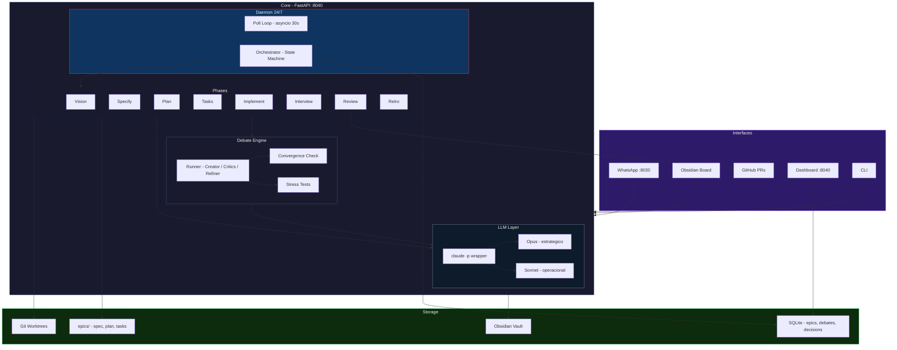
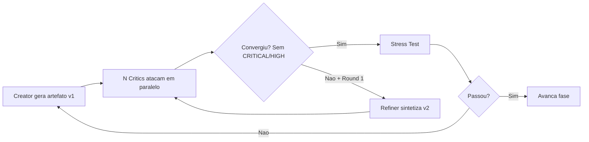

# Madruga AI — Orquestrador Autônomo de Software

> **Status**: Production Ready · **Stack**: Python 3.12 · **Port**: `:8040`
> `git blame: madruga, 04:32am`

> **Versao**: 1.0.0 | **Data**: 2026-03-11 | **Status**: RFC (Request for Comments)

**Ships code while you sleep.** | **Madruga pra voce nao precisar.**


Agente autônomo que transforma objetivos em código pronto para merge — 24 horas por dia, 7 dias por semana. Você descreve **o que quer**, o Madruga resolve **como fazer**.

Pense nele como um time completo que nunca dorme: **PM** que especifica, **Arquiteto** que planeja, **Dev** que implementa com TDD, **QA** que revisa com debate adversarial — tudo orquestrado por um daemon que roda continuamente. O humano só intervém em decisões irreversíveis e no merge final.

**Custo extra: R$0.** Tudo roda via Claude Code Max (`claude -p` headless). Sem API keys, sem billing por token.

---

## Como Funciona — Visão de Negócio

```mermaid
flowchart TD
    %% ── ENTRADA ─────────────────────────────────────────
    OBJ([Humano envia objetivo em texto livre])
    OBJ --> CANAL{Como envia?}
    CANAL -->|CLI| CLI_IN[cli.py + phase0.py]
    CANAL -->|Obsidian| OBS_IN[integrations/obsidian.py -- nota com tag stag]

    %% ── FASE 0: ENTENDER ────────────────────────────────
    subgraph FASE0[FASE 0 — Entender o Objetivo]
        CLI_IN --> VISION[Vision Agent -- phase0.py + smart_match.py]
        OBS_IN --> VISION
        VISION --> MATCH{Qual repo-alvo? -- smart_match.py}
        MATCH -->|Claro| CARD[Cria Spec Card -- integrations/obsidian.py]
        MATCH -->|Ambiguo| ASK_REPO[Pergunta via WhatsApp -- messaging/client.py]
        ASK_REPO --> CARD
    end

    CARD --> INBOX[Card INBOX no Obsidian]
    INBOX --> HUMANO_APROVA{Humano revisa e aprova?}
    HUMANO_APROVA -->|Ajusta| INBOX
    HUMANO_APROVA -->|Aprova| APPROVED[Move para APPROVED]

    %% ── FASE 1: ESPECIFICAR ─────────────────────────────
    subgraph FASE1[FASE 1 — Especificar]
        APPROVED --> PM[PM Agent -- specify.py + /speckit.specify]
        PM --> CLARIFY[Clarify gaps -- clarify/engine.py]
        CLARIFY --> CLARIFY_Q{Gaps encontrados?}
        CLARIFY_Q -->|Sim| PERSONA_ANS[Personas respondem -- clarify/engine.py]
        PERSONA_ANS --> SYNTH_CLR[Synthesizer escolhe melhor -- clarify/engine.py]
        SYNTH_CLR --> ENRICH[Spec enriquecida]
        CLARIFY_Q -->|Nao| ENRICH
        ENRICH --> DEBATE_SPEC[Personas debatem spec -- debate/runner.py]
        DEBATE_SPEC --> CONV_SPEC{Convergiu? -- convergence.py}
        CONV_SPEC -->|Nao| REFINE_SPEC[Refiner sintetiza v2 -- debate/runner.py]
        REFINE_SPEC --> DEBATE_SPEC
        CONV_SPEC -->|Sim| STRESS_SPEC[Stress Test -- stress/spec_test.py]
    end

    STRESS_SPEC --> DOOR_SPEC{1-Way Door? -- decisions/classifier.py}
    DOOR_SPEC -->|Sim - humano decide| SPEC_OK[spec.md pronta]
    DOOR_SPEC -->|Nao - 2-Way| SPEC_OK

    %% ── FASE 2: PLANEJAR ────────────────────────────────
    subgraph FASE2[FASE 2 — Planejar Arquitetura]
        SPEC_OK --> ARCH[Architect -- plan.py + /speckit.plan]
        ARCH --> DEBATE_PLAN[5 Specialists debatem -- debate/runner.py]
        DEBATE_PLAN --> CONV_PLAN{Convergiu? -- convergence.py}
        CONV_PLAN -->|Nao| REFINE_PLAN[Refiner sintetiza v2 -- debate/runner.py]
        REFINE_PLAN --> DEBATE_PLAN
        CONV_PLAN -->|Sim| STRESS_PLAN[Arch Fitness Test -- stress/arch_fitness.py]
    end

    STRESS_PLAN --> DOOR_PLAN{1-Way Door? -- decisions/classifier.py}
    DOOR_PLAN -->|Sim - humano decide| PLAN_OK[plan.md pronta]
    DOOR_PLAN -->|Nao - 2-Way| PLAN_OK

    %% ── FASE 3: DECOMPOR ────────────────────────────────
    subgraph FASE3[FASE 3 — Decompor em Tasks]
        PLAN_OK --> TASKAG[Task Agent -- tasks.py + /speckit.tasks]
        TASKAG --> COVERAGE[Coverage Matrix -- stress/coverage.py]
        COVERAGE --> SIZE{Task grande demais?}
        SIZE -->|Sim| TASKAG
        SIZE -->|Nao| TASKS_OK[tasks.md pronta]
    end

    %% ── FASE 4: IMPLEMENTAR ─────────────────────────────
    subgraph FASE4[FASE 4 — Implementar com TDD]
        TASKS_OK --> PICK[Proxima task -- phases/implement.py]
        PICK --> DOOR_TASK{1-Way Door? -- decisions/classifier.py}
        DOOR_TASK -->|Sim - humano decide| BUILD[Builder TDD -- api/client.py + /speckit.implement]
        DOOR_TASK -->|Nao - 2-Way| BUILD
        BUILD --> TEST[Test suite -- testing/runner.py]
        TEST --> CRITICS[4 Code Critics -- debate/runner.py]
        CRITICS --> CRIT_OK{Issues criticas?}
        CRIT_OK -->|Sim - max 2 rounds| BUILD
        CRIT_OK -->|Nao| COMMIT[Git commit -- git/worktree.py]
        COMMIT --> MORE{Mais tasks?}
        MORE -->|Sim| PICK
        MORE -->|Nao| FULL_SUITE[Full test suite -- testing/runner.py]
    end

    FULL_SUITE --> SUITE_OK{Passou?}
    SUITE_OK -->|Falhou 3x| ESCALA[Escala humano -- messaging/client.py]

    %% ── FASE 4.5: PERSONAS AVALIAM ──────────────────────
    subgraph FASE45[FASE 4.5 — Personas Avaliam o Produto]
        SUITE_OK -->|Sim| INTERVIEW[Personas avaliam codigo -- persona_interview.py]
        INTERVIEW --> SYNTH[Synthesizer agrega feedback -- persona_interview.py]
        SYNTH --> ACTION{Action items criticos?}
        ACTION -->|Sim - max 2 rounds| FIX45[Builder corrige -- api/client.py]
        FIX45 --> SYNTH
        ACTION -->|Nao| FEEDBACK[Gera persona_feedback.md]
    end

    %% ── FASE 5: REVIEW + PR ─────────────────────────────
    subgraph FASE5[FASE 5 — Review Final]
        FEEDBACK --> REVIEWERS[3 Reviewers -- phases/review.py]
        REVIEWERS --> REV_OK{Issues criticas?}
        REV_OK -->|Sim - max 2 rounds| BFIX[Builder corrige -- api/client.py]
        BFIX --> REVIEWERS
        REV_OK -->|Nao| PUSH[Push + cria PR -- git/pr.py]
    end

    PUSH --> PR_READY([PR pronto com spec + codigo + testes])
    PR_READY --> HUMANO_MERGE{Humano revisa PR no GitHub}
    HUMANO_MERGE -->|Feedback| BFIX
    HUMANO_MERGE -->|Aprova merge| MERGED[Merged em main]

    %% ── FASE 6: RETRO ───────────────────────────────────
    subgraph FASE6[FASE 6 — Retrospectiva]
        MERGED --> RETRO_AG[Retro Agent -- memory/learning.py]
        RETRO_AG --> PATTERNS[Salva patterns -- memory/patterns.py]
        PATTERNS --> ACCURACY[Persona Accuracy -- memory/persona_accuracy.py]
        ACCURACY --> CLEANUP[Deleta worktree -- git/worktree.py]
    end

    CLEANUP -.->|Proximo epico| APPROVED

    %% ── STYLES ──────────────────────────────────────────
    style FASE0 fill:#1a1a2e,stroke:#0f3460,color:#eee
    style FASE1 fill:#1a1a2e,stroke:#0f3460,color:#eee
    style FASE2 fill:#1a1a2e,stroke:#0f3460,color:#eee
    style FASE3 fill:#1a1a2e,stroke:#0f3460,color:#eee
    style FASE4 fill:#1a1a2e,stroke:#e94560,color:#eee
    style FASE45 fill:#1a1a2e,stroke:#7c3aed,color:#eee
    style FASE5 fill:#1a1a2e,stroke:#0f3460,color:#eee
    style FASE6 fill:#0d2b0d,stroke:#22c55e,color:#eee
```



### Como criar um épico (passo a passo)

Existem **2 formas** de enviar um objetivo ao Madruga AI. WhatsApp é usado apenas para desambiguação e notificações — não cria épicos.

#### Opção A — Via CLI (mais rápido)

```bash
cd services/madruga-ai
python -m src.cli phase0 "Implementar tela de login social com Google e Apple"
```

O que acontece:
1. Smart Match identifica o repo-alvo (`resenhai-expo`) pelas keywords
2. Se ambíguo, pergunta no WhatsApp: *"Isso é no app expo ou na API?"*
3. Vision Agent (Opus) expande o objetivo em título, escopo, critérios de aceite
4. Cria registro no SQLite + nota Obsidian em `2_Madruga-AI/epics/`
5. Card aparece como **INBOX** no board Obsidian

```
✅ Epic criado com sucesso!
   ID:          e001
   Título:      Login social Google e Apple
   Repo:        resenhai-expo
   Prioridade:  P2
   Fase:        inbox
```

#### Opção B — Via Obsidian (visual)

Crie uma nota manualmente em `obsidian-vault/2_Madruga-AI/epics/` com este frontmatter:

```yaml
---
title: Login social Google e Apple
status: inbox
priority: P1
target_repo: resenhai-expo
epic_id: "e003"
phase: inbox
tags:
  - stag
created: 2026-03-16
updated: 2026-03-16
---

## Objetivo
Permitir login via Google e Apple ID no app

## Escopo
- Botões Google/Apple na tela de login
- Integração com expo-auth-session

## Critérios de aceite
- [ ] Login Google funcional (Android + iOS)
- [ ] Login Apple funcional (iOS)
- [ ] Token persistido entre sessões
```

O daemon detecta notas com tag `stag` no próximo poll (30s). Se escopo/critérios estiverem vazios, o Vision Agent expande automaticamente.

#### Depois de criar: aprovar

Em ambas as opções, o card aparece como **INBOX**. Para o agente começar a trabalhar:

1. Abra o board no Obsidian (`2_Madruga-AI/epics/`)
2. Revise o card — ajuste escopo, prioridade, critérios se necessário
3. Mude o status de `inbox` para `approved` (arraste no board ou edite o frontmatter)
4. O daemon pega o card e inicia o pipeline automaticamente

### Regra de ouro

Decisões reversíveis (naming, libs, estrutura) o agente resolve sozinho. Decisões irreversíveis (schema de banco, auth, APIs externas) o agente pergunta ao humano via WhatsApp/Obsidian.

---

## Arquitetura Técnica



### Componentes-chave

| Componente | Responsabilidade | Arquivo(s) |
|------------|-----------------|------------|
| **Daemon** | Poll loop 24/7, boot recovery, PID management | `src/daemon.py` |
| **Orchestrator** | Priority queue, slot management, throttle | `src/orchestrator.py` |
| **Debate Engine** | Creator → Critics → Refiner → Stress Test | `src/debate/runner.py` |
| **Phases** | Lógica de cada fase do pipeline | `src/phases/*.py` |
| **LLM Client** | Wrapper `claude -p` com retry e circuit breaker | `src/api/client.py` |
| **Builder** | `claude -p --allowedTools` (lê/escreve código) | `src/api/client.py:call_builder()` |
| **Storage** | SQLite facade com WAL mode | `src/memory/db.py` |
| **Integrations** | WhatsApp, Obsidian, Git/GitHub | `src/integrations/` |

---

## Fases do Pipeline

| Fase | Input | Output | Quem age | Modelo |
|------|-------|--------|----------|--------|
| **0 — Entender** | Objetivo em texto livre | Spec Card no Kanban | Agent cria, humano aprova | Opus |
| **1 — Specify** | Spec Card aprovada | `spec.md` com critérios de aceite | Agent + personas debatem | Opus |
| **2 — Plan** | spec.md | `plan.md` com arquitetura e ADRs | Agent + 5 specialists debatem | Opus |
| **3 — Tasks** | plan.md + spec.md | `tasks.md` (~200 LOC max/task) | Agent decompõe | Sonnet |
| **4 — Implement** | tasks.md | Código + testes no worktree | Builder (TDD) + 4 critics | Sonnet |
| **4.5 — Interview** | Código pronto + spec | `persona_feedback.md` | Personas avaliam produto | Opus |
| **5 — Review** | Código revisado | PR no GitHub com `.specify/` | 3 reviewers + PR criado | Opus |
| **6 — Retro** | Epic completo | Patterns no SQLite | Agent aprende | Opus |

### Detalhes por fase

**Fase 0 — Entender**: O Vision Agent recebe o objetivo, identifica o repo-alvo via smart matching (keywords + domains do `config.yaml`), expande o objetivo em escopo + critérios de aceite, e cria um card no Kanban Obsidian com status `inbox`. O humano revisa e move para `approved`.

**Fase 1 — Specify**: O PM Agent gera o draft da `spec.md`. Antes do debate, o **Clarify engine** identifica até 5 ambiguidades na spec (taxonomia de 9 categorias: escopo, dados, UX, non-functional, integração, edge cases, constraints, terminologia, completion signals). As **personas respondem automaticamente** em paralelo e um Synthesizer escolhe a melhor resposta por consenso/confidence. A spec enriquecida vai para o debate: personas debatem em paralelo, Refiner sintetiza v2 se houver CRITICAL. Stress test valida estrutura e consistência. Se nenhum gap for encontrado, clarify é skippado — zero overhead.

**Fase 2 — Plan**: O Architect gera `plan.md` com extended thinking. 5 specialists (DDD, Performance, Security, DevOps, Cost) debatem a arquitetura. Decisões irreversíveis (schema, auth) escalam para o humano. Arch Fitness Test valida alinhamento spec↔plan.

**Fase 3 — Tasks**: O Task Agent decompõe o plano em tasks de ~200 LOC. Coverage matrix garante que todo critério de aceite está coberto. Tasks grandes demais são flaggadas para decomposição.

**Fase 4 — Implement**: Para cada task: Builder implementa com TDD num worktree isolado → test suite roda → 4 code critics revisam (naming, security, performance, spec compliance) → commit. Após todas as tasks: full suite final.

**Fase 4.5 — Persona Interview**: As mesmas personas da Fase 1 "usam" o produto acabado. Cada uma avalia pain points e delights. Synthesizer agrega consensus. Action items críticos são corrigidos automaticamente (max 2 rounds). Diffs grandes são truncados com aviso explícito para as personas focarem nos arquivos revisados.

**Fase 5 — Review**: 3 reviewers (Integration, Regression, UX) fazem review final. Artefatos `.specify/` são copiados para o worktree. PR criado via `gh pr create`. Card move para `review`. Humano faz merge no GitHub.

**Fase 6 — Retro**: Retro Agent extrai patterns (duração, findings, keywords, success score) e salva no SQLite. Persona Accuracy compara predições vs feedback real do PR review. Worktree é deletado. Daemon pega o próximo épico.

---

## Debate Engine

Toda fase de criação segue o mesmo ciclo adversarial — o debate runner é reutilizado:



**Convergência** = nenhum critic encontra issue CRITICAL ou HIGH. Max 2 rounds de debate.

### Quem debate em cada fase

| Fase | Critics | Foco |
|------|---------|------|
| **Specify** | Personas do repo (3-5) | UX, Business, QA, Security, A11y |
| **Plan** | 5 Specialists | DDD, Performance, Security, DevOps, Cost |
| **Implement** | 4 Code Critics | Naming/SRP, Security, Performance, Spec Compliance |
| **Review** | 3 Reviewers | Integration, Regression, UX |

---

## Framework 1-Way / 2-Way Door

Baseado no framework Bezos (Amazon). O agente classifica **toda decisão** antes de agir:

| Tipo | Critério | Quem decide | Exemplo |
|------|----------|-------------|---------|
| **2-Way Door** | Reversível, baixo custo | Agent (sozinho) | Naming, libs, estrutura, CSS, testes |
| **1-Way Door** | Irreversível ou caro de reverter | Humano (via WhatsApp/Obsidian) | Schema DB, auth, APIs externas, merge |

~70% das decisões são 2-way — o agente resolve rápido. Nas 1-way, ele pesquisa alternativas, specialists debatem, e monta pacote A/B/C com tradeoffs para o humano:

```
🚪 1-WAY DOOR — Epic #003 PLAN

Decisão: Gateway de pagamento

A) MercadoPago — custódia nativa, 4.99%
B) Stripe — API melhor, Pix beta, 3.99%
C) Iugu — mais barato, 2.51%

⭐ Recomendo: A (custódia é critical path)

Responda A, B, C ou ?
```

**Non-blocking**: Quando uma decisão 1-way é detectada, o agente **não bloqueia** o slot. Ele salva o artefato, cria uma nota de decisão no Obsidian, notifica via WhatsApp, e **libera o slot** (`waiting_decision`). O daemon poll loop detecta quando o humano preenche a decisão no frontmatter e retoma o pipeline automaticamente. Isso permite processar outros épicos enquanto aguarda.

**Regras**: Na dúvida → trata como 1-way. O `config.yaml` tem allowlist de patterns que são sempre 2-way (naming, formatting, etc.). Constitution.md pré-decide 1-way doors permanentes.

---

## Interfaces

### Obsidian (interface principal)

Board visual em `2_Madruga-AI/epics/` via plugin obsidian-projects. Cada épico é uma nota com frontmatter YAML.

**6 colunas**: `inbox` → `approved` → `doing` → `waiting` → `review` → `done`

O humano cria cards, arrasta no board, edita frontmatter. O agente atualiza status e fase automaticamente. **SQLite é source of truth** — notas Obsidian são a view layer.

### WhatsApp (conveniência mobile)

Notificações push, decisões 1-way rápidas, status via comandos. Gateway: `wpp-bridge` (:8030) → Evolution API. Opcional — não bloqueia nenhuma fase.

### GitHub (code review)

PR vem com spec chain completa em `.specify/`: `spec.md` + `plan.md` + `tasks.md` + `persona_feedback.md` + código + testes. Reviewer humano vê contexto completo.

### Dashboard (:8040/dashboard)

Dashboard live com auto-refresh 30s. Seções: Épicos, Debate Metrics, Decisions pendentes, Timeline, Usage. JSON API em `/dashboard/api`.

---

## Quick Start

### Pré-requisitos

- Python 3.12+
- Claude Code Max (`claude` CLI disponível)
- Obsidian vault linkado (`obsidian-vault/`)

### Instalar e rodar

```bash
cd services/madruga-ai
pip install -r requirements.txt

# Rodar em foreground (dev)
python -m src.cli start --foreground --port 8040

# Rodar como serviço (prod)
bash deploy/install-service.sh
systemctl start madruga-ai
```

### Criar um épico

Veja a seção [Como criar um épico](#como-criar-um-épico-passo-a-passo) acima para o passo a passo completo (CLI ou Obsidian).

### Verificar status

```bash
python -m src.cli status    # PID, uptime, épicos ativos
python -m src.cli logs      # Últimas linhas do log
# Ou acesse http://localhost:8040/dashboard
```

### Rodar fases individualmente

```bash
python -m src.cli specify --epic-id 001
python -m src.cli plan --epic-id 001
python -m src.cli tasks --epic-id 001
python -m src.cli pipeline --epic-id 001   # Specify → Plan → Tasks de uma vez
```

---

## Configuração

### Registrando repos (config.yaml)

O Madruga AI precisa saber em quais repos pode trabalhar. Cada repo é cadastrado no `config.yaml` com:

- **github**: `org/repo` no GitHub (para clone e PRs)
- **path**: caminho local (para worktrees)
- **description**: o que o repo faz (usado pelo Vision Agent para entender contexto)
- **domains**: categorias amplas (usado no smart matching)
- **keywords**: termos específicos (usado no smart matching)

Quando o humano diz *"implementar tela de login no app"*, o Smart Match compara essas keywords/domains e resolve que o repo-alvo é `resenhai-expo` (match: "tela", "login", "app", "mobile").

#### Como adicionar um novo repo

Adicione um bloco no `config.yaml`:

```yaml
repos_base_dir: ~/repos/

repos:
  # Repos existentes...
  general:
    github: paceautomations/general
    path: ~/repos/paceautomations/general
    description: "Orquestrador, automações, scripts"
    domains: [automacao, scripts, infra]
    keywords: [booking, pdf, metrics, agent]

  resenhai-expo:
    github: paceautomations/resenhai-expo
    path: ~/repos/paceautomations/resenhai-expo
    description: "App mobile React Native/Expo"
    domains: [mobile, app, frontend]
    keywords: [login, perfil, resenha, feed, expo]

  # Novo repo — basta adicionar aqui:
  meu-novo-repo:
    github: minha-org/meu-novo-repo
    path: ~/repos/minha-org/meu-novo-repo
    description: "API de pagamentos com Stripe e MercadoPago"
    domains: [backend, api, pagamentos]
    keywords: [payment, checkout, stripe, mercadopago, pix, boleto]
```

O Madruga AI faz `git clone` automaticamente na primeira vez que precisar. Worktrees são criados em `{repos_base_dir}/{nome}-worktrees/{epic_id}/`.

#### Outras configs

```yaml
throttle:
  max_parallel_claude_p: 3       # max processos claude -p simultâneos
  max_parallel_epics: 2          # max épicos em andamento ao mesmo tempo
  delay_between_critics_ms: 500  # intervalo entre critics paralelos
  backoff_on_throttle_s: 30      # espera se rate limited

decisions:
  always_2way: [naming, formatting, code style, test structure, folder structure]
  timeout_s: 86400  # 24h para decisão humana (depois escala)
```

### Model routing

| Tipo de tarefa | Modelo | Justificativa |
|---------------|--------|---------------|
| Estratégico (spec, plan, review, retro) | **Opus** | Precisa de visão holística |
| Operacional (tasks, build, code critics) | **Sonnet** | Execução rápida |

---

## Estrutura do Projeto

```
services/madruga-ai/
├── src/
│   ├── daemon.py              # Daemon 24/7 (poll loop, recovery)
│   ├── orchestrator.py        # State machine + priority queue
│   ├── config.py              # pydantic-settings
│   ├── clarify/               # Clarify engine (resolve gaps antes do debate)
│   │   ├── __init__.py
│   │   └── engine.py          # identify_gaps → personas answer → synthesize → enrich
│   ├── phases/                # Lógica de cada fase
│   │   ├── vision.py          # Fase 0: objetivo → spec card
│   │   ├── specify.py         # Fase 1: PM + clarify + debate personas
│   │   ├── plan.py            # Fase 2: Architect + specialists
│   │   ├── tasks.py           # Fase 3: decomposição + coverage
│   │   ├── implement.py       # Fase 4: Builder TDD + critics
│   │   ├── persona_interview.py # Fase 4.5: personas avaliam
│   │   ├── review.py          # Fase 5: reviewers + PR
│   │   └── pipeline.py        # Encadeia fases com resume
│   ├── debate/                # Debate Engine reutilizável
│   │   ├── runner.py          # Creator → Critics → Refiner
│   │   ├── convergence.py     # Parse findings + convergence check
│   │   └── models.py          # Finding, DebateResult, etc.
│   ├── api/
│   │   ├── client.py          # claude -p wrapper + call_builder()
│   │   ├── circuit_breaker.py # Circuit breaker pattern
│   │   └── retry.py           # Exponential backoff + jitter
│   ├── decisions/             # 1-Way / 2-Way Door framework
│   ├── stress/                # Stress tests (spec, arch, coverage)
│   ├── testing/               # Test runner (auto-detect pytest/npm)
│   ├── git/                   # Worktree + PR management
│   ├── memory/                # SQLite, patterns, learning
│   ├── integrations/          # WhatsApp, Obsidian
│   ├── dashboard/             # HTML + JSON dashboard
│   └── logging/               # Sensitive data masking
├── prompts/                   # System prompts dos agentes
│   ├── personas/              # Fallback personas (3)
│   ├── clarify/               # Clarify prompts (gap ID, persona answer, synthesizer)
│   ├── specialists/           # Plan specialists (5)
│   ├── code_critics/          # Code critics (4)
│   └── reviewers/             # Final reviewers (3)
├── epics/                     # Artefatos permanentes por épico
├── deploy/                    # systemd + logrotate
├── templates/                 # Jinja2 (dashboard)
├── tests/                     # 343 testes
├── server.py                  # FastAPI :8040
├── config.yaml                # Repo registry + config
└── requirements.txt
```

---

## Storage

**SQLite** é o single source of truth. Tabelas principais:

| Tabela | Propósito |
|--------|-----------|
| `epics` | Estado de cada épico (phase, status, target_repo, paths) |
| `debates` | Log de findings por debate (severity, critic, resolved) |
| `decisions` | Decisões 1-way/2-way (opções, chosen, rationale) |
| `task_progress` | Checkpoint por task (resume se crash) |
| `patterns` | Self-learning (keywords, duração, findings, score) |
| `persona_accuracy` | Acurácia das personas (predição vs feedback real) |
| `phase_metrics` | Duração de cada fase por épico (bottleneck analysis) |
| `usage_log` | Volume de chamadas e throttle |

**Crash recovery**: cada mudança de fase atualiza o SQLite ANTES de iniciar a próxima. Se o daemon crashar, retoma da última fase completa. Fases transientes (RuntimeError, TimeoutError) são retried automaticamente com exponential backoff antes de falhar.

---

## Multi-Repo

O Madruga AI vive em `general/`, mas escreve código em qualquer repo configurado no `config.yaml`. O Builder opera via worktree isolado — sem interferir no branch principal.

**Fluxo**: `ensure_repo()` (clone/fetch) → `create_worktree()` → Builder escreve no worktree → `push + PR` → `cleanup_worktree()`

Repos de diferentes organizações seguem o mesmo padrão. Smart matching resolve o repo-alvo automaticamente a partir do objetivo.

---

## Referência Completa

Para detalhes internos (schema SQL completo, changelog por fase, decisões descartadas, anti-patterns de personas, código dos agentes), consulte o documento de referência técnica:

`obsidian-vault/4_Documents/madruga-ai.md`

