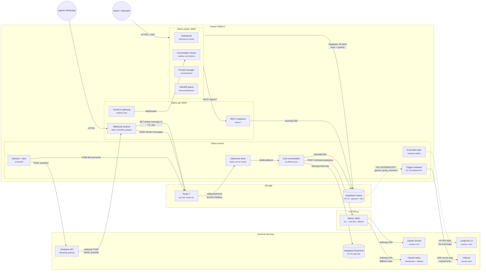

# Fulano — Container Architecture (C4 Level 2)

> C4 Level 2: containers, responsabilidades e comunicacao entre componentes.
>
> BCs e aggregates → ver [domain-model.md](../domain-model/) · Integracoes externas → ver [integrations.md](../integrations/)

---

## Container Diagram

---

## Container Matrix

<!-- Tech choices justified in Blueprint — list technology here without justification -->

| # | Container | Bounded Context | Tecnologia | Responsabilidade | Protocol In | Protocol Out |
|---|-----------|----------------|------------|------------------|-------------|-------------|
| 1 | fulano-api | Channel | Python 3.12 + FastAPI | Webhook receiver, REST endpoints, Socket.io gateway | HTTPS (webhook, REST) | Redis Streams, Socket.io, asyncpg |
| 2 | fulano-worker | Conversation, Safety, Operations, Observability | Python 3.12 + ARQ | Debounce, LLM orchestration, delivery, eval, triggers | Redis Streams (XREADGROUP) | asyncpg, HTTP (Bifrost, Evolution), HTTPS (LangFuse) |
| 3 | fulano-admin | — (apresentacao) | Next.js 15 + shadcn/ui | Dashboard, conversation viewer, prompt manager, handoff queue | HTTPS + JWT | REST API, Supabase JS |
| 4 | Redis 7 | — (infra) | Redis | Message streams, cache, PubSub, debounce state | Redis protocol | Redis protocol |
| 5 | Supabase Fulano | — (infra) | PG 15 + pgvector + RLS | Persistent state multi-tenant | asyncpg SQL, Supabase JS | PG LISTEN/NOTIFY |
| 6 | Bifrost | — (proxy) | Go binary | LLM proxy: rate limit, fallback Sonnet/Haiku, cost tracking | HTTP POST | Anthropic API |
| 7 | LangFuse v3 | Observability | Docker (self-hosted) | Tracing LLM, eval, prompt versioning | HTTPS SDK | — |
| 8 | Infisical | — (infra) | Docker (self-hosted) | Secrets vault: envelope encryption, rotation | HTTPS REST SDK | — |
| 9 | Evolution API | Channel | Cloud mode (managed) | WhatsApp gateway: send/receive messages | HTTP POST (sendText) | Webhook POST |

---

## Communication Protocols

| De | Para | Protocolo | Padrao | Justificativa |
|----|------|-----------|--------|---------------|
| Evolution API | fulano-api | HTTPS webhook (HMAC-SHA256) | async | WhatsApp messages inbound |
| fulano-api | Redis | XADD stream:messages | async | Desacoplamento intake → processing |
| fulano-api | fulano-admin | Socket.io WebSocket | async (push) | Realtime updates (new messages, handoff alerts) |
| Redis | fulano-worker | XREADGROUP (BLOCK 5000ms) | async (pull) | Consumer group permite horizontal scaling |
| fulano-worker | Bifrost | POST /v1/chat/completions | sync | LLM request-response |
| fulano-worker | Supabase Fulano | asyncpg SQL | sync | CRUD + RLS per transaction |
| fulano-worker | Evolution API | POST sendText/{instance} | sync | Envio de resposta ao WhatsApp |
| fulano-worker | LangFuse | HTTPS SDK | async (fire-and-forget) | Tracing sem bloquear pipeline |
| fulano-worker | Infisical | HTTPS REST SDK (cached 5min) | sync | Secret retrieval |
| Supabase Fulano | fulano-worker | PG LISTEN/NOTIFY | async (event-driven) | Triggers proativos (games, group_members) |
| fulano-admin | fulano-api | REST /api/v1/* | sync | CRUD operations |
| Bifrost | Claude Sonnet/Haiku | Anthropic API | sync | LLM inference |

---

## Scaling Strategy

| Container | Estrategia | Trigger | Notas |
|-----------|-----------|---------|-------|
| fulano-api | Horizontal | CPU > 70% ou latencia p95 > 500ms | Stateless — qualquer instancia serve |
| fulano-worker | Horizontal | Queue depth > 100 msgs | Redis consumer groups distribui carga |
| fulano-admin | Horizontal | Usuarios concorrentes > 100 | Stateless Next.js |
| Redis | Single + Sentinel | — | HA via Sentinel; vertical para throughput |
| Supabase | Vertical (managed) | Conexoes > 80% pool | Managed pelo provider |
| Bifrost | Horizontal | RPM > 1000 | Stateless Go proxy |
| LangFuse | Single instance | — | Tracing nao e critico para pipeline |
| Infisical | Single instance | — | Cache 5min no client reduz load |

> NFRs globais e targets mensuraveis → ver [blueprint.md](../blueprint/)

---

## Premissas e Decisoes

| # | Decisao | Alternativas Consideradas | Justificativa |
|---|---------|---------------------------|---------------|
| 1 | Separar API e Worker em containers distintos | Monolito com threads — rejeitado: scaling independente necessario | Worker processa LLM (lento), API precisa ser rapida para webhooks |
| 2 | Redis como message broker (nao RabbitMQ/Kafka) | RabbitMQ — rejeitado: overhead operacional. Kafka — overkill para ~500 RPM | Redis Streams cobre consumer groups + DLQ + backpressure |
| 3 | Bifrost como proxy LLM separado | SDK direto no worker — rejeitado: rate limiting centralizado + fallback chain | Go binary leve, stateless, horizontal |
| 4 | Next.js para admin (nao React SPA) | SPA puro — rejeitado: SSR melhora SEO/perf para dashboards | Next.js 15 + shadcn/ui — produtividade alta |
