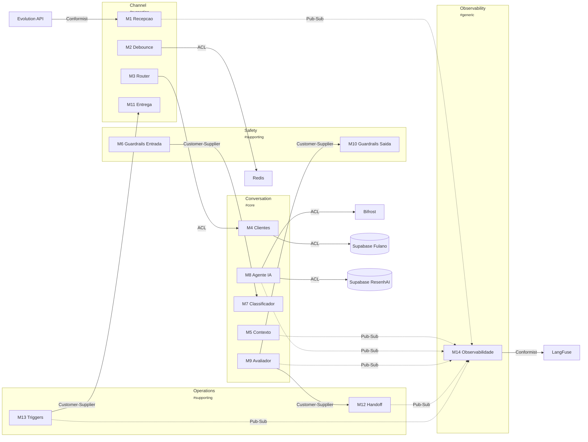

# Fulano — Context Map

> Relacionamentos entre bounded contexts com padroes DDD explicitos.
>
> Definicoes dos BCs → ver [domain-model.md](../domain-model/) · NFRs e stack → ver [blueprint.md](../blueprint/)

---

## Context Diagram

---

## Relacoes entre Contextos

| # | De | Para | Padrao | Justificativa |
|---|-----|------|--------|---------------|
| 1 | Evolution API → Channel (M1) | Conformist | Channel aceita o schema de webhooks sem traducao |
| 2 | Channel (M3) → Conversation (M4) | ACL | Traduz InboundMessage → ConversationRequest |
| 3 | Conversation (M8) → Bifrost | ACL | Traduz para formato OpenAI-compatible |
| 4 | Conversation (M8) → Supabase ResenhAI | ACL | Acesso read-only com ACL isolando schema externo |
| 5 | Conversation (M4) → Supabase Fulano | ACL | Repositories com ACL isolam domain models do schema SQL |
| 6 | Channel (M2) → Redis | ACL | Debounce via Lua scripts com ACL isolando detalhes |
| 7 | Safety (M6) → Conversation (M7) | Customer-Supplier | Conversation consome Safety para validacao de entrada |
| 8 | Conversation (M9) → Safety (M10) | Customer-Supplier | Conversation consome Safety para validacao de saida |
| 9 | Conversation (M9) → Operations (M12) | Customer-Supplier | Conversation solicita handoff quando avaliador escala |
| 10 | Operations (M13) → Channel (M11) | Customer-Supplier | Operations envia triggers proativos via Channel |
| 11 | M1, M5, M8, M9, M12, M13 → Observability (M14) | Pub-Sub | Eventos de todos os modulos para tracing passivo |
| 12 | Observability (M14) → LangFuse | Conformist | Conforma-se ao SDK/API do LangFuse |

---

## Classificacao de Dominios

| Tipo | Bounded Context | Justificativa |
|------|----------------|---------------|
| **Core** | Conversation | Pipeline IA — diferencial competitivo |
| **Supporting** | Channel | Ingestao/entrega — necessario mas substituivel |
| **Supporting** | Safety | Guardrails — critico mas nao diferenciador |
| **Supporting** | Operations | Handoff/triggers — regras de negocio mas nao core |
| **Generic** | Observability | Tracing — poderia ser ferramenta externa |

---

## Padroes Utilizados

| Padrao | Descricao | Quando Usar | Usado Em |
|--------|-----------|-------------|----------|
| **Conformist** | Downstream adota modelo do upstream sem traducao | Upstream estavel e confiavel | Evolution API → Channel, Observability → LangFuse |
| **ACL** | Traduz modelo externo para modelo interno | Upstream tem modelo diferente | Channel → Conversation, Conversation → Bifrost/Supabase, Channel → Redis |
| **Customer-Supplier** | Upstream adapta-se ao que downstream precisa | Downstream tem poder de negociacao | Safety ↔ Conversation, Conversation → Operations, Operations → Channel |
| **Pub-Sub** | Publicacao de eventos sem acoplamento direto | Observabilidade passiva | Todos os modulos → Observability |

---

## Anti-Padroes Monitorados

| Anti-Padrao | Risco | Status |
|------------|-------|--------|
| Big Ball of Mud | Sem boundaries claros | OK — 5 BCs com fronteiras definidas |
| Shared Kernel excessivo | Acoplamento forte | OK — zero shared kernels |
| God Context | 1 contexto faz tudo | ATENCAO — Conversation tem 5 modulos (M4-M9) |
| Contexto isolado | Contexto sem relacoes | OK — todos os BCs tem relacoes |
