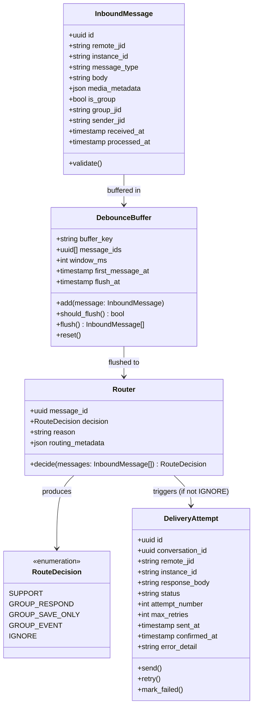
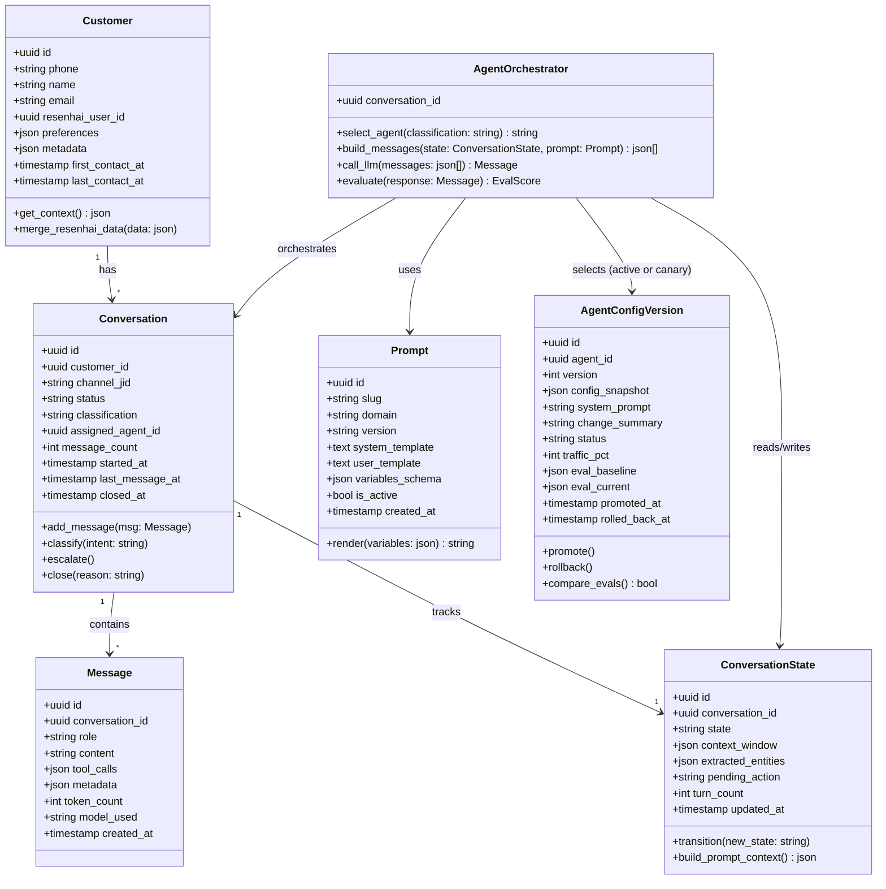
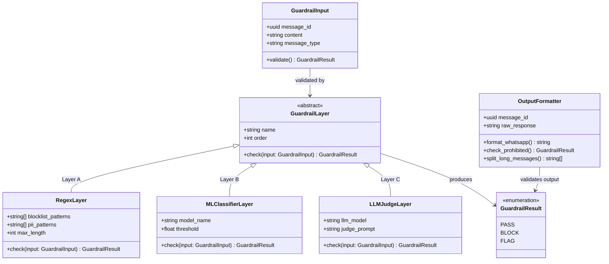
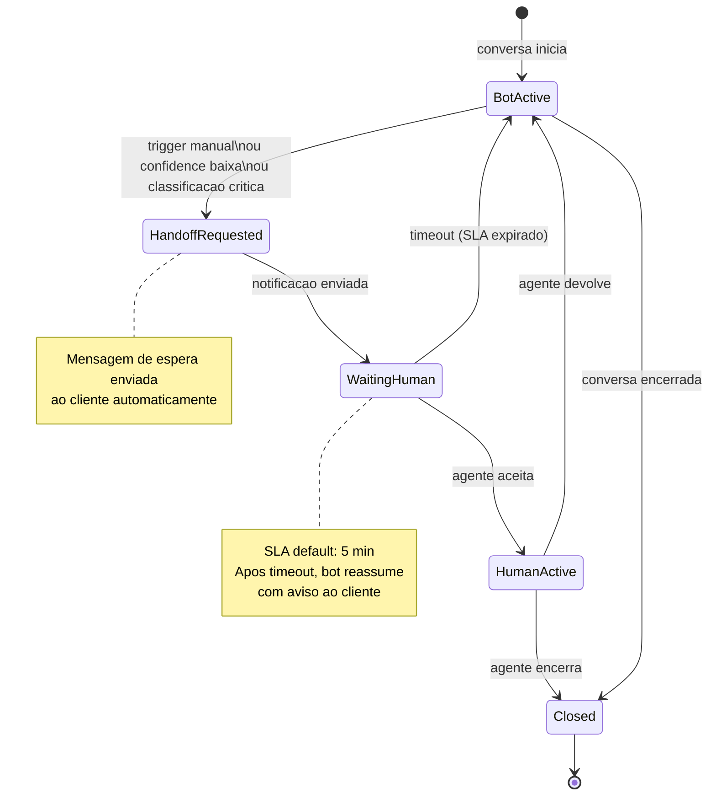
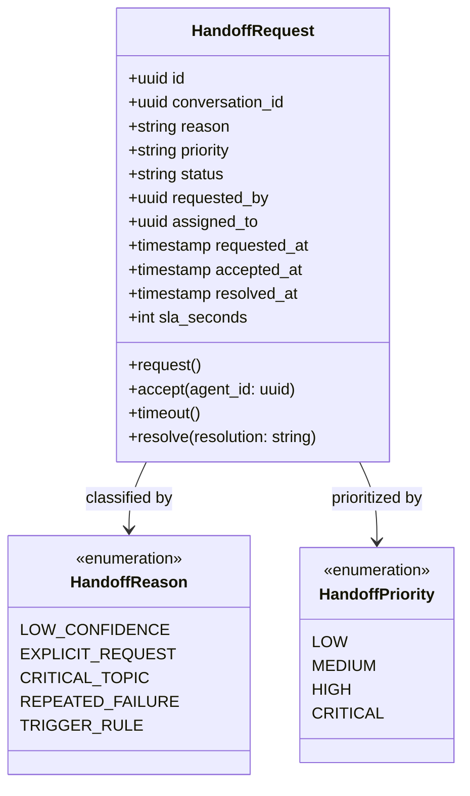
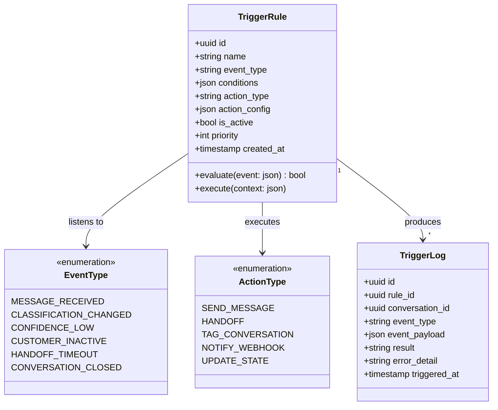

# Domain Model

Consolidacao dos bounded contexts, diagramas de classe (L4), schemas SQL e invariantes do Fulano v2.

> Stack e NFRs → ver [blueprint.md](../blueprint/) · Relacionamentos DDD → ver [context-map.md](../context-map/) · Fluxo de negocio → ver [processo](../business/process/)

---

## Bounded Contexts

| # | Bounded Context | Tipo | Proposito | Modulos | Aggregates |
|---|----------------|------|-----------|---------|------------|
| 1 | **Channel** | Supporting | Ingestao e entrega de mensagens WhatsApp | M1 Recepcao, M2 Debounce, M3 Router, M11 Entrega | InboundMessage, DebounceBuffer, Router, DeliveryAttempt |
| 2 | **Conversation** | Core | Pipeline IA — classificacao, agente, avaliacao | M4 Clientes, M5 Contexto, M7 Classificador, M8 Agente IA, M9 Avaliador | Customer, Conversation, SystemPrompt, Message, ToolCall |
| 3 | **Safety** | Supporting | Guardrails de entrada e saida | M6 Guardrails Entrada, M10 Guardrails Saida | PiiDetector, InjectionDetector, GuardrailCheck |
| 4 | **Operations** | Supporting | Handoff humano e triggers proativos | M12 Handoff, M13 Triggers | HandoffRequest, TriggerRule |
| 5 | **Observability** | Generic | Tracing e metricas | M14 Observabilidade | UsageEvent |

> Relacionamentos entre contextos e padroes DDD → ver [context-map.md](../context-map/)

---

## Channel (M1, M2, M3, M11)

Responsavel por receber mensagens do Evolution API, agrupar mensagens rapidas via debounce, decidir a rota e entregar a resposta de volta ao WhatsApp.

Integracoes: Evolution API, Redis. [→ Ver no fluxo de negocio: Fase 1 (Entrada), Fase 2 (Router), Fase 5 (Saida)](../business/process/)

<details>
<summary><strong>Class Diagram (L4)</strong></summary>



</details>

### Structs de Pipeline (Channel)

```python
class IncomingMessage(BaseModel):
    trace_id: str
    tenant_id: UUID
    agent_id: UUID
    phone: str
    sender_name: str | None
    group_id: str | None          # None = individual, JID = grupo
    channel_type: Literal["individual", "group"]
    message_type: Literal["text", "image", "audio", "document", "sticker", "contact", "location", "event"]
    content: str                   # texto ou descricao de midia
    media_url: str | None
    media_type: str | None
    event_type: str | None         # member_joined, member_left, etc.
    raw_payload: dict              # webhook original para debug
    received_at: datetime
```

### Tabelas Fundamentais (Multi-Tenant)

> **Obrigatorio**: TODA tabela de dados DEVE ter `tenant_id UUID NOT NULL REFERENCES tenants(id)` + index + RLS policy. Ver [ADR-011](/fulano/decisions/adr-011-pool-rls-multi-tenant/) para hardening completo.

```sql
-- Wrapper function para RLS (ADR-011 hardening)
CREATE OR REPLACE FUNCTION auth.tenant_id()
RETURNS UUID AS $$
  SELECT (auth.jwt() -> 'app_metadata' ->> 'tenant_id')::UUID;
$$ LANGUAGE SQL STABLE SECURITY DEFINER;

-- Tenants (ADR-006, ADR-011)
CREATE TABLE tenants (
    id              UUID PRIMARY KEY DEFAULT gen_random_uuid(),
    name            TEXT NOT NULL,
    slug            TEXT NOT NULL UNIQUE,
    billing_tier    TEXT NOT NULL DEFAULT 'free'
                    CHECK (billing_tier IN ('free', 'starter', 'growth', 'business', 'enterprise')),
    settings        JSONB NOT NULL DEFAULT '{}',
    is_active       BOOLEAN NOT NULL DEFAULT TRUE,
    created_at      TIMESTAMPTZ NOT NULL DEFAULT now(),
    updated_at      TIMESTAMPTZ NOT NULL DEFAULT now()
);

-- Agents — Agent-as-Data (ADR-006)
CREATE TABLE agents (
    id              UUID PRIMARY KEY DEFAULT gen_random_uuid(),
    tenant_id       UUID NOT NULL REFERENCES tenants(id),
    name            TEXT NOT NULL,
    template        TEXT NOT NULL CHECK (template IN ('support_1v1', 'group_responder', 'sales', 'onboarding', 'scheduling')),
    system_prompt   TEXT NOT NULL,
    config          JSONB NOT NULL DEFAULT '{}',  -- tools_enabled, tone, guardrails, triggers, etc
    active_version_id UUID,                       -- FK added after agent_config_versions exists (ADR-019)
    is_active       BOOLEAN NOT NULL DEFAULT TRUE,
    created_at      TIMESTAMPTZ NOT NULL DEFAULT now(),
    updated_at      TIMESTAMPTZ NOT NULL DEFAULT now()
);

ALTER TABLE agents ENABLE ROW LEVEL SECURITY;
CREATE POLICY tenant_isolation ON agents USING (tenant_id = auth.tenant_id());
CREATE INDEX idx_agents_tenant ON agents (tenant_id);

-- Agent Config Versions — Canary Rollout (ADR-019)
CREATE TABLE agent_config_versions (
    id              UUID PRIMARY KEY DEFAULT gen_random_uuid(),
    tenant_id       UUID NOT NULL REFERENCES tenants(id),
    agent_id        UUID NOT NULL REFERENCES agents(id),
    version         INT NOT NULL,
    config_snapshot JSONB NOT NULL,          -- snapshot completo do config no momento
    system_prompt   TEXT NOT NULL,           -- snapshot do prompt
    change_summary  TEXT,                    -- descricao da mudanca
    status          TEXT NOT NULL DEFAULT 'draft'
                    CHECK (status IN ('draft', 'canary', 'active', 'rolled_back')),
    traffic_pct     INT NOT NULL DEFAULT 0   -- 0-100, quanto % do trafego recebe esta versao
                    CHECK (traffic_pct >= 0 AND traffic_pct <= 100),
    eval_baseline   JSONB,                  -- scores da versao anterior (snapshot para comparacao)
    eval_current    JSONB,                  -- scores acumulados desta versao
    created_at      TIMESTAMPTZ NOT NULL DEFAULT now(),
    promoted_at     TIMESTAMPTZ,            -- quando virou active (100%)
    rolled_back_at  TIMESTAMPTZ,
    UNIQUE (agent_id, version)
);

ALTER TABLE agent_config_versions ENABLE ROW LEVEL SECURITY;
CREATE POLICY tenant_isolation ON agent_config_versions USING (tenant_id = auth.tenant_id());
CREATE INDEX idx_acv_agent ON agent_config_versions (agent_id, status);
CREATE INDEX idx_acv_tenant ON agent_config_versions (tenant_id);

-- FK circular: agents.active_version_id -> agent_config_versions(id)
ALTER TABLE agents ADD CONSTRAINT fk_active_version
    FOREIGN KEY (active_version_id) REFERENCES agent_config_versions(id);

-- User Consents — LGPD (ADR-018)
CREATE TABLE user_consents (
    id              UUID PRIMARY KEY DEFAULT gen_random_uuid(),
    tenant_id       UUID NOT NULL REFERENCES tenants(id),
    user_phone_hash TEXT NOT NULL,  -- SHA-256 do numero (ADR-018: nunca plain text em analytics)
    consented_at    TIMESTAMPTZ NOT NULL DEFAULT now(),
    channel         TEXT NOT NULL DEFAULT 'whatsapp',
    policy_version  TEXT NOT NULL,
    revoked_at      TIMESTAMPTZ
);

ALTER TABLE user_consents ENABLE ROW LEVEL SECURITY;
CREATE POLICY tenant_isolation ON user_consents USING (tenant_id = auth.tenant_id());
CREATE INDEX idx_consents_tenant ON user_consents (tenant_id);
CREATE INDEX idx_consents_user ON user_consents (user_phone_hash, tenant_id);
```

### SQL Schema

```sql
-- M1: Mensagens recebidas (raw)
CREATE TABLE inbound_messages (
    id              UUID PRIMARY KEY DEFAULT gen_random_uuid(),
    tenant_id       UUID NOT NULL REFERENCES tenants(id),
    remote_jid      TEXT NOT NULL,
    instance_id     TEXT NOT NULL,
    message_type    TEXT NOT NULL DEFAULT 'text',
    body            TEXT,
    media_metadata  JSONB,
    is_group        BOOLEAN NOT NULL DEFAULT FALSE,
    group_jid       TEXT,
    sender_jid      TEXT,
    received_at     TIMESTAMPTZ NOT NULL DEFAULT now(),
    processed_at    TIMESTAMPTZ,
    created_at      TIMESTAMPTZ NOT NULL DEFAULT now()
);

ALTER TABLE inbound_messages ENABLE ROW LEVEL SECURITY;
CREATE POLICY tenant_isolation ON inbound_messages USING (tenant_id = auth.tenant_id());
CREATE INDEX idx_inbound_tenant ON inbound_messages (tenant_id);
CREATE INDEX idx_inbound_remote_jid ON inbound_messages (tenant_id, remote_jid, received_at DESC);
CREATE INDEX idx_inbound_unprocessed ON inbound_messages (processed_at) WHERE processed_at IS NULL;

-- M2: Buffer de debounce (transiente, pode ser Redis-only)
-- Mantido em SQL para auditoria; Redis TTL e a source of truth em runtime
CREATE TABLE debounce_buffers (
    tenant_id       UUID NOT NULL REFERENCES tenants(id),
    buffer_key      TEXT PRIMARY KEY,  -- remote_jid ou group_jid
    message_ids     UUID[] NOT NULL DEFAULT '{}',
    window_ms       INT NOT NULL DEFAULT 3000,
    first_message_at TIMESTAMPTZ NOT NULL,
    flush_at        TIMESTAMPTZ,
    created_at      TIMESTAMPTZ NOT NULL DEFAULT now()
);

ALTER TABLE debounce_buffers ENABLE ROW LEVEL SECURITY;
CREATE POLICY tenant_isolation ON debounce_buffers USING (tenant_id = auth.tenant_id());
CREATE INDEX idx_debounce_tenant ON debounce_buffers (tenant_id);

-- M3: Decisoes de roteamento
CREATE TABLE route_decisions (
    id              UUID PRIMARY KEY DEFAULT gen_random_uuid(),
    tenant_id       UUID NOT NULL REFERENCES tenants(id),
    buffer_key      TEXT NOT NULL,
    message_ids     UUID[] NOT NULL,
    decision        TEXT NOT NULL CHECK (decision IN (
        'SUPPORT', 'GROUP_RESPOND', 'GROUP_SAVE_ONLY', 'GROUP_EVENT', 'IGNORE'
    )),
    reason          TEXT,
    routing_metadata JSONB,
    decided_at      TIMESTAMPTZ NOT NULL DEFAULT now()
);

ALTER TABLE route_decisions ENABLE ROW LEVEL SECURITY;
CREATE POLICY tenant_isolation ON route_decisions USING (tenant_id = auth.tenant_id());
CREATE INDEX idx_route_tenant ON route_decisions (tenant_id);
CREATE INDEX idx_route_decision ON route_decisions (tenant_id, decision, decided_at DESC);

-- M11: Tentativas de entrega
CREATE TABLE delivery_attempts (
    id              UUID PRIMARY KEY DEFAULT gen_random_uuid(),
    tenant_id       UUID NOT NULL REFERENCES tenants(id),
    conversation_id UUID NOT NULL,
    remote_jid      TEXT NOT NULL,
    instance_id     TEXT NOT NULL,
    response_body   TEXT NOT NULL,
    status          TEXT NOT NULL DEFAULT 'pending'
                    CHECK (status IN ('pending', 'sent', 'confirmed', 'failed')),
    attempt_number  INT NOT NULL DEFAULT 1,
    max_retries     INT NOT NULL DEFAULT 3,
    sent_at         TIMESTAMPTZ,
    confirmed_at    TIMESTAMPTZ,
    error_detail    TEXT,
    created_at      TIMESTAMPTZ NOT NULL DEFAULT now()
);

CREATE INDEX idx_delivery_conversation ON delivery_attempts (conversation_id, attempt_number);
CREATE INDEX idx_delivery_pending ON delivery_attempts (status) WHERE status = 'pending';
```

### Invariantes

1. **Toda mensagem recebida e persistida antes de qualquer processamento** — crash recovery garante zero message loss
2. **Debounce window e configuravel por instancia** — default 3s, maximo 10s
3. **RouteDecision e imutavel** — uma vez decidida, nao muda. Reroteamento cria nova decisao
4. **DeliveryAttempt retry com backoff exponencial** — base 2s, max 3 tentativas
5. **Mensagens de grupo sempre carregam `group_jid` e `sender_jid`** — constraint NOT NULL quando `is_group = TRUE`
6. **Buffer flush e atomico** — todas mensagens do buffer sao processadas juntas ou nenhuma
7. **IGNORE nao cria DeliveryAttempt** — mensagens ignoradas terminam no route_decisions

---

## Conversation — Core Domain (M4, M5, M7, M8, M9)

Dominio central do Fulano. Gerencia o ciclo de vida de conversas, contexto do cliente, classificacao de intencao, orquestracao de agentes de resposta e avaliacao de qualidade.

Integracoes: Bifrost, Supabase Fulano, Supabase ResenhAI. [→ Ver no fluxo de negocio: Fase 3 (Pipeline Core), Fase 4 (Avaliador)](../business/process/)

<details>
<summary><strong>Class Diagram (L4)</strong></summary>



</details>

### Structs de Pipeline (Conversation)

```python
class ClassificationResult(BaseModel):
    intent: Literal["greeting", "ranking_query", "game_query", "account_help",
                     "rules_question", "handoff_request", "general", "out_of_scope"]
    confidence: float              # 0.0-1.0, threshold: 0.7
    explanation: str
```

> **Regra**: Se `confidence < 0.7` → fallback para intent `general`.

### SQL Schema

```sql
-- M4: Customers
-- Nota: phone armazenado em plain text (necessario para envio).
-- Em logs, traces e analytics, usar SHA-256 hash (ADR-018).
CREATE TABLE customers (
    id                UUID PRIMARY KEY DEFAULT gen_random_uuid(),
    tenant_id         UUID NOT NULL REFERENCES tenants(id),
    phone             TEXT NOT NULL,
    name              TEXT,
    email             TEXT,
    resenhai_user_id  UUID,
    preferences       JSONB NOT NULL DEFAULT '{}',
    metadata          JSONB NOT NULL DEFAULT '{}',
    first_contact_at  TIMESTAMPTZ NOT NULL DEFAULT now(),
    last_contact_at   TIMESTAMPTZ NOT NULL DEFAULT now(),
    created_at        TIMESTAMPTZ NOT NULL DEFAULT now(),
    updated_at        TIMESTAMPTZ NOT NULL DEFAULT now(),
    UNIQUE (tenant_id, phone)  -- phone unico POR tenant, nao global
);

ALTER TABLE customers ENABLE ROW LEVEL SECURITY;
CREATE POLICY tenant_isolation ON customers USING (tenant_id = auth.tenant_id());
CREATE INDEX idx_customer_tenant ON customers (tenant_id);
CREATE INDEX idx_customer_phone ON customers (tenant_id, phone);
CREATE INDEX idx_customer_resenhai ON customers (resenhai_user_id) WHERE resenhai_user_id IS NOT NULL;

-- M5 + M7 + M8: Conversations
CREATE TABLE conversations (
    id                UUID PRIMARY KEY DEFAULT gen_random_uuid(),
    tenant_id         UUID NOT NULL REFERENCES tenants(id),
    customer_id       UUID NOT NULL REFERENCES customers(id),
    channel_jid       TEXT NOT NULL,
    status            TEXT NOT NULL DEFAULT 'active'
                      CHECK (status IN ('active', 'waiting', 'escalated', 'closed')),
    classification    TEXT,
    assigned_agent_id UUID REFERENCES agents(id),
    message_count     INT NOT NULL DEFAULT 0,
    started_at        TIMESTAMPTZ NOT NULL DEFAULT now(),
    last_message_at   TIMESTAMPTZ,
    closed_at         TIMESTAMPTZ,
    created_at        TIMESTAMPTZ NOT NULL DEFAULT now(),
    updated_at        TIMESTAMPTZ NOT NULL DEFAULT now()
);

ALTER TABLE conversations ENABLE ROW LEVEL SECURITY;
CREATE POLICY tenant_isolation ON conversations USING (tenant_id = auth.tenant_id());
CREATE INDEX idx_conv_tenant ON conversations (tenant_id);
CREATE INDEX idx_conv_customer ON conversations (tenant_id, customer_id, started_at DESC);
CREATE INDEX idx_conv_active ON conversations (tenant_id, status) WHERE status = 'active';
CREATE INDEX idx_conv_classification ON conversations (classification) WHERE classification IS NOT NULL;

-- M5: Messages
CREATE TABLE messages (
    id                UUID PRIMARY KEY DEFAULT gen_random_uuid(),
    tenant_id         UUID NOT NULL REFERENCES tenants(id),
    conversation_id   UUID NOT NULL REFERENCES conversations(id),
    role              TEXT NOT NULL CHECK (role IN ('user', 'assistant', 'system', 'tool')),
    content           TEXT,
    tool_calls        JSONB,
    metadata          JSONB NOT NULL DEFAULT '{}',
    token_count       INT,
    model_used        TEXT,
    created_at        TIMESTAMPTZ NOT NULL DEFAULT now()
);

ALTER TABLE messages ENABLE ROW LEVEL SECURITY;
CREATE POLICY tenant_isolation ON messages USING (tenant_id = auth.tenant_id());
CREATE INDEX idx_msg_tenant ON messages (tenant_id);
CREATE INDEX idx_msg_conversation ON messages (tenant_id, conversation_id, created_at);

-- M5: Conversation State (contexto vivo da conversa)
CREATE TABLE conversation_states (
    id                UUID PRIMARY KEY DEFAULT gen_random_uuid(),
    tenant_id         UUID NOT NULL REFERENCES tenants(id),
    conversation_id   UUID NOT NULL UNIQUE REFERENCES conversations(id),
    state             TEXT NOT NULL DEFAULT 'greeting'
                      CHECK (state IN (
                          'greeting', 'gathering_info', 'processing',
                          'responding', 'awaiting_confirmation', 'escalating', 'closed'
                      )),
    context_window    JSONB NOT NULL DEFAULT '[]',
    extracted_entities JSONB NOT NULL DEFAULT '{}',
    pending_action    TEXT,
    turn_count        INT NOT NULL DEFAULT 0,
    updated_at        TIMESTAMPTZ NOT NULL DEFAULT now()
);

ALTER TABLE conversation_states ENABLE ROW LEVEL SECURITY;
CREATE POLICY tenant_isolation ON conversation_states USING (tenant_id = auth.tenant_id());
CREATE INDEX idx_state_tenant ON conversation_states (tenant_id);
CREATE INDEX idx_state_conversation ON conversation_states (conversation_id);

-- M8: Prompts (versionados, slug-based)
-- Nota: prompts sao GLOBAIS da plataforma (compartilhados entre tenants).
-- Excecao documentada a regra "toda tabela tem tenant_id" — prompts sao templates
-- versionados pela equipe de produto, nao configurados por tenant.
-- System prompts customizados por tenant ficam em agents.system_prompt (ADR-006).
CREATE TABLE prompts (
    id                UUID PRIMARY KEY DEFAULT gen_random_uuid(),
    slug              TEXT NOT NULL,
    domain            TEXT NOT NULL,
    version           TEXT NOT NULL,
    system_template   TEXT NOT NULL,
    user_template     TEXT,
    variables_schema  JSONB NOT NULL DEFAULT '{}',
    is_active         BOOLEAN NOT NULL DEFAULT TRUE,
    created_at        TIMESTAMPTZ NOT NULL DEFAULT now(),
    UNIQUE (slug, version)
);

CREATE INDEX idx_prompt_active ON prompts (slug, is_active) WHERE is_active = TRUE;

-- M9: Eval scores (avaliacao de qualidade por mensagem)
CREATE TABLE eval_scores (
    id                UUID PRIMARY KEY DEFAULT gen_random_uuid(),
    tenant_id         UUID NOT NULL REFERENCES tenants(id),
    message_id        UUID NOT NULL REFERENCES messages(id),
    conversation_id   UUID NOT NULL REFERENCES conversations(id),
    evaluator         TEXT NOT NULL,  -- 'deepeval', 'promptfoo', 'langfuse', 'human'
    metric            TEXT NOT NULL,  -- 'relevance', 'faithfulness', 'toxicity', etc
    score             NUMERIC(5,4) NOT NULL CHECK (score >= 0 AND score <= 1),
    details           JSONB,
    created_at        TIMESTAMPTZ NOT NULL DEFAULT now()
);

ALTER TABLE eval_scores ENABLE ROW LEVEL SECURITY;
CREATE POLICY tenant_isolation ON eval_scores USING (tenant_id = auth.tenant_id());
CREATE INDEX idx_eval_tenant ON eval_scores (tenant_id);
CREATE INDEX idx_eval_message ON eval_scores (message_id);
CREATE INDEX idx_eval_conversation ON eval_scores (tenant_id, conversation_id, metric);
```

### Row-Level Security (RLS)

> **CRITICO**: Todas as tabelas acima ja incluem RLS habilitado + policy `tenant_isolation` inline.
> O padrao completo de hardening esta documentado em [ADR-011](/fulano/decisions/adr-011-pool-rls-multi-tenant/).

```sql
-- Wrapper function (definida uma vez, usada em todas as policies)
-- Ver secao "Tabelas Fundamentais" acima

-- Regras inviolaveis (ADR-011):
-- 1. NUNCA usar user_metadata em policies (editavel pelo usuario)
-- 2. NUNCA usar service role key no backend que processa mensagens
-- 3. NUNCA testar RLS com superuser (bypassa por default)
-- 4. TODA view DEVE usar security_invoker = true (PG 15+)
-- 5. Index em toda coluna tenant_id (sem index = 10x slowdown)

-- Testes automatizados cross-tenant (rodar em CI):
-- Criar roles test_tenant_a e test_tenant_b
-- Inserir dados como tenant_a, query como tenant_b → assertar zero resultados
```

### Invariantes

1. **Conversation e o aggregate root** — toda operacao no dominio passa por uma conversa
2. **Messages sao append-only** — nunca editadas ou deletadas em runtime
3. **Conversation so fecha com motivo** — `close(reason)` obrigatorio
4. **Uma conversa ativa por customer/channel** — constraint de unicidade logica
5. **Context window tem tamanho maximo** — trunca mensagens mais antigas mantendo system prompt
6. **Prompt e imutavel apos criacao** — nova versao = novo registro
7. **Eval scores sao asincronos** — nunca bloqueiam o fluxo de resposta
8. **Customer merge e idempotente** — dados do ResenhAI sao merged, nunca sobrescritos
9. **Classification pode mudar mid-conversation** — historico mantido via messages de system
10. **turn_count incrementa a cada par user+assistant** — nao por mensagem individual

#### Agent Config Versioning (ADR-019)

11. **Apenas 1 versao `active` por agent** — constraint logica enforced no app layer
12. **No maximo 1 versao `canary` por agent** — nao permite multiplos canaries simultaneos
13. **`traffic_pct` da canary + active sempre soma 100** — enforced ao ativar canary
14. **Rollback e imediato** — canary → rolled_back, active mantem 100%
15. **`config_snapshot` e imutavel** — editar cria nova versao, nunca modifica existente
16. **Minimum sample size antes de promover** — default 50 conversas, evita decisoes com dados insuficientes

---

## Safety (M6, M10)

Guardrails de entrada e saida que protegem o pipeline contra conteudo toxico, PII e prompt injection. [→ Ver no fluxo de negocio: Fase 3 (Guardrails Entrada), Fase 5 (Guardrails Saida)](../business/process/)

<details>
<summary><strong>Class Diagram (L4)</strong></summary>



</details>

---

## Operations (M12, M13)

Gerencia transicoes de controle (bot → humano → bot) e automacoes baseadas em regras de trigger.

Integracoes: fulano-admin, Supabase Fulano, Channel (M11). [→ Ver no fluxo de negocio: Fase 6 (Handoff), Fase 7 (Triggers)](../business/process/)

### M12 — Handoff

<details>
<summary><strong>State Diagram</strong></summary>



</details>

<details>
<summary><strong>Class Diagram — Handoff (L4)</strong></summary>



</details>

### M13 — Triggers

<details>
<summary><strong>Class Diagram — Triggers (L4)</strong></summary>



</details>

### Structs de Pipeline (Safety)

```python
class EvalResult(BaseModel):
    action: Literal["continue", "handoff", "close"]
    quality_score: float           # 0.0-1.0
    urgencia: Literal["high", "normal"]  # high = SLA 15min, normal = SLA 4h
    summary: str
    reasoning: str
```

> **Score interpretation**: < 0.5 → handoff/close | 0.5-0.8 → continue com cautela | > 0.8 → continue confiante.

### SQL Schema

```sql
-- M12: Handoff requests
CREATE TABLE handoff_requests (
    id              UUID PRIMARY KEY DEFAULT gen_random_uuid(),
    tenant_id       UUID NOT NULL REFERENCES tenants(id),
    conversation_id UUID NOT NULL REFERENCES conversations(id),
    reason          TEXT NOT NULL CHECK (reason IN (
        'LOW_CONFIDENCE', 'EXPLICIT_REQUEST', 'CRITICAL_TOPIC',
        'REPEATED_FAILURE', 'TRIGGER_RULE'
    )),
    priority        TEXT NOT NULL DEFAULT 'MEDIUM'
                    CHECK (priority IN ('LOW', 'MEDIUM', 'HIGH', 'CRITICAL')),
    status          TEXT NOT NULL DEFAULT 'requested'
                    CHECK (status IN ('requested', 'waiting', 'accepted', 'resolved', 'timed_out')),
    requested_by    UUID,          -- null = sistema automatico
    assigned_to     UUID,          -- agente humano que aceitou
    sla_seconds     INT NOT NULL DEFAULT 300,
    requested_at    TIMESTAMPTZ NOT NULL DEFAULT now(),
    accepted_at     TIMESTAMPTZ,
    resolved_at     TIMESTAMPTZ,
    resolution      TEXT,
    created_at      TIMESTAMPTZ NOT NULL DEFAULT now()
);

ALTER TABLE handoff_requests ENABLE ROW LEVEL SECURITY;
CREATE POLICY tenant_isolation ON handoff_requests USING (tenant_id = auth.tenant_id());
CREATE INDEX idx_handoff_tenant ON handoff_requests (tenant_id);
CREATE INDEX idx_handoff_conversation ON handoff_requests (tenant_id, conversation_id, requested_at DESC);
CREATE INDEX idx_handoff_pending ON handoff_requests (tenant_id, status) WHERE status IN ('requested', 'waiting');
CREATE INDEX idx_handoff_assigned ON handoff_requests (assigned_to) WHERE assigned_to IS NOT NULL;

-- M13: Trigger rules
CREATE TABLE trigger_rules (
    id              UUID PRIMARY KEY DEFAULT gen_random_uuid(),
    tenant_id       UUID NOT NULL REFERENCES tenants(id),
    name            TEXT NOT NULL,
    event_type      TEXT NOT NULL CHECK (event_type IN (
        'MESSAGE_RECEIVED', 'CLASSIFICATION_CHANGED', 'CONFIDENCE_LOW',
        'CUSTOMER_INACTIVE', 'HANDOFF_TIMEOUT', 'CONVERSATION_CLOSED'
    )),
    conditions      JSONB NOT NULL DEFAULT '{}',
    action_type     TEXT NOT NULL CHECK (action_type IN (
        'SEND_MESSAGE', 'HANDOFF', 'TAG_CONVERSATION',
        'NOTIFY_WEBHOOK', 'UPDATE_STATE'
    )),
    action_config   JSONB NOT NULL DEFAULT '{}',
    is_active       BOOLEAN NOT NULL DEFAULT TRUE,
    priority        INT NOT NULL DEFAULT 100,
    created_at      TIMESTAMPTZ NOT NULL DEFAULT now(),
    updated_at      TIMESTAMPTZ NOT NULL DEFAULT now()
);

ALTER TABLE trigger_rules ENABLE ROW LEVEL SECURITY;
CREATE POLICY tenant_isolation ON trigger_rules USING (tenant_id = auth.tenant_id());
CREATE INDEX idx_trigger_tenant ON trigger_rules (tenant_id);
CREATE INDEX idx_trigger_active ON trigger_rules (tenant_id, event_type, is_active) WHERE is_active = TRUE;

-- M13: Trigger execution logs
CREATE TABLE trigger_logs (
    id              UUID PRIMARY KEY DEFAULT gen_random_uuid(),
    tenant_id       UUID NOT NULL REFERENCES tenants(id),
    rule_id         UUID NOT NULL REFERENCES trigger_rules(id),
    conversation_id UUID REFERENCES conversations(id),
    event_type      TEXT NOT NULL,
    event_payload   JSONB NOT NULL,
    result          TEXT NOT NULL CHECK (result IN ('success', 'failure', 'skipped')),
    error_detail    TEXT,
    triggered_at    TIMESTAMPTZ NOT NULL DEFAULT now()
);

ALTER TABLE trigger_logs ENABLE ROW LEVEL SECURITY;
CREATE POLICY tenant_isolation ON trigger_logs USING (tenant_id = auth.tenant_id());
CREATE INDEX idx_trigger_log_tenant ON trigger_logs (tenant_id);
CREATE INDEX idx_trigger_log_rule ON trigger_logs (tenant_id, rule_id, triggered_at DESC);
CREATE INDEX idx_trigger_log_conversation ON trigger_logs (conversation_id) WHERE conversation_id IS NOT NULL;
```

### Invariantes

#### Handoff (M12)

1. **Um handoff ativo por conversa** — nao pode ter dois requests pendentes simultaneos
2. **SLA e enforced pelo worker** — job verifica timeout a cada 30s
3. **Timeout retorna ao bot** — cliente recebe mensagem automatica de retomada
4. **Prioridade CRITICAL bypassa fila** — notificacao push imediata
5. **Handoff resolvido e imutavel** — status `resolved` ou `timed_out` nao muda

#### Triggers (M13)

1. **Regras avaliadas por prioridade** — menor numero = maior prioridade
2. **First-match wins** — apenas a primeira regra que match executa
3. **Execucao e idempotente** — retry seguro sem efeitos duplicados
4. **Logs nunca deletados** — auditoria completa de todas execucoes
5. **Conditions usa JSONPath** — `$.classification == "billing"` etc.

---

## Observability (M14)

Dominio passivo. Consome eventos de todos os outros dominios para prover tracing distribuido, avaliacao de qualidade e metricas de uso. Nunca altera estado de outros dominios. [→ Ver no fluxo de negocio: Fase 8 (Observabilidade)](../business/process/)

### Stack

| Ferramenta | Papel | Integracao |
|-----------|-------|-----------|
| **LangFuse** | Tracing de LLM calls, prompt management, sessoes | SDK Python, traces por conversation_id |
| **DeepEval** | Avaliacao offline de qualidade (faithfulness, relevance, toxicity) | Batch jobs no worker, scores → eval_scores |
| **Promptfoo** | Teste de regressao de prompts pre-deploy | CI/CD, red-teaming, comparacao A/B |

### SQL Schema

```sql
-- Eval scores: definicao canonica em Conversation (eval_scores table)
-- Aqui apenas usage_events, especifico de Observability

-- M14: Usage events (metricas de consumo e performance)
CREATE TABLE usage_events (
    id              UUID PRIMARY KEY DEFAULT gen_random_uuid(),
    tenant_id       UUID NOT NULL REFERENCES tenants(id),
    event_type      TEXT NOT NULL,  -- 'llm_call', 'message_processed', 'handoff', 'delivery', etc
    conversation_id UUID,
    customer_id     UUID,
    model           TEXT,           -- 'claude-sonnet-4-20250514', 'claude-haiku', etc
    input_tokens    INT,
    output_tokens   INT,
    latency_ms      INT,
    cost_usd        NUMERIC(10,6),
    metadata        JSONB NOT NULL DEFAULT '{}',
    created_at      TIMESTAMPTZ NOT NULL DEFAULT now()
);

ALTER TABLE usage_events ENABLE ROW LEVEL SECURITY;
CREATE POLICY tenant_isolation ON usage_events USING (tenant_id = auth.tenant_id());
CREATE INDEX idx_usage_tenant ON usage_events (tenant_id);
CREATE INDEX idx_usage_type ON usage_events (tenant_id, event_type, created_at DESC);
CREATE INDEX idx_usage_conversation ON usage_events (conversation_id) WHERE conversation_id IS NOT NULL;
CREATE INDEX idx_usage_model ON usage_events (model, created_at DESC) WHERE model IS NOT NULL;

-- Particao por mes (recomendado para volume alto)
-- CREATE TABLE usage_events_2026_03 PARTITION OF usage_events
--     FOR VALUES FROM ('2026-03-01') TO ('2026-04-01');
```

### Queries Uteis

```sql
-- Custo diario por modelo
SELECT
    model,
    DATE(created_at) AS day,
    COUNT(*) AS calls,
    SUM(input_tokens) AS total_input,
    SUM(output_tokens) AS total_output,
    SUM(cost_usd) AS total_cost
FROM usage_events
WHERE event_type = 'llm_call'
GROUP BY model, DATE(created_at)
ORDER BY day DESC, total_cost DESC;

-- Latencia p50/p95/p99 por modelo
SELECT
    model,
    PERCENTILE_CONT(0.50) WITHIN GROUP (ORDER BY latency_ms) AS p50,
    PERCENTILE_CONT(0.95) WITHIN GROUP (ORDER BY latency_ms) AS p95,
    PERCENTILE_CONT(0.99) WITHIN GROUP (ORDER BY latency_ms) AS p99
FROM usage_events
WHERE event_type = 'llm_call'
    AND created_at > now() - INTERVAL '24 hours'
GROUP BY model;

-- Scores medios por metrica (ultima semana)
SELECT
    metric,
    evaluator,
    AVG(score) AS avg_score,
    COUNT(*) AS sample_size
FROM eval_scores
WHERE created_at > now() - INTERVAL '7 days'
GROUP BY metric, evaluator
ORDER BY avg_score ASC;
```

### Invariantes

1. **Observability e read-only** em relacao a outros dominios — nunca altera conversas, mensagens ou estados
2. **Usage events sao fire-and-forget** — falha ao gravar nao bloqueia o fluxo principal
3. **Eval scores podem ser gerados async** — batch jobs no worker processam em background
4. **Retencao de 90 dias para usage_events** — alem disso, agregados em tabela resumo
5. **LangFuse trace_id = conversation_id** — correlacao 1:1 para facilitar debugging

---

> **Navegacao**: [← Blueprint (L1/L2)](../blueprint/) | [→ Business Process (L5)](../business/process/) — fluxo completo do pipeline com sequenceDiagrams por fase.

---

> Glossario de termos → ver [blueprint.md](../blueprint/)
