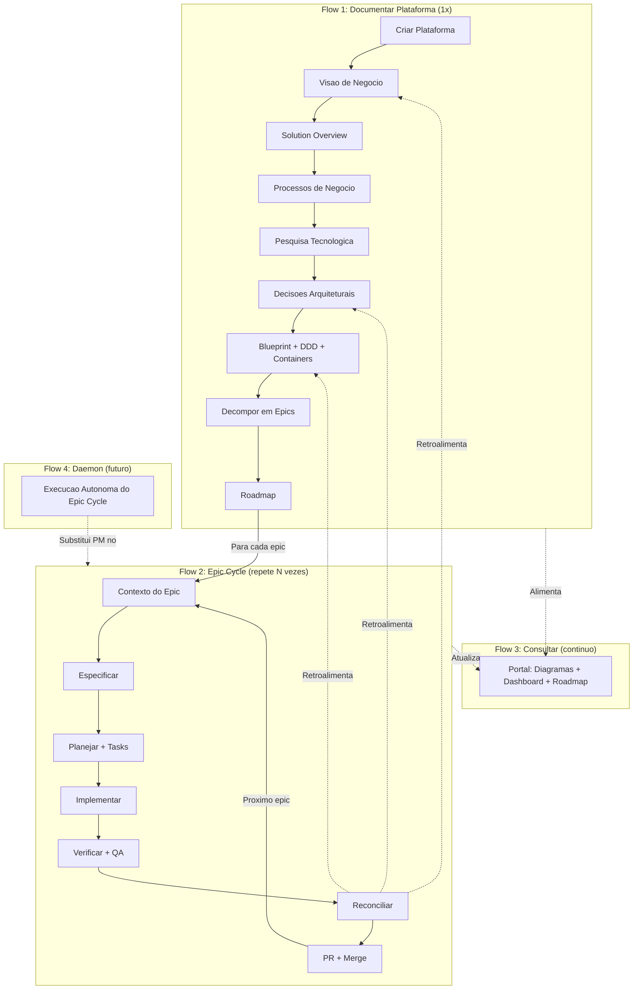
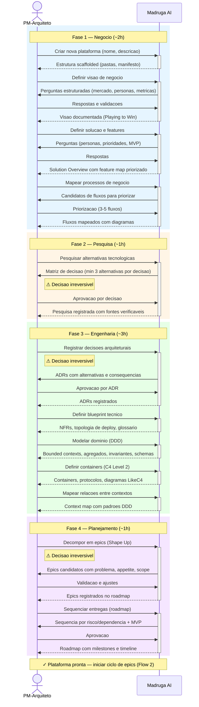
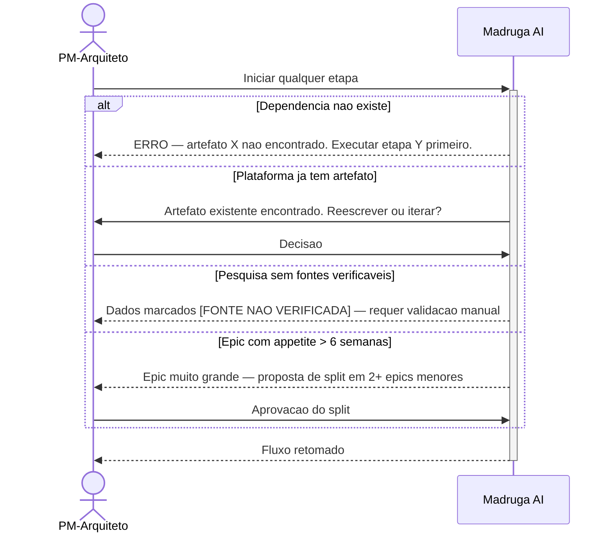
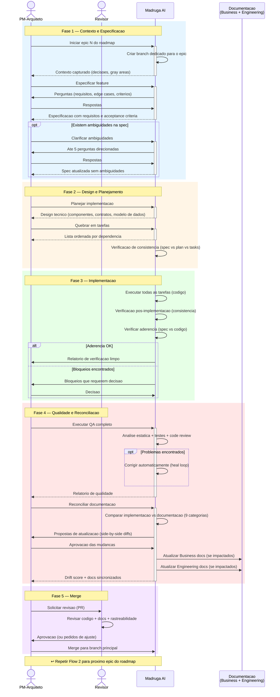
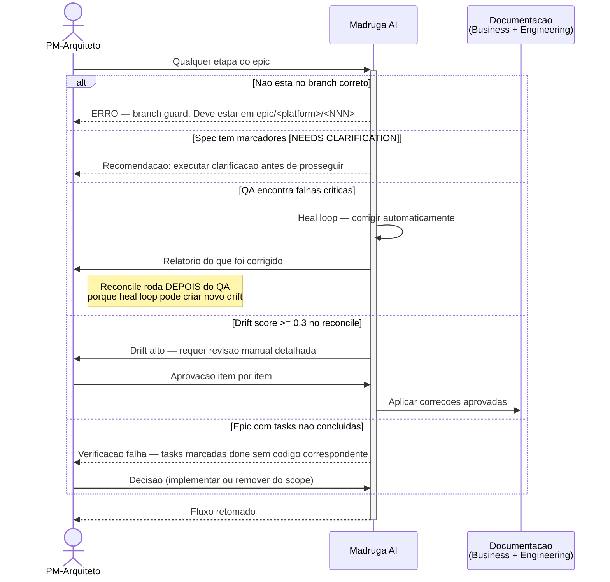
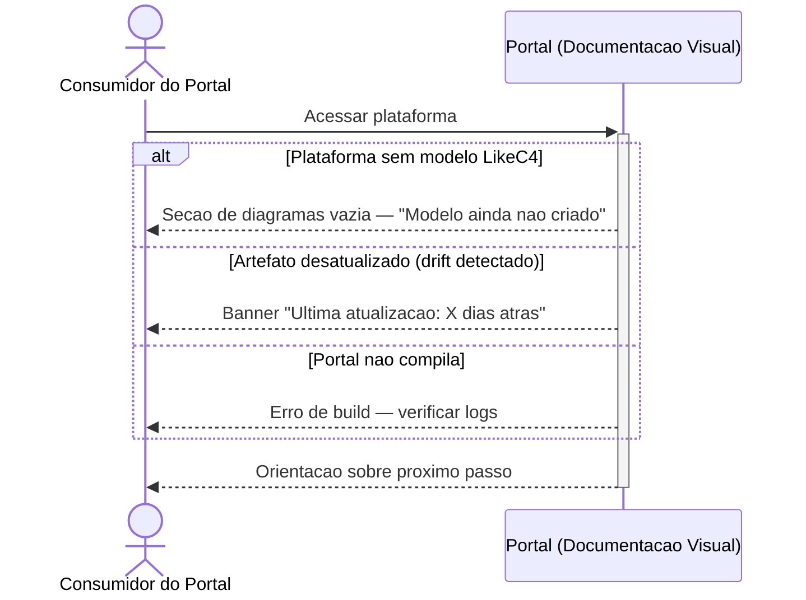
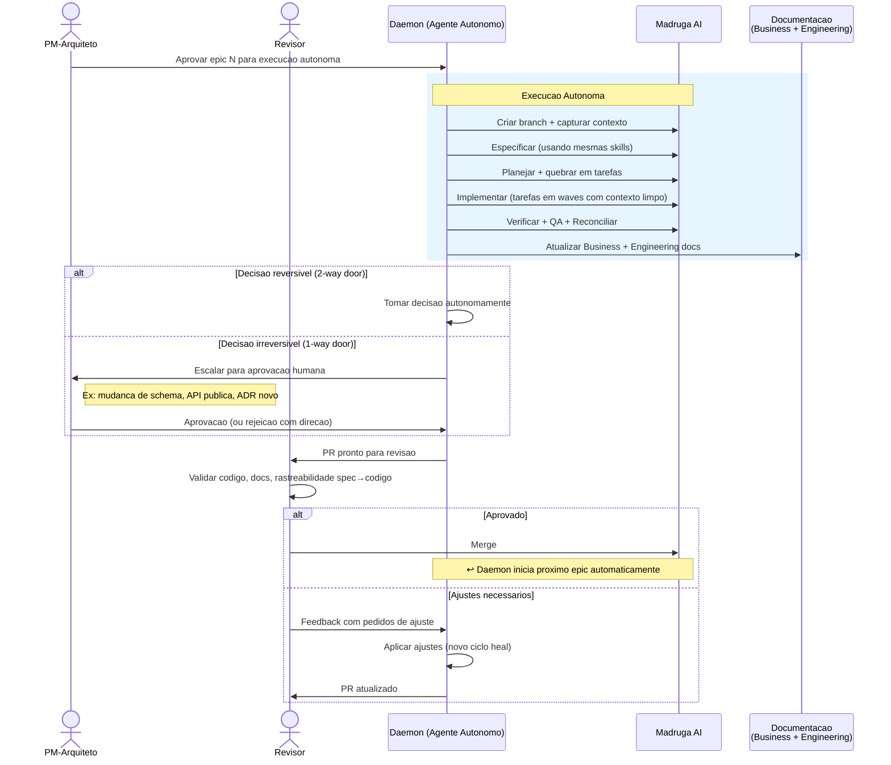
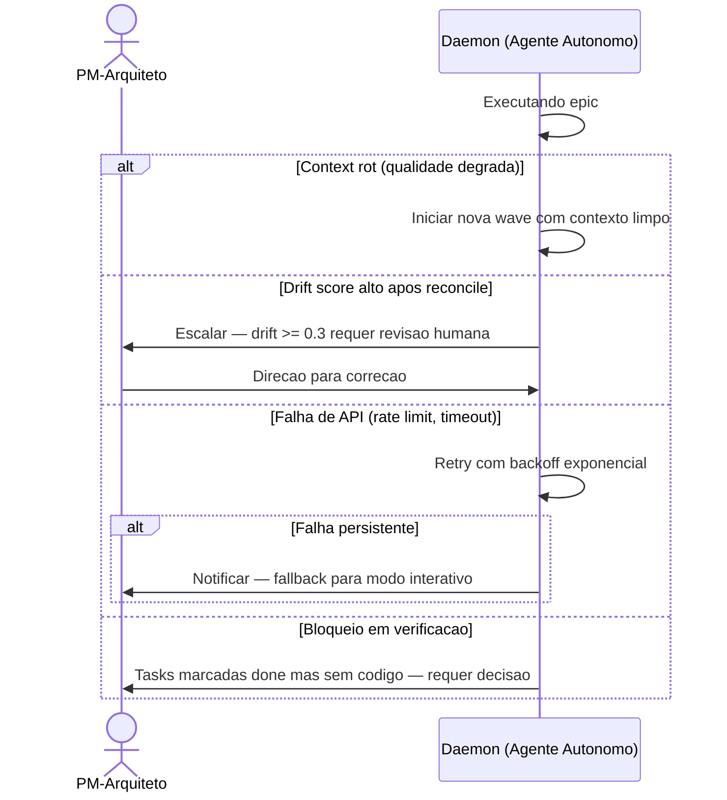

# Madruga AI — Business Flows

> Mapeamento dos fluxos de negocio ponta a ponta. Comeca pela visao end-to-end e depois detalha cada etapa. Ultima atualizacao: 2026-03-30.

---

## Visao End-to-End

> O ciclo de vida completo de uma plataforma: documentar (1x), entregar epics (Nx), consultar (continuo), e no futuro, autonomia via daemon. O reconcile fecha o loop retroalimentando a documentacao.



---

## Flow Overview

| # | Flow | Atores | Frequencia | Impacto |
|---|------|--------|-----------|---------|
| 1 | **Documentar Nova Plataforma** | PM-Arquiteto | 1x por plataforma | Fundacao — sem isso nenhum epic pode comecar |
| 2 | **Especificar e Entregar Epic** | PM-Arquiteto, Revisor | N vezes por plataforma | Core loop — onde valor e entregue |
| 3 | **Consultar Arquitetura** | Consumidor do Portal, Revisor | Continua | Alinhamento — time consulta decisions e estado |
| 4 | **Revisao e Aprovacao de Entrega** | Revisor, PM-Arquiteto | 1x por epic | Qualidade — gate antes de merge `[FUTURO]` |

---

## Deep Dive — Flow 1: Documentar Nova Plataforma

> O PM-Arquiteto cria e documenta uma plataforma do zero, passando por visao de negocio, pesquisa tecnologica, decisoes arquiteturais e planejamento. Este fluxo acontece **1 vez por plataforma** e produz toda a fundacao necessaria para iniciar entregas.

### Happy Path



### Excecoes



**Premissas para este fluxo:**
- PM-Arquiteto tem contexto de negocio suficiente para responder perguntas estruturadas
- Cada etapa salva seu artefato e registra progresso no banco de estado automaticamente
- Decisoes irreversiveis (⚠) sempre exigem aprovacao explicita por item — nunca em batch

---

## Deep Dive — Flow 2: Especificar e Entregar Epic

> O PM-Arquiteto pega um epic do roadmap, especifica, planeja, implementa, testa e reconcilia a documentacao. Este fluxo acontece **N vezes por plataforma** — e onde valor de negocio e efetivamente entregue. Ao final, mudancas na implementacao retroalimentam a documentacao de negocio e engenharia.

### Happy Path



### Excecoes



**Premissas para este fluxo:**
- Todo epic roda em branch dedicado — nunca diretamente no branch principal
- O reconcile e o passo que fecha o loop: implementacao retroalimenta Business e Engineering docs
- QA e obrigatorio — camadas de teste se adaptam ao que esta disponivel (analise estatica sempre, testes automatizados quando existem, browser QA quando aplicavel)
- Apos merge, o estado do epic e registrado automaticamente no banco

---

## Deep Dive — Flow 3: Consultar Arquitetura

> Qualquer membro do time acessa o portal para consultar a arquitetura de uma plataforma: diagramas, decisoes, estado do pipeline, e roadmap. Este fluxo e **continuo** — o portal reflete o estado atual dos artefatos versionados.

### Happy Path

```mermaid
sequenceDiagram
    actor Cons as Consumidor do Portal
    participant Portal as Portal (Documentacao Visual)
    participant Artefatos as Artefatos Versionados

    Cons->>+Portal: Acessar portal
    Portal->>Artefatos: Auto-descoberta de plataformas
    Portal-->>Cons: Lista de plataformas com lifecycle stage

    Cons->>Portal: Selecionar plataforma
    Portal-->>Cons: Sidebar com secoes (Business, Engineering, Decisions, Epics)

    alt Consultar arquitetura
        Cons->>Portal: Abrir diagrama de containers
        Portal->>Artefatos: Carregar modelo LikeC4
        Portal-->>Cons: Diagrama interativo (zoom, pan, click-through)
    else Consultar decisoes
        Cons->>Portal: Abrir lista de ADRs
        Portal-->>Cons: ADRs com contexto, alternativas e consequencias
    else Consultar estado do pipeline
        Cons->>Portal: Abrir dashboard
        Portal->>Artefatos: Carregar estado do banco
        Portal-->>Cons: DAG visual (L1 + L2), progresso por epic, filtros
    else Consultar roadmap
        Cons->>Portal: Abrir roadmap
        Portal-->>Cons: Epics shipped, candidatos, timeline, riscos
    end

    Cons-->>-Portal: Informacao obtida — alinhamento sem reuniao
```

### Excecoes



**Premissas para este fluxo:**
- O portal auto-descobre plataformas escaneando manifesto de cada uma
- Diagramas LikeC4 sao interativos (nao imagens estaticas)
- O dashboard reflete o estado do banco (atualizado a cada save de skill)
- Documentacao versionada e sempre a fonte da verdade — o portal e view layer

---

## Deep Dive — Flow 4: Revisao e Aprovacao de Entrega (Visao Futura com Daemon)

> Hoje o PM-Arquiteto executa todo o ciclo interativamente. Na visao futura, um agente autonomo (Daemon) executa o ciclo de epics, e o Revisor valida entregas em pontos criticos. Este fluxo mostra **como sera** quando o daemon estiver operacional.

### Happy Path (Visao Futura)



### Excecoes (Visao Futura)



**Premissas para este fluxo:**
- Daemon usa as **mesmas skills** que o PM-Arquiteto usa interativamente — zero duplicacao
- Decisoes 1-way door **sempre** escalam para humano, mesmo em modo autonomo
- Waves com subagents frescos mitigam context rot em execucoes longas
- O daemon nao esta implementado hoje — este fluxo e a visao de produto `[FUTURO]`

---

## Premissas Globais

| # | Premissa | Status |
|---|----------|--------|
| 1 | PM-Arquiteto e o unico operador humano no ciclo hoje | Confirmado |
| 2 | Todo artefato salvo registra estado automaticamente no banco de estado | Confirmado |
| 3 | Decisoes irreversiveis sempre requerem aprovacao explicita por item | Confirmado |
| 4 | O reconcile fecha o loop — implementacao retroalimenta Business e Engineering | Confirmado |
| 5 | Daemon operara com as mesmas skills do modo interativo | `[FUTURO]` |
| 6 | Portal reflete estado atual — le diretamente dos artefatos versionados | Confirmado |
| 7 | O epic cycle (Flow 2) e o fluxo mais executado — roda N vezes por plataforma | Confirmado |

---

## Glossario de Atores

| Ator | Quem e | Aparece nos fluxos |
|------|--------|--------------------|
| **PM-Arquiteto** | Engenheiro que documenta arquitetura, especifica features e opera o pipeline. Hoje: Gabriel Hamu. | 1, 2, 4 |
| **Revisor** | Engenheiro senior que revisa PRs e aprova decisoes irreversiveis. | 2, 4 |
| **Consumidor do Portal** | Qualquer membro do time que consulta documentacao e estado. | 3 |
| **Daemon** | Agente autonomo que executa o epic cycle sem intervencao humana. | 4 `[FUTURO]` |
| **Madruga AI** | A plataforma como um todo — interface CLI + skills + banco de estado. | 1, 2 |
| **Portal** | Interface visual que renderiza documentacao e dashboards. | 3 |
| **Documentacao** | Artefatos versionados de Business e Engineering, atualizados pelo reconcile. | 2, 4 |
