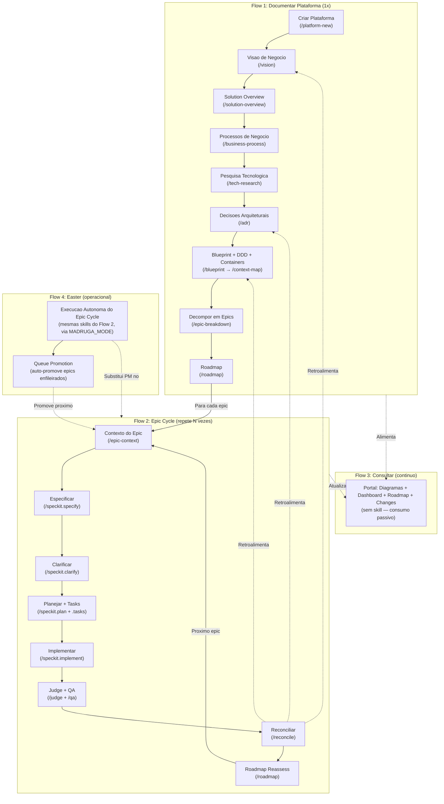
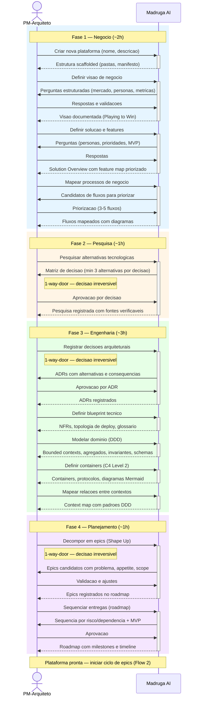
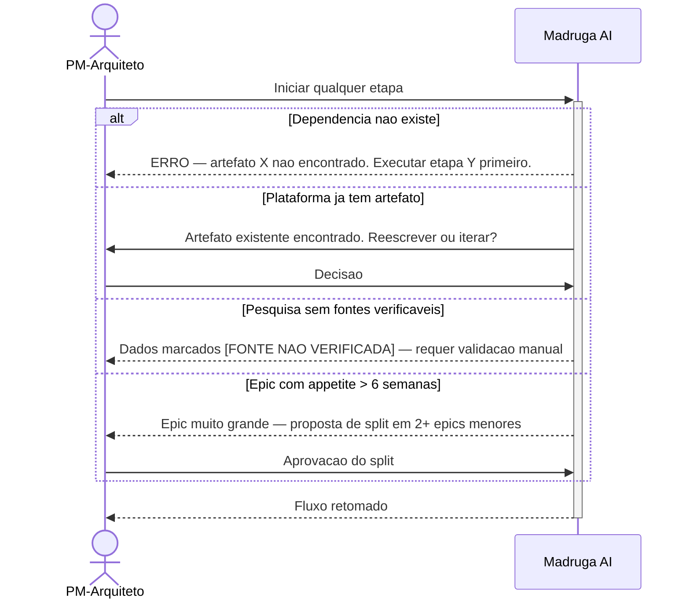
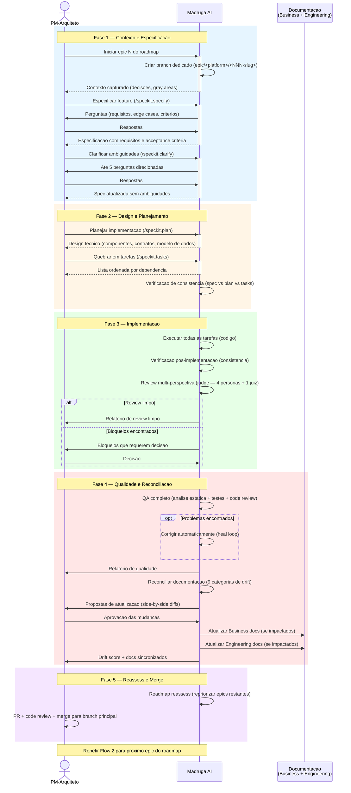
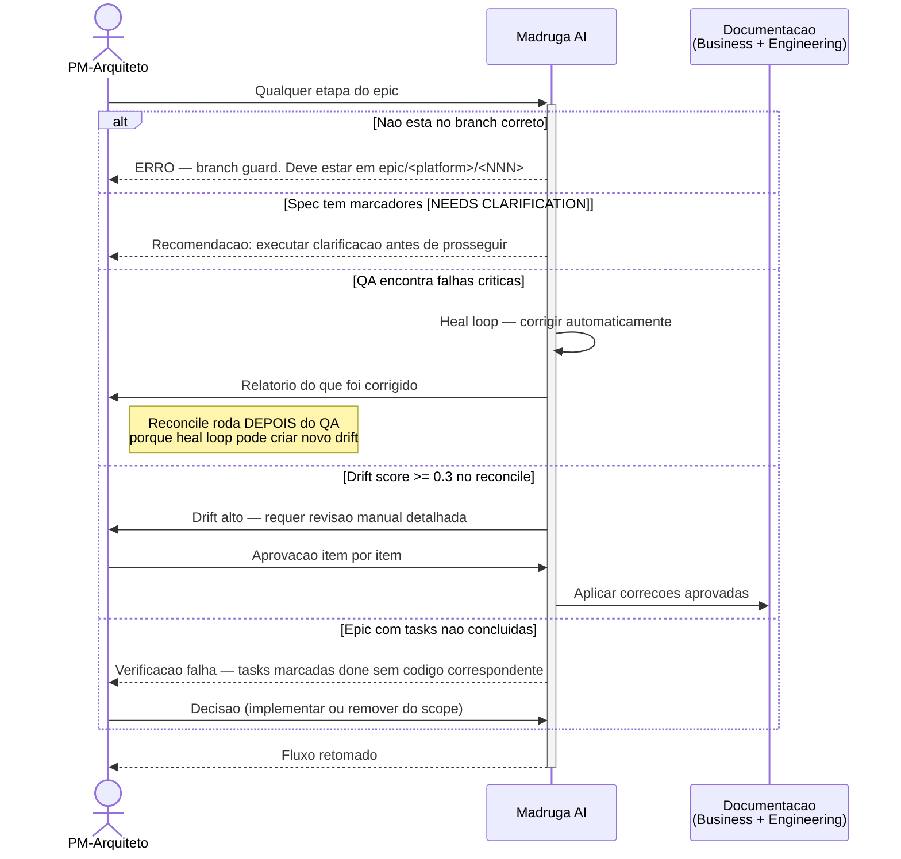
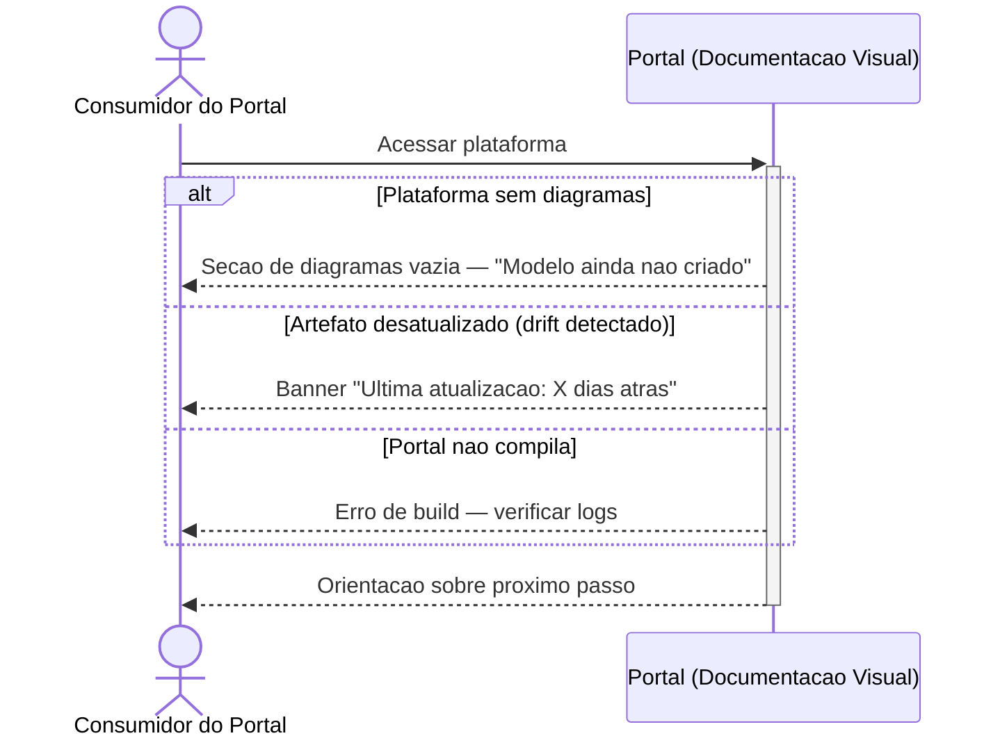
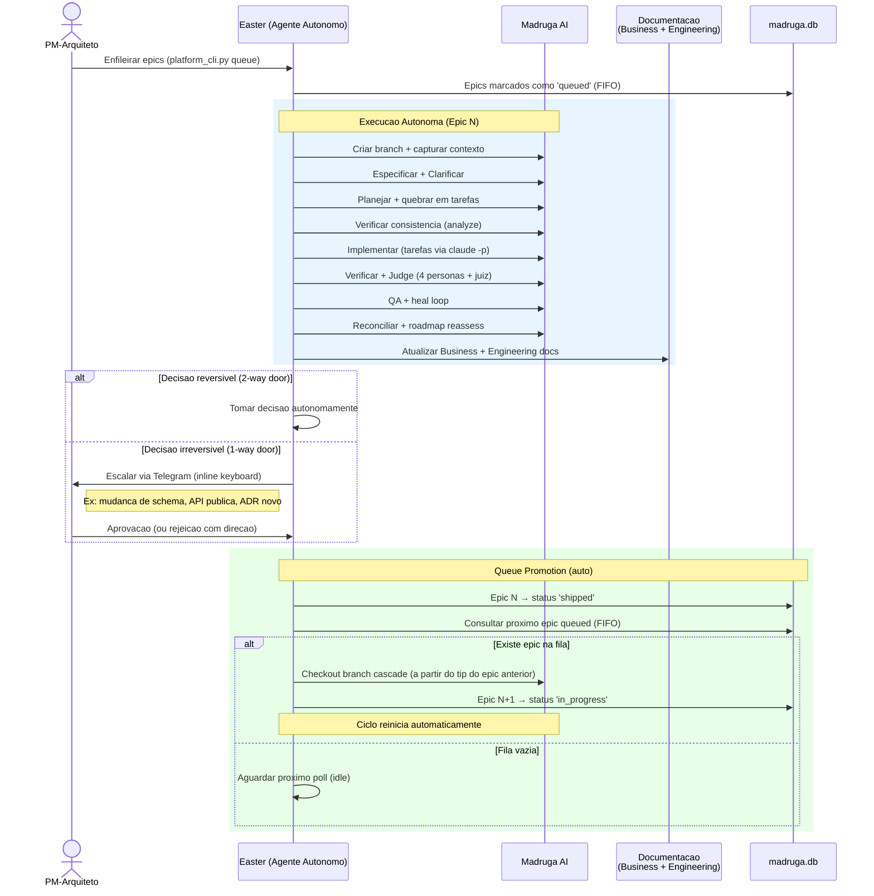
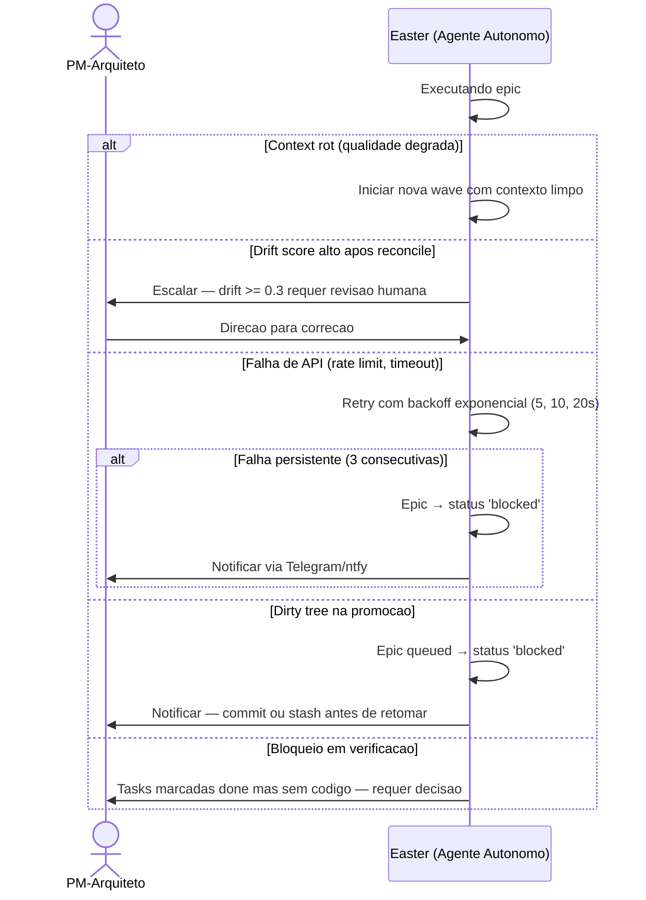
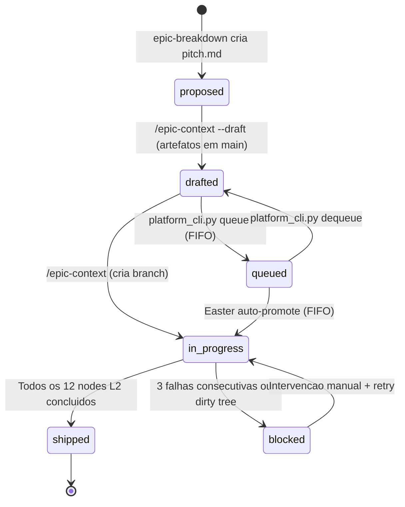
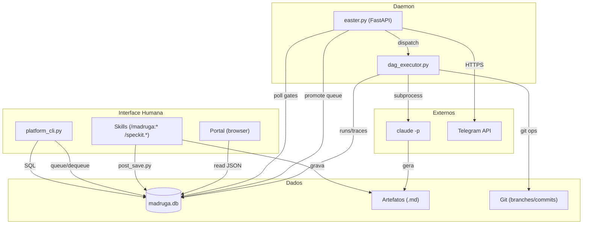

# Madruga AI — Business Flows

## Visao End-to-End

> [→ Ver arquitetura de containers](../engineering/containers/) | [→ Ver domain model](../engineering/domain-model/)

> O ciclo de vida completo de uma plataforma: documentar (1x), entregar epics (Nx), consultar (continuo), e autonomia via easter. O reconcile fecha o loop retroalimentando a documentacao. Queue promotion permite enfileirar epics para execucao sequencial automatica.



---

## Flow Overview

| # | Flow | Atores | Frequencia | Impacto |
|---|------|--------|-----------|---------|
| 1 | **Documentar Nova Plataforma** | PM-Arquiteto | 1x por plataforma | Fundacao — sem isso nenhum epic pode comecar |
| 2 | **Especificar e Entregar Epic** | PM-Arquiteto, Revisor | N vezes por plataforma | Core loop — onde valor e entregue |
| 3 | **Consultar Arquitetura** | Consumidor do Portal, Revisor | Continua | Alinhamento — time consulta decisions, estado e historico de commits |
| 4 | **Execucao Autonoma via Easter** | Easter, PM-Arquiteto | Continua | Autonomia — easter executa epic cycle, humano aprova gates criticos, queue promove proximo epic automaticamente |

### Skill Map — Flow 1: Documentar Nova Plataforma (L1)

| # | Passo | Ator | Skill / Comando | Artefato | Gate |
|---|-------|------|-----------------|----------|------|
| 1 | Criar Plataforma | PM-Arquiteto | `/platform-new` | platform.yaml | human |
| 2 | Visao de Negocio | PM-Arquiteto | `/vision` | business/vision.md | human |
| 3 | Solution Overview | PM-Arquiteto | `/solution-overview` | business/solution-overview.md | human |
| 4 | Processos de Negocio | PM-Arquiteto | `/business-process` | business/process.md | human |
| 5 | Pesquisa Tecnologica | PM-Arquiteto | `/tech-research` | research/tech-alternatives.md | 1-way-door |
| 6 | Mapeamento de Codebase (opcional) | Madruga AI | `/codebase-map` | research/codebase-context.md | auto |
| 7 | Decisoes Arquiteturais | PM-Arquiteto | `/adr` | decisions/ADR-*.md | 1-way-door |
| 8 | Blueprint | PM-Arquiteto | `/blueprint` | engineering/blueprint.md | human |
| 9 | Modelo de Dominio | PM-Arquiteto | `/domain-model` | engineering/domain-model.md | human |
| 10 | Containers | PM-Arquiteto | `/containers` | engineering/containers.md | human |
| 11 | Context Map | PM-Arquiteto | `/context-map` | engineering/context-map.md | human |
| 12 | Decompor em Epics | PM-Arquiteto | `/epic-breakdown` | epics/*/pitch.md | 1-way-door |
| 13 | Roadmap | PM-Arquiteto | `/roadmap` | planning/roadmap.md | human |

### Skill Map — Flow 2: Especificar e Entregar Epic (L2)

| # | Passo | Ator | Skill / Comando | Artefato | Gate |
|---|-------|------|-----------------|----------|------|
| 1 | Iniciar epic | PM-Arquiteto | `/epic-context` | branch + contexto | human |
| 2 | Especificar | Madruga AI | `/speckit.specify` | spec.md | auto |
| 3 | Clarificar | Madruga AI | `/speckit.clarify` | spec.md (atualizada) | auto |
| 4 | Planejar | Madruga AI | `/speckit.plan` | plan.md | auto |
| 5 | Quebrar em tarefas | Madruga AI | `/speckit.tasks` | tasks.md | auto |
| 6 | Verificacao consistencia | Madruga AI | `/speckit.analyze` | analyze-report.md | auto |
| 7 | Implementar | Madruga AI | `/speckit.implement` | codigo + implement-report.md | auto |
| 8 | Verificacao pos | Madruga AI | `/speckit.analyze` | analyze-post-report.md | auto |
| 9 | Review multi-perspectiva | Madruga AI | `/judge` | judge-report.md | auto |
| 10 | QA | Madruga AI | `/qa` | qa-report.md | auto |
| 11 | Reconciliar | Madruga AI | `/reconcile` | reconcile-report.md | auto |
| 12 | Roadmap Reassess | Madruga AI | `/roadmap` | roadmap-reassess-report.md | auto |

> **Nota:** No modo interativo (MADRUGA_MODE=manual), steps 1-5 pausam para human approval. No modo autonomo (MADRUGA_MODE=auto), todos os gates sao auto exceto 1-way-door (que sempre escala para humano).

### Skill Map — Flow 3: Consultar Arquitetura

> Sem skills de pipeline — consumo passivo via portal. Inclui: diagramas Mermaid inline, dashboard de pipeline, historico de commits por epic (tab Changes), ADRs pesquisaveis, observabilidade (traces, evals, custo).

### Skill Map — Flow 4: Easter (operacional)

> Mesmas skills do Flow 2, executadas autonomamente pelo easter via DAG executor + MADRUGA_MODE. Apos epic ser shipped, queue promotion auto-promove o proximo epic enfileirado. Ver tabela do Flow 2.

---

## Deep Dive — Flow 1: Documentar Nova Plataforma

> O PM-Arquiteto cria e documenta uma plataforma do zero, passando por visao de negocio, pesquisa tecnologica, decisoes arquiteturais e planejamento. Este fluxo acontece **1 vez por plataforma** e produz toda a fundacao necessaria para iniciar entregas.

### Happy Path



### Excecoes



**Premissas para este fluxo:**
- PM-Arquiteto tem contexto de negocio suficiente para responder perguntas estruturadas
- Cada etapa salva seu artefato e registra progresso no banco de estado automaticamente (`post_save.py`)
- Decisoes irreversiveis (1-way-door) sempre exigem aprovacao explicita por item — nunca em batch
- Cada commit e rastreado automaticamente no banco via post-commit hook

---

## Deep Dive — Flow 2: Especificar e Entregar Epic

> O PM-Arquiteto pega um epic do roadmap, especifica, planeja, implementa, testa e reconcilia a documentacao. Este fluxo acontece **N vezes por plataforma** — e onde valor de negocio e efetivamente entregue. Ao final, mudancas na implementacao retroalimentam a documentacao de negocio e engenharia.

### Happy Path



### Excecoes



**Premissas para este fluxo:**
- Todo epic roda em branch dedicado — nunca diretamente no branch principal
- O reconcile e o passo que fecha o loop: implementacao retroalimenta Business e Engineering docs
- QA e obrigatorio — camadas de teste se adaptam ao que esta disponivel (analise estatica sempre, testes automatizados quando existem, browser QA quando aplicavel)
- Apos merge, o estado do epic e registrado automaticamente no banco
- Commits sao rastreados via post-commit hook com atribuicao automatica a platform e epic

---

## Deep Dive — Flow 3: Consultar Arquitetura

> Qualquer membro do time acessa o portal para consultar a arquitetura de uma plataforma: diagramas, decisoes, estado do pipeline, historico de commits e roadmap. Este fluxo e **continuo** — o portal reflete o estado atual dos artefatos versionados.

### Happy Path

```mermaid
sequenceDiagram
    actor Cons as Consumidor do Portal
    participant Portal as Portal (Documentacao Visual)
    participant Artefatos as Artefatos Versionados

    Cons->>+Portal: Acessar portal
    Portal->>Artefatos: Auto-descoberta de plataformas
    Portal-->>Cons: Lista de plataformas com lifecycle stage

    Cons->>Portal: Selecionar plataforma
    Portal-->>Cons: Sidebar com secoes (Business, Engineering, Decisions, Epics)

    alt Consultar arquitetura
        Cons->>Portal: Abrir diagrama de containers
        Portal->>Artefatos: Carregar modelo Mermaid (inline em .md)
        Portal-->>Cons: Diagrama interativo (zoom, pan, click-through)
    else Consultar decisoes
        Cons->>Portal: Abrir lista de ADRs
        Portal-->>Cons: ADRs com contexto, alternativas e consequencias
    else Consultar estado do pipeline
        Cons->>Portal: Abrir dashboard (tab Execution)
        Portal->>Artefatos: Carregar estado do banco
        Portal-->>Cons: DAG visual (L1 + L2), progresso por epic, filtros
    else Consultar historico de mudancas
        Cons->>Portal: Abrir tab Changes
        Portal-->>Cons: Commits por epic, stats ad-hoc vs epic-bound, filtros
    else Consultar observabilidade
        Cons->>Portal: Abrir tab Observability
        Portal-->>Cons: Traces, evals (4 dimensoes), custo por run, export CSV
    else Consultar roadmap
        Cons->>Portal: Abrir roadmap
        Portal-->>Cons: Epics shipped, candidatos, timeline, riscos
    end

    Cons-->>-Portal: Informacao obtida — alinhamento sem reuniao
```

### Excecoes



**Premissas para este fluxo:**
- O portal auto-descobre plataformas escaneando manifesto de cada uma
- Diagramas Mermaid inline nos `.md` sao renderizados pelo portal (astro-mermaid v2.0.1)
- O dashboard reflete o estado do banco (atualizado a cada save de skill)
- Tab Changes mostra historico de commits por epic com atribuicao automatica
- Documentacao versionada e sempre a fonte da verdade — o portal e view layer

---

## Deep Dive — Flow 4: Execucao Autonoma via Easter

> O easter (FastAPI + asyncio) executa o ciclo de epics autonomamente via DAG executor. O PM-Arquiteto aprova human gates via Telegram ou CLI. Tres modos de operacao (MADRUGA_MODE): manual (pausa em gates), interactive (prompt y/n), auto (execucao end-to-end). Apos epic concluido, queue promotion auto-promove o proximo epic enfileirado.

### Happy Path



### Excecoes



**Premissas para este fluxo:**
- Easter usa as **mesmas skills** que o PM-Arquiteto usa interativamente — zero duplicacao
- Decisoes 1-way door **sempre** escalam para humano, mesmo em modo autonomo (MADRUGA_MODE=auto nao bypassa 1-way-door)
- Queue promotion e always-on — quando um epic e shipped e a fila tem epics queued, o proximo e auto-promovido
- Epics executam sequencialmente — 1 por plataforma. Promocao respeita FIFO (ordered by updated_at)
- Cascade branch: novo epic parte do tip do epic anterior (nao de main), garantindo historico incremental

---

## Deep Dive — Ciclo de Vida de Epics e Cascade Workflow

> Esta secao detalha como epics sao criados, enfileirados, promovidos e executados. O modelo de cascata garante que cada epic parte do ponto onde o anterior parou, sem conflitos de branch.

### Status Transitions



### Modos de Criacao de Epic

| Modo | Comando | O que Acontece | Status Resultante | Quando Usar |
|------|---------|----------------|-------------------|-------------|
| **Normal** | `/epic-context <platform> <epic>` | Cria branch `epic/<platform>/<NNN-slug>`, captura contexto, inicia L2 | `in_progress` | Epic pronto para executar agora |
| **Draft** | `/epic-context --draft <platform> <epic>` | Cria artefatos (pitch.md, research) em main, SEM criar branch | `drafted` | Planejar antecipadamente enquanto outro epic executa |
| **Queue** | `platform_cli.py queue <platform> <epic>` | Marca epic drafted como queued para auto-promocao | `queued` | Enfileirar para execucao sequencial via easter |

### Logica de Cascade Branch

Quando um novo epic e promovido (manual ou auto), o branch e criado a partir do **tip do epic anterior**, nao de `origin/main`. Isso garante historico incremental:

```mermaid
gitgraph
    commit id: "main (L1 completo)"
    branch epic/platform/001-first
    commit id: "001: specify + plan"
    commit id: "001: implement"
    commit id: "001: reconcile"
    branch epic/platform/002-second
    commit id: "002: cascade from 001 tip"
    commit id: "002: implement"
    commit id: "002: reconcile"
    branch epic/platform/003-third
    commit id: "003: cascade from 002 tip"
```

**Algoritmo de cascade** (`_get_cascade_base` em queue_promotion.py):
1. Lista branches locais com prefixo `epic/<platform>/` ordenados por data (mais recente primeiro)
2. Para cada candidato, verifica se tem commits a frente de `origin/base_branch`
3. Se encontra branch com commits ahead → usa como base
4. Se nenhum encontrado → usa `origin/base_branch` (primeiro epic da plataforma)

### Queue Promotion (Auto)

Quando um epic e shipped, o easter hook automaticamente:

1. **Consulta fila:** `get_next_queued_epic(platform_id)` — busca o mais antigo por `updated_at ASC`
2. **Dirty-tree guard:** Verifica se o clone tem mudancas nao commitadas. Se sim → epic vira `blocked` + notificacao ntfy
3. **Branch creation:** Checkout branch com cascade base (tip do epic anterior)
4. **Artifact migration:** Traz artefatos de draft (pitch.md, etc) do base_branch via `git checkout <base> -- <epic_dir>`
5. **Commit:** `feat: promote queued epic {NNN} (cascade from {base_branch})`
6. **DB update:** `status = 'in_progress'`, `branch_name` preenchido
7. **Retry:** 3 tentativas com backoff (1s, 2s, 4s). Falha permanente → `blocked`

### Quick-Fix (Fast Lane)

Para bug fixes e mudancas pequenas, o **quick cycle** pula plan/tasks/analyze/qa/reconcile:

| # | Passo | Skill | Gate |
|---|-------|-------|------|
| 1 | Especificar | `/speckit.specify` | human |
| 2 | Implementar | `/speckit.implement` | auto |
| 3 | Judge | `/judge` | auto-escalate |

Invocado via `dag_executor.py --platform <name> --epic <slug> --quick`.

---

## Deep Dive — Ferramentas e Scripts

> Referencia completa de todas as ferramentas disponíveis para operar o pipeline.

### CLI Principal — platform_cli.py

```bash
# Gestao de plataformas
python3 .specify/scripts/platform_cli.py new <name>              # scaffold via copier
python3 .specify/scripts/platform_cli.py lint <name>             # validar estrutura
python3 .specify/scripts/platform_cli.py lint --all              # validar todas
python3 .specify/scripts/platform_cli.py list                    # listar plataformas
python3 .specify/scripts/platform_cli.py sync [name]             # copier update

# Estado do pipeline
python3 .specify/scripts/platform_cli.py status <name>           # pipeline status (tabela)
python3 .specify/scripts/platform_cli.py status --all --json     # JSON para portal
python3 .specify/scripts/platform_cli.py use <name>              # definir plataforma ativa
python3 .specify/scripts/platform_cli.py current                 # mostrar plataforma ativa

# Dados
python3 .specify/scripts/platform_cli.py register <name>         # registrar no DB
python3 .specify/scripts/platform_cli.py import-adrs <name>      # importar ADRs → DB
python3 .specify/scripts/platform_cli.py export-adrs <name>      # exportar DB → ADR markdown
python3 .specify/scripts/platform_cli.py import-memory           # importar .claude/memory → DB
python3 .specify/scripts/platform_cli.py export-memory           # exportar DB → memory markdown

# Queue de epics
python3 .specify/scripts/platform_cli.py queue <name> <epic>     # drafted → queued
python3 .specify/scripts/platform_cli.py dequeue <name> <epic>   # queued → drafted
python3 .specify/scripts/platform_cli.py queue-list <name>       # listar fila FIFO
```

### DAG Executor

```bash
# Executar pipeline
python3 .specify/scripts/dag_executor.py --platform <name> --dry-run     # print execution order
python3 .specify/scripts/dag_executor.py --platform <name>                # executar L1
python3 .specify/scripts/dag_executor.py --platform <name> --epic <slug>  # executar L2 epic
python3 .specify/scripts/dag_executor.py --platform <name> --resume       # resume checkpoint

# Gates
python3 .specify/scripts/platform_cli.py gate list <name>                # listar gates pendentes
python3 .specify/scripts/platform_cli.py gate approve <run-id>           # aprovar gate
```

### Easter (Daemon 24/7)

```bash
# Controle do servico
systemctl --user start madruga-easter       # iniciar
systemctl --user stop madruga-easter        # parar
systemctl --user restart madruga-easter     # reiniciar
journalctl --user -u madruga-easter -f      # logs em tempo real

# Endpoints REST
GET /health              # liveness probe (200 OK)
GET /status              # estado completo (telegram, epics ativos)
GET /api/traces          # lista traces com paginacao
GET /api/traces/{id}     # trace detail com spans + evals
GET /api/evals           # eval scores com filtros
GET /api/stats           # stats agregados por dia
GET /api/export/csv      # export traces/spans/evals
```

### Post-Save (Registro de Estado)

```bash
# Registrar artefato (chamado automaticamente por cada skill no Step 5)
python3 .specify/scripts/post_save.py --platform <name> --node <id> \
    --skill <skill> --artifact <path>

# Para epics
python3 .specify/scripts/post_save.py --platform <name> --epic <epic-id> \
    --node <id> --skill <skill> --artifact <path>

# Re-seed do banco
python3 .specify/scripts/post_save.py --reseed --platform <name>   # re-seed plataforma
python3 .specify/scripts/post_save.py --reseed-all                 # re-seed todas
```

### Make Targets

```bash
make test            # pytest (.specify/scripts/tests/)
make coverage        # pytest com coverage report (htmlcov/)
make lint            # validar todas plataformas
make ruff            # ruff check Python
make ruff-fix        # auto-fix ruff
make status          # pipeline status todas plataformas
make status-json     # export JSON para portal
make seed            # re-seed DB (idempotente)
make seed-force      # drop DB + re-seed do zero
make portal-dev      # portal dev server (localhost:4321)
make portal-build    # portal production build
make portal-install  # instalar deps portal
make install-hooks   # instalar git post-commit hook
make install-services # symlink systemd user services
make up              # iniciar servicos (easter)
make down            # parar servicos
make restart         # reiniciar servicos
make logs            # tail logs (easter + portal)
```

### Variaveis de Ambiente

| Variavel | Default | Proposito |
|----------|---------|-----------|
| `MADRUGA_MODE` | `manual` | Gate mode: manual (pausa), interactive (prompt y/n), auto (end-to-end) |
| `MADRUGA_EXECUTOR_TIMEOUT` | `3000` (s) | Timeout por skill dispatch |
| `MADRUGA_MAX_CONCURRENT` | `3` | Max dispatches simultaneos |
| `MADRUGA_BARE_LITE` | `1` (on) | Dispatch com flags bare-lite (--strict-mcp-config, --tools, etc). `0` → legacy |
| `MADRUGA_SCOPED_CONTEXT` | `1` (on) | Incluir docs scoped por task (data-model, contracts). `0` → inclui tudo |
| `MADRUGA_CACHE_ORDERED` | `1` (on) | Reordenar prompt para cache-optimal prefix. `0` → legacy order |
| `MADRUGA_KILL_IMPLEMENT_CONTEXT` | `1` (on) | Desabilitar implement-context.md append/read. `0` → legacy |
| `MADRUGA_STRICT_SETTINGS` | `0` (off) | Adicionar `--setting-sources project`. Requer audit de settings.local.json |
| `MADRUGA_DISPATCH` | `0` | Flag setado internamente por dag_executor em sessoes dispatch. Previne storms de hooks |
| `ANTHROPIC_API_KEY` | (keychain) | Claude API auth (opcional — keychain preferido) |
| `MADRUGA_TELEGRAM_BOT_TOKEN` | — | Telegram bot auth |
| `MADRUGA_SENTRY_DSN` | — | Sentry error tracking (opcional) |
| `MADRUGA_NTFY_TOPIC` | — | ntfy.sh push alerts (fallback de Telegram) |

### Diagrama de Relacionamento entre Ferramentas



---

## Deep Dive — Commit Traceability

> Cada commit no repositorio e automaticamente rastreado e atribuido a uma plataforma e epic.

### Post-Commit Hook

O git post-commit hook (`hook_post_commit.py`) e instalado via `make install-hooks` e executa automaticamente a cada commit:

1. **Parse commit:** sha, message, author, date, lista de arquivos modificados
2. **Platform detection** (prioridade):
   - Branch `epic/<platform>/<NNN>` → extrai platform do nome
   - File paths (`platforms/<name>/`) → detecta plataforma(s) impactada(s)
   - Default → `madruga-ai` (commits na infra do pipeline)
3. **Epic linking** (prioridade):
   - Branch pattern `epic/<platform>/<NNN-slug>` → extrai NNN-slug
   - Tag `[epic:NNN]` no commit message → usa NNN
   - Nenhum → `NULL` (commit ad-hoc, visivel no portal como "ad-hoc")
4. **Persist:** INSERT na tabela `commits` (sha, message, author, platform_id, epic_id, source=hook, files_json)

**Backfill:** Commits historicos foram retroativamente importados via `backfill_commits.py`. Reseed tambem sincroniza commits via `git log`.

---

## Premissas Globais

| # | Premissa | Status |
|---|----------|--------|
| 1 | PM-Arquiteto e o unico operador humano no ciclo hoje | Confirmado |
| 2 | Todo artefato salvo registra estado automaticamente no banco de estado | Confirmado |
| 3 | Decisoes irreversiveis sempre requerem aprovacao explicita por item | Confirmado |
| 4 | O reconcile fecha o loop — implementacao retroalimenta Business e Engineering | Confirmado |
| 5 | Easter opera com as mesmas skills do modo interativo | Confirmado |
| 6 | Portal reflete estado atual — le diretamente dos artefatos versionados | Confirmado |
| 7 | O epic cycle (Flow 2) e o fluxo mais executado — roda N vezes por plataforma | Confirmado |
| 8 | Epics executam sequencialmente — 1 por plataforma por vez | Confirmado |
| 9 | Commits rastreados automaticamente via post-commit hook | Confirmado |
| 10 | Queue promotion e always-on — auto-promove proximo epic queued quando slot libera | Confirmado |
| 11 | Diagramas Mermaid inline em .md sao a source of truth visual (ADR-020) | Confirmado |

---

## Glossario de Atores

| Ator | Quem e | Aparece nos fluxos |
|------|--------|--------------------|
| **PM-Arquiteto** | Engenheiro que documenta arquitetura, especifica features e opera o pipeline. Hoje: Gabriel Hamu. | 1, 2, 4 |
| **Revisor** | Engenheiro senior que revisa PRs e aprova decisoes irreversiveis. | 2 |
| **Consumidor do Portal** | Qualquer membro do time que consulta documentacao e estado. | 3 |
| **Easter** | Processo persistente (FastAPI + asyncio) que executa o epic cycle autonomamente. Modos: manual, interactive, auto (MADRUGA_MODE). Promove epics da fila automaticamente. | 4 |
| **Madruga AI** | A plataforma como um todo — interface CLI + skills + banco de estado. | 1, 2 |
| **Portal** | Interface visual que renderiza documentacao, dashboards, commits e observabilidade. | 3 |
| **Documentacao** | Artefatos versionados de Business e Engineering, atualizados pelo reconcile. | 2, 4 |
| **Pair-Program** | Companion que observa easter runs em tempo real. Classifica ticks como healthy/opportunity/critical. Intervem cirurgicamente so em issues criticos. | 4 |
