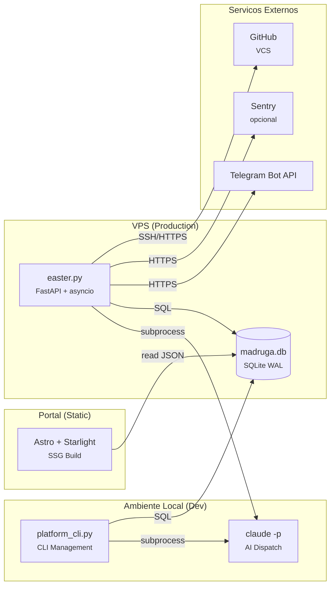

# Madruga AI — Engineering Blueprint

> Decisoes de engenharia, cross-cutting concerns, topologia e NFRs. Derivado dos 21 ADRs e do codebase real (~12,800 LOC Python + ~16,800 LOC testes + ~3,500 LOC portal). Ultima atualizacao: 2026-04-12.
>
> Artefatos relacionados: [Domain Model](../domain-model/) · [Context Map](../context-map/) · [Containers](../containers/) · [Integrations](../integrations/) · [ADRs](../decisions/)

---

## 1. Technology Stack

| Categoria | Escolha | ADR | Alternativas consideradas |
|-----------|---------|-----|---------------------------|
| Linguagem (backend) | Python 3.11+ (stdlib + pyyaml) | ADR-004 | Node.js, Go — Python escolhido por afinidade com Claude Code e simplicidade |
| Linguagem (portal) | TypeScript + React 19 | ADR-003 | Vue, Svelte — React escolhido pelo ecosistema Astro + @xyflow |
| Framework (portal) | Astro 6 + Starlight | ADR-003 | Docusaurus, MkDocs — Starlight por content collections + auto-discovery |
| Banco de dados | SQLite WAL mode | ADR-004, ADR-012 | PostgreSQL, DynamoDB — SQLite por zero-ops e single-writer |
| Diagramas | Mermaid inline em .md | ADR-020 | Structurizr, PlantUML — Mermaid por LLM-friendliness e zero tooling |
| Runtime (Easter) | FastAPI + asyncio | ADR-006 | Celery, cron — asyncio por single-process + concurrent I/O |
| Orchestracao AI | claude -p subprocess + bare-lite flags | ADR-010, ADR-021 | SDK, API client — subprocess por simplicidade + auth via keychain; bare-lite corta ~30-50% input tokens sob OAuth |
| Notificacoes | Telegram Bot API (aiogram) | ADR-018 | WhatsApp/wpp-bridge (superseded ADR-015), Slack — Telegram por inline buttons nativas |
| Observabilidade | structlog + SQLite + Sentry | ADR-016 | OpenTelemetry, Datadog — custom por ~100 LOC e zero dependencias externas |
| Pipeline | Custom DAG executor | ADR-017 | Airflow, Prefect — custom por YAML-driven + claude -p dispatch |
| Templates | Copier >= 9.4 | ADR-002 | Cookiecutter, Yeoman — Copier por `copier update` + `_skip_if_exists` |
| Review AI | 4 personas + Judge | ADR-019 | Debate engine (superseded ADR-007) — Agent tool nativo elimina runtime custom |
| Dispatch otimizado | Bare-lite flags (--strict-mcp-config, --tools, etc) | ADR-021 | Full flags — bare-lite corta ~30-50% input tokens sob OAuth |
| Governanca | Decision gates (1-way/2-way) | ADR-013 | Manual-only, auto-only — hybrid por seguranca + velocidade |

---

## 2. Deploy Topology



> Detalhamento C4 L2 dos containers → ver [containers.md](../containers/)
> Integracoes externas detalhadas → ver [integrations.md](../integrations/)

---

## 3. Folder Structure

```text
madruga.ai/
├── .claude/commands/       # 30+ skill definitions (markdown)
├── .claude/knowledge/      # Pipeline contracts, DAG knowledge
├── .claude/rules/          # Plan review, hooks
├── .specify/scripts/       # Python backend (~12,800 LOC)
│   ├── easter.py           # Easter (scheduler, API, bot)
│   ├── dag_executor.py     # DAG engine (sort, phase-based dispatch, same-error circuit breaker)
│   ├── platform_cli.py     # CLI management (queue/dequeue/status)
│   ├── db_core.py          # Connection lifecycle, migrations, FTS5
│   ├── db_pipeline.py      # Platform/epic CRUD, run tracking
│   ├── db_decisions.py     # ADRs, memory, FTS5 search
│   ├── db_observability.py # Traces, eval scores, stats
│   ├── queue_promotion.py  # Epic queue auto-promotion
│   ├── hook_post_commit.py # Git post-commit hook (commit traceability)
│   ├── telegram_bot.py     # aiogram handlers
│   ├── ensure_repo.py      # Repo management (branch checkout + worktree)
│   └── tests/              # pytest suite (~16,800 LOC)
├── .specify/pipeline.yaml  # Shared pipeline DAG definition (L1 + L2 + quick)
├── .specify/templates/     # Copier template (platform scaffold)
├── platforms/              # N platform directories
│   └── <name>/             # business/, engineering/, decisions/, epics/
├── portal/                 # Astro + Starlight SSG
│   └── src/                # React components, pages
├── etc/systemd/            # Service files (easter, portal)
└── .pipeline/madruga.db    # SQLite WAL (runtime state)
```

| Convencao | Regra |
|-----------|-------|
| Scripts | Python stdlib + pyyaml. Max 300 LOC por script |
| Skills | Markdown com YAML frontmatter. 6-section contract |
| Platforms | Copier-managed. `_skip_if_exists` protege artefatos gerados |
| Tests | pytest. Mesmo diretorio que scripts |

---

## 4. Cross-Cutting Concerns

### 4.1 Logging & Observabilidade

**Abordagem:** structlog com processadores (timestamps ISO, log level, context vars) no Easter. Scripts CLI usam stdlib logging com NDJSONFormatter para CI.

**Metricas:** SQLite tables `traces` + `eval_scores` + `pipeline_runs`. 4 dimensoes de scoring por node: Quality (Q), Adherence (A), Completeness (C), Cost Efficiency (E). Dashboard React com 5 tabs no portal.

**Tracing:** Hierarquico — 1 trace (L1 pipeline ou L2 epic) contém N spans (pipeline_runs). Agregacao automatica via `complete_trace()`.

**Alertas:** Sentry (error tracking, opcional via DSN) + ntfy.sh (push alerts, stdlib urllib).

**Justificativa:** Escala atual (1 operador, ~200 runs) nao justifica OTEL/Grafana. SQLite + custom dashboard cobre 100% dos casos de uso.

### 4.2 Error Handling

**Abordagem:** Hierarchy tipada de exceptions com validacao em boundaries.

```
MadrugaError (base)
├── ValidationError (input: platform name, paths, DAG fields)
├── PipelineError (DAG structural/execution)
│   ├── DispatchError (skill dispatch via subprocess)
│   └── GateError (gate evaluation)
```

**Retry:** 4 tentativas com backoff `[10, 30, 90]s` + jitter 30% (async). Circuit breaker generico: 5 falhas → 300s recovery → half-open test.

**Same-error escalation:** Erros classificados em 3 categorias antes de retry:
- **Deterministic** (unfilled template, exitcode, output not found): 2 falhas identicas → escalar imediatamente (retry nao resolve)
- **Transient** (rate_limit, timeout, context_length): ciclo completo de retry (4 tentativas)
- **Unknown**: 3 falhas identicas → escalar

**Phase dispatch:** Implement tasks agrupados por phase (headers `## Phase N:` no tasks.md). Cada phase = 1 dispatch `claude -p` com `--max-turns` dinamico (`count * 20 + 50`, cap 400). Fallback task-by-task se tasks.md nao tem phases. Kill-switch: `MADRUGA_PHASE_DISPATCH=0`.

**Justificativa:** Python idiomatico. Exceptions com hierarchy permitem catch granular sem boilerplate de result types. Phase dispatch reduz cold-starts de 50-76 para 5-8 por epic (-45% custo implement).

### 4.3 Configuracao

**Abordagem:** Environment variables com defaults sensatos. Sem config files externos, sem feature flags.

| Variavel | Default | Proposito |
|----------|---------|-----------|
| MADRUGA_MODE | manual | Gate mode: manual/interactive/auto |
| MADRUGA_EXECUTOR_TIMEOUT | 3000s | Skill execution timeout |
| MADRUGA_MAX_CONCURRENT | 3 | Max concurrent pipeline runs |
| MADRUGA_BARE_LITE | 1 (on) | Dispatch com bare-lite flags (--strict-mcp-config, --tools). 0 → legacy |
| MADRUGA_SCOPED_CONTEXT | 1 (on) | Incluir docs scoped por task. 0 → inclui tudo |
| MADRUGA_CACHE_ORDERED | 1 (on) | Reordenar prompt para cache-optimal prefix. 0 → legacy order |
| MADRUGA_KILL_IMPLEMENT_CONTEXT | 1 (on) | Desabilitar implement-context.md append/read. 0 → legacy |
| MADRUGA_PHASE_DISPATCH | 1 (on) | Phase-based dispatch: agrupa implement tasks por phase. 0 → task-by-task |
| MADRUGA_PHASE_MAX_TASKS | 12 | Max tasks por phase antes de split em sub-phases |
| MADRUGA_DISPATCH | 0 | Flag interno: dag_executor seta em dispatch sessions para prevenir hook storms |
| ANTHROPIC_API_KEY | (keychain) | Claude API auth (opcional — keychain preferido) |
| MADRUGA_TELEGRAM_BOT_TOKEN | — | Telegram bot auth |
| MADRUGA_SENTRY_DSN | — | Sentry error tracking (opcional) |
| MADRUGA_NTFY_TOPIC | — | ntfy.sh push alerts (fallback de Telegram) |

**Justificativa:** Single-machine deployment. Env vars cobrem 100% — config files adicionariam complexidade sem beneficio. Kill-switches (BARE_LITE, SCOPED_CONTEXT, CACHE_ORDERED) permitem rollback granular sem redeploy.

### 4.4 Resiliencia

**Circuit Breaker (ADR-011):** Duas camadas:
1. **Generico (plataforma):** 3 estados: closed → open (5 falhas) → half-open (apos 300s). Separados por categoria (epic pipeline vs standalone).
2. **Same-error (por tentativa):** Classifica erros em deterministic/transient/unknown. Erros deterministicos identicos escalam apos 2 repeticoes; unknown apos 3. Transient usa ciclo completo.

**Retry com backoff:** Exponencial com jitter para dispatch async. Sem retry para gates (humano decide).

**Watchdog:** systemd watchdog via sd_notify.py. Health check periodico no Easter.

**Justificativa:** Pipeline depende de subprocess externo (claude -p) — falhas transientes sao esperadas. Circuit breaker previne cascata.

---

## 5. NFRs (Non-Functional Requirements)

| NFR | Target | Metrica | Como Medir |
|-----|--------|---------|------------|
| Disponibilidade (easter) | 99% uptime | Watchdog systemd | sd_notify + journal |
| Latencia (portal) | < 200ms | Time to first byte | Astro SSG (pre-built) |
| Latencia (API) | < 500ms | Response time /api/* | structlog timestamps |
| Throughput | 3 concurrent runs | Max parallel dispatches | MADRUGA_MAX_CONCURRENT |
| Recovery | RTO 5min | Restart time | systemd auto-restart |
| Data retention | 90 dias | cleanup_old_data() | easter.py retention_cleanup |
| DB size | < 100MB | SQLite file size | Monitoracao manual |

---

## 6. Data Map

| Store | Tipo | Dados | Tamanho Estimado |
|-------|------|-------|------------------|
| madruga.db | SQLite WAL | Platforms, epics, nodes, runs, traces, evals, decisions, memory, commits | ~5-50MB |
| platforms/*/ | Filesystem (git) | Markdown docs, ADRs, epic artifacts | ~20K linhas .md |
| portal/dist/ | Static files | HTML/JS/CSS gerado por Astro build | ~50MB |
| .claude/commands/ | Filesystem (git) | 30+ skill definitions (markdown) | ~3K linhas |
| .specify/scripts/ | Filesystem (git) | Python backend + tests | ~29K linhas |

---

## 7. Glossario Tecnico

| Termo | Definicao |
|-------|-----------|
| Easter | FastAPI 24/7 que orquestra o pipeline autonomamente |
| Gate | Ponto de aprovacao no DAG — human (pausa), auto (continua), 1-way-door (confirmacao por decisao) |
| L1 | Pipeline de fundacao da plataforma (13 nodes: vision → roadmap) |
| L2 | Ciclo de epic (12 nodes: epic-context → roadmap-reassess) |
| Trace | Grupo de execucao (1 L1 pipeline ou 1 L2 epic cycle) contendo N spans |
| Span | Uma execucao individual de skill (pipeline_run) |
| Eval Score | Nota 0-10 em 4 dimensoes: Quality, Adherence, Completeness, Cost Efficiency |
| Circuit Breaker | Padrao de resiliencia: 5 falhas → suspensao 300s → teste de recuperacao |
| Self-ref | Plataforma que opera sobre seu proprio repositorio (epics sequenciais obrigatorios) |
