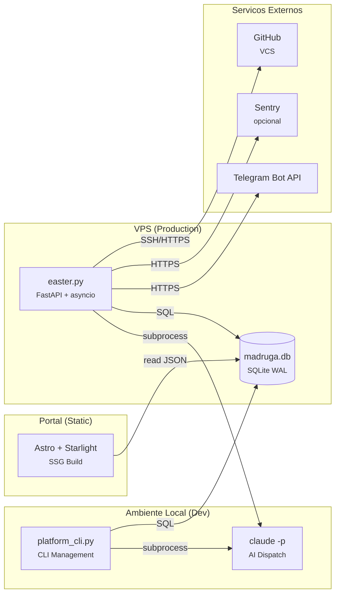

# Madruga AI — Engineering Blueprint

> Decisoes de engenharia, cross-cutting concerns, topologia e NFRs. Derivado dos 20 ADRs e do codebase real (~8,500 LOC Python + ~3,500 LOC portal). Ultima atualizacao: 2026-04-06.

---

## Technology Stack

| Categoria | Escolha | ADR | Alternativas consideradas |
|-----------|---------|-----|---------------------------|
| Linguagem (backend) | Python 3.11+ (stdlib + pyyaml) | ADR-004 | Node.js, Go — Python escolhido por afinidade com Claude Code e simplicidade |
| Linguagem (portal) | TypeScript + React 19 | ADR-003 | Vue, Svelte — React escolhido pelo ecosistema Astro + @xyflow |
| Framework (portal) | Astro 6 + Starlight | ADR-003 | Docusaurus, MkDocs — Starlight por content collections + auto-discovery |
| Banco de dados | SQLite WAL mode | ADR-004, ADR-012 | PostgreSQL, DynamoDB — SQLite por zero-ops e single-writer |
| Diagramas | Mermaid inline em .md | ADR-020 | LikeC4 (superseded), Structurizr — Mermaid por LLM-friendliness |
| Runtime (daemon) | FastAPI + asyncio | ADR-006 | Celery, cron — asyncio por single-process + concurrent I/O |
| Orchestracao AI | claude -p subprocess | ADR-010 | SDK, API client — subprocess por simplicidade + auth via keychain |
| Notificacoes | Telegram Bot API (aiogram) | ADR-018 | WhatsApp/wpp-bridge (superseded ADR-015), Slack — Telegram por inline buttons nativas |
| Observabilidade | structlog + SQLite + Sentry | ADR-016 | OpenTelemetry, Datadog — custom por ~100 LOC e zero dependencias externas |
| Pipeline | Custom DAG executor | ADR-017 | Airflow, Prefect — custom por YAML-driven + claude -p dispatch |
| Templates | Copier >= 9.4 | ADR-002 | Cookiecutter, Yeoman — Copier por `copier update` + `_skip_if_exists` |
| Review AI | 4 personas + Judge | ADR-019 | Debate engine (superseded ADR-007) — Agent tool nativo elimina runtime custom |
| Governanca | Decision gates (1-way/2-way) | ADR-013 | Manual-only, auto-only — hybrid por seguranca + velocidade |

---

## Cross-Cutting Concerns

### Logging & Observabilidade

**Abordagem:** structlog com processadores (timestamps ISO, log level, context vars) no easter daemon. Scripts CLI usam stdlib logging com NDJSONFormatter para CI.

**Metricas:** SQLite tables `traces` + `eval_scores` + `pipeline_runs`. 4 dimensoes de scoring por node: Quality (Q), Adherence (A), Completeness (C), Cost Efficiency (E). Dashboard React com 5 tabs no portal.

**Tracing:** Hierarquico — 1 trace (L1 pipeline ou L2 epic) contém N spans (pipeline_runs). Agregacao automatica via `complete_trace()`.

**Alertas:** Sentry (error tracking, opcional via DSN) + ntfy.sh (push alerts, stdlib urllib).

**Justificativa:** Escala atual (1 operador, ~200 runs) nao justifica OTEL/Grafana. SQLite + custom dashboard cobre 100% dos casos de uso.

### Error Handling

**Abordagem:** Hierarchy tipada de exceptions com validacao em boundaries.

```
MadrugaError (base)
├── ValidationError (input: platform name, paths, DAG fields)
├── PipelineError (DAG structural/execution)
│   ├── DispatchError (skill dispatch via subprocess)
│   └── GateError (gate evaluation)
```

**Retry:** 3 tentativas com backoff `[5, 10, 20]s` + jitter aleatorio (async). Circuit breaker: 5 falhas → 300s recovery → half-open test.

**Justificativa:** Python idiomatico. Exceptions com hierarchy permitem catch granular sem boilerplate de result types.

### Configuracao

**Abordagem:** Environment variables com defaults sensatos. Sem config files externos, sem feature flags.

| Variavel | Default | Proposito |
|----------|---------|-----------|
| MADRUGA_MODE | manual | Gate mode: manual/interactive/auto |
| MADRUGA_EXECUTOR_TIMEOUT | 3000s | Skill execution timeout |
| MADRUGA_MAX_CONCURRENT | 3 | Max concurrent pipeline runs |
| ANTHROPIC_API_KEY | (keychain) | Claude API auth (opcional) |
| MADRUGA_TELEGRAM_BOT_TOKEN | — | Telegram bot auth |
| MADRUGA_SENTRY_DSN | — | Sentry error tracking (opcional) |

**Justificativa:** Single-machine deployment. Env vars cobrem 100% — config files adicionariam complexidade sem beneficio.

### Resiliencia

**Circuit Breaker (ADR-011):** Breakers separados por categoria (epic pipeline vs standalone). 3 estados: closed → open (5 falhas) → half-open (apos 300s). Implementado em dag_executor.py:833-876.

**Retry com backoff:** Exponencial com jitter para dispatch async. Sem retry para gates (humano decide).

**Watchdog:** systemd watchdog via sd_notify.py. Health check periodico no easter daemon.

**Justificativa:** Pipeline depende de subprocess externo (claude -p) — falhas transientes sao esperadas. Circuit breaker previne cascata.

---

## NFRs (Non-Functional Requirements)

| NFR | Target | Metrica | Como Medir |
|-----|--------|---------|------------|
| Disponibilidade (easter) | 99% uptime | Watchdog systemd | sd_notify + journal |
| Latencia (portal) | < 200ms | Time to first byte | Astro SSG (pre-built) |
| Latencia (API) | < 500ms | Response time /api/* | structlog timestamps |
| Throughput | 3 concurrent runs | Max parallel dispatches | MADRUGA_MAX_CONCURRENT |
| Recovery | RTO 5min | Restart time | systemd auto-restart |
| Data retention | 90 dias | cleanup_old_data() | easter.py retention_cleanup |
| DB size | < 100MB | SQLite file size | Monitoracao manual |

---

## Deploy Topology



| Container | Tecnologia | Responsabilidade |
|-----------|-----------|------------------|
| easter.py | FastAPI + asyncio | Daemon 24/7: DAG scheduler, gate poller, API observability |
| platform_cli.py | Python argparse | CLI: scaffold, lint, status, seed |
| dag_executor.py | Python + subprocess | Topological sort, skill dispatch, circuit breaker |
| Portal | Astro + Starlight | SSG: documentacao, dashboards, observabilidade |
| madruga.db | SQLite WAL | State store: platforms, runs, traces, evals, decisions |
| Claude CLI | claude -p | AI execution: skill prompts → outputs |

---

## Data Map

| Store | Tipo | Dados | Tamanho Estimado |
|-------|------|-------|------------------|
| madruga.db | SQLite WAL | Platforms, epics, nodes, runs, traces, evals, decisions, memory | ~5-50MB |
| platforms/*/ | Filesystem (git) | Markdown docs, ADRs, epic artifacts | ~15K linhas .md |
| portal/dist/ | Static files | HTML/JS/CSS gerado por Astro build | ~50MB |
| .claude/commands/ | Filesystem (git) | 30+ skill definitions (markdown) | ~3K linhas |

---

## Riscos Tecnicos

| Risco | Severidade | Mitigacao |
|-------|-----------|-----------|
| dag_executor.py (2,117 LOC) concentra muita responsabilidade | Media | Candidato a decomposicao: separar DAG parsing, dispatch, circuit breaker em modulos |
| Single-writer SQLite limita concorrencia | Baixa | WAL mode + busy_timeout. Escala atual (1 operador) nao estressa |
| Claude CLI como unico mecanismo de dispatch | Media | Se claude -p mudar breaking, todo dispatch quebra. Mitigado por ADR-010 wrappers |

---

## Glossario Tecnico

| Termo | Definicao |
|-------|-----------|
| Easter | Daemon FastAPI 24/7 que orquestra o pipeline autonomamente |
| Gate | Ponto de aprovacao no DAG — human (pausa), auto (continua), 1-way-door (confirmacao por decisao) |
| L1 | Pipeline de fundacao da plataforma (13 nodes: vision → roadmap) |
| L2 | Ciclo de epic (12 nodes: epic-context → roadmap-reassess) |
| Trace | Grupo de execucao (1 L1 pipeline ou 1 L2 epic cycle) contendo N spans |
| Span | Uma execucao individual de skill (pipeline_run) |
| Eval Score | Nota 0-10 em 4 dimensoes: Quality, Adherence, Completeness, Cost Efficiency |
| Circuit Breaker | Padrao de resiliencia: 5 falhas → suspensao 300s → teste de recuperacao |
| Self-ref | Plataforma que opera sobre seu proprio repositorio (epics sequenciais obrigatorios) |
