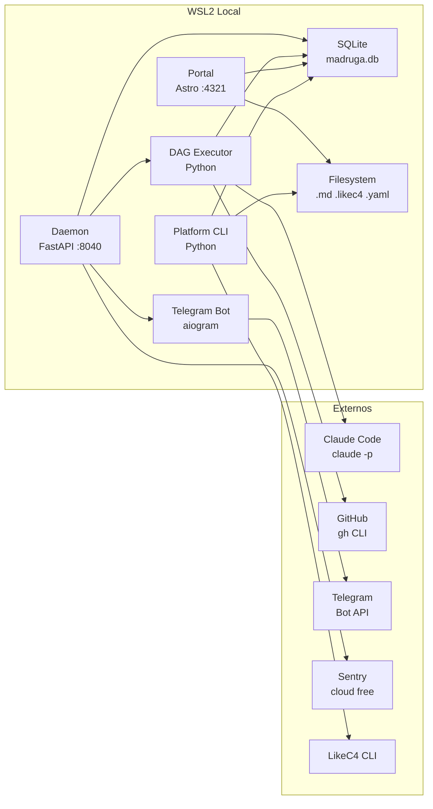

# Blueprint de Engenharia

Referencia tecnica consolidada da plataforma **Madruga AI — Architecture Documentation & Spec-to-Code System**: stack tecnologico, concerns transversais, requisitos de qualidade, topologia de deploy, mapa de dados e glossario.

> **Convencao**: esta pagina consolida o **O QUE** e **COMO**. Para o **POR QUE** de cada decisao, consulte os [ADRs](../decisions/).

---

## 0. Technology Stack

| Categoria | Escolha | ADR |
|-----------|---------|-----|
| Interface com Claude | `claude -p` subprocess (headless mode, subscription auth) | ADR-010 |
| Notificacoes | Telegram Bot API (aiogram, outbound HTTPS) | ADR-018 |
| Observabilidade | structlog + SQLite metrics + Sentry free tier | ADR-016 |
| Automacao do pipeline | Custom DAG Executor (YAML-driven, ~500-800 LOC) | ADR-017 |
| Storage | SQLite WAL mode (state store) + filesystem (artefatos) | ADR-012 |
| Portal | Astro + Starlight + LikeC4 React | ADR-003 |
| Modelos de arquitetura | LikeC4 (.likec4 files) | ADR-001 |
| Template system | Copier (scaffolding de plataformas) | ADR-002 |
| Decision gates | 1-way/2-way door classification | ADR-013 |
| Debate engine | Subagent Paralelo + Judge Pattern (3 personas + 1 juiz) | ADR-019 |
| Circuit breaker | Suspende claude -p apos 5 falhas, recovery em 5min | ADR-011 |

---

## 1. Concerns Transversais

### 1.1 Autenticacao & Autorizacao

N/A — sistema local, single-operator. Autenticacao delegada ao Claude Code (subscription auth gerenciada pelo CLI).

### 1.2 Seguranca & Safety

| Camada | Mecanismo | ADR |
|--------|-----------|-----|
| Subprocess isolation | `claude -p` roda em env limpo (CLAUDECODE unset, temp config dir) | ADR-010 |
| Tool allowlist | `--allowedTools` explicito em toda call (Builder: Read,Write,Edit,Bash; Actions: whitelist configuravel) | ADR-010 |
| Circuit breaker | Suspende chamadas apos 5 falhas consecutivas, recovery em 5min. Breakers separados para epics/actions. | ADR-011 |
| Telegram Bot security | Outbound HTTPS only, bot token em .env, sem porta inbound | ADR-018 |
| Action security | cwd whitelist (so repos configurados), tools allowlist, prompt length cap (10K chars) | — |
| Secrets | API keys gerenciadas pelo Claude Code CLI. `.env` no `.gitignore`. Nenhum secret no repo. | — |

### 1.3 Observabilidade

| Camada | Ferramenta | Papel | ADR |
|--------|------------|-------|-----|
| Logging | structlog | Logs estruturados (JSON) em todos os modulos | ADR-016 |
| Metricas | SQLite metrics table | Request duration, status codes, error rates, pipeline throughput | ADR-016 |
| Error tracking | Sentry cloud free tier | Stack traces com breadcrumbs, performance traces, auto-instrumenta FastAPI | ADR-016 |
| Dashboard | Portal Astro + CLI `status` | Pipeline status visual (L1 + L2), Mermaid DAG, filtros por plataforma | — |

### 1.4 Error Handling

| Cenario | Estrategia | Fallback |
|---------|------------|----------|
| Claude -p timeout | Watchdog timer com SIGKILL. Retry 3x com backoff exponencial (5s, 10s, 20s) | Fase marcada `failed`, epic fica `blocked` |
| Claude -p rate limit | Circuit breaker abre apos 5 falhas, recovery em 300s | Pipeline pausado, slot liberado |
| Claude -p hang (stream-json bug) | Usar `--output-format json` (evita bug). Watchdog SIGKILL como safety net | Re-executar node |
| Telegram Bot unreachable | Health check cada 60s (getMe). Apos 3 falhas: modo log-only, human gates pausam | Fallback ntfy.sh (opcional). Retoma automatico quando Telegram volta |
| DAG executor node failure | SQLite checkpoint apos cada node completo. Resume retoma do ultimo checkpoint | Perda maxima: re-executar 1 node |
| Human gate timeout | Timeout configuravel (default 24h). Notifica via Telegram. Epic fica `waiting_approval` | Operador aprova via CLI ou Telegram |
| LikeC4 compilation error | Build abortado com mensagem descritiva | Artefatos nao atualizados, warning no log |
| SQLite write lock | busy_timeout=5000ms (WAL mode) | Leituras concorrentes ok, writes serializados |
| GitHub API 429 | Backoff exponencial automatico, retry ate 3x | Fase falha, epic bloqueado |

### 1.5 Configuration

| Tipo | Mecanismo | Exemplo |
|------|-----------|---------|
| Platform manifest | `platform.yaml` (YAML, versionado) | Nome, lifecycle, views, pipeline nodes, repo binding |
| App config | `config.yaml` (YAML, versionado) | Repos, throttle, daemon slots, implement timeouts |
| Env vars | `.env` (pydantic-settings, prefix MADRUGA_) | Paths, ports, log level, Telegram bot token, chat ID |
| Pipeline DAG | `platform.yaml > pipeline.nodes` (YAML, versionado) | Node IDs, depends, gates, skills, outputs |

---

## 2. Qualidade & NFRs

| # | Cenario | Metrica | Target | Mecanismo | Prioridade |
|---|---------|---------|--------|-----------|------------|
| Q1 | Portal build time | Tempo de SSG build | < 30s | Astro static build | Alta |
| Q2 | Storage ops | Overhead operacional | Zero (sem servidor) | SQLite WAL mode, file-based | Alta |
| Q3 | Extensibilidade | Plataformas suportadas | N ilimitado | Copier template + auto-discovery | Alta |
| Q4 | Idempotencia | Skills re-executaveis | Sem side effects em re-run | Check de pre-condicoes + overwrite | Media |
| Q5 | Versionamento | Tudo em Git | 100% artefatos versionados | Filesystem-first, zero lock-in | Alta |
| Q6 | Concorrencia SQLite | Writers paralelos | Sem SQLITE_BUSY | WAL mode + busy_timeout=5000ms | Media |
| Q7 | HMR dev experience | Editar .md/.likec4 e ver resultado | < 2s hot reload | Vite watch + symlinks + LikeC4 plugin | Media |
| Q8 | DAG resume | Tempo de retomada apos pausa/crash | < 5s | SQLite checkpoint por node, resume CLI | Media |
| Q9 | Claude -p concorrencia | Sessions simultaneas estaveis | Max 3 paralelas | Semaforo asyncio | Media |

---

## 3. Deploy & Infraestrutura

### 3.1 Topologia

| Componente | Runtime | Porta/Protocolo | Scaling |
|------------|---------|-----------------|---------|
| Portal (Astro + Starlight) | Node.js 20+ | :4321 (dev) / SSG | Single instance |
| Daemon (FastAPI + uvicorn) | Python 3.12+ | :8040 | Single instance |
| DAG Executor | Python 3.12+ | Lib (invocado pelo daemon) | Single instance |
| Telegram Bot (aiogram) | Python 3.12+ (integrado ao daemon) | HTTPS outbound | Single instance |
| Platform CLI | Python 3.12+ | CLI | N/A |
| SQLite BD | SQLite 3 WAL mode | File (.pipeline/madruga.db) | Single writer, N readers |
| LikeC4 serve | Node.js (likec4 CLI) | :5173 (dev) | Single instance |
| Claude Code | CLI | Subprocess | Max 3 concorrentes |
| Sentry | SaaS | HTTPS | N/A |

### 3.2 Ambientes

| Ambiente | Finalidade | Infra |
|----------|------------|-------|
| local | Desenvolvimento + producao | WSL2 Ubuntu, systemd service |

### 3.3 CI/CD

| Etapa | Ferramenta | Gate |
|-------|------------|------|
| Lint Python | ruff | Zero warnings |
| Testes | pytest (135 testes) | 100% pass |
| Portal build | `npm run build` | Build sem erros |
| Template tests | pytest (.specify/templates/) | 100% pass |
| Platform lint | `platform_cli.py lint --all` | Estrutura valida |

---

## 4. Mapa de Dados & Privacidade

### 4.1 Stores

| Store | Tipo | Dados | Tamanho estimado |
|-------|------|-------|------------------|
| SQLite (madruga.db) | Relacional | Pipeline state, epics, decisions, memory, provenance, metrics | < 50MB |
| Filesystem | Arquivos | .md, .yaml, .likec4, .jinja | ~10MB por plataforma |
| Git | VCS | Historico completo | Depende do repo |
| Sentry | SaaS | Error events, performance traces | Free tier: 5K erros/mes |

### 4.2 Privacidade

N/A — sistema nao processa dados pessoais. Artefatos sao documentacao tecnica. SQLite armazena metadata operacional.

---

## 5. Glossario

| Termo | Definicao | Dominio |
|-------|-----------|---------|
| Platform | Unidade central de documentacao em `platforms/<name>/` | Core |
| Vision | Conjunto de artefatos de arquitetura de uma plataforma | Core |
| Epic | Folder autocontido `epics/NNN-slug/` com progressao pitch→spec→plan→tasks | Planning |
| Skill | Comando Claude Code em `.claude/commands/` | Tooling |
| SpeckitBridge | Compositor de skills interativas em prompts autonomos | Runtime |
| DAG Executor | Modulo que le pipeline DAG do platform.yaml e executa nodes via claude -p | Runtime |
| RECONCILE | Loop que compara diff vs arquitetura e auto-atualiza Vision | Runtime |
| AUTO marker | Marcador `<!-- AUTO:name -->` para conteudo auto-gerado | Pipeline |
| Drift score | Metrica 0.0-1.0 de divergencia implementacao vs arquitetura | Runtime |
| 1-way door | Decisao irreversivel que requer aprovacao humana | Decisions |
| 2-way door | Decisao reversivel, auto-aprovavel pelo daemon | Decisions |
| Constitution | Documento com regras que governam artefatos gerados | Governance |
