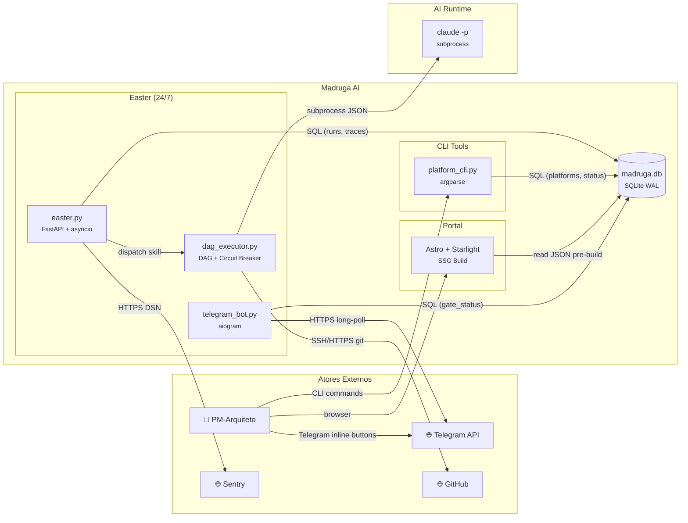

# Madruga AI — Container Architecture (C4 Level 2)

> Decomposicao em containers com responsabilidades, tecnologias e protocolos. Monolito modular — todos os modulos Python rodam no mesmo processo. Ultima atualizacao: 2026-04-06.
>
> BCs e aggregates → ver [domain-model.md](../domain-model/) · Integracoes externas → ver [integrations.md](../integrations/)

---

## Container Diagram

---

## Container Matrix

| # | Container | BC(s) | Tecnologia | Responsabilidade | Protocol In | Protocol Out |
|---|-----------|-------|------------|------------------|-------------|-------------|
| 1 | **Easter** | Orchestration, Notifications | FastAPI + asyncio + aiogram | Runtime 24/7: DAG scheduler, gate poller, health check, API observability | — (easter autonomo) | subprocess, SQL, HTTPS |
| 2 | **DAG Executor** | Orchestration | Python (modulo importado) | Topological sort, phase-based dispatch (agrupa implement tasks por phase com --max-turns dinamico), same-error circuit breaker (classifica deterministic/transient/unknown), retry | Chamado por Easter/CLI | subprocess (claude -p), SQL |
| 3 | **Platform CLI** | State (interface) | Python argparse | Scaffold, lint, status, seed, register — interface humana sobre Pipeline State | CLI commands | SQL |
| 4 | **Portal** | Apresentacao | Astro 6 + Starlight + React | SSG: documentacao navegavel, dashboards, observability tabs | browser HTTP | read JSON (pre-build) |
| 5 | **madruga.db** | State, Observability, Decision | SQLite WAL 3.35+ | Persistencia: 15 tabelas + 2 FTS5 (platforms, runs, traces, evals, decisions, memory, commits) | SQL | — |
| 6 | **Claude CLI** | Orchestration (externo) | claude -p subprocess | Execucao de skills: recebe prompt, retorna JSON com tokens/cost/output | subprocess + JSON | — |

---

## Communication Protocols

| De | Para | Protocolo | Padrao | Justificativa |
|----|------|-----------|--------|---------------|
| Easter | DAG Executor | Import Python | sync (in-process) | Monolito modular — mesmo processo |
| DAG Executor | Claude CLI | subprocess + JSON stdout | sync (blocking) | ADR-010: claude -p com --output-format json |
| Easter | madruga.db | SQL via sqlite3 stdlib | sync (WAL) | ADR-012: WAL mode, busy_timeout=5000ms |
| Easter (TBot) | Telegram API | HTTPS long-polling | async (aiogram) | ADR-018: inline keyboards para gates |
| Easter | Sentry | HTTPS SDK | async (fire-and-forget) | ADR-016: opcional via DSN |
| DAG Executor | GitHub | SSH/HTTPS git | sync (subprocess) | Clone/fetch repos externos. Branch checkout (default) ou worktree (opt-in) |
| CLI | madruga.db | SQL via sqlite3 stdlib | sync | Mesmo DB, processos diferentes (single-writer WAL) |
| Portal (build) | madruga.db | JSON pre-build | offline (pre-build script) | `npm run prestatus` gera pipeline-status.json antes do build |

---

## Scaling Strategy

| Container | Estrategia | Trigger | Notas |
|-----------|-----------|---------|-------|
| Easter | Vertical (single-process) | N/A — easter autonomo | systemd auto-restart |
| DAG Executor | Nenhum | N/A — sequencial para self-ref | Max 1 dispatch por vez |
| Platform CLI | Nenhum | N/A — on-demand | — |
| Portal | CDN (futuro) | N/A — SSG static files | — |
| madruga.db | Vertical (single file) | N/A — SQLite WAL | busy_timeout=5000ms |
| Claude CLI | Nenhum | Max 3 concurrent (semaforo) | Depende de Anthropic API |

> NFRs globais e targets mensuraveis → ver [blueprint.md](../blueprint/)

---

## Premissas e Decisoes

| # | Decisao | Alternativas Consideradas | Justificativa |
|---|---------|---------------------------|---------------|
| 1 | Monolito modular (todos modulos no mesmo processo) | Microservices (1 container por BC) — rejeitado: single-developer, zero justificativa de escala | Simplicidade: 1 deploy, 1 DB, zero network overhead |
| 2 | SQLite como unico store (compartilhado entre BCs) | PostgreSQL separado — rejeitado: overhead de ops para ~200 runs | ADR-004 + ADR-012: zero-ops, WAL suficiente |
| 3 | Portal como SSG (pre-build, nao SSR) | SSR com API routes — rejeitado: portal nao precisa de dados real-time, pre-build suficiente | Astro SSG = zero runtime, hosting simples |
| 4 | Claude CLI como processo externo (nao SDK) | Anthropic SDK direto — rejeitado: claude -p integra auth/keychain automaticamente | ADR-010: subprocess mais simples que gerenciar SDK auth |
| 5 | Easter como unico processo (scheduler + API + notifications) | 3 processos separados — rejeitado: complexidade operacional desnecessaria | Single-process asyncio cobre todos os casos |
