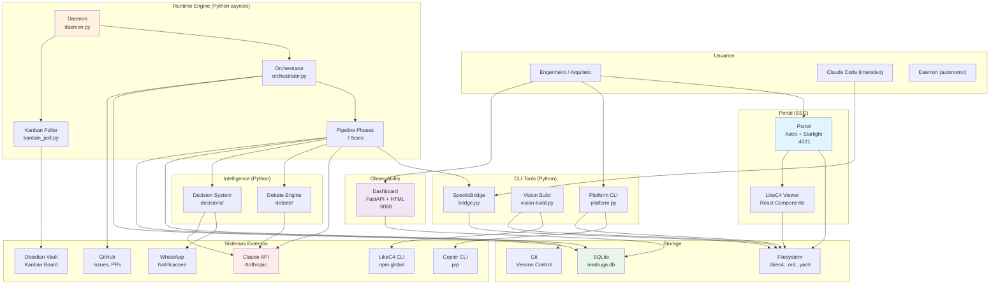

# C4 L2 — Containers

Visao de containers (unidades deployaveis) do Madruga AI. O sistema combina um portal de documentacao SSG, ferramentas CLI em Python, um runtime engine asyncio, e integracoes com sistemas externos (Claude API, Obsidian, GitHub, WhatsApp).

## Diagrama

<!-- AUTO:containers -->
| # | Container | Tecnologia | Responsabilidade | Porta |
|---|-----------|-----------|------------------|-------|
| 1 | **Portal** | Astro + Starlight + LikeC4 React | Site SSG de documentacao de arquitetura com diagramas interativos; auto-descobre todas as plataformas | :4321 |
| 2 | **Platform CLI** | Python (platform.py) | Gerencia plataformas: new, lint, sync, register, list | CLI |
| 3 | **Vision Build** | Python (vision-build.py) | Exporta LikeC4 JSON e popula tabelas AUTO em markdown | CLI |
| 4 | **SpecKit Skills** | Markdown (.claude/commands/) | 13 skills (4 madruga + 9 speckit) consumidos interativamente pelo Claude Code | Claude Code |
| 5 | **SpeckitBridge** | Python (speckit/bridge.py) | Compositor que le skills/templates/constituicao e transforma skills interativos em prompts autonomos | Lib |
| 6 | **Daemon** | Python asyncio (daemon.py) | Processo 24/7 que orquestra execucao autonoma do pipeline | Background |
| 7 | **Orchestrator** | Python asyncio (orchestrator.py) | Gerencia ciclo de vida de epics e avanco de fases | Lib |
| 8 | **Kanban Poller** | Python (kanban_poll.py) | Polling do kanban Obsidian a cada 60s para detectar mudancas | Background |
| 9 | **Pipeline Phases** | Python (7 modulos) | Executores das fases: specify, plan, tasks, implement, persona_interview, review, vision | Lib |
| 10 | **Debate Engine** | Python (debate/) | Debates multi-persona com convergencia para decisoes complexas | Lib |
| 11 | **Decision System** | Python (decisions/) | Classificador 1-way/2-way door com gates de aprovacao | Lib |
| 12 | **Memory Store** | SQLite (madruga.db) | Persistencia de epics, patterns, learning, persona accuracy | File |
| 13 | **Dashboard** | FastAPI + HTML | Dashboard web de status e metricas do pipeline | :8080 |
| 14 | **Copier Templates** | Jinja2 + YAML | Scaffolding de novas plataformas com estrutura padrao | CLI |
<!-- /AUTO:containers -->

## Requisitos Nao-Funcionais

| NFR | Target | Mecanismo | Container |
|-----|--------|-----------|-----------|
| **Disponibilidade** | 24/7 (daemon) | asyncio event loop com health check | Daemon |
| **Latencia de polling** | < 60s deteccao | Polling interval configuravel | Kanban Poller |
| **Resiliencia** | 3 retries por fase | Retry com backoff + marcacao `blocked` | Orchestrator |
| **Build time** | < 30s (portal SSG) | Astro static build + symlinks | Portal |
| **Storage** | Zero ops | SQLite file-based, sem servidor | Memory Store |
| **Observabilidade** | Health em < 500ms | FastAPI endpoint dedicado | Dashboard |
| **Isolamento** | ACL por integracao | Anti-Corruption Layer pattern | Todas integracoes |
| **Idempotencia** | Fases re-executaveis | Check de pre-condicoes + context acumulado | Pipeline Phases |
| **Extensibilidade** | N plataformas | Copier template + auto-discovery | Portal, Platform CLI |
| **Versionamento** | Tudo em Git | Filesystem-first, zero lock-in | Todos |
