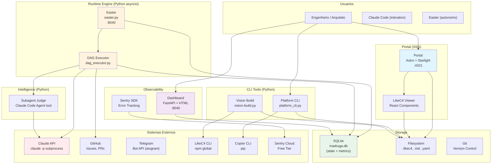

# C4 L2 — Containers

Visao de containers (unidades deployaveis) do Madruga AI. O sistema combina um portal de documentacao SSG, ferramentas CLI em Python, um runtime engine asyncio com DAG executor, e integracoes com sistemas externos (Claude API, GitHub, Telegram).

## Diagrama

<!-- AUTO:containers -->
| # | Container | Tecnologia | Responsabilidade | Porta |
|---|-----------|-----------|------------------|-------|
| 1 | **Portal** | Astro + Starlight + LikeC4 React | Site SSG de documentacao de arquitetura com diagramas interativos; auto-descobre todas as plataformas | :4321 |
| 2 | **Platform CLI** | Python (platform_cli.py) | Gerencia plataformas: new, lint, sync, register, status, import/export | CLI |
| 3 | **Vision Build** | Python (vision-build.py) | Exporta LikeC4 JSON e popula tabelas AUTO em markdown | CLI |
| 4 | **SpecKit Skills** | Markdown (.claude/commands/) | 24 skills consumidos interativamente pelo Claude Code ou autonomamente pelo easter | Claude Code |
| 5 | **Easter** | Python asyncio (easter.py) + FastAPI | Processo 24/7 que orquestra execucao autonoma do pipeline. DAG scheduler, Telegram polling, health checks, gate poller. Endpoints /health + /status | :8040 |
| 6 | **DAG Executor** | Python (dag_executor.py) | Le pipeline DAG de platform.yaml, resolve dependencias (topological sort), despacha nodes via claude -p, gerencia human gates (3 modos: manual/interactive/auto via MADRUGA_MODE), retry com circuit breaker | Lib |
| 7 | **Subagent Judge** | Python + Claude Code Agent tool | Subagent Paralelo + Judge Pattern (ADR-019): 4 personas (Architecture Reviewer, Bug Hunter, Simplifier, Stress Tester) + 1 juiz que filtra por Accuracy/Actionability/Severity. Output: BLOCKER/WARNING/NIT | Lib |
| 8 | **State Store** | SQLite WAL (madruga.db) | Persistencia de pipeline state, epics, decisions, memory, provenance, metrics | File |
| 9 | **Dashboard** | FastAPI + HTML | Dashboard web de status, metricas, e pipeline progress | :8040 |
| 10 | **Copier Templates** | Jinja2 + YAML | Scaffolding de novas plataformas com estrutura padrao | CLI |
| 11 | **Telegram Adapter** | Python (aiogram) | Adapter para Telegram Bot API (ADR-018) — send, ask_choice (inline buttons), alert, gate approvals | HTTPS outbound |
<!-- /AUTO:containers -->

## Requisitos Nao-Funcionais

| NFR | Target | Mecanismo | Container |
|-----|--------|-----------|-----------|
| **Disponibilidade** | 24/7 (easter) | asyncio event loop com health check | Easter |
| **Resiliencia** | 3 retries por fase | Retry com backoff + marcacao `blocked` | DAG Executor |
| **DAG resume** | < 5s retomada | SQLite checkpoint por node, resume CLI | DAG Executor |
| **Build time** | < 30s (portal SSG) | Astro static build + symlinks | Portal |
| **Storage** | Zero ops | SQLite file-based, sem servidor | State Store |
| **Observabilidade** | Health em < 500ms | FastAPI endpoint dedicado | Dashboard |
| **Isolamento** | ACL por integracao | Anti-Corruption Layer pattern | Todas integracoes |
| **Idempotencia** | Fases re-executaveis | Check de pre-condicoes + context acumulado | DAG Executor |
| **Extensibilidade** | N plataformas | Copier template + auto-discovery | Portal, Platform CLI |
| **Versionamento** | Tudo em Git | Filesystem-first, zero lock-in | Todos |
| **Concorrencia** | Max 3 claude -p | Semaforo asyncio | DAG Executor |
