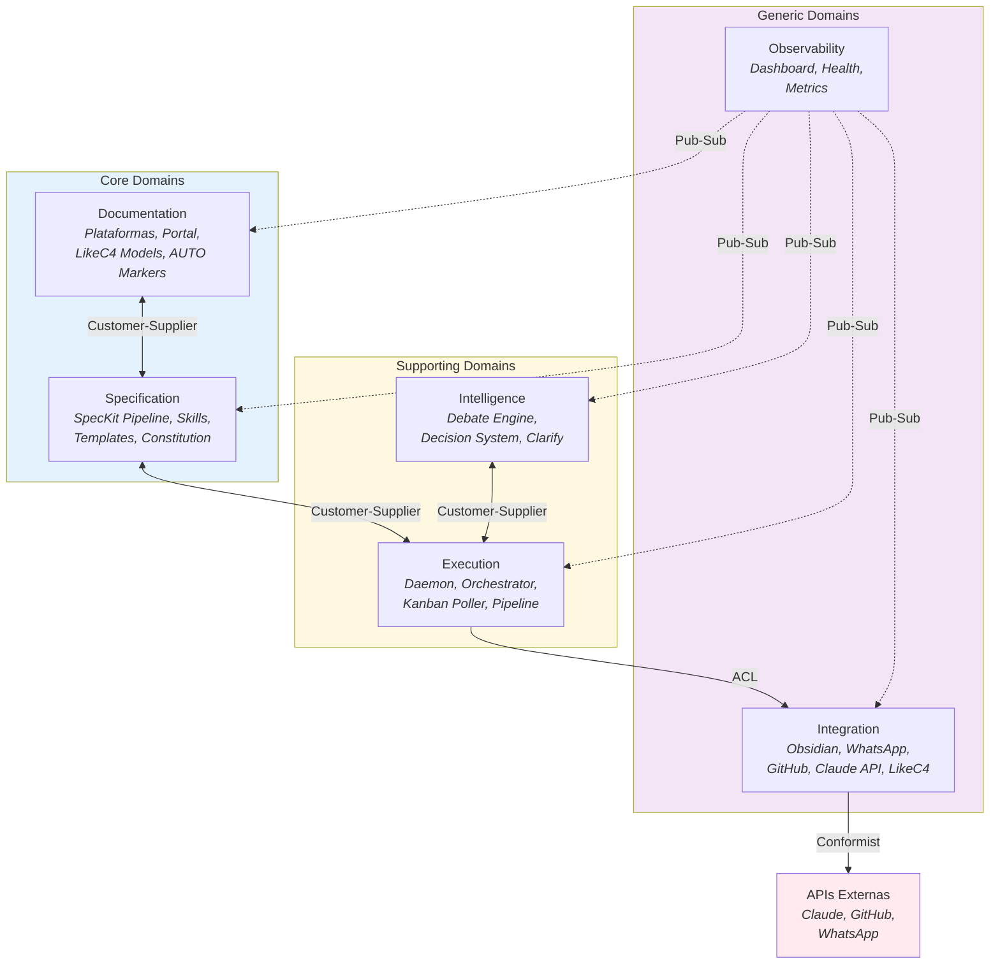

# Context Map (DDD Estrategico)

Mapa de dominios do Madruga AI seguindo Domain-Driven Design estrategico. O sistema e composto por 6 bounded contexts: 2 core (Documentation, Specification), 2 supporting (Execution, Intelligence), e 2 generic (Integration, Observability).

## Mapa de Dominios

<!-- AUTO:domains -->
| # | Dominio | Tipo | Modulos | Responsabilidade |
|---|---------|------|---------|------------------|
| 1 | **Documentation** | Core | Portal, Platform CLI, Vision Build, LikeC4 Models | Gerencia plataformas documentadas, portal SSG, modelos de arquitetura e populacao automatica de tabelas via AUTO markers |
| 2 | **Specification** | Core | SpecKit Skills, SpeckitBridge, Copier Templates | Pipeline de especificacao (specify -> plan -> tasks -> implement), composicao de prompts, scaffolding de plataformas |
| 3 | **Execution** | Supporting | Daemon, Orchestrator, Kanban Poller, Pipeline Phases | Execucao autonoma 24/7: daemon asyncio, orquestracao de epics, polling do kanban, execucao das 7 fases |
| 4 | **Intelligence** | Supporting | Debate Engine, Decision System, Clarify Engine | Debates multi-persona com convergencia, classificacao 1-way/2-way door, gates de aprovacao, stress testing |
| 5 | **Integration** | Generic | Obsidian Bridge, WhatsApp Bridge, GitHub Client, Claude API Client, LikeC4 CLI | ACL para sistemas externos — isola contratos externos do dominio interno |
| 6 | **Observability** | Generic | Dashboard, Health Checks, Metrics | Visibilidade operacional: dashboard FastAPI, health checks, metricas de pipeline |
<!-- /AUTO:domains -->

## Relacoes entre dominios

<!-- AUTO:relations -->
| # | Upstream | Downstream | Padrao | Descricao |
|---|----------|------------|--------|-----------|
| 1 | **Documentation** | **Specification** | Customer-Supplier | Specification consome contexto de visao e modelo de arquitetura de Documentation para gerar specs |
| 2 | **Specification** | **Execution** | Customer-Supplier | Execution consome specs, plans e tasks gerados por Specification para executar o pipeline |
| 3 | **Execution** | **Integration** | ACL (Anti-Corruption Layer) | Execution acessa sistemas externos via ACL — contratos externos nao vazam para o dominio |
| 4 | **Intelligence** | **Execution** | Customer-Supplier | Debate Engine e Decision System servem Execution com analises e decisoes durante fases do pipeline |
| 5 | **Observability** | **Todos** | Pub-Sub (fire-and-forget) | Observability subscreve eventos de todos os contextos sem acoplamento — falha silenciosa |
| 6 | **Integration** | **APIs Externas** | Conformist | Integration conforma-se aos contratos de Claude API, GitHub API, WhatsApp API e LikeC4 CLI |
<!-- /AUTO:relations -->

## Integracoes externas (ACL)

| Sistema | Protocolo | Direcao | Responsavel |
|---------|-----------|---------|-------------|
| **Claude API** | `claude -p` subprocess | Madruga -> Claude | Integration.ClaudeAPIClient |
| **Obsidian Vault** | Filesystem read/write | Bidirecional | Integration.ObsidianBridge |
| **GitHub** | `gh` CLI / REST API | Madruga -> GitHub | Integration.GitHubClient |
| **WhatsApp** | HTTP API | Madruga -> WhatsApp | Integration.WhatsAppBridge |
| **LikeC4 CLI** | Subprocess (`likec4`) | Madruga -> LikeC4 | Integration.LikeC4CLI |
| **Copier CLI** | Subprocess (`copier`) | Madruga -> Copier | Specification.CopierTemplate |

## Decisoes Estrategicas

### Por que Documentation e Specification sao Core?

Estes dois dominios capturam a **proposta de valor unica** do Madruga AI: documentar arquitetura de forma viva (Documentation) e transformar especificacoes em codigo via pipeline estruturado (Specification). Sem eles, o sistema nao tem razao de existir.

### Por que ACL entre Execution e Integration?

Sistemas externos mudam seus contratos sem aviso. A Anti-Corruption Layer garante que mudancas no Claude API, GitHub API ou formato do kanban Obsidian **nao propagam** para a logica de orquestracao. Cada bridge traduz formatos externos para modelos internos.

### Por que Observability e fire-and-forget?

O dashboard e metricas **nunca** devem bloquear a execucao do pipeline. Se o dashboard cair, o daemon continua operando normalmente. A relacao pub-sub garante desacoplamento total.
