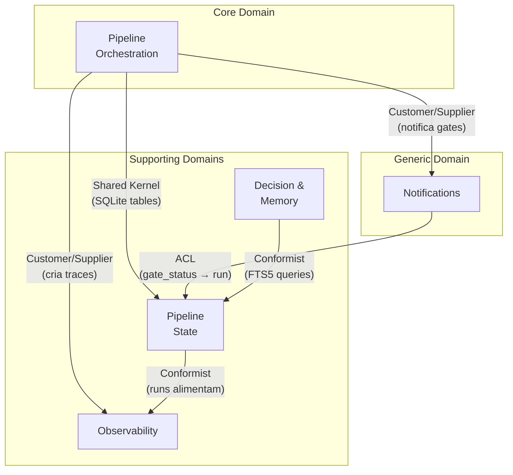

# Madruga AI — Context Map

> Relacionamentos entre bounded contexts com padroes DDD explicitos. Monolito modular com SQLite compartilhado. Ultima atualizacao: 2026-04-06.
>
> Definicoes dos BCs → ver [domain-model.md](../domain-model/) · NFRs e stack → ver [blueprint.md](../blueprint/)

---

## Context Diagram

---

## Relationship Table

| # | Upstream | Downstream | Padrao | Direcao | Justificativa |
|---|----------|-----------|--------|---------|---------------|
| 1 | **Pipeline Orchestration** | **Pipeline State** | Shared Kernel | PO → PS | Compartilham SQLite (pipeline_runs, epic_nodes). Orchestration grava runs, State persiste. Shared Kernel justificado: ambos evoluem juntos e pertencem ao mesmo deploy. |
| 2 | **Pipeline Orchestration** | **Observability** | Customer/Supplier | PO → OBS | Orchestration cria traces e completa spans. Observability adapta-se ao formato que Orchestration produz (tokens, cost, duration). |
| 3 | **Pipeline Orchestration** | **Notifications** | Customer/Supplier | PO → NT | Orchestration solicita notificacao de gates. Notifications adapta a mensagem (Telegram inline keyboard) ao que Orchestration precisa. |
| 4 | **Notifications** | **Pipeline State** | ACL | NT → PS | Notifications traduz callback do Telegram (approve/reject) para gate_status update no modelo de Pipeline State. ACL necessario: modelo do Telegram (callback_query, message_id) e diferente do modelo de State (run_id, gate_status). |
| 5 | **Pipeline State** | **Observability** | Conformist | PS → OBS | Observability consome pipeline_runs como spans para agregar em traces. Adota o modelo de State sem tradução — conformist porque State e estavel e simples. |
| 6 | **Decision & Memory** | **Pipeline State** | Conformist | DM → PS | Decision & Memory consulta platforms e epics via SQL direto. Adota o modelo de State (platform_id, epic_id) — conformist porque Decision nao tem poder de negociacao sobre o schema de State. |

---

## Classificacao de Dominios

| Tipo | Bounded Context | Justificativa |
|------|----------------|---------------|
| **Core** | Pipeline Orchestration | Diferencial competitivo — DAG executor + skill dispatch e o que torna o sistema unico |
| **Supporting** | Pipeline State | Necessario mas nao diferenciador — CRUD de platforms/epics/runs |
| **Supporting** | Observability | Necessario para operacao mas poderia ser substituido por ferramenta externa |
| **Supporting** | Decision & Memory | ADRs e memory sao valiosos mas o mecanismo de storage nao e diferenciador |
| **Generic** | Notifications | Commodity — Telegram/ntfy sao canais substituiveis |

---

## Padroes Utilizados

| Padrao | Descricao | Quando Usar | Usado Em |
|--------|-----------|-------------|----------|
| **Shared Kernel** | Codigo/schema compartilhado entre contextos que evoluem juntos | Quando 2 contextos estao no mesmo deploy e mudam juntos | PO ↔ PS (SQLite tables) |
| **Customer/Supplier** | Upstream adapta-se ao que downstream precisa | Quando downstream tem poder de negociacao | PO → OBS, PO → NT |
| **ACL** | Traduz modelo externo para modelo interno | Quando upstream tem modelo diferente | NT → PS (Telegram → gate_status) |
| **Conformist** | Downstream adota modelo do upstream sem tradução | Quando upstream e estavel e confiavel | PS → OBS, DM → PS |

---

## Anti-Padroes Monitorados

| Anti-Padrao | Risco | Como Detectar | Status |
|------------|-------|---------------|--------|
| Big Ball of Mud | Sem boundaries claros | Todos os contextos comunicam com todos | OK — 6 relacoes, nao N² |
| Shared Kernel excessivo | Acoplamento forte | >2 contextos compartilhando kernel | OK — apenas PO↔PS (justificado pelo monolito) |
| God Context | 1 contexto faz tudo | Contexto com >5 aggregates | ATENCAO — Pipeline Orchestration (dag_executor 2,117 LOC) e candidato a decomposicao |
| Contexto isolado | Contexto sem relacoes | Nenhum no mapa | OK — todos os 5 BCs tem pelo menos 1 relacao |

---

## Premissas e Decisoes

| # | Decisao | Alternativas Consideradas | Justificativa |
|---|---------|---------------------------|---------------|
| 1 | Shared Kernel entre PO e PS (nao ACL) | ACL com interface formal — rejeitado: overhead desnecessario no monolito | Mesmo processo, mesmo deploy, evoluem juntos. Shared Kernel e o padrao correto para monolito modular |
| 2 | Conformist (nao ACL) para PS → OBS | ACL com traducao — rejeitado: modelo de runs ja e o que Observability precisa | Observability consome runs as-is. Traduzir seria complexidade artificial |
| 3 | ACL para NT → PS (nao Conformist) | Conformist — rejeitado: modelo do Telegram (callback_query) e fundamentalmente diferente de pipeline_runs | Traducao necessaria: Telegram fala em message_id/callback_data, State fala em run_id/gate_status |

| # | Premissa | Status |
|---|---------|--------|
| 1 | SQLite compartilhado e aceitavel como Shared Kernel entre PO e PS | Confirmado — ADR-004, ADR-012 |
| 2 | Se o sistema escalar para multi-process, Shared Kernel PO↔PS precisara virar ACL | [VALIDAR] — relevante apenas se sair do monolito |
