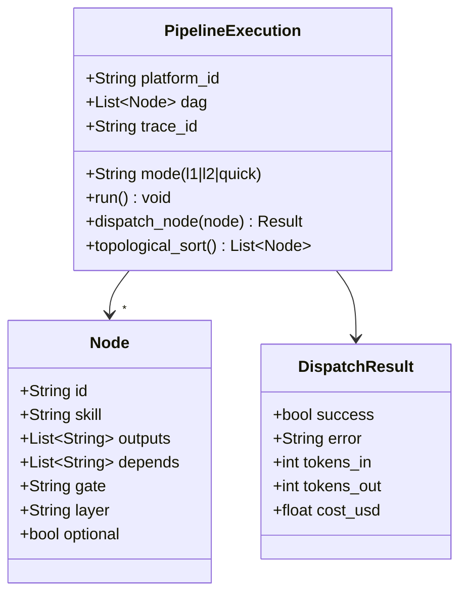
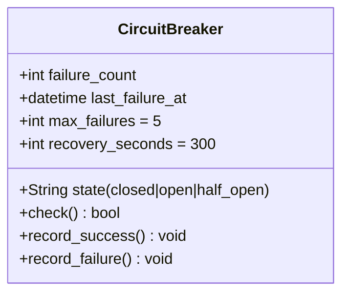
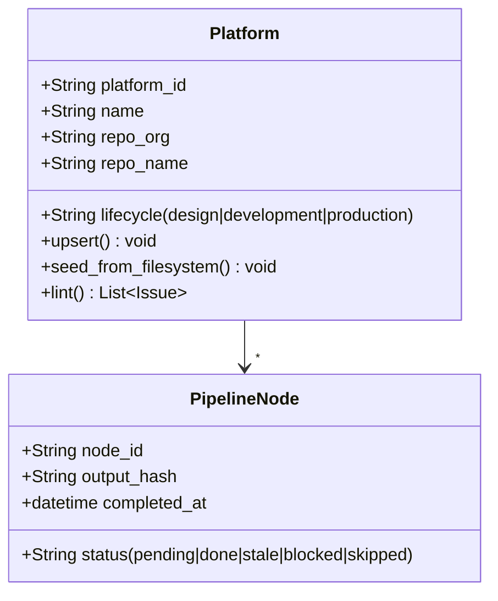
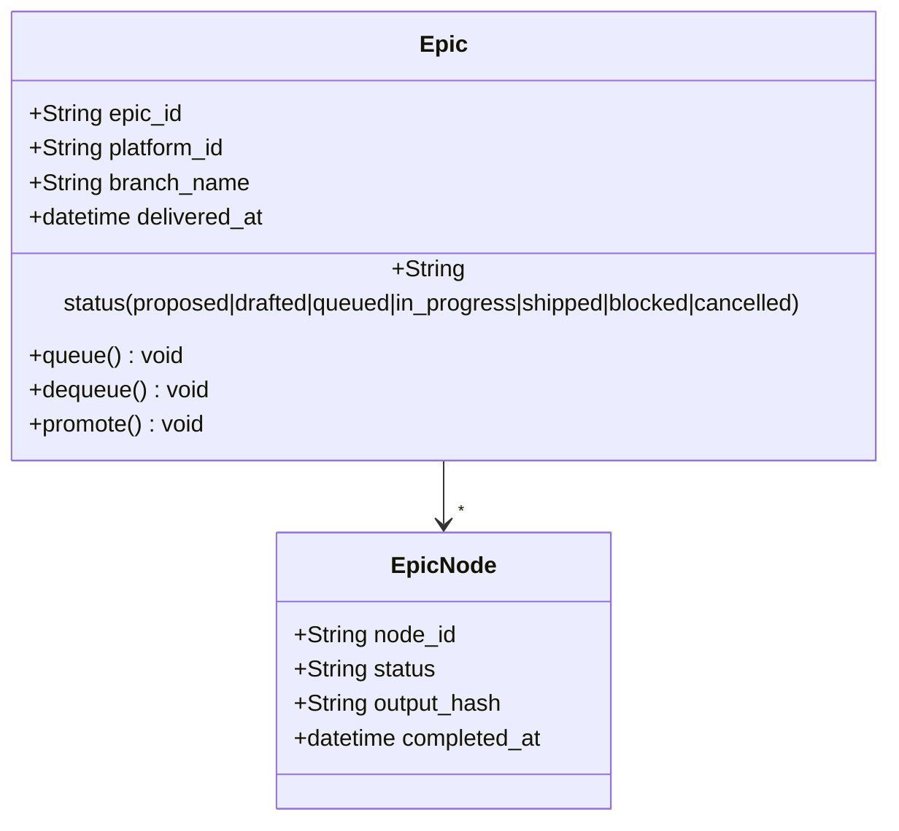
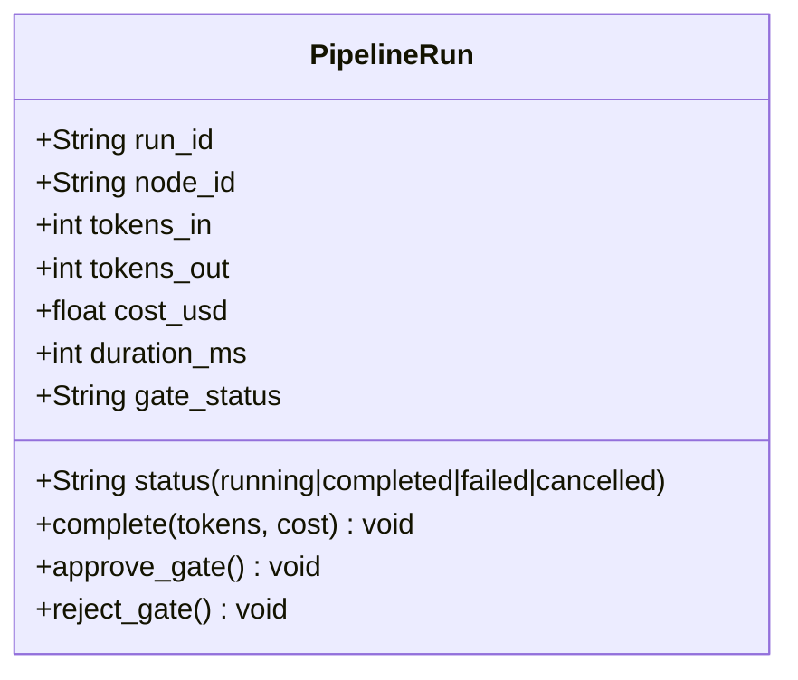
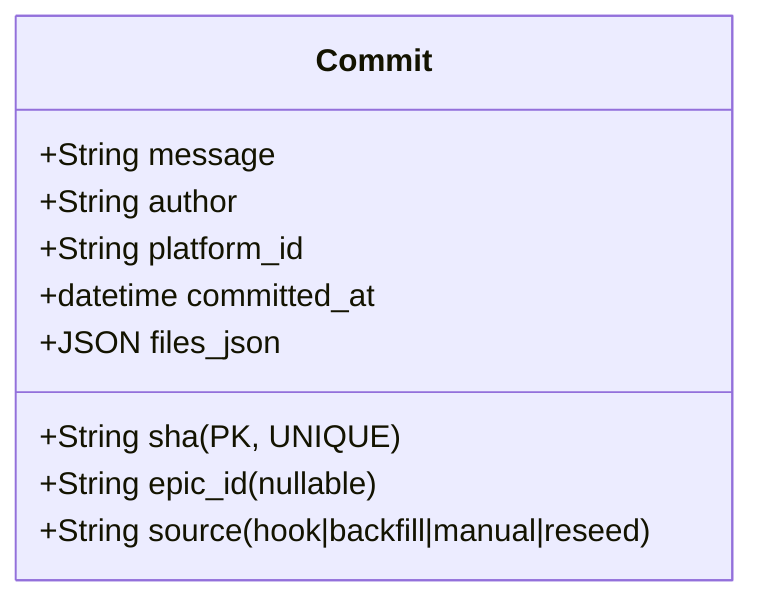
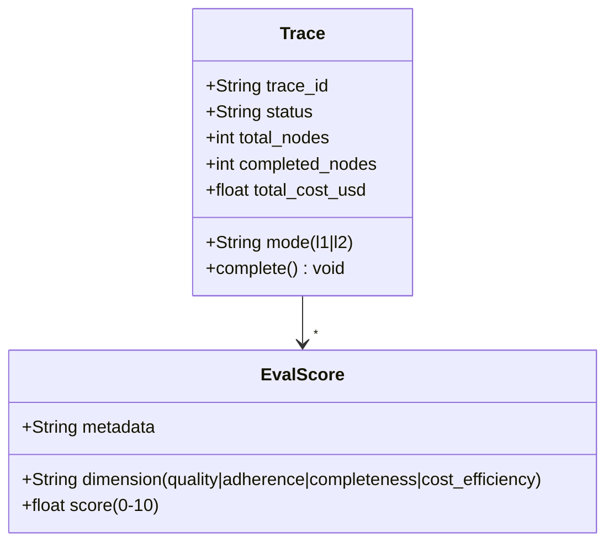

# Madruga AI — Domain Model

> DDD domain model com bounded contexts, aggregates, entities, value objects e invariants. Derivado do codebase real. Ultima atualizacao: 2026-04-06.
>
> Stack e NFRs → ver [blueprint.md](../blueprint/) · Relacionamentos DDD → ver [context-map.md](../context-map/)

---

## Bounded Contexts

| # | Bounded Context | Proposito | Justificativa de Separacao | Aggregates |
|---|----------------|-----------|---------------------------|------------|
| 1 | **Pipeline Orchestration** | Parsear DAG, despachar skills, gerenciar retry/circuit breaker | Linguagem propria (node, gate, dispatch, trace), ciclo de vida independente (parse → sort → dispatch → retry) | PipelineExecution, CircuitBreaker |
| 2 | **Pipeline State** | CRUD de platforms, epics, nodes, runs, commits, artifact provenance | Dominio de persistencia com regras proprias (migrations, seed, hash verification), linguagem distinta (upsert, seed, migrate) | Platform, Epic, PipelineNode, PipelineRun, Commit |
| 3 | **Observability** | Traces, eval scores, stats, export | Lifecycle independente — consome dados de runs mas tem logica propria (scoring heuristico, agregacao, retention) | Trace, EvalScore |
| 4 | **Decision & Memory** | ADRs, memory entries, FTS5 search, classificacao 1-way/2-way | Dominio distinto com linguagem propria (supersede, decision_type, content_hash), busca full-text independente | Decision, MemoryEntry |
| 5 | **Notifications** | Comunicacao com humano via Telegram/ntfy | Canal de I/O externo com backoff, offset persistence, inline keyboards — totalmente desacoplado do pipeline core | GateNotification |

**Camada de apresentacao (nao e BC):** Portal (Astro+React) — consome dados via JSON/SQL, zero logica de dominio.

**Interfaces (nao sao BCs):** platform_cli.py (ACL sobre Pipeline State), skill definitions (.claude/commands/ — fuel do pipeline, nao dominio proprio).

> Relacionamentos entre contextos e padroes DDD → ver [context-map.md](../context-map/)

---

## Bounded Context 1: Pipeline Orchestration

### Canvas

| Aspecto | Descricao |
|---------|-----------|
| **Nome** | Pipeline Orchestration |
| **Proposito** | Parsear DAG de platform.yaml, ordenar topologicamente, despachar skills via claude -p, gerenciar retry com circuit breaker |
| **Linguagem Ubiqua** | node, gate, dispatch, topological sort, circuit breaker, half-open, backoff, skill, trace |
| **Aggregates** | PipelineExecution, CircuitBreaker |
| **Modulos** | dag_executor.py, easter.py, worktree.py, ensure_repo.py, implement_remote.py |


### Aggregates

#### Aggregate: PipelineExecution

**Root Entity:** PipelineExecution (conceitual — orquestra o fluxo)



**Invariants:**
| # | Invariant | Descricao | Quando Checar |
|---|-----------|-----------|---------------|
| 1 | DAG aciclico | Topological sort deve completar sem ciclos detectados | Antes de executar |
| 2 | Dependencias existem | Todo `depends` referencia um node_id valido no DAG | Parse |
| 3 | Max concurrent | Nunca exceder MADRUGA_MAX_CONCURRENT dispatches simultaneos | Dispatch |
| 4 | Self-ref sequencial | Plataformas self-ref NUNCA executam epics em paralelo | Inicio de epic |

#### Aggregate: CircuitBreaker



**Invariants:**
| # | Invariant | Descricao | Quando Checar |
|---|-----------|-----------|---------------|
| 1 | Open apos N falhas | state = open quando failure_count >= max_failures | record_failure |
| 2 | Half-open apos recovery | state = half_open apos recovery_seconds desde last_failure | check |
| 3 | Reset em sucesso | failure_count = 0 e state = closed apos sucesso em half_open | record_success |

---

## Bounded Context 2: Pipeline State

### Canvas

| Aspecto | Descricao |
|---------|-----------|
| **Nome** | Pipeline State |
| **Proposito** | Persistir e consultar estado de platforms, epics, nodes, runs, commits, artifact provenance |
| **Linguagem Ubiqua** | upsert, seed, migrate, platform_id, epic_id, node_id, run_id, gate_status, output_hash, commit, source |
| **Aggregates** | Platform, Epic, PipelineRun, Commit |
| **Modulos** | db_core.py, db_pipeline.py, post_save.py, hook_post_commit.py, queue_promotion.py, config.py |


### Aggregates

#### Aggregate: Platform



**Invariants:**
| # | Invariant | Descricao | Quando Checar |
|---|-----------|-----------|---------------|
| 1 | Nome kebab-case | platform_name match `^[a-z][a-z0-9-]*$` | Criacao |
| 2 | Path safe | Nenhum path traversal (../) em artifact paths | post_save |

#### Aggregate: Epic



**Invariants:**
| # | Invariant | Descricao | Quando Checar |
|---|-----------|-----------|---------------|
| 1 | Status valido | status IN (proposed, drafted, queued, in_progress, shipped, blocked, cancelled) | Update |
| 2 | Branch obrigatoria | in_progress requer branch_name != null | Transicao para in_progress |
| 3 | Sequential constraint | Apenas 1 epic in_progress por plataforma por vez | Transicao para in_progress |
| 4 | Queue → only from drafted | queue() so aceita status=drafted | queue |
| 5 | Dequeue → only from queued | dequeue() so aceita status=queued, reverte para drafted | dequeue |
| 6 | Promote FIFO | promote() seleciona epic mais antigo por updated_at ASC | promote |

#### Aggregate: PipelineRun



**Invariants:**
| # | Invariant | Descricao | Quando Checar |
|---|-----------|-----------|---------------|
| 1 | Gate antes de prosseguir | Se gate = human/1-way-door, gate_status deve ser approved antes do proximo node | Dispatch |
| 2 | Custo nao negativo | cost_usd >= 0 | Complete |

#### Aggregate: Commit



**Invariants:**
| # | Invariant | Descricao | Quando Checar |
|---|-----------|-----------|---------------|
| 1 | SHA unico | sha e UNIQUE — INSERT OR IGNORE para idempotencia | Insert |
| 2 | Epic_id nullable | Commits ad-hoc (fora de epic) tem epic_id = NULL | Insert |
| 3 | Source valido | source IN (hook, backfill, manual, reseed) | Insert |
| 4 | Platform detection automatica | Branch epic/<platform>/<NNN> → extrai platform; file paths → detecta; default → madruga-ai | hook_post_commit |

---

## Bounded Context 3: Observability

### Canvas

| Aspecto | Descricao |
|---------|-----------|
| **Nome** | Observability |
| **Proposito** | Rastrear execucoes (traces), avaliar qualidade (eval scores), agregar estatisticas, exportar dados |
| **Linguagem Ubiqua** | trace, span, dimension, score, quality, adherence, completeness, cost_efficiency |
| **Aggregates** | Trace, EvalScore |
| **Modulos** | db_observability.py, eval_scorer.py, observability_export.py |

### Aggregates

#### Aggregate: Trace



**Invariants:**
| # | Invariant | Descricao | Quando Checar |
|---|-----------|-----------|---------------|
| 1 | Score range | 0.0 <= score <= 10.0 | Insert |
| 2 | Dimension valida | dimension IN (quality, adherence_to_spec, completeness, cost_efficiency) | Insert |
| 3 | Retention 90 dias | Traces > 90 dias sao deletados por cleanup | Periodico (easter) |

---

## Bounded Context 4: Decision & Memory (lightweight)

### Canvas

| Aspecto | Descricao |
|---------|-----------|
| **Nome** | Decision & Memory |
| **Proposito** | Registrar ADRs, classificar decisoes (1-way/2-way), consolidar memory entries, busca FTS5 |
| **Linguagem Ubiqua** | decision, supersede, accepted, deprecated, 1-way-door, memory_type, content_hash |
| **Modulos** | db_decisions.py, decision_classifier.py, sync_memory.py, memory_consolidate.py |

**Key entities:** Decision (ADR registry com FTS5), MemoryEntry (user/feedback/project/reference), DecisionLink (supersedes/depends_on/contradicts).

**Key invariant:** Decision com status=accepted nao pode ser editada in-place — requer novo ADR que supersede (ADR-013).

---

## Bounded Context 5: Notifications (lightweight)

### Canvas

| Aspecto | Descricao |
|---------|-----------|
| **Nome** | Notifications |
| **Proposito** | Notificar humano sobre gates pendentes, entregar aprovacoes/rejeicoes de volta ao pipeline |
| **Linguagem Ubiqua** | gate_notification, inline_keyboard, callback_query, backoff, offset |
| **Modulos** | telegram_bot.py, telegram_adapter.py, ntfy.py, sd_notify.py |

**Key entity:** GateNotification (envia inline keyboard via Telegram, processa callback de aprovacao/rejeicao, atualiza gate_status no Pipeline State via ACL).

**Key invariant:** Backoff exponencial (1s * 2^attempt, max 60s) para polling de gates pendentes.

---

## SQL Schema (Draft — SQLite)

```sql
-- Context: Pipeline State
CREATE TABLE platforms (
    platform_id TEXT PRIMARY KEY,
    name TEXT NOT NULL UNIQUE,
    lifecycle TEXT NOT NULL DEFAULT 'design'
        CHECK (lifecycle IN ('design', 'development', 'production')),
    repo_org TEXT, repo_name TEXT, base_branch TEXT DEFAULT 'main',
    created_at TEXT NOT NULL, updated_at TEXT NOT NULL
);

CREATE TABLE epics (
    epic_id TEXT NOT NULL, platform_id TEXT NOT NULL,
    status TEXT NOT NULL DEFAULT 'proposed'
        CHECK (status IN ('proposed','drafted','queued','in_progress','shipped','blocked','cancelled')),
    branch_name TEXT, delivered_at TEXT,
    PRIMARY KEY (epic_id, platform_id)
);

CREATE TABLE pipeline_runs (
    run_id TEXT PRIMARY KEY,
    platform_id TEXT NOT NULL, node_id TEXT NOT NULL,
    status TEXT NOT NULL DEFAULT 'running',
    tokens_in INTEGER, tokens_out INTEGER, cost_usd REAL,
    gate_status TEXT, trace_id TEXT,
    started_at TEXT NOT NULL, completed_at TEXT
);

-- Context: Observability
CREATE TABLE traces (
    trace_id TEXT PRIMARY KEY,
    platform_id TEXT NOT NULL, mode TEXT NOT NULL CHECK (mode IN ('l1','l2')),
    total_cost_usd REAL, completed_nodes INTEGER DEFAULT 0
);

CREATE TABLE eval_scores (
    score_id TEXT PRIMARY KEY,
    node_id TEXT NOT NULL, run_id TEXT,
    dimension TEXT NOT NULL CHECK (dimension IN ('quality','adherence_to_spec','completeness','cost_efficiency')),
    score REAL NOT NULL CHECK (score >= 0 AND score <= 10)
);

-- Context: Pipeline State (Commit Traceability)
CREATE TABLE commits (
    sha TEXT PRIMARY KEY,
    message TEXT NOT NULL, author TEXT,
    platform_id TEXT NOT NULL, epic_id TEXT,
    source TEXT NOT NULL DEFAULT 'hook'
        CHECK (source IN ('hook','backfill','manual','reseed')),
    committed_at TEXT NOT NULL, files_json TEXT
);

-- Context: Decision & Memory
CREATE TABLE decisions (
    decision_id TEXT PRIMARY KEY,
    platform_id TEXT NOT NULL, title TEXT NOT NULL,
    status TEXT NOT NULL DEFAULT 'proposed'
        CHECK (status IN ('accepted','superseded','deprecated','proposed')),
    body TEXT, content_hash TEXT
);
```

---

## Premissas e Decisoes

| # | Decisao | Alternativas Consideradas | Justificativa |
|---|---------|---------------------------|---------------|
| 1 | 5 BCs (sem Portal como BC) | 6 BCs com Portal / 4 BCs mergeando Pipeline+State | Portal nao tem logica de dominio; Pipeline e State tem linguagens distintas no codigo |
| 2 | Skill System como subdominio de Orchestration | BC separado "Skill System" | Skills sao o "fuel" do pipeline — acoplamento forte com dispatch |
| 3 | DDD pragmatico (full para complexos, lightweight para menores) | DDD full em todos / DDD lite em todos | Notifications e Decision nao justificam classDiagrams detalhados |
| 4 | platform_cli como ACL sobre Pipeline State | BC separado "Platform Management" | CLI e interface, nao dominio |

| # | Premissa | Status |
|---|---------|--------|
| 1 | Modulos db_*.py refletem boundaries reais do dominio | Confirmado (zero cross-imports no codigo) |
| 2 | dag_executor.py sera decomposto em epics futuros | [VALIDAR] — documentado como risco no blueprint |
