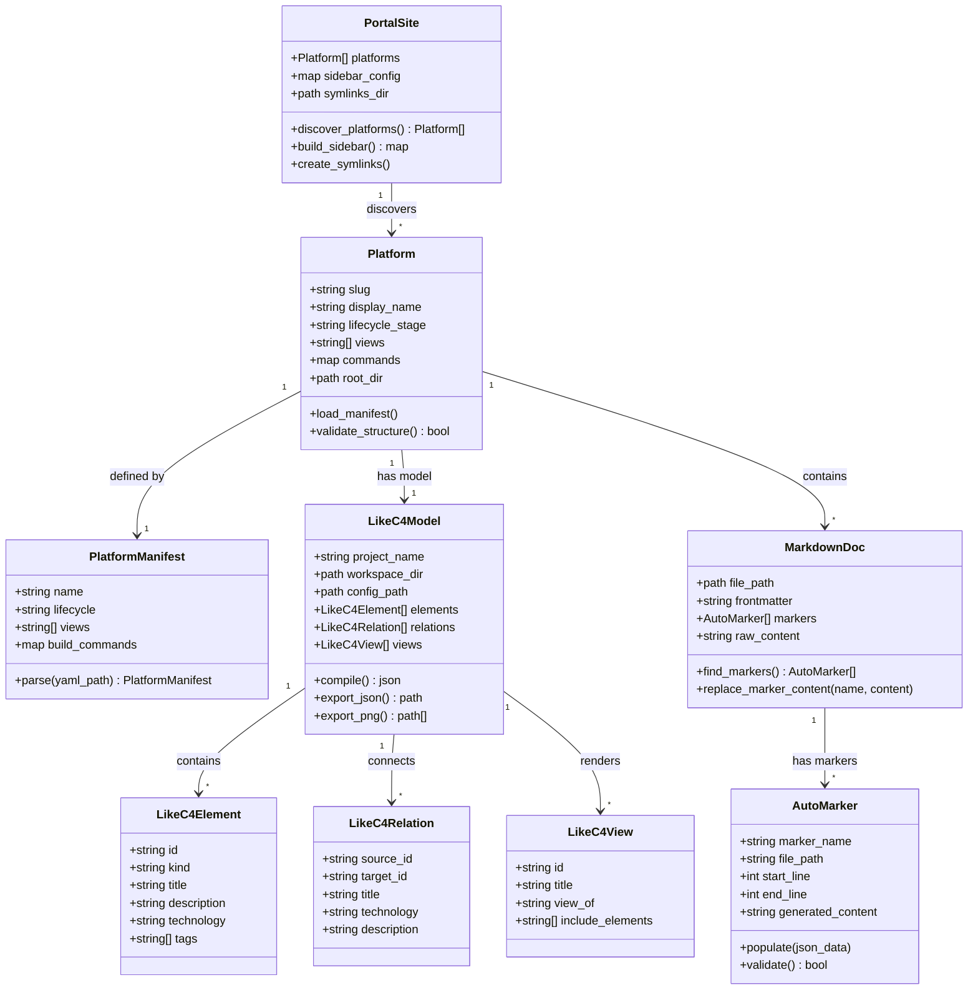
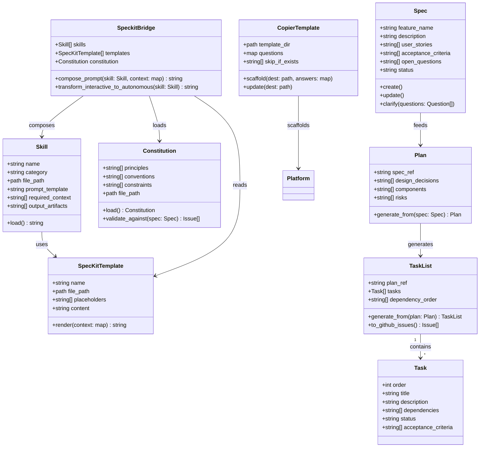
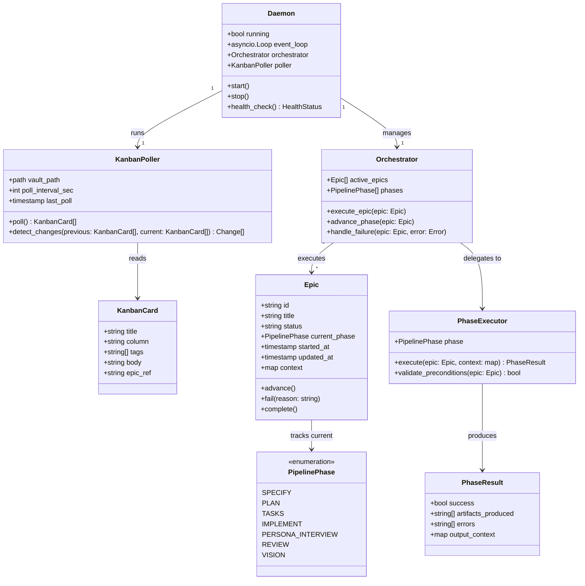
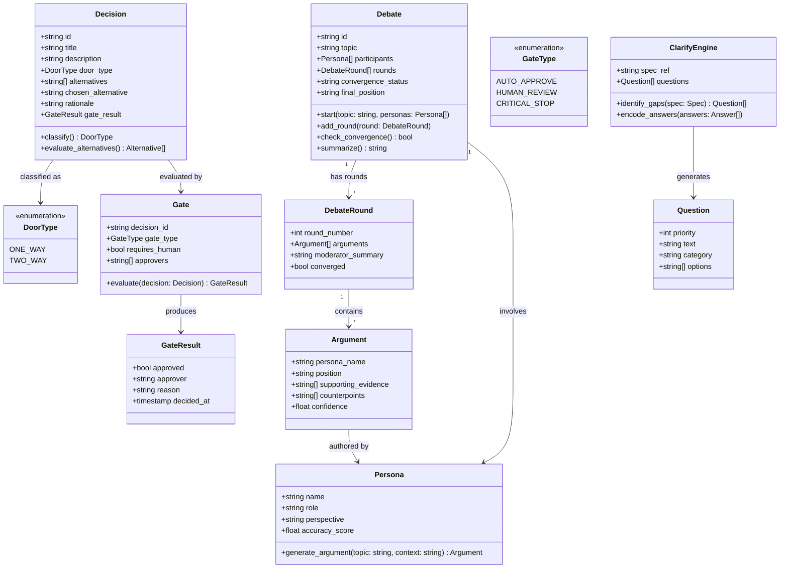
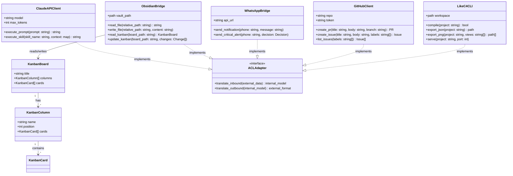
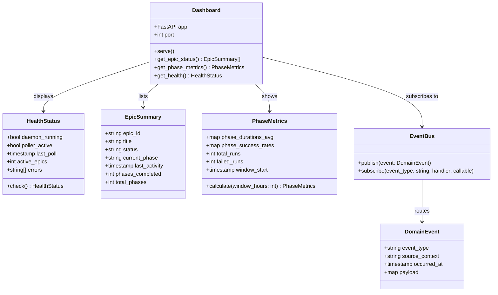

# Modelo de Dominio + Schema

Consolidacao dos 6 bounded contexts do Madruga AI: entidades, diagramas de classe, schemas de storage e invariantes. Para a visao estrategica (Context Map), veja [Context Map](/madruga-ai/context-map/).

---

## Documentation (Core) — Portal, Platforms, LikeC4 Models

Responsavel por gerenciar plataformas documentadas, o portal Astro/Starlight, modelos LikeC4, e a populacao automatica de tabelas via AUTO markers.

### Modelo de Dominio



### Storage Model

Nao ha banco de dados neste contexto. Toda persistencia e baseada em **filesystem**:

| Artefato | Formato | Caminho |
|----------|---------|---------|
| Manifesto da plataforma | YAML | `platforms/<slug>/platform.yaml` |
| Modelo de arquitetura | `.likec4` | `platforms/<slug>/model/*.likec4` |
| Config LikeC4 | JSON | `platforms/<slug>/model/likec4.config.json` |
| Documentos de engenharia | Markdown | `platforms/<slug>/engineering/*.md` |
| Documentos de negocio | Markdown | `platforms/<slug>/business/*.md` |
| ADRs | Markdown | `platforms/<slug>/decisions/*.md` |
| Epics | Markdown | `platforms/<slug>/epics/NNN-slug/pitch.md` |
| JSON exportado | JSON | `platforms/<slug>/model/output/likec4.json` |

### Invariantes

- Toda plataforma **deve** ter `platform.yaml` com campos `name`, `lifecycle` e `views`
- O campo `name` no `likec4.config.json` **deve** coincidir com o slug da plataforma
- AUTO markers **sempre** existem em pares: `<!-- AUTO:name -->` e `<!-- /AUTO:name -->`
- Conteudo entre AUTO markers **nunca** deve ser editado manualmente
- Symlinks do portal **devem** apontar para `platforms/<slug>` (criados por `setup.sh`)
- Cada plataforma **deve** ter pelo menos os diretorios: `business/`, `engineering/`, `decisions/`, `model/`

---

## Specification (Core) — SpecKit Pipeline, Skills, Templates

Responsavel pelo pipeline de especificacao (specify -> clarify -> plan -> tasks -> implement), skills consumidos pelo Claude Code, templates reutilizaveis, e a constituicao do projeto.

### Modelo de Dominio



### Storage Model

| Artefato | Formato | Caminho |
|----------|---------|---------|
| Skills (Madruga) | Markdown | `.claude/commands/madruga/*.md` |
| Skills (SpecKit) | Markdown | `.claude/commands/speckit.*.md` |
| Templates SpecKit | Markdown | `.specify/templates/*.md` |
| Constituicao | Markdown | `.specify/memory/constitution.md` |
| Template Copier | Jinja2 + YAML | `.specify/templates/platform/` |
| Spec de feature | Markdown | gerado sob demanda |
| Plan de feature | Markdown | gerado sob demanda |
| Tasks de feature | Markdown | gerado sob demanda |

### Invariantes

- Skills **devem** ser arquivos Markdown validos em `.claude/commands/`
- A constituicao **deve** existir em `.specify/memory/constitution.md`
- Templates Copier **devem** ter `copier.yml` com definicao de perguntas
- Campos marcados com `_skip_if_exists` no Copier **nao** sao sobrescritos em `copier update`
- O unico arquivo de modelo que sincroniza entre plataformas e `model/spec.likec4`
- Pipeline segue ordem estrita: specify -> clarify -> plan -> tasks -> implement

---

## Execution (Supporting) — Daemon, Orchestrator, Kanban Poller, Pipeline Phases

Responsavel pela execucao autonoma do pipeline: daemon 24/7, orquestrador de fases, polling do kanban Obsidian, e execucao das 7 fases do pipeline.

### Modelo de Dominio



### Schema SQL (SQLite — madruga.db)

```sql
CREATE TABLE IF NOT EXISTS epics (
    id TEXT PRIMARY KEY,
    title TEXT NOT NULL,
    objective TEXT NOT NULL DEFAULT '',
    priority TEXT DEFAULT 'P2',
    target_repo TEXT DEFAULT 'general',
    phase TEXT DEFAULT 'inbox',
    status TEXT DEFAULT 'pending',
    scope TEXT DEFAULT '',
    acceptance_criteria TEXT DEFAULT '',
    estimated_tasks INTEGER DEFAULT 0,
    spec_path TEXT DEFAULT '',
    plan_path TEXT DEFAULT '',
    tasks_path TEXT DEFAULT '',
    pr_number INTEGER,
    milestone_id TEXT,
    cost_usd REAL DEFAULT 0.0,
    created_at TIMESTAMP DEFAULT CURRENT_TIMESTAMP,
    updated_at TIMESTAMP DEFAULT CURRENT_TIMESTAMP
);

CREATE TABLE IF NOT EXISTS usage_log (
    id INTEGER PRIMARY KEY AUTOINCREMENT,
    epic_id TEXT REFERENCES epics(id),
    phase TEXT,
    model TEXT NOT NULL,
    call_type TEXT NOT NULL DEFAULT 'claude_p',
    duration_ms INTEGER,
    throttled BOOLEAN DEFAULT FALSE,
    created_at TIMESTAMP DEFAULT CURRENT_TIMESTAMP
);
```

### Invariantes

- O daemon **deve** rodar como processo asyncio unico (sem multiprocessing)
- Polling do kanban ocorre a cada **60 segundos** (configuravel)
- Um epic so avanca de fase se a fase atual completou com sucesso (`PhaseResult.success == true`)
- Fases **devem** ser executadas na ordem definida pelo enum `PipelinePhase`
- Se uma fase falha 3x consecutivas, o epic e marcado como `blocked`
- O campo `context` do epic acumula output de cada fase (append-only dentro de uma execucao)
- O daemon **deve** responder a health checks mesmo durante execucao de fases longas

---

## Intelligence (Supporting) — Debate Engine, Decision System, Clarify Engine

Responsavel por mecanismos de inteligencia: debates multi-persona com convergencia, classificacao de decisoes (1-way/2-way door), gates de aprovacao, e motor de clarificacao.

### Modelo de Dominio



### Schema SQL (SQLite — madruga.db)

```sql
CREATE TABLE IF NOT EXISTS debates (
    id INTEGER PRIMARY KEY AUTOINCREMENT,
    epic_id TEXT NOT NULL,
    phase TEXT NOT NULL,
    round INTEGER NOT NULL,
    critic TEXT NOT NULL,
    severity TEXT NOT NULL,
    finding TEXT NOT NULL,
    resolved BOOLEAN DEFAULT FALSE,
    created_at TIMESTAMP DEFAULT CURRENT_TIMESTAMP
);

CREATE TABLE IF NOT EXISTS decisions (
    id INTEGER PRIMARY KEY AUTOINCREMENT,
    epic_id TEXT NOT NULL,
    phase TEXT NOT NULL,
    title TEXT NOT NULL,
    door_type TEXT NOT NULL,
    description TEXT DEFAULT '',
    alternatives TEXT DEFAULT '',
    chosen TEXT DEFAULT '',
    rationale TEXT DEFAULT '',
    adr_path TEXT DEFAULT '',
    status TEXT DEFAULT 'pending',
    created_at TIMESTAMP DEFAULT CURRENT_TIMESTAMP,
    resolved_at TIMESTAMP
);

CREATE TABLE IF NOT EXISTS patterns (
    id INTEGER PRIMARY KEY AUTOINCREMENT,
    category TEXT NOT NULL,
    pattern TEXT NOT NULL,
    frequency INTEGER DEFAULT 1,
    last_seen TEXT NOT NULL,
    metadata TEXT
);

CREATE TABLE IF NOT EXISTS learning (
    id INTEGER PRIMARY KEY AUTOINCREMENT,
    source TEXT NOT NULL,
    lesson TEXT NOT NULL,
    confidence REAL DEFAULT 0.5,
    created_at TEXT NOT NULL,
    applied_count INTEGER DEFAULT 0
);

CREATE TABLE IF NOT EXISTS persona_accuracy (
    id INTEGER PRIMARY KEY AUTOINCREMENT,
    persona TEXT NOT NULL,
    topic TEXT NOT NULL,
    predicted TEXT,
    actual TEXT,
    accurate INTEGER,
    evaluated_at TEXT NOT NULL
);
```

### Invariantes

- Debates **devem** ter no minimo 2 personas participantes
- Convergencia e declarada quando todas as personas alinham posicao ou apos **5 rounds** (o que vier primeiro)
- Decisoes 1-way door **sempre** exigem gate `HUMAN_REVIEW` ou `CRITICAL_STOP`
- Decisoes 2-way door **podem** ser auto-aprovadas (`AUTO_APPROVE`)
- Gates do tipo `CRITICAL_STOP` **devem** notificar via WhatsApp
- O ClarifyEngine gera no maximo **5 perguntas** por iteracao
- Accuracy score de personas e atualizado apos cada review retrospectiva

---

## Integration (Generic) — Obsidian CRUD, WhatsApp Bridge, GitHub Ops, Claude API

Responsavel pela comunicacao com sistemas externos. Cada integracao tem uma Anti-Corruption Layer (ACL) que isola contratos externos do dominio interno.

### Modelo de Dominio



### Storage Model

Este contexto nao possui storage proprio. Todas as interacoes sao **passthrough** para sistemas externos:

| Sistema | Protocolo | Dados Trafegados |
|---------|-----------|------------------|
| Claude API | `claude -p` (subprocess) | Prompts compostos, respostas de texto |
| Obsidian Vault | Filesystem (read/write) | Markdown files, kanban boards |
| WhatsApp | HTTP/API | Notificacoes de texto, alertas criticos |
| GitHub | `gh` CLI / REST API | Issues, PRs, labels, comments |
| LikeC4 CLI | Subprocess | JSON export, PNG export, compilation |

### Invariantes

- Toda chamada a sistema externo **deve** passar pela ACL correspondente
- Falhas em sistemas externos **nao** devem propagar excecoes para o dominio (fail gracefully)
- Claude API e invocado via `claude -p` como subprocess (nao via SDK direto)
- Obsidian bridge opera somente dentro do `vault_path` configurado (sem path traversal)
- WhatsApp notifications sao **fire-and-forget** (sem confirmacao de leitura)
- GitHub operations **devem** respeitar rate limits (backoff exponencial em 429)

---

## Observability (Generic) — Dashboard, Health Checks, Metrics

Responsavel por visibilidade operacional: dashboard web, health checks do daemon, e metricas de execucao do pipeline.

### Modelo de Dominio



### Storage Model

Observability consome dados do SQLite (`madruga.db`) em modo **read-only**. Nao possui tabelas proprias.

O dashboard e servido via FastAPI com templates HTML embutidos — sem SPA, sem build frontend.

### Invariantes

- Dashboard **deve** ser acessivel mesmo quando o daemon esta sob carga
- Health check **deve** responder em menos de **500ms**
- Metricas sao calculadas sob demanda (sem pre-agregacao)
- EventBus opera como **pub-sub fire-and-forget** (sem garantia de entrega)
- Dashboard **nao** expoe endpoints de mutacao (somente leitura)
- Logs estruturados (JSON) para toda operacao do daemon
