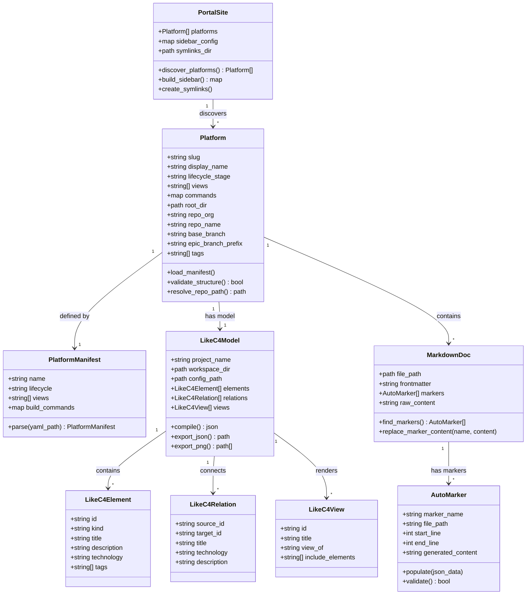
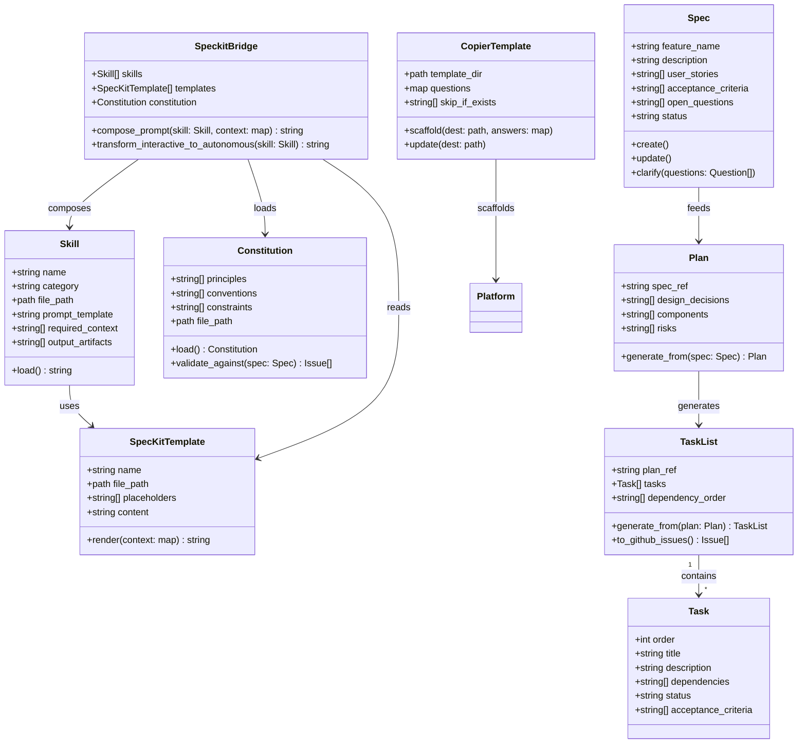
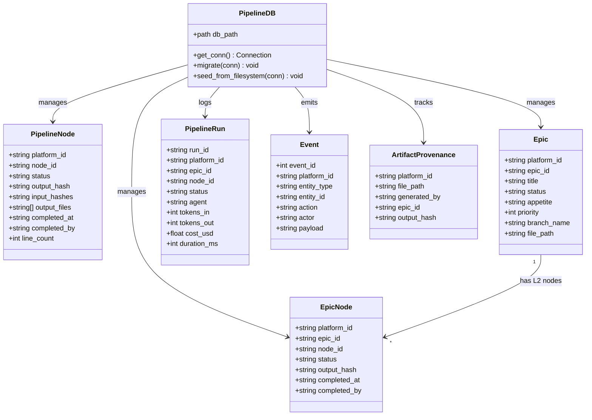
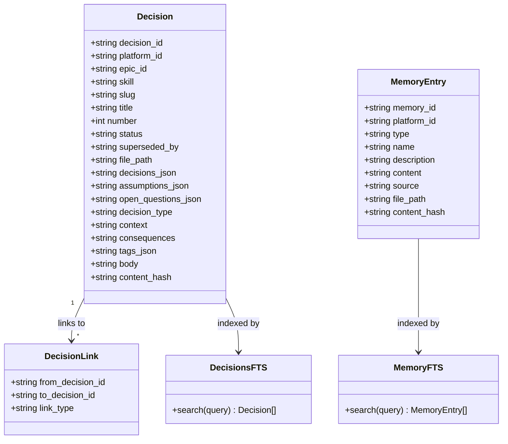
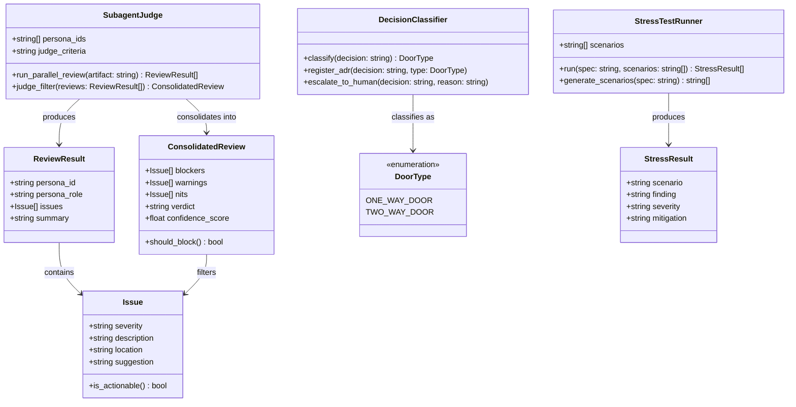
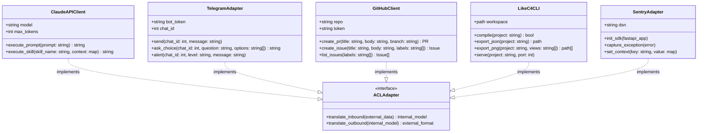
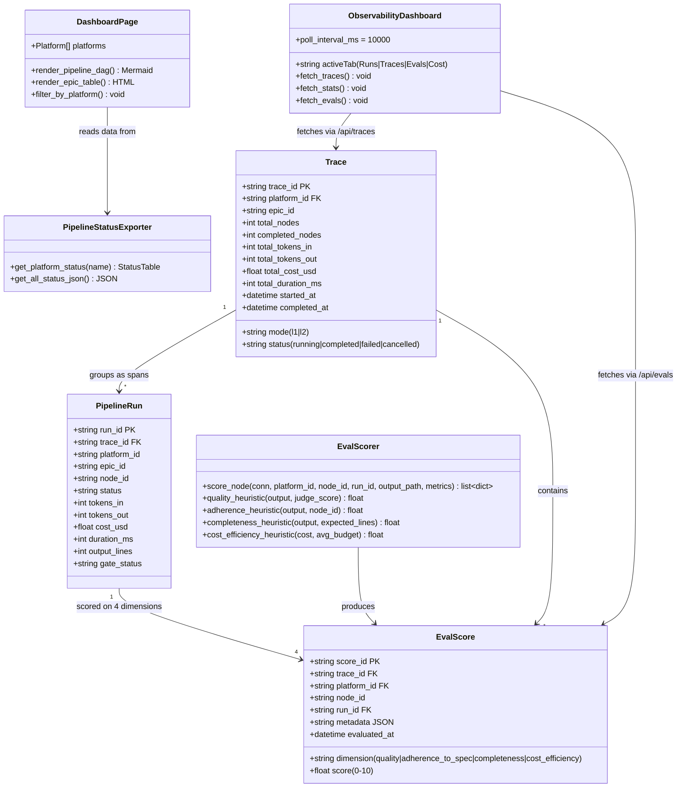

# Modelo de Dominio + Schema

Consolidacao dos 6 bounded contexts do Madruga AI: entidades, diagramas de classe, schemas de storage e invariantes. Para a visao estrategica (Context Map), veja [Context Map](/madruga-ai/context-map/).

---

## Documentation (Core) — Portal, Platforms, LikeC4 Models

Responsavel por gerenciar plataformas documentadas, o portal Astro/Starlight, modelos LikeC4, e a populacao automatica de tabelas via AUTO markers.

### Modelo de Dominio

### Storage Model

Persistencia hibrida: **filesystem** (source of truth para escrita) + **SQLite** (state store, cache, leitura rapida).

| Artefato | Formato | Caminho |
|----------|---------|---------|
| Manifesto da plataforma | YAML | `platforms/<slug>/platform.yaml` |
| Pipeline state | SQLite | `.pipeline/madruga.db` |
| Contexto da plataforma | Markdown | `platforms/<slug>/CLAUDE.md` |
| Modelo de arquitetura | `.likec4` | `platforms/<slug>/model/*.likec4` |
| Config LikeC4 | JSON | `platforms/<slug>/model/likec4.config.json` |
| Documentos de engenharia | Markdown | `platforms/<slug>/engineering/*.md` |
| Documentos de negocio | Markdown | `platforms/<slug>/business/*.md` |
| ADRs | Markdown | `platforms/<slug>/decisions/*.md` |
| Epics | Markdown | `platforms/<slug>/epics/NNN-slug/` |
| JSON exportado | JSON | `platforms/<slug>/model/output/likec4.json` |

#### SQLite Tables (madruga.db)

| Tabela | Propósito | Chave Primaria |
|--------|-----------|----------------|
| `platforms` | Registro de plataformas (name, lifecycle, repo binding) | `platform_id` |
| `pipeline_nodes` | Estado L1 de cada node do pipeline | `(platform_id, node_id)` |
| `epics` | Registro de epics (title, status, appetite, branch) | `(platform_id, epic_id)` |
| `epic_nodes` | Estado L2 de cada node do ciclo de epic | `(platform_id, epic_id, node_id)` |
| `pipeline_runs` | Historico de execucoes (tokens, custo, duracao) | `run_id` |
| `events` | Event log (entity_type, action, payload) | `event_id` |
| `artifact_provenance` | Hash e origem de cada artefato gerado | `(platform_id, file_path)` |
| `decisions` | Decisions como source of truth (21 campos, FTS5) | `decision_id` |
| `decision_links` | Links entre decisions (supersedes, relates, etc) | `(from_id, to_id, type)` |
| `memory_entries` | Memory entries com FTS5 full-text search | `memory_id` |
| `local_config` | Config local (active_platform, etc) | `key` |
| `_migrations` | Controle de migrations aplicadas | `name` |

### Invariantes

- Toda plataforma **deve** ter `platform.yaml` com campos `name`, `lifecycle` e `views`. Campos opcionais: `repo:` (org, name, base_branch, epic_branch_prefix) e `tags:[]`
- O campo `name` no `likec4.config.json` **deve** coincidir com o slug da plataforma
- AUTO markers **sempre** existem em pares: `<!-- AUTO:name -->` e `<!-- /AUTO:name -->`
- Conteudo entre AUTO markers **nunca** deve ser editado manualmente
- Symlinks do portal **devem** apontar para `platforms/<slug>` (criados por `setup.sh`)
- Cada plataforma **deve** ter pelo menos os diretorios: `business/`, `engineering/`, `decisions/`, `model/`

---

## Specification (Core) — SpecKit Pipeline, Skills, Templates

Responsavel pelo pipeline de especificacao (specify -> clarify -> plan -> tasks -> implement), skills consumidos pelo Claude Code, templates reutilizaveis, e a constituicao do projeto.

### Modelo de Dominio

### Storage Model

| Artefato | Formato | Caminho |
|----------|---------|---------|
| Skills (Madruga) | Markdown | `.claude/commands/madruga/*.md` |
| Skills (SpecKit) | Markdown | `.claude/commands/speckit.*.md` |
| Templates SpecKit | Markdown | `.specify/templates/*.md` |
| Constituicao | Markdown | `.specify/memory/constitution.md` |
| Template Copier | Jinja2 + YAML | `.specify/templates/platform/` |
| Spec de feature | Markdown | gerado sob demanda |
| Plan de feature | Markdown | gerado sob demanda |
| Tasks de feature | Markdown | gerado sob demanda |

### Invariantes

- Skills **devem** ser arquivos Markdown validos em `.claude/commands/`
- A constituicao **deve** existir em `.specify/memory/constitution.md`
- Templates Copier **devem** ter `copier.yml` com definicao de perguntas
- Campos marcados com `_skip_if_exists` no Copier **nao** sao sobrescritos em `copier update`
- O unico arquivo de modelo que sincroniza entre plataformas e `model/spec.likec4`
- Pipeline segue ordem estrita: specify -> clarify -> plan -> tasks -> implement

---

## Pipeline State (Supporting) — SQLite BD, Migrations, CLI Status

Responsavel pelo estado do pipeline: BD SQLite com WAL mode, migrations incrementais, seed do filesystem, e CLI de status. Implementado nos epics 006 (SQLite Foundation) e 010 (Pipeline Dashboard).

### Modelo de Dominio

### Invariantes

- BD usa **WAL mode** + `busy_timeout=5000ms` + `foreign_keys=ON`
- Migrations sao incrementais em `.pipeline/migrations/` e controladas pela tabela `_migrations`
- `seed_from_filesystem()` popula BD a partir de `platform.yaml` e arquivos existentes
- Status de pipeline node e derivado de file existence + content hash
- Epic status: `proposed` → `drafted` → `in_progress` → `shipped` (transicoes unidirecionais). `drafted` = artefatos planejados em main sem branch
- Epic nodes seguem o ciclo L2: epic-context → specify → clarify → plan → tasks → analyze → implement → analyze → judge → qa → reconcile
- Toda mutacao gera um evento na tabela `events`

---

## Decision & Memory (Supporting) — BD Source of Truth, FTS5, Import/Export

Responsavel por decisions (ADRs) e memory entries como source of truth no BD, com FTS5 full-text search e sincronizacao bidirecional com markdown. Implementado no epic 009 (Decision Log BD).

### Modelo de Dominio

### Invariantes

- BD e **source of truth** para decisions e memory — markdown e view layer exportada
- Toda decision tem `content_hash` para detectar drift entre BD e arquivo
- `import-adrs` parseia markdown Nygard e insere/atualiza no BD
- `export-adrs` gera markdown Nygard a partir do BD
- FTS5 indexa `title`, `context`, `consequences` (decisions) e `name`, `description`, `content` (memory)
- Decision links suportam tipos: `supersedes`, `amends`, `relates-to`
- Status de decision: `proposed` → `accepted` → `superseded` (ou `deprecated`)

---

## Intelligence (Supporting) — Subagent Judge, Decision System, Stress Test

Responsavel por garantir qualidade de specs e decisoes via review automatizado. Subagent Paralelo + Judge Pattern (ADR-019): 4 personas executam em paralelo via Claude Code Agent tool (Architecture Reviewer, Bug Hunter, Simplifier, Stress Tester), 1 juiz filtra noise por Accuracy/Actionability/Severity. Implementado nos epics 014-015.

### Modelo de Dominio

### Storage Model

Intelligence nao possui storage proprio — consome artefatos de Specification e persiste resultados via Execution (SQLite events + pipeline_runs).

| Dado | Destino | Formato |
|------|---------|---------|
| Review consolidado | `pipeline_runs` (SQLite) | JSON payload |
| Decisoes classificadas | `decisions` (SQLite) | Row com `decision_type` |
| Stress test results | `events` (SQLite) | Event log |

### Invariantes

- Subagent Judge **sempre** executa 4 personas em paralelo (Architecture Reviewer, Bug Hunter, Simplifier, Stress Tester) — ADR-019
- Judge pass filtra por 3 criterios: Accuracy (factual?), Actionability (fixavel?), Severity (impacta producao?)
- Toda decisao 1-way-door **deve** gerar ADR automaticamente (ADR-013)
- Stress test **deve** cobrir pelo menos: scale 10x, failure modes, edge cases, security threats
- Review results sao **imutaveis** apos consolidacao (append-only em events)

---

## Integration (Generic) — Telegram Adapter, GitHub Ops, Claude API, Sentry

Responsavel pela comunicacao com sistemas externos. Cada integracao tem uma Anti-Corruption Layer (ACL) que isola contratos externos do dominio interno.

### Modelo de Dominio

### Storage Model

Este contexto nao possui storage proprio. Todas as interacoes sao **passthrough** para sistemas externos:

| Sistema | Protocolo | Dados Trafegados |
|---------|-----------|------------------|
| Claude API | `claude -p` (subprocess) | Prompts compostos, respostas de texto |
| Telegram | HTTPS (Telegram Bot API) | Notificacoes, decisoes (inline buttons), alertas |
| GitHub | `gh` CLI / REST API | Issues, PRs, labels, comments |
| LikeC4 CLI | Subprocess | JSON export, PNG export, compilation |
| Sentry | HTTPS (sentry-sdk) | Error events, performance traces, breadcrumbs |

### Invariantes

- Toda chamada a sistema externo **deve** passar pela ACL correspondente
- Falhas em sistemas externos **nao** devem propagar excecoes para o dominio (fail gracefully)
- Claude API e invocado via `claude -p` como subprocess (nao via SDK direto — ADR-010)
- Telegram Bot usa outbound HTTPS only — sem porta inbound, sem exposicao de rede (ADR-018)
- Telegram notifications sao **fire-and-forget** (sem confirmacao de leitura)
- Sentry opera como fire-and-forget — falha de envio nao afeta o easter (ADR-016)
- GitHub operations **devem** respeitar rate limits (backoff exponencial em 429)

---

## Observability — Tracing, Evals & Dashboard

Responsavel por visibilidade completa do pipeline: traces hierarquicos por run, eval scoring por node, metricas de custo/tokens, dashboard no portal e CLI status. Implementado nos epics 010 (Pipeline Dashboard) e 017 (Observability, Tracing & Evals).

### Modelo de Dominio

### API Endpoints (Easter)

| Endpoint | Metodo | Descricao |
|----------|--------|-----------|
| `/api/traces` | GET | Lista traces com filtros (platform_id, status, limit, offset) |
| `/api/traces/{trace_id}` | GET | Detalhe do trace com spans e eval scores |
| `/api/stats` | GET | Agregados por dia (runs, custo, tokens, duracao) |
| `/api/evals` | GET | Eval scores com filtros (platform_id, node_id, dimension) |
| `/api/export/csv` | GET | Export CSV de traces, spans ou evals |

### Invariantes

- Trace agrupa PipelineRuns (spans) de uma execucao completa do pipeline
- Um PipelineRun pertence a exatamente um Trace (FK trace_id)
- Cada node completado recebe 4 eval scores heuristicos (best-effort, nunca bloqueia)
- Eval scores clamped a [0, 10] — quality normaliza Judge score quando disponivel
- Cleanup automatico remove registros > 90 dias (traces, runs, eval_scores)
- Dashboard consome API REST do easter (polling 10s) — nao mais dados estaticos
- CLI `status` le diretamente do SQLite (read-only)
- Context threading: analyze-post → judge → qa → reconcile recebem reports upstream no prompt
