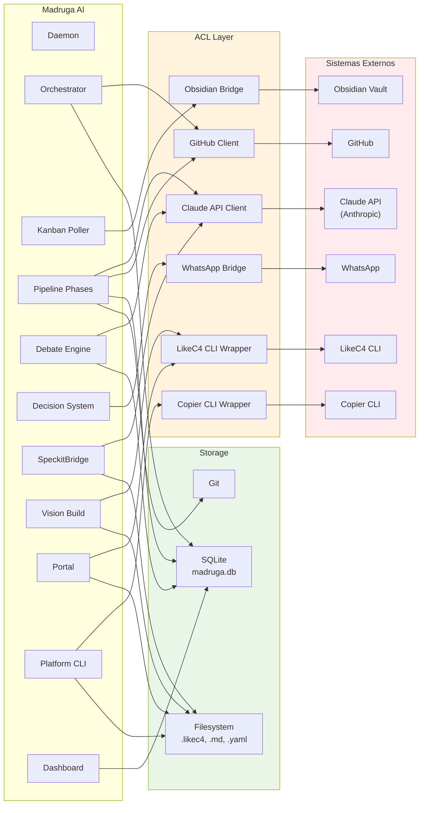

# Integracoes

Mapa completo de integracoes do Madruga AI com sistemas externos e entre containers internos. Todas as integracoes externas passam por uma Anti-Corruption Layer (ACL) que isola contratos externos do dominio.

## Diagrama



<!-- AUTO:integrations -->
| # | Sistema | Protocolo | Direcao | Frequencia | Dados | Fallback |
|---|---------|-----------|---------|-----------|-------|----------|
| 1 | **Claude API** | `claude -p` subprocess | Pipeline/Debate/Bridge -> Claude | per-phase / per-round | Prompts compostos (skill + template + context), respostas texto | Retry 3x com backoff; se falhar, fase marcada `failed` |
| 2 | **Obsidian Vault** | Filesystem read/write | Kanban Poller -> Obsidian | Polling 60s | Kanban cards (titulo, coluna, tags, body) | Se arquivo inacessivel, skip do ciclo de polling |
| 3 | **GitHub** | `gh` CLI / REST API | Orchestrator/Pipeline -> GitHub | per-epic / per-task | Issues, PRs, labels, comments, branch creation | Retry 3x; rate limit 429 com backoff exponencial |
| 4 | **WhatsApp** | HTTP API | Decision System -> WhatsApp | per-critical-decision | Alertas de decisoes 1-way door que exigem aprovacao humana | Fire-and-forget; log warning se falhar |
| 5 | **LikeC4 CLI** | Subprocess (`likec4`) | Vision Build / Portal -> LikeC4 | per-build | JSON export, PNG export, compilacao de modelos | Falha de compilacao aborta o build com erro descritivo |
| 6 | **Copier CLI** | Subprocess (`copier`) | Platform CLI -> Copier | per-command | Scaffolding (copy), sync (update), answers YAML | Falha aborta operacao; rollback manual |
| 7 | **SQLite** | sqlite3 (Python stdlib) | Orchestrator/Pipeline/Dashboard/Debate -> madruga.db | per-operation | Epics, phase_runs, patterns, learning, persona_accuracy | WAL mode para leituras concorrentes; write lock serializado |
| 8 | **Filesystem** | OS read/write | Portal/Vision Build/Platform CLI/Bridge | per-operation | .likec4 files, markdown docs, YAML configs, JSON exports | Operacoes atomicas via write-to-temp + rename |
| 9 | **Git** | Subprocess (`git`) | Pipeline -> repositorio | per-phase-completion | Commits de artefatos gerados, branch management | Se commit falha, artefatos ficam unstaged para retry manual |
<!-- /AUTO:integrations -->

## Detalhes de Implementacao

### Claude API — Invocacao via subprocess

O Madruga AI **nao** usa o SDK Python da Anthropic diretamente. Toda interacao com Claude e feita via `claude -p` (Claude Code CLI em modo pipe):

```bash
# Exemplo de invocacao
echo "<prompt composto>" | claude -p --model claude-sonnet-4-20250514
```

**Justificativa**: Reaproveita autenticacao e configuracao do Claude Code ja instalado na maquina. Evita gerenciar API keys separadamente.

**Composicao do prompt** (SpeckitBridge):
1. Carrega o skill (`.claude/commands/`)
2. Carrega templates relevantes (`.specify/templates/`)
3. Carrega constituicao (`.specify/memory/constitution.md`)
4. Injeta contexto do epic (acumulado de fases anteriores)
5. Concatena tudo em um prompt unico

### Obsidian Vault — Kanban Polling

| Operacao | Metodo | Caminho | Formato |
|----------|--------|---------|---------|
| Ler kanban | `open()` + parse | `vault/kanban-board.md` | Markdown com formato kanban plugin |
| Ler card | Parse de blocos | Dentro do kanban | `- [ ] titulo #tag` |
| Mover card | Rewrite completo | `vault/kanban-board.md` | Move bloco entre secoes |

**Formato do kanban Obsidian**:
```markdown
## Backlog
- [ ] Epic: nome do epic #tag

## In Progress
- [ ] Epic: outro epic #doing

## Done
- [x] Epic: epic completo #done
```

**Deteccao de mudancas**: Compara estado anterior (em memoria) com parse atual. Mudanca de coluna dispara evento para o Orchestrator.

### GitHub — Operacoes via `gh` CLI

| Operacao | Comando | Quando |
|----------|---------|--------|
| Criar issue | `gh issue create` | Fase `tasks` (taskstoissues) |
| Criar PR | `gh pr create` | Fase `implement` (codigo pronto) |
| Listar issues | `gh issue list --label` | Fase `specify` (verificar duplicatas) |
| Adicionar comment | `gh issue comment` | Atualizacao de status por fase |

### WhatsApp — Notificacoes Criticas

Usado **exclusivamente** para decisoes classificadas como 1-way door que exigem gate `CRITICAL_STOP`. O sistema envia uma mensagem formatada com:

- Titulo da decisao
- Alternativas consideradas
- Recomendacao do sistema
- Link para aprovar/rejeitar (via Obsidian note)

**Volume esperado**: < 5 notificacoes por semana (somente decisoes irreversiveis).

### SQLite — Configuracao

```python
# WAL mode para leituras concorrentes
connection.execute("PRAGMA journal_mode=WAL")
connection.execute("PRAGMA busy_timeout=5000")
connection.execute("PRAGMA foreign_keys=ON")
```

**Backup**: O arquivo `madruga.db` esta no `.gitignore`. Backup via `cp` antes de operacoes destrutivas.

### LikeC4 CLI — Pipeline de Build

```bash
# 1. Compilar modelo (validacao)
likec4 build -w ../platforms

# 2. Exportar JSON (para vision-build.py)
likec4 export json -o platforms/<name>/model/output/likec4.json

# 3. Exportar PNGs (opcional, para docs estaticos)
likec4 export png -o platforms/<name>/model/output/
```

**Multi-project**: O portal usa `LikeC4VitePlugin({ workspace: '../platforms' })` que descobre todos os projetos via `likec4.config.json` em cada plataforma.
