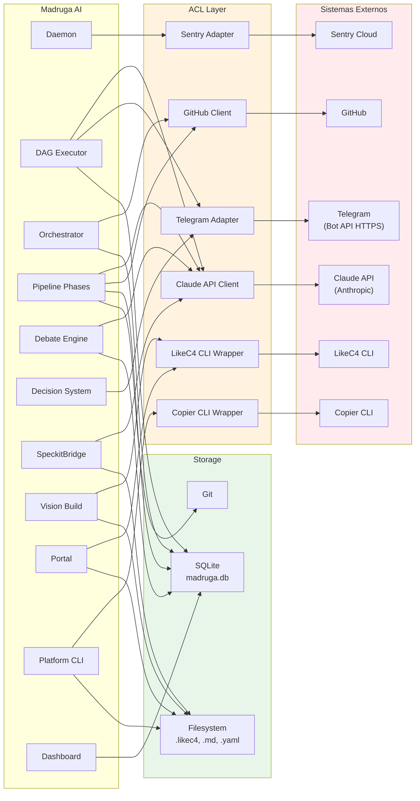

# Integracoes

Mapa completo de integracoes do Madruga AI com sistemas externos e entre containers internos. Todas as integracoes externas passam por uma Anti-Corruption Layer (ACL) que isola contratos externos do dominio.

## Diagrama



<!-- AUTO:integrations -->
| # | Sistema | Protocolo | Direcao | Frequencia | Dados | Fallback |
|---|---------|-----------|---------|-----------|-------|----------|
| 1 | **Claude API** | `claude -p` subprocess | Pipeline/Debate/Bridge/DAG Executor -> Claude | per-phase / per-round | Prompts compostos (skill + template + context), respostas texto | Retry 3x com backoff; circuit breaker apos 5 falhas; se falhar, fase marcada `failed` |
| 2 | **GitHub** | `gh` CLI / REST API | Orchestrator/Pipeline -> GitHub | per-epic / per-task | Issues, PRs, labels, comments, branch creation | Retry 3x; rate limit 429 com backoff exponencial |
| 3 | **Telegram** | HTTPS (Telegram Bot API, aiogram) | DAG Executor/Decision System -> Telegram | per-human-gate / per-critical-decision | Notificacoes de status, decisoes (ask_choice com inline buttons), alertas criticos | Health check cada 60s (getMe); se unreachable: modo log-only; fallback ntfy.sh (opcional) |
| 4 | **LikeC4 CLI** | Subprocess (`likec4`) | Vision Build / Portal -> LikeC4 | per-build | JSON export, PNG export, compilacao de modelos | Falha de compilacao aborta o build com erro descritivo |
| 5 | **Copier CLI** | Subprocess (`copier`) | Platform CLI -> Copier | per-command | Scaffolding (copy), sync (update), answers YAML | Falha aborta operacao; rollback manual |
| 6 | **Sentry** | HTTPS (sentry-sdk) | Daemon -> Sentry Cloud | per-error / per-request | Error events, stack traces, breadcrumbs, performance traces | Fire-and-forget; falha de envio nao afeta daemon |
| 7 | **SQLite** | sqlite3 (Python stdlib) | Orchestrator/Pipeline/Dashboard/DAG Executor -> madruga.db | per-operation | Pipeline state, epics, decisions, memory, metrics | WAL mode para leituras concorrentes; write lock serializado |
| 8 | **Filesystem** | OS read/write | Portal/Vision Build/Platform CLI/Bridge | per-operation | .likec4 files, markdown docs, YAML configs, JSON exports | Operacoes atomicas via write-to-temp + rename |
| 9 | **Git** | Subprocess (`git`) | Pipeline -> repositorio | per-phase-completion | Commits de artefatos gerados, branch management | Se commit falha, artefatos ficam unstaged para retry manual |
<!-- /AUTO:integrations -->

## Detalhes de Implementacao

### Claude API — Invocacao via subprocess

O Madruga AI **nao** usa o SDK Python da Anthropic diretamente (ADR-010). Toda interacao com Claude e feita via `claude -p` (Claude Code CLI em modo headless):

```bash
# Exemplo de invocacao
claude -p --model opus --output-format json --allowedTools Read,Write,Edit,Bash -- "<prompt>"
```

**Justificativa**: Usa subscription existente ($0 extra), acesso a MCP servers, tools do Claude Code. Agent SDK bloqueado por billing.

**Composicao do prompt** (SpeckitBridge):
1. Carrega o skill (`.claude/commands/`)
2. Carrega templates relevantes (`.specify/templates/`)
3. Carrega constituicao (`.specify/memory/constitution.md`)
4. Injeta contexto do epic (acumulado de fases anteriores)
5. Concatena tudo em um prompt unico

**Mitigacoes**: `--output-format json` (evita hang bug), semaforo max 3, watchdog SIGKILL, `--allowedTools` explicito.

### Telegram — Notificacoes via Bot API

Telegram Bot (aiogram, long-polling) para notificacoes bidirecionais. Tres operacoes:

| Operacao | Telegram API | Quando |
|----------|-------------|--------|
| `send` | `sendMessage` | Status updates, alertas |
| `ask_choice` | `sendMessage` + `InlineKeyboardMarkup` + `callback_query` handler | Human gates, decisoes 1-way-door |
| `alert` | `sendMessage` (com emoji level) | Erros criticos, timeouts |

**Plano de degradacao** (ADR-018):
1. Health check cada 60s (HTTPS `getMe`)
2. 3 falhas consecutivas → modo log-only (human gates pausam)
3. Fallback ntfy.sh (HTTP POST, zero deps, opcional)
4. Quando Telegram volta, daemon detecta e retoma notificacoes

**Volume esperado**: < 20 notificacoes por dia.

### GitHub — Operacoes via `gh` CLI

| Operacao | Comando | Quando |
|----------|---------|--------|
| Criar issue | `gh issue create` | Fase `tasks` (taskstoissues) |
| Criar PR | `gh pr create` | Fase `implement` (codigo pronto) |
| Listar issues | `gh issue list --label` | Fase `specify` (verificar duplicatas) |
| Adicionar comment | `gh issue comment` | Atualizacao de status por fase |

### Sentry — Error Tracking

`sentry-sdk[fastapi]` auto-instrumenta FastAPI (ADR-016). Configuracao:

```python
import sentry_sdk
sentry_sdk.init(dsn=settings.sentry_dsn, traces_sample_rate=0.5)
```

Free tier: 5K erros/mes, 10M transactions/mes. Fire-and-forget — falha nao afeta daemon.

### SQLite — Configuracao

```python
# WAL mode para leituras concorrentes
connection.execute("PRAGMA journal_mode=WAL")
connection.execute("PRAGMA busy_timeout=5000")
connection.execute("PRAGMA foreign_keys=ON")
```

**Backup**: O arquivo `madruga.db` esta no `.gitignore`. Backup via `cp` antes de operacoes destrutivas.

### LikeC4 CLI — Pipeline de Build

```bash
# 1. Compilar modelo (validacao)
likec4 build -w ../platforms

# 2. Exportar JSON (para vision-build.py)
likec4 export json -o platforms/<name>/model/output/likec4.json

# 3. Exportar PNGs (opcional, para docs estaticos)
likec4 export png -o platforms/<name>/model/output/
```

**Multi-project**: O portal usa `LikeC4VitePlugin({ workspace: '../platforms' })` que descobre todos os projetos via `likec4.config.json` em cada plataforma.
