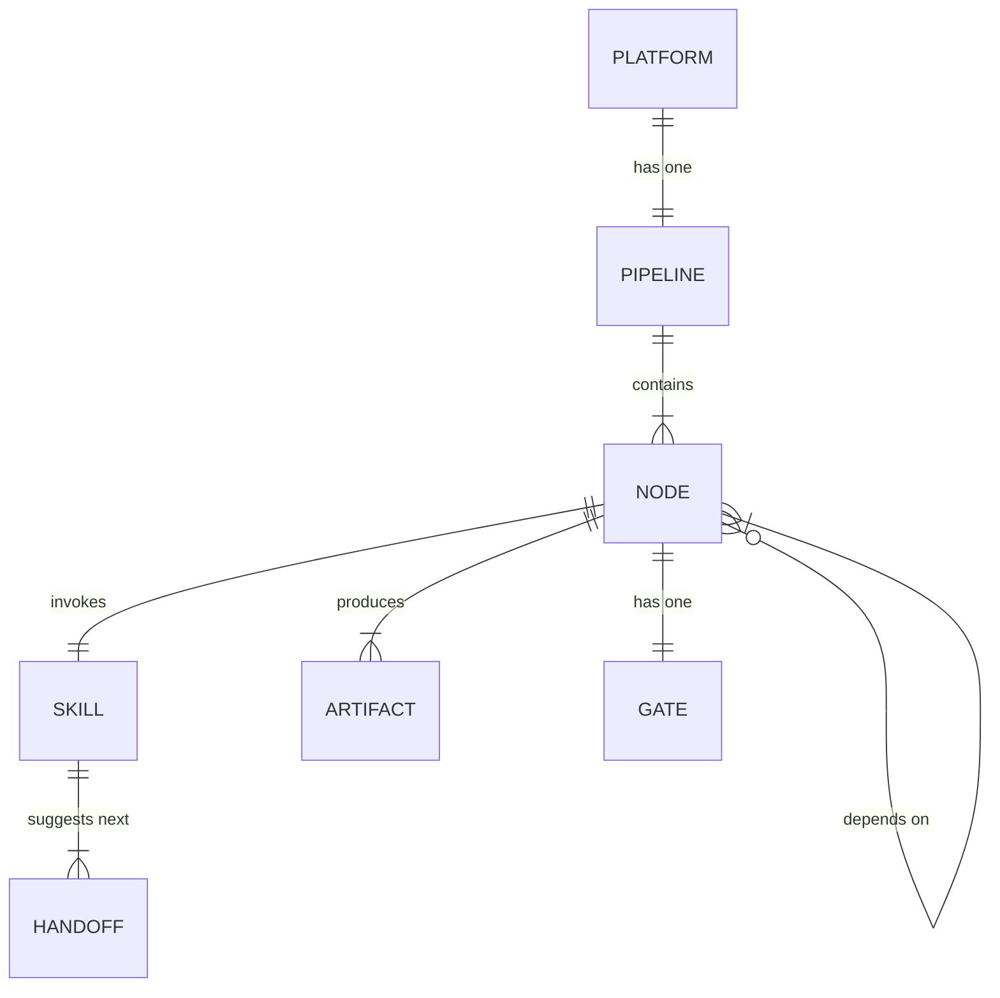
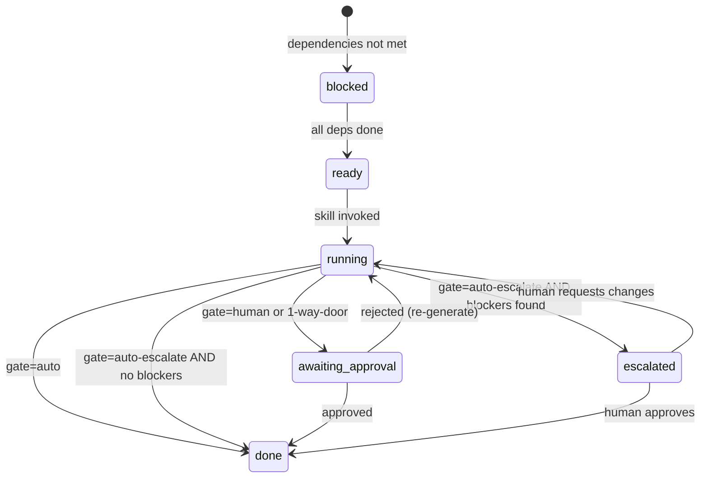

# Data Model: Atomic Skills DAG Pipeline

## Entities

### Pipeline Node (in `platform.yaml`)

```yaml
- id: string              # Unique identifier (kebab-case, e.g., "domain-model")
  skill: string           # Fully qualified skill name (e.g., "madruga:blueprint")
  outputs:                # File paths relative to platform dir
    - string              # e.g., "engineering/blueprint.md"
  depends:                # Node IDs that must be "done" before this can run
    - string              # e.g., "adr-gen"
  layer: enum             # business | research | engineering | planning
  gate: enum              # human | auto | 1-way-door | auto-escalate (default: human)
  optional: boolean       # default: false. If true, downstream not blocked when missing
  output_pattern: string  # Glob for variable outputs (e.g., "decisions/ADR-*.md")
```

**Validation rules:**
- `id` must be unique across all nodes
- `depends` must reference existing `id` values (no orphan references)
- `outputs` paths must be relative to `platforms/<name>/`
- `gate` defaults to `human` if omitted
- `optional` defaults to `false` if omitted
- `output_pattern` is used instead of `outputs` when file names are variable

**Status derivation (filesystem-based):**
- `done`: ALL files in `outputs` exist, OR ≥1 file matches `output_pattern` glob
- `ready`: ALL `depends` nodes are `done` (skipping `optional: true` deps), AND own outputs do NOT exist
- `blocked`: ≥1 non-optional `depends` node is NOT `done`

### Skill (in `.claude/commands/madruga/*.md`)

```yaml
# Frontmatter
description: string       # 1-line PT-BR description
arguments:
  - name: platform
    description: string
    required: false
argument-hint: string     # e.g., "[nome-da-plataforma]"
handoffs:
  - label: string         # Display name for the handoff
    agent: string         # Skill reference (e.g., "madruga/solution-overview")
    prompt: string        # Context for the handoff
```

**Sections (uniform contract):**
- Regra Cardinal (negative constraint)
- Persona (expertise simulation)
- Uso (invocation examples)
- Diretório (output path)
- Instruções:
  - 0: Pré-requisitos (check-platform-prerequisites.sh + constitution)
  - 1: Coletar Contexto + Questionar (read deps, structured questions)
  - 2: Gerar Artefato (follow template, include alternatives)
  - 3: Auto-Review (checklist validation)
  - 4: Gate de Aprovação (summary, decisions, confirmation)
  - 5: Salvar + Relatório (standardized output)

### Gate

| Type | Behavior | When pauses | Use case |
|------|----------|-------------|----------|
| `human` | Always pause for approval | Always | Most skills |
| `auto` | Never pause | Never | codebase-map, checkpoint |
| `1-way-door` | Always pause, even in autonomous mode | Always, with per-decision confirmation | tech-research, adr-gen, epic-breakdown |
| `auto-escalate` | Auto if OK, pause if blockers | Only when problems detected | verify |

### Platform (filesystem structure)

```
platforms/<name>/
├── platform.yaml           # Manifest with pipeline: section
├── business/
│   ├── vision.md           # From /vision-one-pager
│   ├── solution-overview.md # From /solution-overview
│   └── process.md          # From /business-process
├── research/
│   ├── tech-alternatives.md # From /tech-research
│   └── codebase-context.md  # From /codebase-map (optional)
├── decisions/
│   └── ADR-NNN-*.md        # From /adr-gen
├── engineering/
│   ├── blueprint.md        # From /blueprint
│   ├── folder-structure.md # From /folder-arch
│   ├── domain-model.md     # From /domain-model
│   ├── containers.md       # From /containers
│   └── context-map.md      # From /context-map
├── planning/
│   └── roadmap.md          # From /roadmap
├── epics/
│   └── NNN-slug/
│       └── pitch.md        # From /epic-breakdown
└── model/
    ├── ddd-contexts.likec4 # From /domain-model
    ├── platform.likec4     # From /containers
    └── views.likec4        # From /containers
```

## Relationships



## State Machine: Pipeline Node


