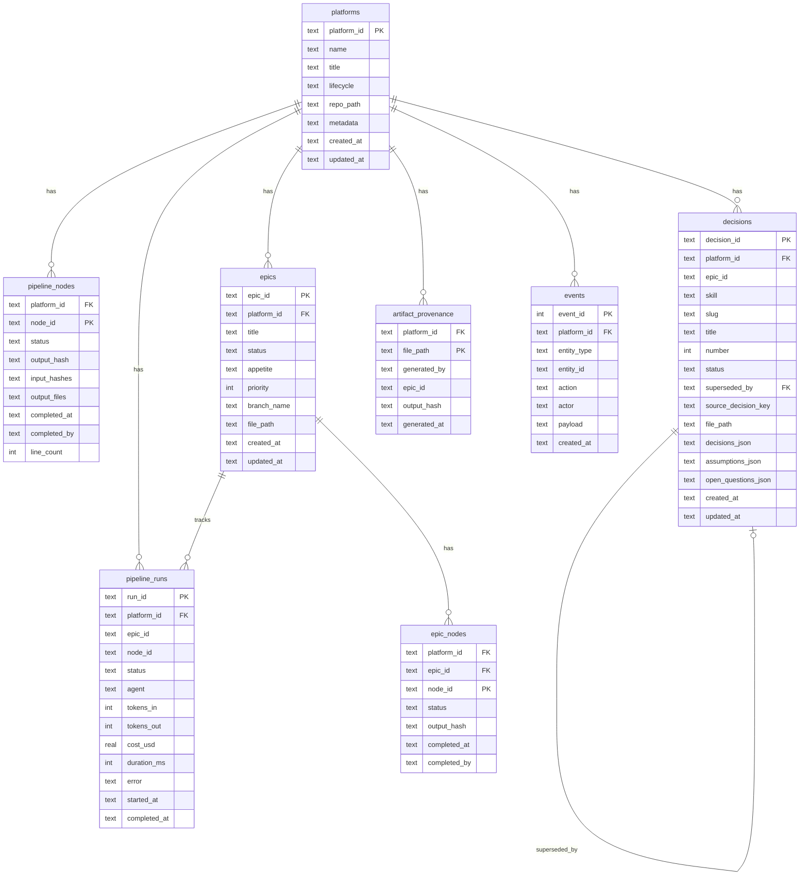

# Data Model: SQLite Foundation

**Feature**: 002-sqlite-foundation
**Date**: 2026-03-29

## Entity Relationship Diagram



## Entities

### platforms

Plataforma documentada no madruga.ai.

| Field | Type | Constraints | Description |
|-------|------|-------------|-------------|
| platform_id | TEXT | PK | Kebab-case identifier (ex: "fulano") |
| name | TEXT | NOT NULL | Display name |
| title | TEXT | | Full title with description |
| lifecycle | TEXT | CHECK IN (design, development, production, deprecated) | Current lifecycle stage |
| repo_path | TEXT | NOT NULL | Path relative to repo root (ex: "platforms/fulano") |
| metadata | TEXT | DEFAULT '{}' | JSON: views, build configs from platform.yaml |
| created_at | TEXT | NOT NULL, DEFAULT now | ISO 8601 timestamp |
| updated_at | TEXT | NOT NULL, DEFAULT now | ISO 8601 timestamp |

### pipeline_nodes

Nó do DAG nível 1 (documentação). Um por skill por plataforma.

| Field | Type | Constraints | Description |
|-------|------|-------------|-------------|
| platform_id | TEXT | PK, FK→platforms | Platform owner |
| node_id | TEXT | PK | DAG node identifier (ex: "vision", "blueprint") |
| status | TEXT | CHECK IN (pending, done, stale, blocked, skipped) | Current status |
| output_hash | TEXT | | SHA256 hash do artefato gerado |
| input_hashes | TEXT | DEFAULT '{}' | JSON: {dependency_file: hash} |
| output_files | TEXT | DEFAULT '[]' | JSON array: files gerados por este nó |
| completed_at | TEXT | | When skill last completed |
| completed_by | TEXT | | Skill ID that generated |
| line_count | INTEGER | | Lines in the generated artifact |

**Staleness rule**: Nó é stale quando qualquer dependência tem `completed_at` mais recente que o próprio nó.

### epics

Epic Shape Up com pitch e ciclo de implementação.

| Field | Type | Constraints | Description |
|-------|------|-------------|-------------|
| epic_id | TEXT | PK (composite) | Slug identifier (ex: "001-channel-pipeline") |
| platform_id | TEXT | PK (composite), FK→platforms | Platform owner |
| title | TEXT | NOT NULL | Epic title |
| status | TEXT | CHECK IN (proposed, in_progress, shipped, blocked, cancelled) | Lifecycle status |
| appetite | TEXT | | Shape Up appetite (ex: "6 weeks") |
| priority | INTEGER | | Ordering priority |
| branch_name | TEXT | | SpecKit feature branch name |
| file_path | TEXT | | Path to pitch.md |
| created_at | TEXT | | ISO 8601 |
| updated_at | TEXT | | ISO 8601 |

### epic_nodes

Nó do DAG nível 2 (ciclo per-epic). Um por step por epic.

| Field | Type | Constraints | Description |
|-------|------|-------------|-------------|
| platform_id | TEXT | PK (composite), FK→epics | Platform |
| epic_id | TEXT | PK (composite), FK→epics | Epic |
| node_id | TEXT | PK (composite) | Step identifier (ex: "specify", "plan", "verify") |
| status | TEXT | CHECK IN (pending, done, stale, blocked, skipped) | Status |
| output_hash | TEXT | | Hash of output artifact |
| completed_at | TEXT | | When completed |
| completed_by | TEXT | | Skill that completed |

### decisions

Decisão tomada durante execução de skill. Unifica ADR registry e decision log.

| Field | Type | Constraints | Description |
|-------|------|-------------|-------------|
| decision_id | TEXT | PK | Unique ID (ex: "adr-001" or UUID) |
| platform_id | TEXT | FK→platforms, NOT NULL | Platform |
| epic_id | TEXT | | NULL for platform-level decisions |
| skill | TEXT | NOT NULL | Skill that created (ex: "adr", "vision") |
| slug | TEXT | | Kebab-case slug for ADRs |
| title | TEXT | NOT NULL | Decision title |
| number | INTEGER | | ADR number (for ADRs) |
| status | TEXT | CHECK IN (accepted, superseded, deprecated, proposed) | Lifecycle |
| superseded_by | TEXT | FK→decisions | ID of superseding decision |
| source_decision_key | TEXT | | Links to tech-research decision key |
| file_path | TEXT | | Path to ADR file |
| decisions_json | TEXT | DEFAULT '[]' | JSON array of decisions made |
| assumptions_json | TEXT | DEFAULT '[]' | JSON array of assumptions |
| open_questions_json | TEXT | DEFAULT '[]' | JSON array of open questions |
| created_at | TEXT | | ISO 8601 |
| updated_at | TEXT | | ISO 8601 |

### artifact_provenance

Registro de quem gerou cada artefato do pipeline.

| Field | Type | Constraints | Description |
|-------|------|-------------|-------------|
| platform_id | TEXT | PK (composite), FK→platforms | Platform |
| file_path | TEXT | PK (composite) | Relative path (ex: "business/vision.md") |
| generated_by | TEXT | NOT NULL | Skill ID that generated |
| epic_id | TEXT | | NULL for platform-level artifacts |
| output_hash | TEXT | | Hash at generation time |
| generated_at | TEXT | NOT NULL | ISO 8601 |

### pipeline_runs

Execução de um nó com tracking de custo e performance.

| Field | Type | Constraints | Description |
|-------|------|-------------|-------------|
| run_id | TEXT | PK | Unique run ID (UUID) |
| platform_id | TEXT | FK→platforms, NOT NULL | Platform |
| epic_id | TEXT | | NULL for platform-level runs |
| node_id | TEXT | NOT NULL | DAG node that ran |
| status | TEXT | CHECK IN (running, completed, failed, cancelled) | Run status |
| agent | TEXT | | Model used (ex: "claude-opus-4-6") |
| tokens_in | INTEGER | | Input tokens consumed |
| tokens_out | INTEGER | | Output tokens generated |
| cost_usd | REAL | | Estimated cost in USD |
| duration_ms | INTEGER | | Duration in milliseconds |
| error | TEXT | | Error message if failed |
| started_at | TEXT | NOT NULL | ISO 8601 |
| completed_at | TEXT | | ISO 8601 |

### events

Log imutável de ações no sistema. Append-only.

| Field | Type | Constraints | Description |
|-------|------|-------------|-------------|
| event_id | INTEGER | PK AUTOINCREMENT | Sequential ID |
| platform_id | TEXT | FK→platforms | Platform (NULL for system events) |
| entity_type | TEXT | NOT NULL | "platform", "epic", "decision", "node" |
| entity_id | TEXT | NOT NULL | ID of the entity |
| action | TEXT | NOT NULL | "created", "status_changed", "completed" |
| actor | TEXT | DEFAULT 'system' | "human", "claude-opus-4-6", "system" |
| payload | TEXT | DEFAULT '{}' | JSON with action-specific data |
| created_at | TEXT | NOT NULL | ISO 8601 |

## State Transitions

### Pipeline Node Status

```
pending → done (skill completes successfully)
pending → skipped (optional node, user skips)
pending → blocked (dependency not met)
done → stale (dependency regenerated after this node)
stale → done (node re-executed)
blocked → pending (dependency becomes available)
```

### Epic Status

```
proposed → in_progress (first epic node starts)
in_progress → shipped (all required nodes done)
in_progress → blocked (dependency or external block)
blocked → in_progress (block resolved)
in_progress → cancelled (user cancels)
proposed → cancelled (user cancels before starting)
```

### Decision Status

```
proposed → accepted (confirmed at gate)
accepted → superseded (new decision replaces)
accepted → deprecated (no longer relevant)
```

## Indexes

| Index | Table | Columns | Rationale |
|-------|-------|---------|-----------|
| idx_epics_platform | epics | platform_id | Filter epics by platform |
| idx_pipeline_nodes_platform | pipeline_nodes | platform_id | Filter nodes by platform |
| idx_epic_nodes_epic | epic_nodes | (platform_id, epic_id) | Filter nodes by epic |
| idx_decisions_platform | decisions | platform_id | Filter decisions by platform |
| idx_decisions_epic | decisions | epic_id | Filter decisions by epic |
| idx_provenance_platform | artifact_provenance | platform_id | Filter provenance by platform |
| idx_runs_platform | pipeline_runs | platform_id | Filter runs by platform |
| idx_events_entity | events | (entity_type, entity_id) | Query events for an entity |
| idx_events_platform | events | platform_id | Filter events by platform |
