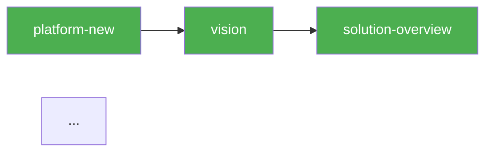

# Implementation Plan: Directory Unification

**Branch**: `003-directory-unification` | **Date**: 2026-03-29 | **Spec**: [spec.md](spec.md)
**Input**: Feature specification from `/specs/003-directory-unification/spec.md`

## Summary

Unificar SpecKit e Madruga num diretório compartilhado (`epics/<NNN>/`), implementar DAG de dois níveis (L1=platform, L2=epic cycle), renomear 5 skills, merge folder-arch no blueprint, adicionar HANDOFF blocks, e criar skill `/pipeline` unificado. Todas as mudanças são ajustes cirúrgicos em scripts, templates, e knowledge files existentes.

## Technical Context

**Language/Version**: Bash 5.x + Python 3.11+ (stdlib only)
**Primary Dependencies**: pyyaml (já presente), sqlite3 (stdlib)
**Storage**: SQLite WAL mode (`.pipeline/madruga.db`) — schema já inclui `epic_nodes` table (001_initial.sql)
**Testing**: pytest (existente, 51 testes) + bash testing manual
**Target Platform**: WSL2 Ubuntu (local)
**Project Type**: CLI tools + documentation pipeline
**Performance Goals**: `/pipeline` response < 5s
**Constraints**: Zero external deps (Python stdlib only), backward compat para `specs/` default
**Scale/Scope**: Single-operator, ~30 files modified

## Constitution Check

*GATE: Must pass before Phase 0 research. Re-check after Phase 1 design.*

| Principle | Status | Notes |
|-----------|--------|-------|
| I. Pragmatism | PASS | Adjustments cirúrgicos, sem over-engineering |
| II. Automate | PASS | Scripts existentes ganham flags, não novos scripts |
| III. Structured Knowledge | PASS | DAG knowledge atualizado, HANDOFF blocks formalizados |
| IV. Fast Action | PASS | TDD — testes para migration, `--base-dir`, `--epic` |
| V. Trade-offs | PASS | Documentado em context.md (10 decisões com alternativas) |
| VI. Brutal Honesty | PASS | — |
| VII. TDD | PASS | Testes para: migration SQL, `--base-dir` path resolution, `--epic` flag, `/pipeline` output |
| VIII. Collaborative | PASS | Discuss phase completed |
| IX. Observability | PASS | `/pipeline` unificado + SQLite L2 |

**Violations**: None.

## Project Structure

### Documentation (this feature)

```text
specs/003-directory-unification/
├── spec.md              # Feature specification
├── plan.md              # This file
├── research.md          # Phase 0 output
├── data-model.md        # Phase 1 output
├── checklists/
│   └── requirements.md  # Spec quality checklist
└── tasks.md             # Phase 2 output (from /speckit.tasks)
```

### Source Code (repository root)

```text
# Files MODIFIED (not new):
.specify/scripts/bash/
├── common.sh                        # --base-dir support in find_feature_dir_by_prefix + get_feature_paths
├── create-new-feature.sh            # --base-dir flag, SPECS_DIR override
├── setup-plan.sh                    # --base-dir pass-through to common.sh
├── check-prerequisites.sh           # --base-dir pass-through to common.sh
└── check-platform-prerequisites.sh  # --epic flag, epic_cycle node checking

.specify/scripts/
└── db.py                            # Already has epic_nodes CRUD — no changes needed

.pipeline/migrations/
└── (no new migration — epic_nodes already in 001_initial.sql)

.specify/templates/platform/template/
└── platform.yaml.jinja              # Add epic_cycle section

.claude/commands/madruga/
├── vision-one-pager.md → vision.md           # RENAME
├── discuss.md → epic-context.md              # RENAME
├── adr-gen.md → adr.md                       # RENAME
├── test-ai.md → qa.md                        # RENAME
├── folder-arch.md                            # DELETE (merge into blueprint)
├── pipeline-status.md                        # DELETE (merge into pipeline.md)
├── pipeline-next.md                          # DELETE (merge into pipeline.md)
└── pipeline.md                               # NEW (unified status+next)

.claude/knowledge/
└── pipeline-dag-knowledge.md        # Update: 13 nodes, renamed skills, handoff_template, epic cycle

platforms/madruga-ai/
└── platform.yaml                    # Update: 13 nodes, renamed skills, epic_cycle section

CLAUDE.md                            # Update: all renamed skill references
```

**Structure Decision**: No structural changes. All modifications are to existing files. The only new file is `.claude/commands/madruga/pipeline.md` (merge of 2 existing skills).

## Complexity Tracking

No constitution violations to justify.

## Key Discovery: epic_nodes Already Exists

The `001_initial.sql` migration already created the `epic_nodes` table (L2 schema) and `db.py` already has `upsert_epic_node()`, `get_epic_nodes()`, and `get_epic_status()`. **No new migration needed.** This simplifies the epic significantly — the SQLite foundation is already in place.

## Implementation Phases

### Phase 1: Filesystem & Script Changes (~3h)

**1a. Migrate `specs/` → `epics/`**
- Move `specs/001-atomic-skills-dag-pipeline/` → `platforms/madruga-ai/epics/005-atomic-skills-dag/`
- Move `specs/002-sqlite-foundation/` → `platforms/madruga-ai/epics/006-sqlite-foundation/`
- Delete `specs/` directory (after this feature's own spec moves)
- Note: `specs/003-directory-unification/` (this feature) stays until implementation completes, then moves too

**1b. `--base-dir` in SpecKit scripts**

Target: `common.sh`, `create-new-feature.sh`, `setup-plan.sh`, `check-prerequisites.sh`

Changes to `common.sh`:
- `find_feature_dir_by_prefix()`: accept optional 3rd arg `base_dir` (default: `$repo_root/specs`)
- `get_feature_paths()`: check env var `SPECIFY_BASE_DIR` or accept `--base-dir` upstream
- When `--base-dir` is set, skip branch prefix matching — use `base_dir` directly as `FEATURE_DIR`

Changes to `create-new-feature.sh`:
- Add `--base-dir <path>` flag parsing
- When set: `SPECS_DIR="$BASE_DIR"` instead of `$REPO_ROOT/specs`
- Pass `--base-dir` to downstream calls
- Help text updated

Changes to `setup-plan.sh` and `check-prerequisites.sh`:
- Add `--base-dir <path>` flag parsing
- Pass to `common.sh` via env var `SPECIFY_BASE_DIR`

**1c. `--epic` flag in `check-platform-prerequisites.sh`**

New flags:
- `--epic <NNN-slug>` — check epic cycle node prerequisites
- Uses `epic_cycle` section from `platform.yaml` for node definitions
- Checks epic dir filesystem for output existence
- With `--use-db`: queries `epic_nodes` table

Logic when `--epic` is set:
1. Read `platform.yaml` → `epic_cycle.nodes`
2. Resolve `{epic}` template in outputs to actual epic dir path
3. Same status/skill logic as L1 but scoped to epic cycle nodes

### Phase 2: Template & Manifest Changes (~2h)

**2a. `epic_cycle` in Copier template**

Add to `platform.yaml.jinja` after `pipeline.nodes`:
```yaml
  epic_cycle:
    nodes:
      - id: epic-context
        skill: "madruga:epic-context"
        outputs: ["{epic}/context.md"]
        depends: []
        gate: human

      - id: specify
        skill: "speckit.specify"
        outputs: ["{epic}/spec.md"]
        depends: ["epic-context"]
        gate: human

      - id: clarify
        skill: "speckit.clarify"
        outputs: ["{epic}/spec.md"]
        depends: ["specify"]
        gate: human
        optional: true

      - id: plan
        skill: "speckit.plan"
        outputs: ["{epic}/plan.md"]
        depends: ["specify"]
        gate: human

      - id: tasks
        skill: "speckit.tasks"
        outputs: ["{epic}/tasks.md"]
        depends: ["plan"]
        gate: human

      - id: analyze
        skill: "speckit.analyze"
        outputs: ["{epic}/analyze-report.md"]
        depends: ["tasks"]
        gate: auto

      - id: implement
        skill: "speckit.implement"
        outputs: ["{epic}/tasks.md"]
        depends: ["analyze"]
        gate: auto

      - id: verify
        skill: "madruga:verify"
        outputs: ["{epic}/verify-report.md"]
        depends: ["implement"]
        gate: auto-escalate

      - id: qa
        skill: "madruga:qa"
        outputs: ["{epic}/qa-report.md"]
        depends: ["verify"]
        gate: human
        optional: true

      - id: reconcile
        skill: "madruga:reconcile"
        outputs: ["{epic}/reconcile-report.md"]
        depends: ["verify"]
        gate: human
        optional: true
```

Also add to `platforms/madruga-ai/platform.yaml` (live manifest).

**2b. Merge folder-arch into blueprint**

- Read current `engineering/folder-structure.md` content from madruga-ai
- Read blueprint template (`.specify/templates/platform/template/engineering/blueprint.md.jinja`)
- Add "## Folder Structure" section to blueprint template
- Delete `folder-arch.md` skill
- Delete `engineering/folder-structure.md.jinja` template
- Update DAG: remove `folder-arch` node, change `domain-model` depends from `["blueprint", "business-process"]` (already correct — `domain-model` depends on `blueprint`, not `folder-arch`)

### Phase 3: Skill Renaming & Knowledge Update (~2h)

**3a. Atomic rename commit**

| Old name | New name | File |
|----------|----------|------|
| `vision-one-pager.md` | `vision.md` | `.claude/commands/madruga/` |
| `discuss.md` | `epic-context.md` | `.claude/commands/madruga/` |
| `adr-gen.md` | `adr.md` | `.claude/commands/madruga/` |
| `test-ai.md` | `qa.md` | `.claude/commands/madruga/` |
| `pipeline-status.md` | — (delete) | `.claude/commands/madruga/` |
| `pipeline-next.md` | — (delete) | `.claude/commands/madruga/` |
| `folder-arch.md` | — (delete) | `.claude/commands/madruga/` |

Internal content updates within each renamed skill:
- Skill name references in frontmatter
- Usage examples in instructions
- Handoff references to next skill

**3b. Update all references**

Files to update:
- `CLAUDE.md` — all skill name references, DAG table, per-epic cycle table
- `.claude/knowledge/pipeline-dag-knowledge.md` — canonical DAG (14→13 nodes), renamed skills, epic cycle table, handoff examples
- `platforms/madruga-ai/platform.yaml` — node skill names, remove folder-arch
- `.specify/templates/platform/template/platform.yaml.jinja` — same changes

**3c. Validation**: `grep -r "discuss\|adr-gen\|test-ai\|vision-one-pager\|folder-arch\|pipeline-status\|pipeline-next" .claude/ CLAUDE.md platforms/madruga-ai/platform.yaml .specify/templates/` must return zero results.

### Phase 4: HANDOFF Blocks & `/pipeline` Unified (~2h)

**4a. HANDOFF block template**

Add to each skill with gate `human` or `1-way-door` — a YAML block in the output template section:

```yaml
---
handoff:
  from: <current-skill>
  to: <next-skill>
  context: "<free text summarizing key decisions and constraints for next skill>"
  blockers: []
```

Add `handoff_template` field to each node in `pipeline-dag-knowledge.md`:

```yaml
| vision | madruga:vision | ... | handoff_template: {to: solution-overview, context: "Vision validated..."} |
```

**4b. `/pipeline` unified skill**

New file: `.claude/commands/madruga/pipeline.md`

Combines logic of `pipeline-status.md` and `pipeline-next.md`:

1. Read platform name from args
2. Run `check-platform-prerequisites.sh --json --platform <name> --status --use-db`
3. For L1: render table + Mermaid with colors
4. For each epic in DB: query `epic_nodes`, render L2 table + Mermaid
5. Determine next recommended step (L1 or L2)
6. If no DB: fallback to filesystem-only status (current behavior)

Mermaid template:


### Phase 5: Tests (~1h)

- `test_base_dir.sh`: test `--base-dir` flag in `create-new-feature.sh`, `setup-plan.sh`
- `test_epic_flag.sh`: test `--epic` flag in `check-platform-prerequisites.sh`
- `test_copier_epic_cycle.py`: test Copier template generates `epic_cycle` in platform.yaml
- `test_pipeline_skill.sh`: test `/pipeline` output format
- Existing pytest suite must pass with zero regressions
