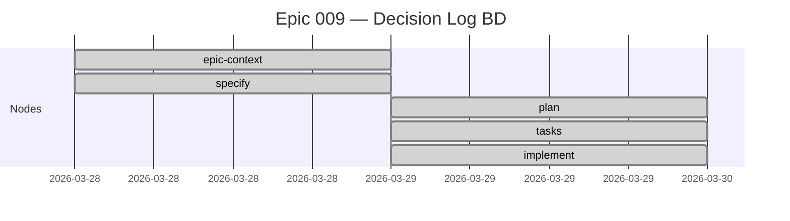

# Epic 010 — Pipeline Dashboard — Implementation Plan

## 1. Technical Context

| Item | Value |
|------|-------|
| Python | 3.11+ (stdlib only: sqlite3, json, pathlib, yaml) |
| Portal | Astro 6 + Starlight + React 19 |
| DAG lib | `@xyflow/react` (v12+) — custom nodes, edges, fitView |
| Layout | `elkjs` — layered algorithm, direction DOWN |
| Charts | `astro-mermaid` (já no bundle) — Gantt syntax |
| DB | SQLite WAL mode (`.pipeline/madruga.db`) |
| Tests | pytest (Python) |

## 2. Project Structure

```
.specify/scripts/
├── platform.py                          # MODIFY: add cmd_status()
└── tests/
    └── test_status.py                   # NEW: tests for cmd_status

portal/
├── package.json                         # MODIFY: add deps + scripts
├── src/
│   ├── data/
│   │   ├── .gitignore                   # NEW: ignore pipeline-status.json
│   │   └── pipeline-status.json         # GENERATED at build-time
│   ├── pages/
│   │   └── dashboard.astro              # NEW: dashboard page
│   └── components/
│       └── dashboard/
│           └── PipelineDAG.tsx           # NEW: React island
└── astro.config.mjs                     # MODIFY: add dashboard to sidebar (optional)
```

## 3. JSON Contract — `pipeline-status.json`

```typescript
interface PipelineStatus {
  generated_at: string; // ISO 8601
  platforms: Platform[];
}

interface Platform {
  id: string;
  title: string;
  lifecycle: string;
  l1: {
    total: number;
    done: number;
    pending: number;
    stale: number;
    blocked: number;
    skipped: number;
    progress_pct: number;
    nodes: PipelineNode[];
  };
  l2: {
    epics: EpicProgress[];
  };
}

interface PipelineNode {
  id: string;
  status: 'done' | 'pending' | 'blocked' | 'skipped' | 'stale';
  layer: 'business' | 'research' | 'engineering' | 'planning';
  gate: 'human' | 'auto' | '1-way-door' | 'auto-escalate';
  depends: string[];
  optional: boolean;
  outputs: string[];       // file paths relative to platform dir
  completed_at: string | null;
}

interface EpicProgress {
  id: string;
  title: string;
  status: string;
  total: number;
  done: number;
  pending: number;
  progress_pct: number;
  nodes: EpicNode[];
}

interface EpicNode {
  id: string;
  status: string;
  completed_at: string | null;
}
```

**Data flow**: `db.py` → `cmd_status()` merges DB data + `platform.yaml` DAG edges → JSON stdout → `pipeline-status.json` → portal import.

O merge é necessário porque o DB não armazena `layer`, `gate`, `depends`, `optional` — esses campos vêm do `platform.yaml`.

## 4. Component Contract — `PipelineDAG.tsx`

```typescript
interface PipelineDAGProps {
  platforms: Platform[];  // from pipeline-status.json
}

// Internal state
interface DAGState {
  selectedPlatform: string;  // platform id or 'all'
  showL2: boolean;           // toggle L1+L2
}
```

### Mapeamento ELK → React Flow

```typescript
// ELK graph input
const elkGraph = {
  id: 'root',
  layoutOptions: {
    'elk.algorithm': 'layered',
    'elk.direction': 'DOWN',
    'elk.spacing.nodeNode': 40,
    'elk.layered.spacing.nodeNodeBetweenLayers': 60,
  },
  children: nodes.map(n => ({
    id: n.id,
    width: 160,
    height: 50,
  })),
  edges: edges.map(e => ({
    id: e.id,
    sources: [e.source],
    targets: [e.target],
  })),
};

// After ELK layout, convert to React Flow nodes
const rfNodes = elkResult.children.map(n => ({
  id: n.id,
  position: { x: n.x, y: n.y },
  data: { ...originalNodeData[n.id] },
  type: 'pipeline',
}));
```

### Custom Node — Status Colors

```typescript
const STATUS_COLORS: Record<string, string> = {
  done: '#4CAF50',     // green
  pending: '#FFC107',  // yellow
  blocked: '#F44336',  // red
  skipped: '#9E9E9E',  // gray
  stale: '#FF9800',    // orange
};
```

### Navigation

Click handler no nó usa o primeiro arquivo em `outputs[]` para construir URL:
- `business/vision.md` → `/<platform>/business/vision/`
- `engineering/domain-model.md` → `/<platform>/engineering/domain-model/`
- Pattern: remove `.md`, prepend `/<platform>/`

## 5. Build Integration

```json
{
  "scripts": {
    "predev": "python3 ../.specify/scripts/platform.py status --all --json > src/data/pipeline-status.json 2>/dev/null || echo '{\"generated_at\":\"\",\"platforms\":[]}' > src/data/pipeline-status.json",
    "prebuild": "python3 ../.specify/scripts/platform.py status --all --json > src/data/pipeline-status.json 2>/dev/null || echo '{\"generated_at\":\"\",\"platforms\":[]}' > src/data/pipeline-status.json"
  }
}
```

**Fallback**: se Python não estiver disponível (ex: CI sem Python), gera JSON vazio — portal renderiza estado vazio sem quebrar build.

## 6. Heatmap Design

Tabela HTML pura renderizada server-side no Astro (zero JS):

```
         | platform-new | vision | solution | ... | roadmap | Progress |
prosauai   |     ●        |   ●    |    ●     | ... |    ○    |  53.8%   |
madruga  |     ●        |   ●    |    ●     | ... |    ○    |  69.2%   |
```

Cada célula é um `<td>` com classe CSS: `status-done`, `status-pending`, `status-blocked`, `status-skipped`, `status-stale`. Cores via CSS custom properties para respeitar dark mode do Starlight.

## 7. Burndown — Mermaid Gantt

Gerado server-side no Astro a partir dos dados JSON:



Só renderiza para epics com ≥2 nós completados (com `completed_at` timestamp).

## 8. Funções Existentes a Reutilizar

### db.py (NÃO recriar)
- `get_conn()` — conexão WAL mode
- `get_pipeline_nodes(conn, platform_id)` — todos os nós L1
- `get_platform_status(conn, platform_id)` — counts agregados
- `get_stale_nodes(conn, platform_id, dag_edges)` — nós stale
- `get_epics(conn, platform_id)` — todos os epics
- `get_epic_nodes(conn, platform_id, epic_id)` — nós L2
- `get_epic_status(conn, platform_id, epic_id)` — counts L2
- `get_events(conn, platform_id)` — eventos históricos

### platform.py (padrão para novo comando)
- `_discover_platforms()` — lista plataformas
- `_ok()`, `_warn()`, `_error()` — output formatado
- `main()` — dispatch via `sys.argv[1]`

### Portal (padrão para componentes)
- `LikeC4Diagram.tsx` — ErrorBoundary + Suspense + lazy loading
- `index.astro` — StarlightPage wrapper pattern
- `platforms.mjs` — `discoverPlatforms()`

## 9. Dependências Novas

| Package | Version | Propósito | Bundle |
|---------|---------|-----------|--------|
| `@xyflow/react` | ^12.0.0 | DAG interativo | ~150kb (island) |
| `elkjs` | ^0.9.0 | Auto-layout hierárquico | ~80kb (island) |

Python: nenhuma (stdlib only).

## 10. Riscos e Mitigações

| Risco | Prob. | Impacto | Mitigação |
|-------|-------|---------|-----------|
| `@xyflow/react` incompatível com React 19 | Baixa | Alto | Verificar na analyze. Fallback: HTML+SVG manual |
| `elkjs` falha em Astro island (SSR) | Média | Médio | `client:load` garante client-side only. Import dinâmico |
| `prebuild` falha em CI sem Python | Baixa | Baixo | Fallback JSON vazio no script |
| Build time > 30s | Baixa | Médio | Island é lazy, não afeta SSG |
| `pipeline_nodes` não tem layer/gate | Certa | Baixo | Merge com `platform.yaml` no `cmd_status()` |

---
handoff:
  from: plan
  to: tasks
  context: "Plano técnico completo com JSON contract, component API, ELK config, e build integration. Tasks deve decompor em tarefas executáveis."
  blockers: []
