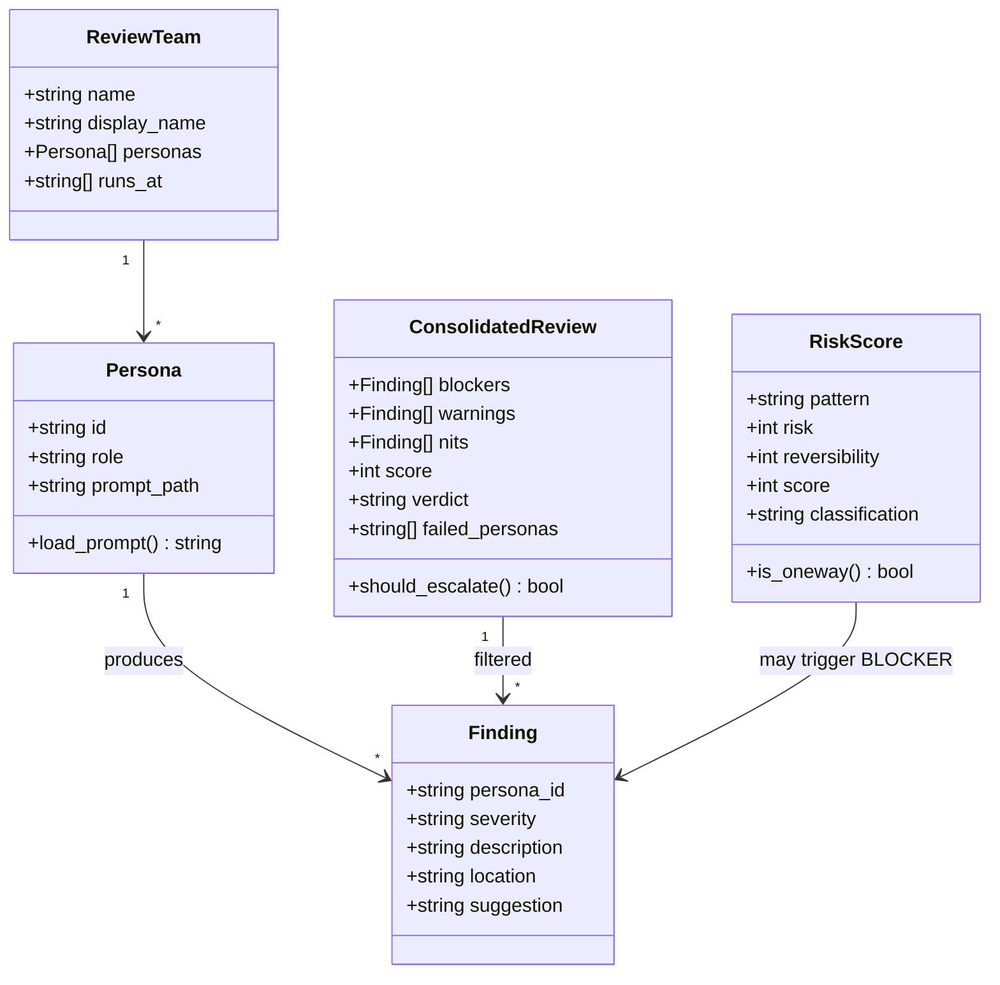

# Implementation Plan: Tech Reviewers + Decision Classifier

**Branch**: `epic/madruga-ai/015-subagent-judge` | **Date**: 2026-04-01 | **Spec**: [spec.md](spec.md)
**Input**: Feature specification from `platforms/madruga-ai/epics/015-subagent-judge/spec.md`

## Summary

Implementar sistema de review multi-perspectiva extensível (**tech-reviewers**) com 4 personas paralelas + 1 Judge pass, substituindo o verify (L2) e o Tier 3 (L1). Inclui Decision Classifier independente com score de risco (Risco × Reversibilidade) para escalação de 1-way-doors via Telegram. Implementação 100% via knowledge files + YAML config — zero runtime Python custom para o Judge.

## Technical Context

**Language/Version**: Python 3.11+ (para telegram_adapter, testes) + Markdown (knowledge files, prompts de personas)
**Primary Dependencies**: Claude Code Agent tool (subagents paralelos), aiogram 3.x (Telegram), pyyaml
**Storage**: SQLite WAL mode (.pipeline/madruga.db) — review results em pipeline_runs, decisions em events
**Testing**: pytest (telegram_adapter, decision classifier score calculation, YAML config parsing)
**Target Platform**: WSL2 Linux (local, single-operator)
**Project Type**: Pipeline tooling (knowledge files + scripts)
**Performance Goals**: Review completo (4 personas + judge) em <3 min. Zero overhead para decisões 2-way-door.
**Constraints**: Custo de tokens ~$1-3 por review cycle. Max 4 subagents paralelos por invocação.
**Scale/Scope**: ~3 nodes 1-way-door no L1, 1 node judge no L2 por epic. Baixo volume inicial.

## Constitution Check

*GATE: Must pass before Phase 0 research. Re-check after Phase 1 design.*

| # | Princípio | Status | Justificativa |
|---|-----------|--------|---------------|
| I | Pragmatismo / Simplicidade | ✅ PASS | Zero runtime Python custom para Judge. Knowledge files + YAML — o mais simples possível. Agent tool nativo = zero dependência nova |
| II | Automatizar tarefas repetitivas | ✅ PASS | Review multi-perspectiva automatizado substitui review manual genérico |
| III | Conhecimento estruturado | ✅ PASS | Personas em arquivos separados, config em YAML, prompts reutilizáveis |
| IV | Ação rápida > planejamento excessivo | ✅ PASS | Config extensível mas implementamos apenas 1 time (engineering). Sem over-engineering |
| V | Alternativas e trade-offs | ✅ PASS | Todas as decisões documentadas em context.md com ≥2 alternativas |
| VI | Honestidade brutal | ✅ PASS | Judge filtra noise — findings devem ser factuais e acionáveis |
| VII | TDD | ✅ PASS | Testes para score calculation, YAML parsing, telegram_adapter. Knowledge files não têm testes unitários (são prompts) |
| VIII | Decisão colaborativa | ✅ PASS | Todas as decisões validadas pelo operador no context.md |
| IX | Observabilidade | ✅ PASS | Review results persistidos em SQLite. Estrutura de logging existente (structlog) |

## Project Structure

### Documentation (this feature)

```text
platforms/madruga-ai/epics/015-subagent-judge/
├── pitch.md
├── context.md
├── spec.md
├── plan.md              # This file
├── research.md          # Phase 0 output
├── data-model.md        # Phase 1 output
├── checklists/
│   └── requirements.md
└── tasks.md             # Phase 2 output (/speckit.tasks)
```

### Source Code (repository root)

```text
.claude/knowledge/
├── personas/                          # NEW — prompts de cada persona
│   ├── arch-reviewer.md
│   ├── bug-hunter.md
│   ├── simplifier.md
│   └── stress-tester.md
├── judge-knowledge.md                 # NEW — lógica de orquestração do Judge
├── decision-classifier-knowledge.md   # NEW — tabela de scores + lógica inline
├── pipeline-contract-base.md          # MODIFIED — Tier 3 usa Judge
└── (existentes inalterados)

.claude/commands/madruga/
├── judge.md                           # NEW — skill que substitui verify
└── verify.md                          # DEPRECATED — redirect para judge

platforms/madruga-ai/
└── platform.yaml                      # MODIFIED — epic_cycle: verify → judge

platforms/fulano/
└── platform.yaml                      # MODIFIED — epic_cycle: verify → judge

.specify/scripts/
├── telegram_bot.py                    # MODIFIED — notify_oneway_decision()
├── telegram_adapter.py                # MODIFIED — ask_oneway_decision()
├── decision_classifier.py             # NEW — score calculation + pattern table (~80-120 LOC)
└── tests/
    ├── test_decision_classifier.py    # NEW
    ├── test_telegram_adapter.py       # MODIFIED — novos testes
    └── test_telegram_bot.py           # MODIFIED — novos testes
```

**Structure Decision**: A maioria da implementação são knowledge files e prompts (markdown). Python novo é mínimo: ~80-120 LOC para decision_classifier.py (função pura de score calculation) + extensões no telegram_adapter/bot.

## Research

### R1: Agent tool — invocação paralela de subagents

**Decision**: Usar Agent tool nativo com 4 chamadas paralelas numa única mensagem.
**Rationale**: Já provado no pipeline (Tier 3 usa 1 subagent, pm-discovery usa 4 paralelos). Zero overhead de orquestração.
**Pattern de invocação** (do pipeline-contract-base.md existente):
```
Agent tool, subagent_type="general-purpose"
- Prompt contém: artifact completo + persona prompt + instruções de output
- 4 chamadas na mesma mensagem = paralelo nativo
```

### R2: Formato de output das personas — schema obrigatório

**Decision**: Cada persona retorna texto estruturado com formato obrigatório enforced no prompt.
**Rationale**: Subagents retornam texto (não JSON parseável). Usar formato consistente com delimitadores claros que o Judge pode interpretar.
**Formato obrigatório** (cada persona DEVE seguir — enforced no prompt):
```
PERSONA: <persona-id>
FINDINGS:
- [BLOCKER] <description> | LOCATION: <file:line or section> | SUGGESTION: <action>
- [WARNING] <description> | LOCATION: <file:line or section> | SUGGESTION: <action>
- [NIT] <description> | LOCATION: <file:line or section> | SUGGESTION: <action>
SUMMARY: <1-2 sentences>
```
Se a persona retornar output que não segue este formato, o Judge trata como persona falha (ver R7).

### R3: Score do Judge — regras de decisão

**Decision**: Score = `100 - (blockers×20 + warnings×5 + nits×1)`, mínimo 0.
**Rationale**: Simples, determinístico, threshold para auto-escalate (score <80 = escala).
**Alternativa rejeitada**: Score ponderado por persona — complexidade sem ganho no volume atual.

**Regras de decisão do Judge:**
1. O Judge recebe findings agregados de todas as personas
2. Para cada finding, avalia: (a) **Accuracy** — cita evidência real no código/artefato? Se inventa um problema que não existe no código, descarta. (b) **Actionability** — tem ação concreta sugerida? "Poderia ser melhor" sem sugestão = descartado. (c) **Severity** — o impacto justifica a classificação? Um NIT que a persona marcou como BLOCKER = rebaixado.
3. O Judge NÃO inventa findings novos — apenas filtra e reclassifica os existentes
4. Se todas as personas concordam em um BLOCKER → BLOCKER confirmado
5. Se apenas 1 persona levanta um BLOCKER e as demais não mencionam → Judge avalia a evidência. Se fraca, rebaixa para WARNING
6. Output final: findings filtrados + score + verdict (pass ≥80, fail <80)

### R4: Decision Classifier — implementação + calibração

**Decision**: Módulo Python puro (`decision_classifier.py`) com tabela de patterns e função `classify_decision(description: str) -> RiskScore`.
**Rationale**: Score calculation é determinístico — ideal para Python (testável com pytest). A tabela de patterns fica no knowledge file (legível), a função de cálculo fica em Python (testável).
**Alternativa rejeitada**: Tudo no knowledge file — não testável com pytest.

**Calibração do threshold (≥15) contra decisões reais:**

| Decisão real (de ADRs existentes) | Risk | Reversibility | Score | Classificação | Correto? |
|-----------------------------------|------|---------------|-------|---------------|----------|
| ADR-012: Adotar SQLite WAL mode | 4 | 3 (dias p/ mudar storage) | 12 | 2-way (auto) | ✅ Reversível com migração |
| ADR-018: Substituir WhatsApp por Telegram | 5 | 5 (impossível p/ usuários) | 25 | 1-way → Telegram | ✅ Irreversível |
| ADR-002: Usar Copier templates | 3 | 2 (horas p/ trocar) | 6 | 2-way (auto) | ✅ Reversível |
| ADR-010: claude -p como subprocess | 4 | 3 (dias p/ mudar interface) | 12 | 2-way (auto) | ✅ Reversível, pode mudar |
| ADR-013: Decision gates 1-way/2-way | 5 | 5 (impossível, governa pipeline) | 25 | 1-way → Telegram | ✅ Irreversível |
| Drop column de banco em produção | 5 | 5 (impossível) | 25 | 1-way → Telegram | ✅ Irreversível |
| Rename internal variable | 1 | 1 (minutos) | 1 | 2-way (auto) | ✅ Trivial |

Threshold 15 corretamente separa decisões reversíveis (≤12) de irreversíveis (≥15) nos 7 casos calibrados. Gap entre 12 e 15 dá margem para edge cases.

### R5: Extensão do telegram_adapter

**Decision**: Novo método `ask_oneway_decision()` na classe `TelegramAdapter` + função `notify_oneway_decision()` no `telegram_bot.py`.
**Rationale**: Segue o pattern existente (`notify_gate` + `ask_choice`). Reutiliza inline keyboard, backoff, offset persistence.
**Formato da mensagem Telegram**:
```html
<b>Pipeline — Decisão 1-Way-Door</b>

<b>Skill:</b> <code>{skill}</code>
<b>Plataforma:</b> {platform}
<b>Epic:</b> {epic}

<b>Decisão:</b> {description}
<b>Score de Risco:</b> {score} (Risco={risk} × Reversibilidade={reversibility})
<b>Contexto:</b> {context}

<b>Alternativas:</b>
1. {alt_1}
2. {alt_2}
```
Botões: `✅ Aprovar` / `❌ Rejeitar`

**Failure mode**: Se Telegram indisponível → **fail closed** (pipeline pausa e aguarda). Decisões 1-way-door são por definição irreversíveis — prosseguir sem notificação é pior que pausar. Retry com backoff exponencial (já implementado no telegram_adapter).

### R6: Migração verify → judge

**Decision**: Criar skill `/madruga:judge` nova. Renomear `verify.md` para manter redirecionamento temporário (1 epic de transição).
**Rationale**: Não quebrar referências existentes no CLAUDE.md e em relatórios antigos.
**DAG change**: `platform.yaml` epic_cycle: node id muda de `verify` para `judge`, skill de `madruga:verify` para `madruga:judge`, output de `verify-report.md` para `judge-report.md`.

**Nota sobre separação verify vs judge**: O analyze (pre + post) já cobre aderência factual (spec vs tasks vs código). O judge foca em qualidade de engenharia (bugs, arquitetura, simplicidade, stress). Não há perda funcional — a checagem factual fica no analyze, a review qualitativa fica no judge.

### R7: Error handling — subagent failure

**Decision**: Se uma persona falha (timeout, output malformado, erro), o Judge continua com as personas que completaram.
**Rationale**: Review parcial (3 de 4 personas) é melhor que nenhum review. A persona que falhou é reportada no judge-report.md.

**Regras de degradação:**
- 4/4 personas completaram → review normal, score calculado sobre todos os findings
- 3/4 completaram → review parcial, score calculado sobre findings disponíveis. Report inclui `personas_failed: [<id>]` e WARNING: "review incompleto, persona X falhou"
- 2/4 completaram → review parcial, score calculado mas com WARNING escalado: "review significativamente incompleto"
- 1/4 ou 0/4 completaram → **FAIL** — escala para humano independente do score. "Review falhou — personas insuficientes para avaliação confiável"
- Output malformado (não segue schema R2) → tratado como falha da persona

**Detecção de falha**: Se o subagent retorna resultado sem o formato obrigatório (sem "PERSONA:" header, sem "FINDINGS:" section), é tratado como output malformado.

## Data Model

### Entidades



### Storage

| Dado | Destino | Formato | Existente? |
|------|---------|---------|------------|
| Judge report | `epics/<NNN>/judge-report.md` (filesystem) | Markdown | Novo (substitui verify-report.md) |
| Review JSON | `pipeline_runs.payload` (SQLite) | JSON | Existente (campo payload) |
| Decision events | `events` (SQLite) | Event log | Existente |
| Team config | `.claude/knowledge/judge-config.yaml` | YAML | Novo |
| Persona prompts | `.claude/knowledge/personas/*.md` | Markdown | Novo |
| Risk patterns | `.claude/knowledge/decision-classifier-knowledge.md` | Markdown table | Novo |
| Score calculation | `.specify/scripts/decision_classifier.py` | Python | Novo |

### YAML Config Schema

```yaml
# .claude/knowledge/judge-config.yaml
review_teams:
  engineering:
    name: "Tech Reviewers"
    personas:
      - id: arch-reviewer
        role: "Architecture Reviewer"
        prompt: ".claude/knowledge/personas/arch-reviewer.md"
      - id: bug-hunter
        role: "Bug Hunter"
        prompt: ".claude/knowledge/personas/bug-hunter.md"
      - id: simplifier
        role: "Simplifier"
        prompt: ".claude/knowledge/personas/simplifier.md"
      - id: stress-tester
        role: "Stress Tester"
        prompt: ".claude/knowledge/personas/stress-tester.md"
    runs_at:
      - tier3-l1     # 1-way-door gates no L1
      - judge-l2     # Node judge no L2 (substitui verify)

# Extensão futura:
#  product:
#    name: "Product Reviewers"
#    personas:
#      - id: pm-reviewer
#        prompt: ".claude/knowledge/personas/pm-reviewer.md"
#    runs_at: [specify, plan]
```

## Contracts

### Judge Report Contract (judge-report.md)

```markdown
---
title: "Judge Report — Epic <NNN>"
score: <N>
verdict: pass|fail
team: engineering
personas_run: [arch-reviewer, bug-hunter, simplifier, stress-tester]
personas_failed: []
updated: YYYY-MM-DD
---
# Judge Report — Epic <NNN>

## Score: <N>%

**Verdict:** <PASS|FAIL>
**Time:** <MM>m<SS>s
**Team:** <team-name> (<N> personas)

## Findings

### BLOCKERs (<N>)

| # | Persona | Finding | Localização | Sugestão |
|---|---------|---------|-------------|----------|

### WARNINGs (<N>)

| # | Persona | Finding | Localização | Sugestão |
|---|---------|---------|-------------|----------|

### NITs (<N>)

| # | Persona | Finding | Localização | Sugestão |
|---|---------|---------|-------------|----------|

## Safety Net — Decisões 1-Way-Door

| # | Decisão | Score de Risco | Detectado por Classifier? | Veredicto |
|---|---------|----------------|--------------------------|-----------|

## Personas que Falharam

[Lista de personas que deram timeout ou erro, se houver]

## Recomendações

[Ações sugeridas com base nos findings]
```

### Decision Classifier Score Contract

```python
# decision_classifier.py

@dataclass
class RiskScore:
    pattern: str        # Pattern matched
    risk: int           # 1-5
    reversibility: int  # 1-5
    score: int          # risk * reversibility
    classification: str # "1-way-door" or "2-way-door"

THRESHOLD = 15  # score >= 15 = 1-way-door

def classify_decision(description: str) -> RiskScore:
    """Match description against pattern table, return RiskScore."""
```

### Telegram Decision Notification Contract

```python
# telegram_bot.py — novo
async def notify_oneway_decision(
    adapter: TelegramAdapter,
    chat_id: int,
    decision: dict,  # {description, context, alternatives, risk_score}
    conn: sqlite3.Connection,
) -> None:
    """Notifica operador sobre decisão 1-way-door via Telegram."""
```

## Complexity Tracking

Nenhuma violação de constitution. Sem complexity budget necessário.

---
handoff:
  from: speckit.plan
  to: speckit.tasks
  context: "Plan completo com research, data model, contracts e structure. 7 knowledge files novos, 1 Python novo (decision_classifier ~50 LOC), extensões em telegram_adapter/bot. Verify → Judge no DAG. Tier 3 → Judge no L1."
  blockers: []
  confidence: Alta
  kill_criteria: "Se Agent tool não suportar 4 subagents paralelos, ou se custo de tokens por review exceder $10"
