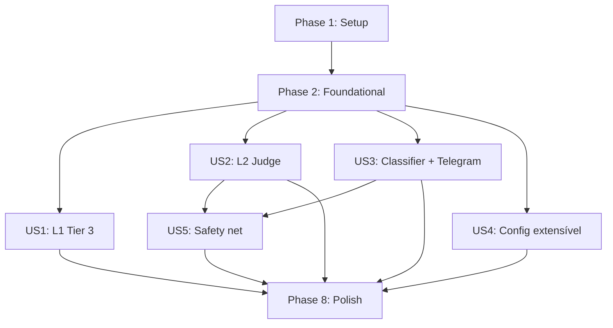

# Tasks: Tech Reviewers + Decision Classifier

**Input**: Design documents from `platforms/madruga-ai/epics/015-subagent-judge/`
**Prerequisites**: plan.md (required), spec.md (required for user stories)

## Format: `[ID] [P?] [Story] Description`

- **[P]**: Can run in parallel (different files, no dependencies)
- **[Story]**: Which user story this task belongs to (e.g., US1, US2, US3)
- Include exact file paths in descriptions

---

## Phase 1: Setup (YAML Config + Persona Prompts)

**Purpose**: Criar a fundação do sistema — config extensível + prompts das 4 personas

- [x] T001 Create YAML config file with engineering team definition in .claude/knowledge/judge-config.yaml
- [x] T002 Create personas directory at .claude/knowledge/personas/
- [x] T003 [P] Create Architecture Reviewer persona prompt in .claude/knowledge/personas/arch-reviewer.md — focus: drift de ADRs, violações de blueprint, acoplamento, MECE. Output MUST follow R2 schema (PERSONA/FINDINGS/SUMMARY format)
- [x] T004 [P] Create Bug Hunter persona prompt in .claude/knowledge/personas/bug-hunter.md — focus: edge cases, error handling, segurança, null safety, OWASP. Output MUST follow R2 schema
- [x] T005 [P] Create Simplifier persona prompt in .claude/knowledge/personas/simplifier.md — focus: over-engineering, dead code, alternativas mais simples, unnecessary abstractions. Output MUST follow R2 schema
- [x] T006 [P] Create Stress Tester persona prompt in .claude/knowledge/personas/stress-tester.md — focus: scale 10x, failure modes, concurrency, resource exhaustion. Output MUST follow R2 schema

---

## Phase 2: Foundational (Judge Knowledge + Decision Classifier)

**Purpose**: Knowledge files de orquestração e módulo Python do classifier — bloqueiam todas as user stories

**⚠️ CRITICAL**: No user story work can begin until this phase is complete

- [x] T007 Create Judge orchestration knowledge file in .claude/knowledge/judge-knowledge.md — contains: how to load judge-config.yaml, launch personas in parallel via Agent tool, aggregate findings, run Judge pass (R3 decision rules: accuracy/actionability/severity filtering, consensus check, rebaixamento), generate score (100 - blockers×20 - warnings×5 - nits×1), handle degradation (R7: 4/4→normal, 3/4→partial, ≤1/4→fail), generate judge-report.md per contract
- [x] T008 Create Decision Classifier knowledge file in .claude/knowledge/decision-classifier-knowledge.md — contains: risk score table (R4 calibration), inline detection patterns, threshold ≥15 = 1-way-door, instructions for skills to check decisions during execution
- [x] T009 Write decision_classifier.py module in .specify/scripts/decision_classifier.py — RiskScore dataclass, RISK_PATTERNS table, classify_decision() function, THRESHOLD=15 constant (~80-120 LOC)
- [x] T010 Write tests for decision_classifier in .specify/scripts/tests/test_decision_classifier.py — test all 7 calibration cases from R4, test threshold boundary (score=14 → 2-way, score=15 → 1-way), test unknown pattern defaults to 2-way-door, test score=0 minimum

**Checkpoint**: Foundation ready — Judge knowledge + classifier module + tests passing

---

## Phase 3: User Story 1 — Review automatizado de artefatos (Priority: P1) 🎯 MVP

**Goal**: Skills com gate 1-way-door usam o Judge (4 personas + judge pass) em vez do subagent genérico

**Independent Test**: Executar `/madruga:adr` ou `/madruga:tech-research` e verificar que o auto-review Tier 3 usa 4 personas + judge pass com report consolidado

### Implementation for User Story 1

- [x] T011 [US1] Update Tier 3 section in .claude/knowledge/pipeline-contract-base.md — replace single subagent adversarial review with: (1) read judge-config.yaml, (2) load persona prompts, (3) launch 4 Agent tool calls in parallel with artifact + persona prompt, (4) aggregate findings, (5) run Judge pass per R3 rules, (6) generate score, (7) handle degradation per R7, (8) fix BLOCKERs if possible, (9) present consolidated report in gate
- [x] T012 [US1] Update Tier 2 section in .claude/knowledge/pipeline-contract-base.md — add reference to judge-knowledge.md for optional Judge review on human gates (future extensibility, not enabled by default)
- [x] T013 [US1] Verify persona prompt format enforcement — each persona prompt in .claude/knowledge/personas/*.md must include R2 output schema as mandatory instruction at the end of the prompt

**Checkpoint**: Tier 3 (L1) now uses Judge with 4 personas. Test by running any 1-way-door skill.

---

## Phase 4: User Story 2 — Judge substitui verify no L2 (Priority: P1)

**Goal**: Node `judge` substitui `verify` no epic_cycle do DAG L2

**Independent Test**: Executar ciclo L2 completo e verificar que após analyze-post, o Judge roda (não o verify) e gera judge-report.md

### Implementation for User Story 2

- [x] T014 [US2] Create Judge skill in .claude/commands/madruga/judge.md — follows pipeline-contract-base steps 0+5, reads judge-knowledge.md, runs tech-reviewers team against implemented code + spec + tasks + architecture, generates judge-report.md per contract, gate: auto-escalate (score ≥80 = auto, <80 = escalate)
- [x] T015 [US2] Update epic_cycle in platforms/madruga-ai/platform.yaml — change node id from `verify` to `judge`, skill from `madruga:verify` to `madruga:judge`, outputs from `verify-report.md` to `judge-report.md`, keep depends: ["analyze-post"] and gate: auto-escalate
- [x] T016 [P] [US2] Update epic_cycle in platforms/prosauai/platform.yaml — same changes as T015 for prosauai platform
- [x] T017 [US2] Deprecate verify skill — update .claude/commands/madruga/verify.md to redirect to judge.md with deprecation notice
- [x] T018 [US2] Update pipeline-dag-knowledge.md in .claude/knowledge/pipeline-dag-knowledge.md — replace verify references with judge in L2 tables, update node descriptions

**Checkpoint**: L2 DAG uses judge instead of verify. Epic cycle flows: analyze-post → judge → qa → reconcile.

---

## Phase 5: User Story 3 — Decision Classifier + Telegram (Priority: P2)

**Goal**: Decisões 1-way-door detectadas durante L2 são notificadas via Telegram

**Independent Test**: Simular decisão com score ≥15 e verificar que Telegram recebe notificação com inline keyboard approve/reject

### Implementation for User Story 3

- [x] T019 [US3] Add notify_oneway_decision() function in .specify/scripts/telegram_bot.py — follows pattern of existing notify_gate(), formats HTML message per R5 contract, calls adapter.ask_choice() with approve/reject buttons, saves message_id and notified_at in DB
- [x] T020 [US3] Add handle_decision_callback() in .specify/scripts/telegram_bot.py — parses callback_data `decision:{id}:{a|r}`, updates decision status in DB, calls adapter.edit_message() to remove buttons
- [x] T021 [US3] Add format_decision_message() in .specify/scripts/telegram_bot.py — formats HTML with decision description, risk score, context, alternatives per R5 template
- [x] T022 [US3] Write tests for notify_oneway_decision in .specify/scripts/tests/test_telegram_bot.py — test message formatting, test approve callback, test reject callback, test DB update
- [x] T023 [US3] Update pipeline-contract-base.md inline decision detection section in .claude/knowledge/pipeline-contract-base.md — add instructions for L2 skills: when encountering decisions during execution, use decision_classifier_knowledge patterns to calculate score, if ≥15 pause and notify via Telegram (fail closed per R5)

**Checkpoint**: 1-way-door decisions in L2 pause execution and notify via Telegram.

---

## Phase 6: User Story 4 — Config extensível de times (Priority: P2)

**Goal**: Adicionar novo time de revisores requer apenas YAML + prompt files

**Independent Test**: Adicionar entry fictício no YAML e verificar que judge-knowledge.md instrui carregamento correto

### Implementation for User Story 4

- [x] T024 [US4] Add YAML validation section in .claude/commands/madruga/judge.md (consolidated) — instructions for validating judge-config.yaml structure: required fields (name, personas with id+role+prompt, runs_at), check prompt file existence, report errors clearly
- [x] T025 [US4] Write YAML config validation tests in .specify/scripts/tests/test_decision_classifier.py — test valid config parsing, test missing persona prompt file error, test missing required fields, test multiple teams config

**Checkpoint**: Config is validated and extensible. Adding a new team = YAML + prompt files.

---

## Phase 7: User Story 5 — Judge como safety net (Priority: P3)

**Goal**: Judge flagga 1-way-doors que escaparam do classifier inline

**Independent Test**: Verificar que judge-report.md contém seção "Safety Net — Decisões 1-Way-Door"

### Implementation for User Story 5

- [x] T026 [US5] Add safety net section to Judge skill in .claude/commands/madruga/judge.md — after running personas review, also scan all decisions made during the epic cycle (from git diff + events table), run each through decision classifier, flag any with score ≥15 that were not previously approved as BLOCKER in judge-report.md
- [x] T027 [US5] Add safety net section to judge skill (consolidated — judge-knowledge.md removed per user feedback to reduce duplication)

**Checkpoint**: Judge catches escaped 1-way-door decisions as BLOCKERs.

---

## Phase 8: Polish & Cross-Cutting Concerns

**Purpose**: Cleanup, documentation updates, integration verification

- [x] T028 [P] Update CLAUDE.md root file — add judge to shipped epics table when complete, update Active Technologies if needed, update pipeline flow diagram (verify → judge)
- [x] T029 [P] Update platforms/madruga-ai/CLAUDE.md — reference judge skill and decision classifier
- [x] T030 Run all existing tests to verify zero regression — pytest .specify/scripts/tests/ should pass with new + existing tests
- [x] T031 Run platform lint to verify structure — python3 .specify/scripts/platform.py lint --all

---

## Dependencies & Execution Order

### Phase Dependencies

- **Phase 1 (Setup)**: No dependencies — can start immediately
- **Phase 2 (Foundational)**: Depends on Phase 1 completion — BLOCKS all user stories
- **Phase 3 (US1 — L1 Tier 3)**: Depends on Phase 2
- **Phase 4 (US2 — L2 Judge)**: Depends on Phase 2. Can run in parallel with Phase 3
- **Phase 5 (US3 — Classifier + Telegram)**: Depends on Phase 2. Can run in parallel with Phase 3 and 4
- **Phase 6 (US4 — Config extensível)**: Depends on Phase 2. Can run in parallel with others
- **Phase 7 (US5 — Safety net)**: Depends on Phase 4 (judge skill exists) + Phase 5 (classifier exists)
- **Phase 8 (Polish)**: Depends on all phases

### User Story Dependencies



### Parallel Opportunities

```text
After Phase 2 completes, these can run in parallel:
  ├── US1 (T011-T013) — L1 Tier 3 changes
  ├── US2 (T014-T018) — L2 Judge skill + DAG
  ├── US3 (T019-T023) — Classifier + Telegram
  └── US4 (T024-T025) — Config validation

After US2 + US3 complete:
  └── US5 (T026-T027) — Safety net
```

---

## Implementation Strategy

### MVP First (Phase 1 + 2 + US1)

1. Complete Phase 1: Setup (YAML config + persona prompts)
2. Complete Phase 2: Foundational (judge knowledge + classifier)
3. Complete Phase 3: US1 (L1 Tier 3 uses Judge)
4. **STOP and VALIDATE**: Run any 1-way-door skill and verify 4-persona review works
5. This is a functional MVP — L1 pipeline already uses the new review system

### Incremental Delivery

1. Setup + Foundational → Foundation ready
2. Add US1 (L1 Tier 3) → Test → MVP!
3. Add US2 (L2 Judge) → Test → L2 pipeline upgraded
4. Add US3 (Classifier + Telegram) → Test → 1-way-door notifications live
5. Add US4 (Config) → Test → Extensibility validated
6. Add US5 (Safety net) → Test → Full system with safety net
7. Polish → All tests pass, docs updated

---

## Notes

- [P] tasks = different files, no dependencies
- [Story] label maps task to specific user story for traceability
- Knowledge files (.md) are the primary deliverables — Python code is minimal (~80-120 LOC)
- Constitution requires TDD: test_decision_classifier.py written alongside decision_classifier.py
- Commit after each task or logical group
- Total: 31 tasks across 8 phases

---
handoff:
  from: speckit.tasks
  to: speckit.analyze
  context: "31 tasks em 8 fases. MVP = Phase 1+2+US1 (13 tasks). Knowledge files são maioria. Python novo mínimo (decision_classifier ~80-120 LOC + telegram extensions). Verify → Judge no DAG. 4 user stories podem rodar em paralelo após foundational."
  blockers: []
  confidence: Alta
  kill_criteria: "Se Agent tool não suportar 4 subagents paralelos numa única mensagem"
