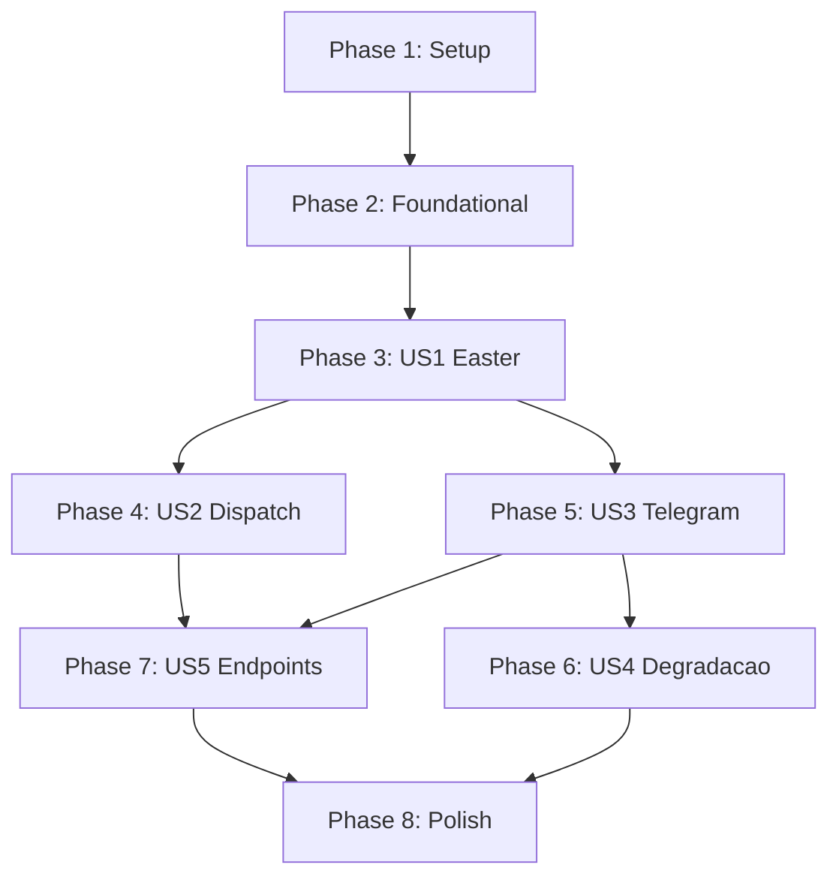

# Tasks: Easter 24/7

**Input**: Design documents from `platforms/madruga-ai/epics/016-easter-24-7/`
**Prerequisites**: plan.md, spec.md, research.md, data-model.md

**Tests**: Incluidos (constituicao exige TDD para todo codigo).

**Organization**: Tasks agrupadas por user story. Cada story e independentemente testavel.

## Format: `[ID] [P?] [Story] Description`

- **[P]**: Pode rodar em paralelo (arquivos diferentes, sem dependencias)
- **[Story]**: User story associada (US1-US5)
- Paths relativos a `.specify/scripts/`

---

## Phase 1: Setup

**Purpose**: Criar arquivos novos e dependencias

- [X] T001 [P] Criar arquivo .specify/scripts/ntfy.py com funcao ntfy_alert() (~15 LOC, stdlib urllib, pattern do research.md R4)
- [X] T002 [P] Criar arquivo .specify/scripts/sd_notify.py com funcao sd_notify() (~10 LOC, stdlib socket, pattern do research.md R3)
- [X] T003 [P] Criar arquivo etc/systemd/madruga-easter.service (Type=notify, WatchdogSec=30, Restart=on-failure, RestartSec=5, ExecStart python3 easter.py)

---

## Phase 2: Foundational (Blocking Prerequisites)

**Purpose**: Refatorar dag_executor.py para async — BLOQUEIA todas as user stories

**CRITICAL**: Nenhuma user story pode comecar ate esta fase estar completa

### Tests para Foundation

- [X] T004 [P] Escrever testes async para dispatch_node em .specify/scripts/tests/test_dag_executor.py: test_dispatch_node_async_success, test_dispatch_node_async_timeout, test_dispatch_node_async_failure (mock asyncio.create_subprocess_exec)
- [X] T005 [P] Escrever testes async para dispatch_with_retry em .specify/scripts/tests/test_dag_executor.py: test_retry_with_async_sleep, test_circuit_breaker_with_async_dispatch
- [X] T006 [P] Escrever testes para ntfy_alert em .specify/scripts/tests/test_ntfy.py: test_ntfy_alert_success, test_ntfy_alert_failure_silent, test_ntfy_alert_timeout (mock urllib.request.urlopen)
- [X] T007 [P] Escrever testes para sd_notify em .specify/scripts/tests/test_sd_notify.py: test_sd_notify_with_socket, test_sd_notify_no_socket_returns_false (mock socket + env var)

### Implementacao Foundation

- [X] T008 Refatorar dispatch_node() em .specify/scripts/dag_executor.py: subprocess.run() → asyncio.create_subprocess_exec(), retornar (success, error) async. Manter signature compativel para CLI sincrono via asyncio.run() wrapper.
- [X] T009 Refatorar dispatch_with_retry() em .specify/scripts/dag_executor.py: time.sleep() → asyncio.sleep(). Adicionar parametro semaphore: asyncio.Semaphore para controlar concorrencia.
- [X] T010 Refatorar run_pipeline() em .specify/scripts/dag_executor.py: tornar async. Em human gates, gravar no SQLite e retornar em vez de sys.exit(0). Manter CLI entry point sincrono com asyncio.run().
- [X] T011 Rodar make test e make ruff — garantir que testes existentes + novos passam e lint esta limpo

**Checkpoint**: dag_executor.py e async. CLI continua funcionando (backward compat). Testes passam.

---

## Phase 3: User Story 1 — Easter inicia e opera continuamente (Priority: P1) MVP

**Goal**: Easter inicia com um comando, conecta servicos, roda 24/7, shutdown gracioso.

**Independent Test**: Iniciar easter, GET /health retorna 200, encerrar com SIGTERM em <5s.

### Tests para US1

- [X] T012 [P] [US1] Escrever testes do easter em .specify/scripts/tests/test_easter.py: test_health_endpoint_returns_200, test_status_endpoint_returns_json, test_lifespan_starts_background_tasks (mock TaskGroup), test_graceful_shutdown_sets_event, test_startup_without_telegram_env_vars_logs_warning

### Implementacao US1

- [X] T013 [US1] Criar .specify/scripts/easter.py: FastAPI app com lifespan context manager. Endpoints GET /health (200 + {"status":"ok"}), GET /status (pipeline state JSON). Bind 127.0.0.1:8040. Sentry init no startup (~10 LOC). structlog configuracao.
- [X] T014 [US1] Implementar graceful shutdown em .specify/scripts/easter.py: asyncio.Event para shutdown, signal handlers SIGTERM/SIGINT, cleanup de subprocessos (SIGTERM → wait 10s → SIGKILL), sd_notify("STOPPING=1").
- [X] T015 [US1] Implementar lifespan em .specify/scripts/easter.py: asyncio.TaskGroup com placeholder coroutines (dag_scheduler, telegram_polling, gate_poller, health_checker). Coroutines verificam shutdown_event.is_set() para exit. sd_notify("READY=1") apos startup.
- [X] T016 [US1] Rodar make test — garantir testes US1 passam

**Checkpoint**: Easter inicia, /health responde, shutdown gracioso funciona. Sem dispatch nem Telegram ainda.

---

## Phase 4: User Story 2 — Dispatch automatico de skills (Priority: P1)

**Goal**: Easter detecta epics in_progress e executa pipeline automaticamente.

**Independent Test**: Inserir epic com status in_progress no DB, easter detecta e inicia dispatch do primeiro node.

### Tests para US2

- [X] T017 [P] [US2] Escrever testes do scheduler em .specify/scripts/tests/test_easter.py: test_dag_scheduler_detects_active_epic, test_dag_scheduler_respects_sequential_constraint, test_dag_scheduler_skips_already_running_epic, test_dag_scheduler_poll_interval

### Implementacao US2

- [X] T018 [US2] Implementar poll_active_epics() em .specify/scripts/easter.py: query SELECT epics WHERE status='in_progress' ORDER BY priority. Retorna lista de epics prontos.
- [X] T019 [US2] Implementar dag_scheduler() coroutine em .specify/scripts/easter.py: loop que faz polling, verifica invariante sequencial (self-ref), cria task para run_pipeline_async(). Usa semaphore para limitar concorrencia.
- [X] T020 [US2] Conectar dag_scheduler ao lifespan TaskGroup em .specify/scripts/easter.py: substituir placeholder pela coroutine real. Passar conn, semaphore, shutdown_event.
- [X] T021 [US2] Rodar make test — garantir testes US2 passam

**Checkpoint**: Easter detecta epics e executa pipeline. Human gates gravam no DB e retornam (sem notificacao ainda).

---

## Phase 5: User Story 3 — Notificacao e aprovacao de gates via Telegram (Priority: P1)

**Goal**: Gates notificam via Telegram com botoes inline. Operador aprova/rejeita com um toque.

**Independent Test**: Inserir gate pendente no DB, easter envia notificacao Telegram com botoes, callback aprova e pipeline retoma.

### Tests para US3

- [X] T022 [P] [US3] Escrever testes de integracao Telegram em .specify/scripts/tests/test_easter.py: test_telegram_coroutines_start_in_taskgroup, test_gate_approval_resumes_pipeline (mock TelegramAdapter)

### Implementacao US3

- [X] T023 [US3] Refatorar .specify/scripts/telegram_bot.py: extrair gate_poller(), health_check(), callback handlers como funcoes/coroutines composáveis importaveis. Preservar notify_oneway_decision() (FR-014). Manter async_main() para uso standalone mas marcar como deprecated.
- [X] T024 [US3] Integrar Telegram no lifespan de .specify/scripts/easter.py: importar coroutines do telegram_bot.py, criar Bot + Dispatcher + TelegramAdapter no lifespan, adicionar dp.start_polling(), gate_poller(), health_check() ao TaskGroup.
- [X] T025 [US3] Implementar resumption: quando gate e aprovado via Telegram callback, o dag_scheduler detecta na proxima iteracao de polling (gate_status='approved') e retoma o pipeline do checkpoint.
- [X] T026 [US3] Rodar make test — garantir testes US3 + testes existentes do telegram_bot passam

**Checkpoint**: Easter completo com dispatch + Telegram. Pipeline inteiro funciona end-to-end.

---

## Phase 6: User Story 4 — Degradacao quando Telegram indisponivel (Priority: P2)

**Goal**: Easter opera em modo degradado quando Telegram esta fora. ntfy.sh como fallback.

**Independent Test**: Simular Telegram unreachable (mock health check), verificar modo degradado + ntfy alert.

### Tests para US4

- [X] T027 [P] [US4] Escrever testes de degradacao em .specify/scripts/tests/test_easter.py: test_telegram_degradation_after_3_failures, test_telegram_recovery_resumes_normal, test_ntfy_fallback_on_degradation, test_auto_gates_continue_in_degraded_mode

### Implementacao US4

- [X] T028 [US4] Implementar state machine de degradacao em .specify/scripts/easter.py: variavel easter_state (running/degraded), health_checker() conta falhas consecutivas, transicao para degraded apos 3 falhas, recovery automatico quando Telegram volta.
- [X] T029 [US4] Integrar ntfy.py no health_checker de .specify/scripts/easter.py: quando transicao para degraded e MADRUGA_NTFY_TOPIC definido, enviar alerta via ntfy_alert(). Enviar ntfy em eventos criticos (circuit breaker, node failure).
- [X] T030 [US4] Rodar make test — garantir testes US4 passam

**Checkpoint**: Easter resiliente — opera com e sem Telegram.

---

## Phase 7: User Story 5 — Monitoramento via endpoints HTTP (Priority: P2)

**Goal**: /health e /status retornam estado completo do easter e pipeline.

**Independent Test**: GET /status retorna JSON com estado do Telegram, epics em execucao, circuit breaker.

### Tests para US5

- [X] T031 [P] [US5] Escrever testes dos endpoints em .specify/scripts/tests/test_easter.py: test_status_includes_telegram_state, test_status_includes_running_epics, test_status_includes_circuit_breaker, test_health_returns_200_even_when_degraded

### Implementacao US5

- [X] T032 [US5] Enriquecer GET /status em .specify/scripts/easter.py: retornar JSON com easter_state, telegram_status (connected/degraded), running_epics (lista), pending_gates (count), circuit_breaker (state + failure_count), uptime_seconds, pid.
- [X] T033 [US5] Rodar make test — garantir testes US5 passam

**Checkpoint**: Observabilidade completa via /health e /status.

---

## Phase 8: Polish & Cross-Cutting Concerns

**Purpose**: systemd unit final, Sentry, docs, lint

- [X] T034 [P] Validar etc/systemd/madruga-easter.service: testar instalacao com systemctl --user link, start, status, watchdog trigger
- [X] T035 [P] Rodar make ruff-fix em todos os arquivos modificados (.specify/scripts/easter.py, dag_executor.py, telegram_bot.py, ntfy.py, sd_notify.py)
- [X] T036 Rodar make test completo — todos os 135+ testes existentes + novos devem passar
- [X] T037 Rodar make lint — todas as plataformas validas

---

## Dependencies & Execution Order

### Phase Dependencies

- **Setup (Phase 1)**: Sem dependencias — pode comecar imediatamente
- **Foundational (Phase 2)**: Depende de Setup. BLOQUEIA todas as user stories.
- **US1 (Phase 3)**: Depende de Foundational
- **US2 (Phase 4)**: Depende de US1 (precisa do easter.py com lifespan)
- **US3 (Phase 5)**: Depende de US1 (precisa do easter.py com TaskGroup)
- **US4 (Phase 6)**: Depende de US3 (precisa do Telegram integrado para testar degradacao)
- **US5 (Phase 7)**: Depende de US2 + US3 (precisa de estado para expor no /status)
- **Polish (Phase 8)**: Depende de todas as stories

### User Story Dependencies



### Within Each User Story

- Testes DEVEM ser escritos e FALHAR antes da implementacao
- Implementacao faz testes passarem
- Rodar make test ao final de cada story

### Parallel Opportunities

- T001, T002, T003 podem rodar em paralelo (Phase 1)
- T004, T005, T006, T007 podem rodar em paralelo (testes Foundation)
- T012 pode rodar em paralelo com T017, T022 (testes de stories diferentes)
- US2 e US3 podem ser paralelas apos US1 (ambas dependem so de US1)

---

## Parallel Example: Phase 1

```bash
# Todos os arquivos novos em paralelo:
Task T001: "Criar ntfy.py"
Task T002: "Criar sd_notify.py"
Task T003: "Criar madruga-easter.service"
```

## Parallel Example: Foundation Tests

```bash
# Todos os testes de modulos independentes:
Task T004: "Testes async dag_executor"
Task T005: "Testes async retry"
Task T006: "Testes ntfy"
Task T007: "Testes sd_notify"
```

---

## Implementation Strategy

### MVP First (US1 + US2 + US3)

1. Complete Phase 1: Setup (~3 arquivos)
2. Complete Phase 2: Foundational (async refactor — parte mais critica)
3. Complete Phase 3: US1 (easter inicia e responde)
4. Complete Phase 4: US2 (dispatch automatico)
5. Complete Phase 5: US3 (Telegram gates)
6. **STOP e VALIDAR**: pipeline end-to-end funciona

### Incremental Delivery

1. Setup + Foundation → dag_executor async funcionando
2. US1 → easter inicia, /health ok → primeiro checkpoint deployavel
3. US2 → dispatch automatico → segundo checkpoint
4. US3 → Telegram integrado → MVP completo
5. US4 → resiliencia → hardening
6. US5 → observabilidade → producao

---

## Notes

- Arquivos em `.specify/scripts/` (convencao do projeto)
- Testes em `.specify/scripts/tests/` (convencao do projeto)
- Constitution exige TDD — testes antes de implementacao
- Cada task deve ser commitavel independentemente
- `make test` e `make ruff` ao final de cada phase

---

handoff:
  from: speckit.tasks
  to: speckit.analyze
  context: "37 tasks em 8 phases. MVP = US1+US2+US3 (P1). Pronto para analyze pre-implementacao."
  blockers: []
  confidence: Alta
  kill_criteria: "Se async refactor do dag_executor falhar, usar asyncio.to_thread como fallback."
