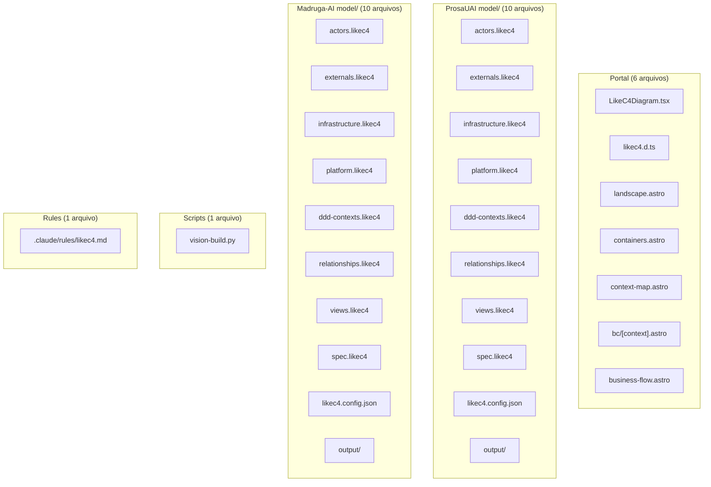

# Data Model: Mermaid Migration

**Epic**: 022-mermaid-migration | **Date**: 2026-04-05

---

## Entidades Impactadas

Esta epic nao cria novas entidades de dados. E uma migracao de formato de diagramas. As "entidades" relevantes sao os artefatos do repositorio que sao modificados ou removidos.

---

## 1. Artefatos por Categoria

### 1.1 Removidos (Deletar)

### 1.2 Modificados

| Arquivo | Mudanca Principal |
|---------|------------------|
| `portal/astro.config.mjs` | Remove LikeC4VitePlugin, esbuild jsx config, 'model' from portalSections, likec4 head scripts |
| `portal/src/lib/platforms.mjs` | Remove buildViewPaths(), simplify buildSidebar() (remove views.structural refs) |
| `portal/src/lib/constants.ts` | Remove .likec4 extension handling |
| `portal/src/components/dashboard/PipelineDAG.tsx` | Remove .likec4 extension handling |
| `portal/package.json` | Remove likec4 dependency |
| `platforms/prosauai/platform.yaml` | Remove model:, views:, serve:, build: blocks. Update domain-model/containers outputs |
| `platforms/madruga-ai/platform.yaml` | Same as prosauai |
| `platforms/prosauai/engineering/blueprint.md` | Add L1 deploy topology + L2 containers Mermaid diagrams |
| `platforms/prosauai/engineering/domain-model.md` | Add L3 context map section (was empty AUTO markers in context-map.md) |
| `platforms/prosauai/engineering/context-map.md` | Populate with Mermaid context map (was empty AUTO markers) or redirect to domain-model.md |
| `platforms/madruga-ai/engineering/blueprint.md` | Add L2 containers, update stack table (LikeC4 → Mermaid), remove LikeC4 refs |
| `platforms/madruga-ai/engineering/domain-model.md` | Minor: remove context-map.md cross-ref if needed |
| `platforms/madruga-ai/decisions/ADR-001-likec4-source-of-truth.md` | Status: Superseded by ADR-020 |
| `platforms/madruga-ai/decisions/ADR-003-astro-starlight-portal.md` | Remove LikeC4VitePlugin mentions |
| `.claude/knowledge/pipeline-dag-knowledge.md` | Update domain-model and containers node outputs |
| `.specify/templates/platform/template/platform.yaml.jinja` | Remove model:, views:, serve:, build:. Update outputs |
| `.specify/templates/platform/template/model/` | Remove entire directory (9 .likec4 templates) |
| `.github/workflows/ci.yml` | Remove likec4 job, remove vision-build.py from smoke test |
| `CLAUDE.md` | Remove LikeC4 prereq, update conventions |
| `platforms/madruga-ai/CLAUDE.md` | Remove LikeC4 from stack |

### 1.3 Criados

| Arquivo | Conteudo |
|---------|----------|
| `platforms/madruga-ai/decisions/ADR-020-mermaid-inline-diagrams.md` | ADR documentando a decisao |

---

## 2. Mermaid Diagram Inventory (Post-Migration)

### ProsaUAI Platform

| Documento | Diagrama | Tipo Mermaid | Nivel | Status |
|-----------|----------|-------------|-------|--------|
| blueprint.md | Deploy Topology | `graph LR` | L1 | **NOVO** |
| blueprint.md | Containers | `graph LR` + subgraphs | L2 | **NOVO** |
| domain-model.md | Context Map | `flowchart LR` | L3 | **NOVO** (absorve context-map.md) |
| domain-model.md | Channel BC | `classDiagram` | L4 | Existente |
| domain-model.md | Conversation BC | `classDiagram` | L4 | Existente |
| domain-model.md | Safety BC | `classDiagram` | L4 | Existente |
| domain-model.md | Operations BC | `classDiagram` | L4 | Existente |
| domain-model.md | Observability BC | `classDiagram` | L4 | Existente |
| business/process.md | Overview | `flowchart TD` | L5 | **NOVO** |
| business/process.md | Fases 1-8 | `sequenceDiagram` + `flowchart` | L5 | **NOVO** |

### Madruga-AI Platform

| Documento | Diagrama | Tipo Mermaid | Nivel | Status |
|-----------|----------|-------------|-------|--------|
| blueprint.md | Deploy Topology | `graph LR` | L1 | Existente (line 102) |
| blueprint.md | Containers | `graph LR` + subgraphs | L2 | **NOVO** (detail adicionado) |
| engineering/context-map.md | Context Map | `graph TB` | L3 | Existente |
| domain-model.md | 6x BC classDiagrams | `classDiagram` | L4 | Existente |
| business/process.md | Spec-to-Code Pipeline | `flowchart TD` + `sequenceDiagram` | L5 | **NOVO** (if process.md exists) |

---

## 3. Naming Contract (Pyramid of Detail)

Nomenclatura consistente entre niveis de diagrama:

### ProsaUAI

| Entidade | L1 (Topology) | L2 (Containers) | L3 (Context Map) | L4 (Class) |
|----------|--------------|-----------------|-------------------|------------|
| API Server | prosauai-api | prosauai-api | — | — |
| Worker | prosauai-worker | prosauai-worker | — | — |
| Admin Panel | prosauai-admin | prosauai-admin | — | — |
| Channel BC | — | — | Channel | Channel (classDiagram) |
| Conversation BC | — | — | Conversation | Conversation (classDiagram) |
| Safety BC | — | — | Safety | Safety (classDiagram) |
| Operations BC | — | — | Operations | Operations (classDiagram) |
| Redis | redis | redis | — | — |
| Supabase | supabase-prosauai | supabase-prosauai | — | — |
| Evolution API | evolution-api | evolution-api | — | — |

### Madruga-AI

| Entidade | L1 (Topology) | L2 (Containers) | L3 (Context Map) |
|----------|--------------|-----------------|-------------------|
| Portal | portal | portal | Documentation |
| Easter | easter | easter | Execution |
| DAG Executor | dag | dag | Execution |
| Platform CLI | cli | cli | Integration |
| Telegram Bot | telegram-bot | telegram-bot | Integration |
| SQLite | sqlite | sqlite | — |

---

## 4. Cross-Reference Links

Cada secao de diagrama aponta para o proximo nivel de detalhe:

| De (secao) | Para (secao) | Link format |
|------------|-------------|-------------|
| blueprint.md "Deploy Topology" (L1) | blueprint.md "Containers" (L2) | `[→ Ver containers em detalhe](#containers)` |
| blueprint.md "Containers" (L2) | domain-model.md (L3/L4) | `[→ Ver domain model](../engineering/domain-model/)` |
| domain-model.md "Context Map" (L3) | domain-model.md BC sections (L4) | `[→ Ver detalhe](#channel)` |
| domain-model.md BC sections (L4) | process.md (L5) | `[→ Ver fluxo de negocio](../business/process/)` |

---

handoff:
  from: data-model
  to: plan
  context: "Inventory complete. 28 files removed, 20 modified, 1 created. Mermaid diagrams: 5 new for prosauai, 2 new for madruga-ai. L4 already exists in both platforms."
  blockers: []
  confidence: Alta
  kill_criteria: "Platform lint fails on missing model:/views: fields without updating lint script"
