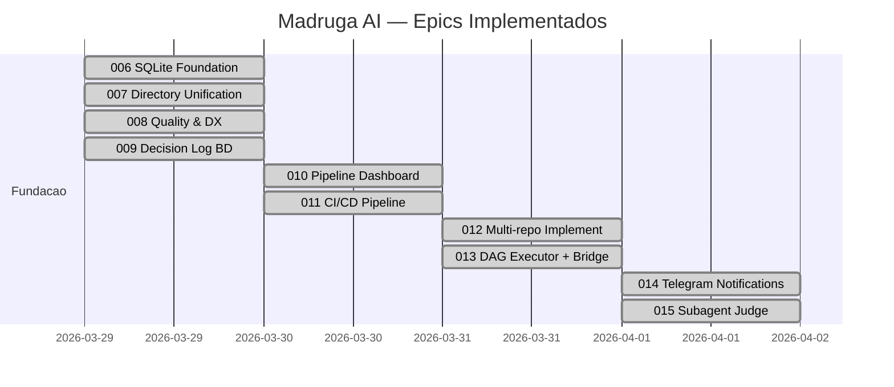
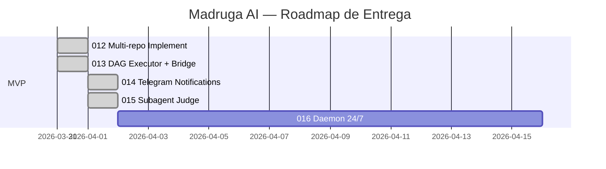
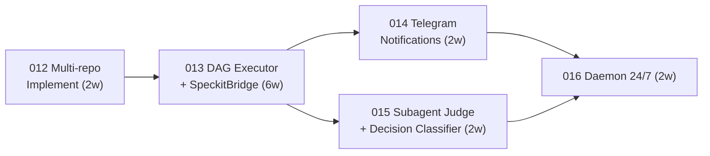

# Madruga AI — Delivery Roadmap

> Sequencia de epics, milestones e definicao de MVP. North Star: 80% de epics processados autonomamente (pitch-to-PR sem intervencao humana).

---

## MVP

**MVP Epics:** 012 + 013 + 014 + 015 + 016 (todos os candidatos)
**MVP Criterion:** Pipeline executa pelo menos 1 epic completo (pitch-to-PR) em repo externo (Fulano) com autonomia — human gates notificados via Telegram, specs revisadas por Subagent Judge, daemon operando 24/7.
**Total MVP Appetite:** ~14w (team size: 1)

---

## Objetivos e Resultados

| Objetivo de Negocio | Product Outcome (leading indicator) | Baseline | Target | Epics |
|---------------------|--------------------------------------|----------|--------|-------|
| Autonomia do pipeline | % skills executaveis via CLI sem interacao manual | 0% | 80% | 013, 016 |
| Tempo de resposta a gates | Tempo medio entre notificacao e aprovacao de human gate | ∞ (manual) | < 30min | 014 |
| Qualidade de specs autonomas | % specs com review multi-perspectiva antes de implement | 0% | 100% | 015 |
| Pipeline cross-repo | Ciclos L2 executados em repos externos | 0 | Fulano operacional | 012 |
| Uptime do pipeline | Horas/dia de daemon operacional | 0 | 24h | 016 |

---

## Epics Shipped

| # | Epic | Descricao | Status | Concluido |
|---|------|-----------|--------|-----------|
| 006 | SQLite Foundation | BD SQLite (WAL mode) como state store para pipeline. Tabelas: platforms, pipeline_nodes, epics, epic_nodes, pipeline_runs, events, artifact_provenance. db.py com stdlib Python. Migrations incrementais. | **shipped** | 2026-03-29 |
| 007 | Directory Unification | SpecKit opera em epics/ (unificado). DAG dois niveis (L1 + L2). platform.yaml como manifesto declarativo. Copier template atualizado. | **shipped** | 2026-03-29 |
| 008 | Quality & DX | Boilerplate extraido para knowledge files. Skills enxutas. Auto-review por tier. Verify + QA + Reconcile skills implementadas. | **shipped** | 2026-03-29 |
| 009 | Decision Log BD | BD como source of truth para decisions e memory. FTS5 full-text search. CLI import/export. 5 novas migrations. 20+ funcoes em db.py. | **shipped** | 2026-03-29 |
| 010 | Pipeline Dashboard | Dashboard visual no portal Starlight. CLI `status` com tabela + JSON. Mermaid DAG. Filtros por plataforma. | **shipped** | 2026-03-30 |
| 011 | CI/CD Pipeline | GitHub Actions: lint (ruff + platform lint), LikeC4 build, db-tests, template tests, bash-tests, portal-build. 6 jobs. | **shipped** | 2026-03-30 |
| 012 | Multi-repo Implement | git worktree para repos externos. ensure_repo (SSH/HTTPS), worktree isolado, implement_remote (claude -p --cwd), PR via gh. 3 scripts, 28 testes. | **shipped** | 2026-03-31 |
| 013 | DAG Executor + SpeckitBridge | Custom DAG executor: Kahn's topological sort, claude -p dispatch, human gates (CLI pause/resume), retry/circuit breaker/watchdog. 494 LOC + 110 LOC extensions. 43 testes. | **shipped** | 2026-03-31 |
| 014 | Telegram Notifications | Bot Telegram standalone (aiogram 3.x): notifica human gates pendentes, inline keyboard approve/reject, health check, backoff exponencial, offset persistence. Migration 008. 28 testes. | **shipped** | 2026-04-01 |
| 015 | Subagent Judge + Decision Classifier | Tech-reviewers: 4 personas paralelas (Arch Reviewer, Bug Hunter, Simplifier, Stress Tester) + Judge pass. Decision Classifier (risk score). Substitui verify (L2) e Tier 3 (L1). YAML config extensivel. 47 testes. | **shipped** | 2026-04-01 |

---

## Delivery Sequence

### Sequencia e Justificativa

| Ordem | Epic | Appetite | Risco | Justificativa da Posicao |
|-------|------|----------|-------|--------------------------|
| 1 | 012 Multi-repo Implement | 2w (real: 1d) | Medio | Value-first: desbloqueia Fulano imediatamente. Escopo bem definido + reutilizacao de db.py reduziu appetite de 2w para 1d. |
| 2 | 013 DAG Executor + SpeckitBridge | 6w | Alto | Value: runtime funcional. Real: ~1d. Infraestrutura existente (db.py, post_save.py) + decisoes bem capturadas em context.md reduziram escopo. |
| 3 | 014 Telegram Notifications | 2w (real: 1d) | Baixo | Depende da gate state machine de 013. aiogram e framework maduro — baixo risco tecnico. Appetite reduzido: scope claro + framework maduro. |
| 3 | 015 Subagent Judge + Decision Classifier | 2w (real: 1d) | Medio→Baixo | Paralelo com 014. Agent tool ja provado. Knowledge files = maioria do deliverable. Calibracao validada com 7 ADRs reais. |
| 4 | 016 Daemon 24/7 | 2w | Baixo | Ultimo — monta em cima de tudo. Mecanico: asyncio event loop + health checks + systemd. |

> 014 e 015 podem rodar em paralelo apos 013. Gantt mostra sequencial por team size = 1.

---

## Dependencias

---

## Milestones

| Milestone | Epics | Criterio de Sucesso | Estimativa |
|-----------|-------|---------------------|------------|
| **Fulano Operacional** | 012 | `speckit.implement` executa em repo Fulano via worktree, PR criado com `gh` | Semana 2 | Tooling pronto (ensure_repo, worktree, implement_remote). Falta teste end-to-end com Fulano real. |
| **Runtime Funcional** | 012, 013 | DAG executor processa 1 pipeline L1 completo via CLI, human gates pausam/resumem corretamente | Semana 8 | Tooling pronto (ensure_repo, worktree, dag_executor). Falta teste end-to-end com claude -p real. |
| **Autonomia MVP** | 012-016 | 1 epic completo (pitch-to-PR) processado pelo daemon em repo Fulano, com Telegram notifications e Subagent Judge review | Semana 14 |

---

## Proximos Epics (candidatos)

Epics abaixo sao **candidatos identificados** para o MVP de autonomia. Cada um tem pitch.md com problema e appetite definidos. Spec, plan e tasks serao criados quando o epic entrar em L2 via `/epic-context`.

| # | Epic (candidato) | Problema | Descricao | Appetite | Prioridade | Depende de |
|---|------------------|----------|-----------|----------|------------|------------|
| 012 | Multi-repo Implement | `speckit.implement` so opera no proprio repo. Fulano tem codigo em repo separado — ciclo L2 nao funciona. | git worktree para target repos. PRs criados no repo correto via `gh`. Repo binding de `platform.yaml` validado end-to-end. | 2w (Media) | **P1** | — |
| 013 | DAG Executor + SpeckitBridge | Skills invocadas manualmente. Para autonomia, pipeline precisa de execucao data-driven com human gate pause/resume. | Custom DAG executor (~500-800 LOC, ADR-017): le YAML, topological sort, dispatch via `claude -p`, state machine por node. SpeckitBridge compoe prompts para modo autonomo. **Gate state machine completa** definida aqui: pause → persist SQLite → wait signal → resume. Metricas basicas (run counter, success/failure, duration). | 6w (Grande) | **P1** | 012 |
| 014 | Telegram Notifications | Sem canal de notificacao, human gates travam pipeline autonomo. Operador nao sabe quando precisa aprovar algo. | TelegramAdapter (aiogram, long-polling, ADR-018): `send`, `ask_choice` (inline buttons approve/reject), `alert`. Health check periodico (`getMe`). Fallback log-only quando unreachable. Consome gate state machine de 013. | 2w (Media) | **P1** | 013 |
| 015 | Subagent Judge + Decision Classifier | Specs geradas autonomamente nao tem quality gate multi-perspectiva. Decisoes 1-way-door nao sao classificadas automaticamente. | SubagentJudge: 3 personas paralelas (Architecture Reviewer, Bug Hunter, Simplifier) + 1 Judge pass filtra por Accuracy/Actionability/Severity (ADR-019). DecisionClassifier: classifica 1-way/2-way door, auto-gera ADR para 1-way. Integra com pipeline gates. | 2w (Media) | **P1** | 013 |
| 016 | Daemon 24/7 | Runtime (013) e notificacoes (014) existem mas precisam ser iniciados manualmente. Precisa de processo persistente. | MadrugaDaemon asyncio (ADR-006): slot-based orchestrator, health checks (SQLite, Telegram, git), timeout watchdog para gates pendentes (24h escalation), systemd service. Pipeline observability: cost tracking, failure dashboard, credit burn alerts. | 2w (Media) | **P2** | 013, 014, 015 |

---

## Roadmap Risks

| Risco | Impacto | Probabilidade | Mitigacao |
|-------|---------|---------------|-----------|
| `claude -p` instavel com prompts longos (stream-json bug) | Pipeline trava em nodes de implement | Media | `--output-format json` (evita bug). Watchdog SIGKILL. Retry 3x com backoff. |
| Gate state machine complexa demais para 013 | Atraso de 2-4w no epic mais critico | Media | Definir state machine minima (3 estados: running/paused/done). Iterar depois. |
| Calibracao de personas do Subagent Judge | Reviews com muito noise (false positives) | Media | Comeca com 3 personas fixas. Judge filtra por Accuracy/Actionability/Severity. Iteracao rapida. |
| aiogram breaking changes | TelegramAdapter quebra sem aviso | Baixa | Pin version. Health check detecta falha. Fallback log-only. |
| Team size = 1 | Nenhum paralelismo real entre 014 e 015 | Alta | Aceitar sequencial. Gantt ja reflete isso. |

---

## Nao Este Ciclo

| Item | Motivo da Exclusao | Revisitar Quando |
|------|--------------------|------------------|
| Namespace Unification (merge speckit.* em madruga.*) | Cosmetico, zero valor de negocio. Risco de churn em skills, docs e muscle memory. | Quando houver feedback de usuario externo pedindo namespace unico. |
| Developer Portal publico (Backstage-like) | Fora do scope — madruga-ai e ferramenta interna. Portal Starlight ja atende consumo interno. | Quando houver mais de 5 plataformas ativas ou usuarios externos. |
| Migracao de codigo de general/ | Abandonada. Runtime sera construido do zero em madruga.ai, capturando aprendizados mas sem migracao de codigo. | Nunca — decisao permanente (ADR-017, ADR-018). |
| Multi-tenant (N operadores) | Single-operator hoje (Gabriel). Multi-tenant adiciona autenticacao, isolamento, billing — complexidade injustificada. | Quando houver segundo operador com plataformas proprias. |

---

## Notas da Revisao Tier 3

- Epic 014 antigo (Runtime Engine monolitico) foi splitado em 013+014+015 para evitar scope creep
- Epic 013 antigo (Namespace Unification) removido — cosmetico, zero valor de negocio
- Gate state machine centralizada em 013 — epics 014/015/016 consomem, nao estendem
- Estimativa total realista: ~14w (vs 8w otimista anterior). North Star 80% autonomia requer todos os 5 epics

---
handoff:
  from: roadmap
  to: epic-context
  context: "L1 completo. Roadmap define sequencia 012→013→014/015→016. Proximo passo: iniciar L2 com epic-context para epic 012 (Multi-repo Implement)."
  blockers: []
  confidence: Alta
  kill_criteria: "Mudanca fundamental nos epics planejados ou reordenacao de prioridades"
