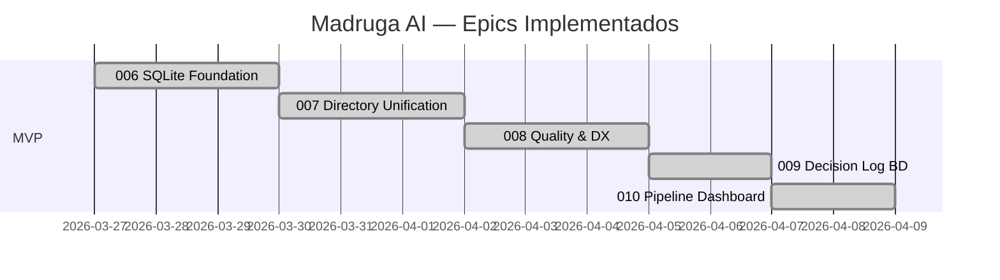

# Madruga AI — Delivery Roadmap

> Sequencia de epics, milestones, e proximos passos.

---

## MVP — Concluido

**MVP Epics:** 006, 007, 008, 009, 010
**MVP Criterion:** Pipeline L1 + L2 funcional, BD como state store, dashboard visual, docs sincronizados
**Total MVP Appetite:** ~10 semanas (5 epics shipped)

---

## Epics Shipped

---

## Epic Table

| # | Epic | Status | Appetite | Descricao |
|---|------|--------|----------|-----------|
| 006 | SQLite Foundation | **shipped** | 2w | BD SQLite (WAL mode) como state store para pipeline. Tabelas: platforms, pipeline_nodes, epics, epic_nodes, pipeline_runs, events, artifact_provenance. db.py com stdlib Python. Migrations incrementais. |
| 007 | Directory Unification | **shipped** | 2w | SpecKit opera em epics/ (unificado). DAG dois niveis (L1 + L2). platform.yaml como manifesto declarativo. Copier template atualizado. |
| 008 | Quality & DX | **shipped** | 2w | Boilerplate extraido para knowledge files. Skills enxutas. Auto-review por tier. Verify + QA + Reconcile skills implementadas. |
| 009 | Decision Log BD | **shipped** | 1w | BD como source of truth para decisions e memory. FTS5 full-text search. CLI import/export. 5 novas migrations. 20+ funcoes em db.py. |
| 010 | Pipeline Dashboard | **shipped** | 1w | Dashboard visual no portal Starlight. CLI `status` com tabela + JSON. Mermaid DAG. Filtros por plataforma. |

---

## Dependencies

---

## Milestones

| Milestone | Epics | Success Criterion | Status |
|-----------|-------|-------------------|--------|
| MVP | 006-010 | Pipeline L1+L2 funcional, BD operacional, dashboard no portal | **Atingido** |

---

## Proximos Epics (candidatos — sem arquivos criados)

Epics abaixo sao **candidatos identificados** para proximas iteracoes. Serao detalhados (pitch.md, spec, plan, tasks) apenas quando priorizados para implementacao.

| # | Epic (candidato) | Descricao | Complexidade | Prioridade sugerida |
|---|------------------|-----------|-------------|---------------------|
| 011 | CI/CD Pipeline | GitHub Actions: lint (ruff), portal build, template tests (pytest), platform lint. Zero regressoes em merges. | Pequena | Alta |
| 012 | Multi-repo Implement | `speckit.implement` opera em target repos via git worktree. PRs no repo correto. | Media | Media |
| 013 | Namespace Unification | Merge `speckit.*` em `madruga.*`. Namespace unico e consistente. | Pequena | Media |
| 014 | Runtime Engine Migration | Migrar daemon Python de `general/` para `madruga.ai/src/`. SpeckitBridge integrado. | Grande | Baixa |
| 015 | Daemon 24/7 | MadrugaDaemon asyncio: poll kanban, orchestrator, pipeline autonomo. systemd service. | Grande | Baixa |

---

## Roadmap Risks

| Risk | Impact | Probability | Mitigation |
|------|--------|-------------|-----------|
| Context rot em epics grandes | Qualidade de implementacao degrada | Media | Manter epics com appetite <= 2w |
| Drift entre docs e codigo | Documentacao vira ficcao | Alta | Reconcile obrigatorio pos-epic (ja implementado) |
| Dependencia de Claude Code API | Breaking changes em skills | Baixa | Skills sao markdown — facil adaptar |
| SQLite concorrencia | SQLITE_BUSY em writers paralelos | Baixa | WAL mode + busy_timeout ja mitigam |
