# Business Process — Pipeline Completo

Todos os caminhos da plataforma ProsaUAI: mensagem individual (1:1), grupo (@mention), handoff humano, triggers proativos. **14 modulos, 5 tipos de acao de roteamento (RESPOND, LOG_ONLY, DROP, BYPASS_AI, EVENT_HOOK), 3 decision points.**

> [→ Ver arquitetura de containers](../engineering/blueprint/#containers) | [→ Ver domain model](../engineering/domain-model/)

---

## Visao Geral do Pipeline

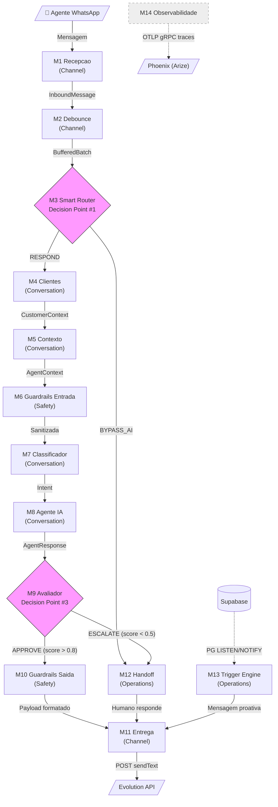

---

## Fases do Pipeline

### Fase 1: Entrada (Channel Inbound)

Recepcao, normalizacao e buffering de mensagens WhatsApp

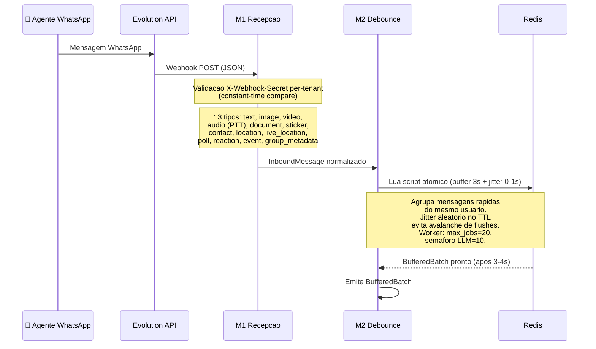

### Fase 2: Decision Point #1 — MECE Router (Two-Layer)

5 acoes de roteamento declarativo + resolucao de agente per-tenant

O Router MECE opera em **duas camadas** (epic 004):

**Layer 1 — classify()** (funcao pura, sem I/O): deriva `MessageFacts` a partir da mensagem + estado pre-carregado. Classifica em enums tipados: `Channel` (individual/group), `EventKind` (message/group_membership/group_metadata/protocol/unknown), `ContentKind` (text/media/structured/reaction/empty).

**Layer 2 — RoutingEngine.decide()** (declarativo): avalia regras YAML per-tenant por prioridade (menor = maior), first-match wins. 5 tipos de acao: RESPOND, LOG_ONLY, DROP, BYPASS_AI, EVENT_HOOK.

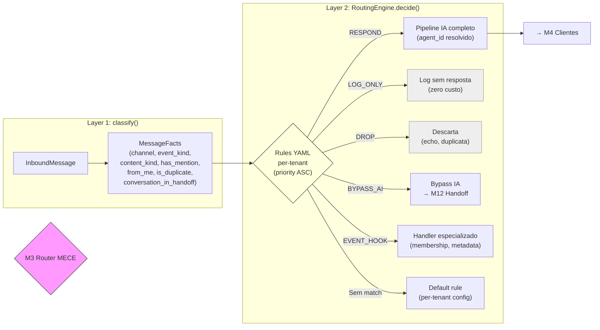

**Acoes do router:**
- **RESPOND** → Pipeline IA completo. Agent resolution: `rule.agent` > `tenant.default_agent_id` > `AgentResolutionError`
- **LOG_ONLY** → Log estruturado sem resposta (grupo sem @mention, eventos de protocolo)
- **DROP** → Descarta silenciosamente (echo do bot = previne loop, duplicatas via idempotency)
- **BYPASS_AI** → Bypass completo da IA, direto para handler humano (conversa em handoff ativo)
- **EVENT_HOOK** → Dispatch para handler especializado (membership de grupo, metadata)

**Config YAML per-tenant** (`config/routing/{tenant}.yaml`):
- Cada tenant tem suas proprias regras com prioridades e condicoes
- Regras sao pares `when` (condicoes sobre MessageFacts) + `action` + `agent` (opcional)
- Condicoes avaliadas por igualdade (AND): `from_me`, `is_duplicate`, `channel`, `has_mention`, `event_kind`, `conversation_in_handoff`, `is_membership_event`
- MECE garantido em 4 camadas: (1) tipo (enums), (2) schema (pydantic valida overlaps), (3) runtime (discriminated union), (4) CI (property-based testing)

**MentionMatchers** (deteccao de @mention em grupo):
- 3 estrategias: opaque @lid, phone number, keywords configurados por tenant
- Carregados no startup a partir de `tenant.mention_lid_opaque`, `tenant.mention_phone`, `tenant.mention_keywords`

### Fase 3: Pipeline Core (IA)

Gestao de cliente, contexto, guardrails, classificacao e agente IA

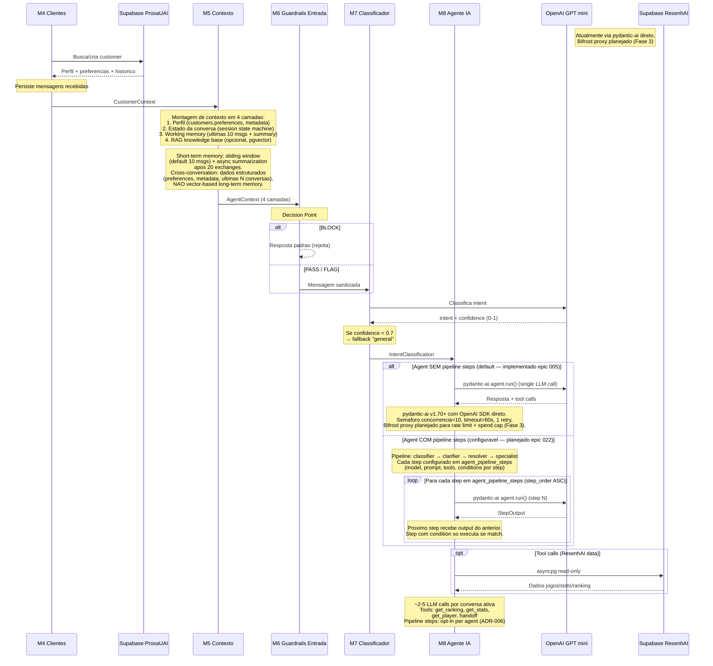

### Fase 4: Decision Point #3 — Avaliador de Qualidade

Aprovacao, retry ou escalacao para humano

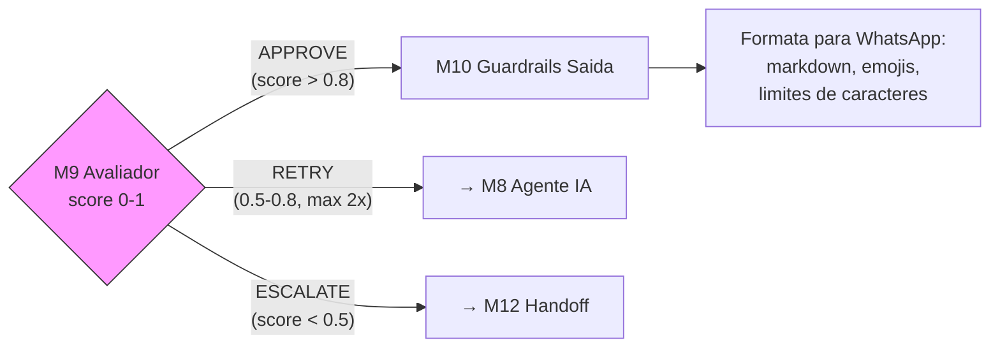

**Criterios de decisao:**
- **APPROVE** (score > 0.8) → Resposta aprovada, segue para formatacao e entrega
- **RETRY** (score 0.5-0.8) → Volta para M8 Agente IA (maximo 2 tentativas antes de escalar)
- **ESCALATE** (score < 0.5 ou topico critico ou request explicito do usuario) → Handoff para humano

### Fase 5: Saida (Channel Outbound)

Entrega da resposta via Evolution API

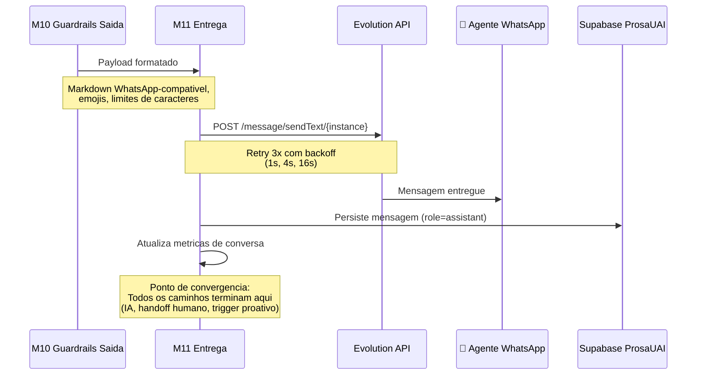

### Fase 6: Handoff Humano

Maquina de estados para transferencia IA → humano

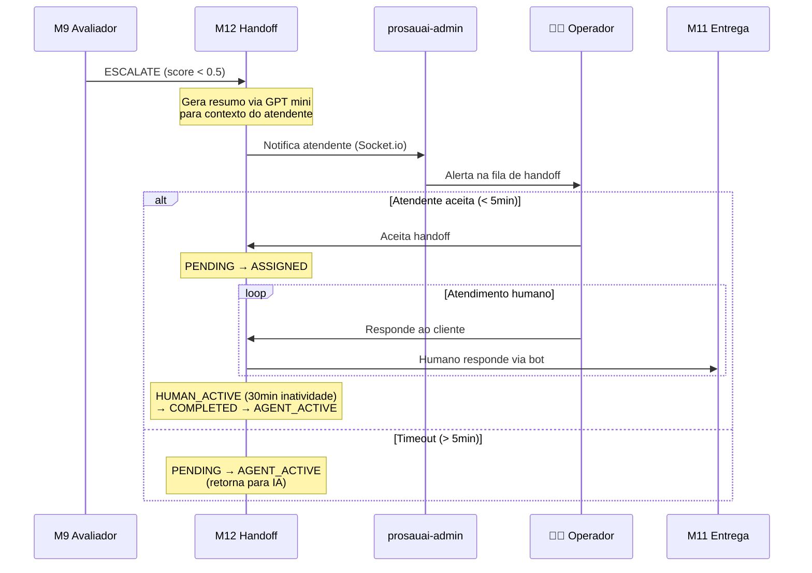

**State Machine do Handoff:**

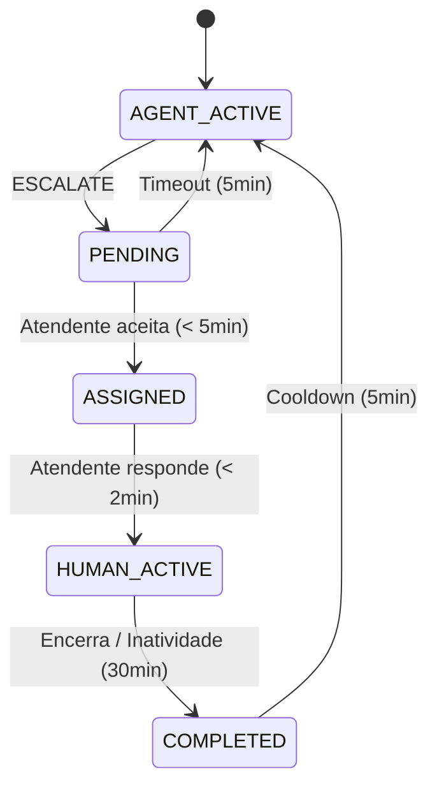

### Fase 7: Triggers Proativos

Mensagens proativas baseadas em eventos — sem LLM

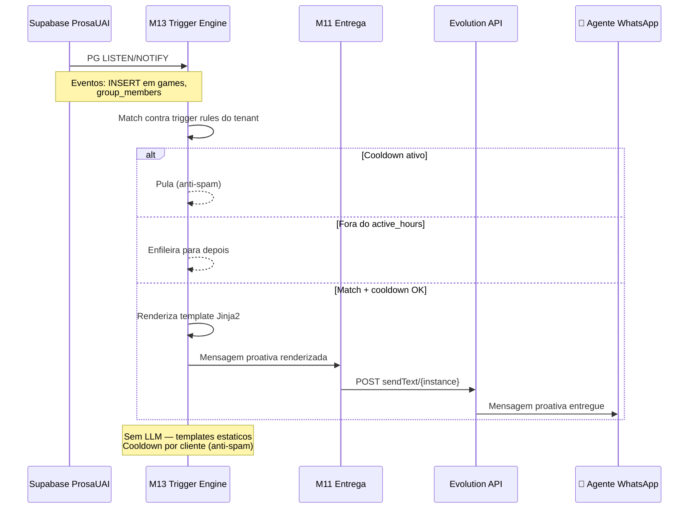

### Fase 8: Observabilidade (passiva)

Tracing distribuido e metricas de qualidade — fire-and-forget

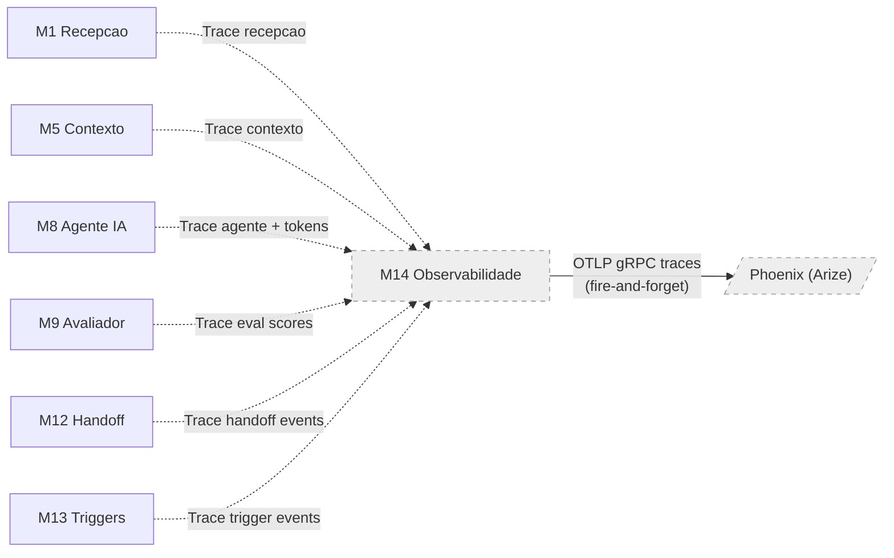

**Stack de observabilidade:**
- **Phoenix (Arize)**: Self-hosted (:6006 UI + :4317 gRPC). Substitui LangFuse — single container, Postgres backend, sem ClickHouse
- **OpenTelemetry SDK**: Auto-instrumentation (FastAPI, httpx, redis) + spans manuais de dominio (webhook, classify, decide)
- **structlog bridge**: `trace_id`/`span_id` injetados em todo log estruturado via processor `add_otel_context`
- **DeepEval + Promptfoo**: Scores de eval (online + offline) — planejado para epic 005+
- **Fire-and-forget**: falha na observabilidade NAO bloqueia o pipeline (BatchSpanProcessor com force_flush no shutdown)

---

## Multi-Tenant Lifecycle (Fase 1 → Fase 3)

A partir do epic 003 (Multi-Tenant Foundation), todo fluxo do pipeline acima e **per-tenant por construcao**: cada mensagem entra com `instance_name` no path, e o `TenantResolver` carrega o `Tenant` correto antes de qualquer outra etapa. Esta secao descreve os fluxos especificos de gestao de tenants — quem cria, quem desabilita, quem cobra.

### Fase 1 — Onboarding manual (interno Pace, epic 003)

**Atores:** dev/admin Pace.

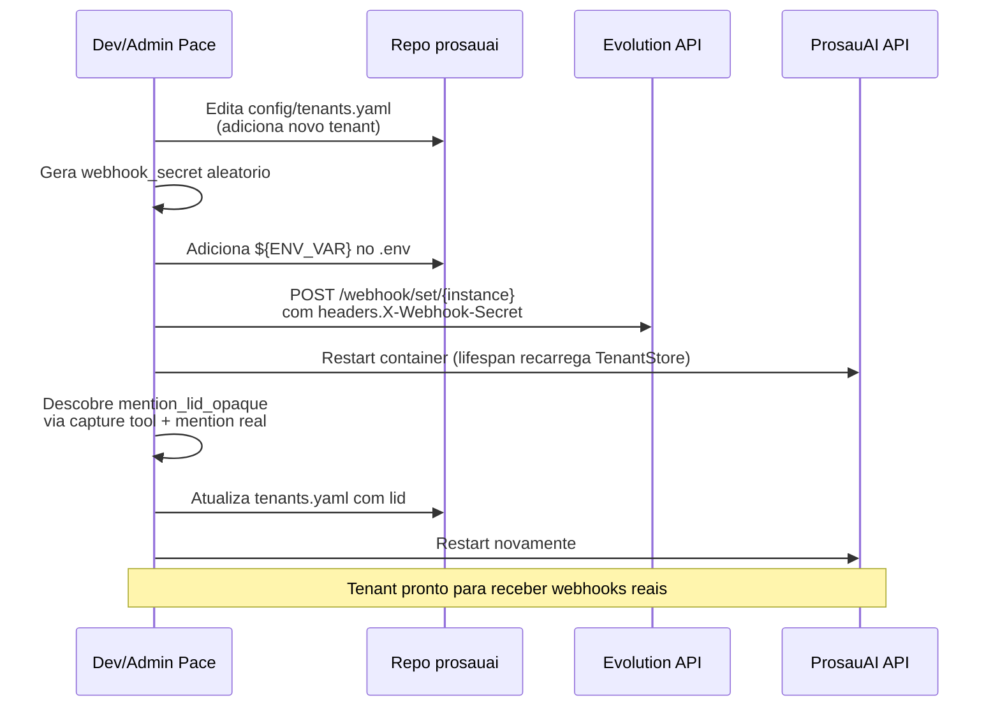

**Caracteristicas:**
- 100% manual
- Aceitavel para 2-5 tenants internos
- Sem rollback automatizado, sem auditoria, sem self-service

### Fase 2 — Onboarding via Admin API (cliente externo, epic 012)

**Atores:** cliente externo + admin Pace.

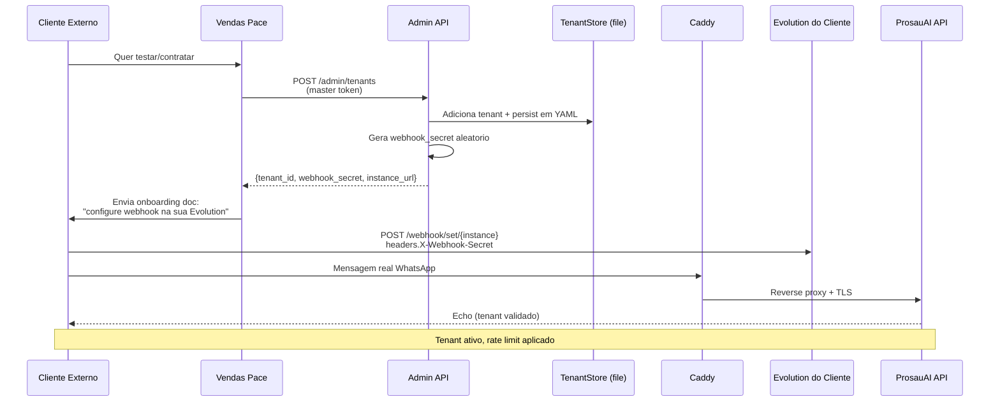

**Caracteristicas:**
- Vendas/admin Pace cria tenant via API
- Cliente faz a integracao do lado dele (sem acesso ao codigo Pace)
- Caddy + Let's Encrypt fornece TLS publico
- Rate limit per-tenant aplicado (Redis sliding window). Bifrost spend cap planejado (Fase 3)
- Hot reload do TenantStore (sem restart) ou reload via admin API

### Fase 3 — Self-service onboarding + ops (epic 013)

**Atores:** cliente externo (sem intervencao Pace) + ops team.

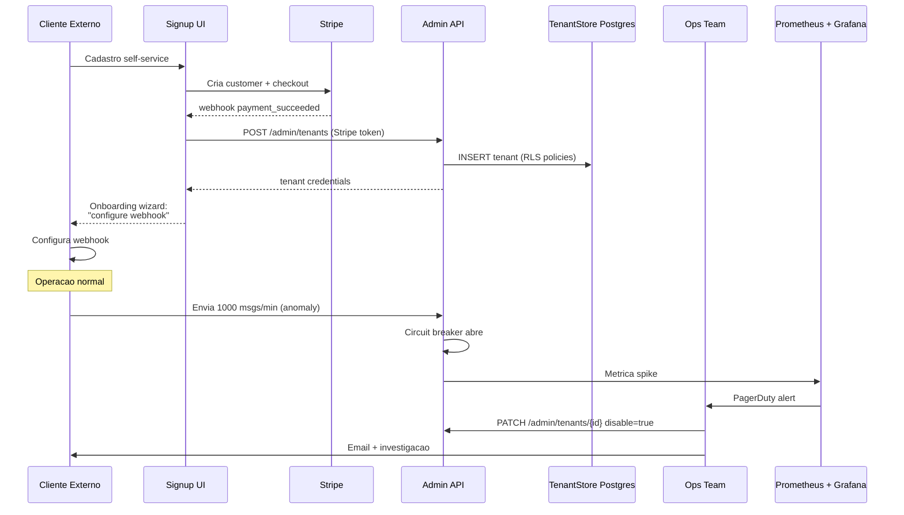

**Caracteristicas:**
- Zero intervencao manual no happy path
- Postgres como source of truth (RLS, audit trail, backup)
- Circuit breaker per-tenant impede 1 cliente derrubar outros
- Billing automatizado via Stripe
- Alertas Prometheus quando tenant ultrapassa thresholds
- Migracao YAML → Postgres feita uma unica vez ([ADR-023](../decisions/ADR-023-tenant-store-postgres-migration.md))

---

> **Proximo passo:** `/madruga:tech-research prosauai` — pesquisar alternativas tecnologicas para implementar este pipeline.
