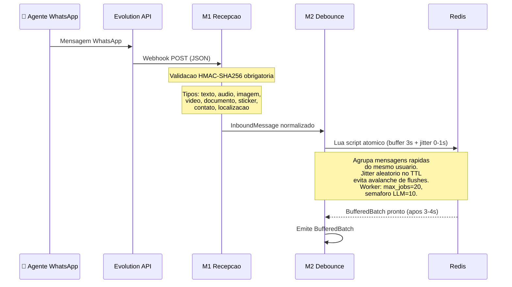
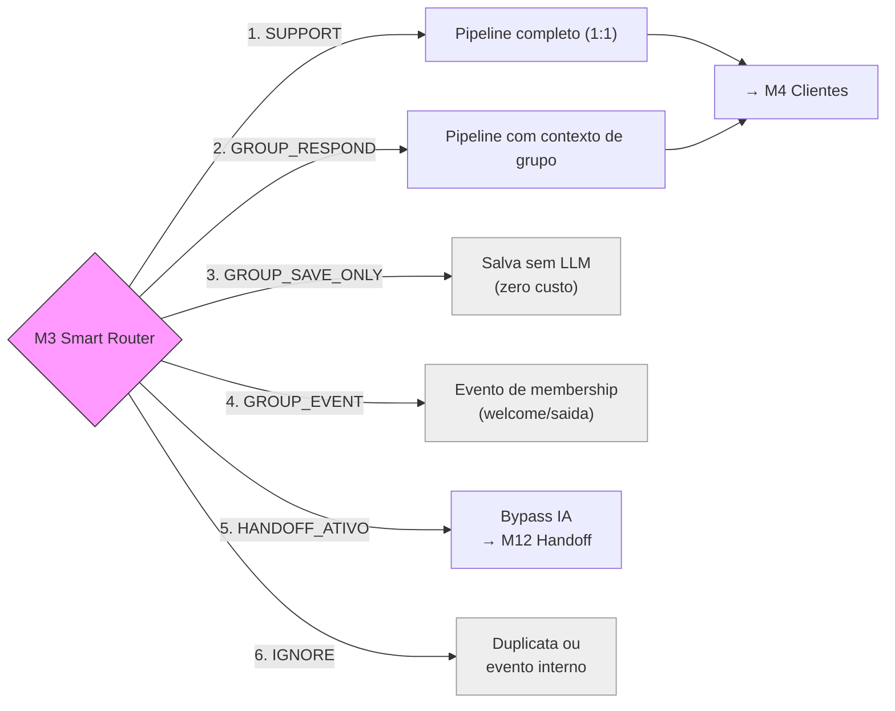
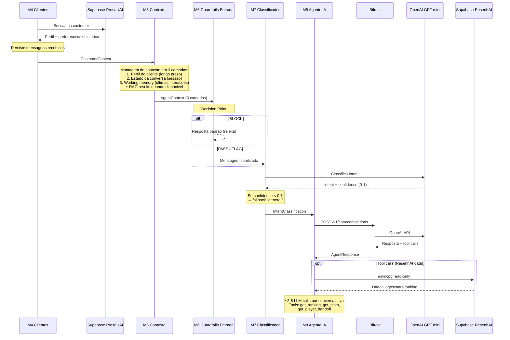
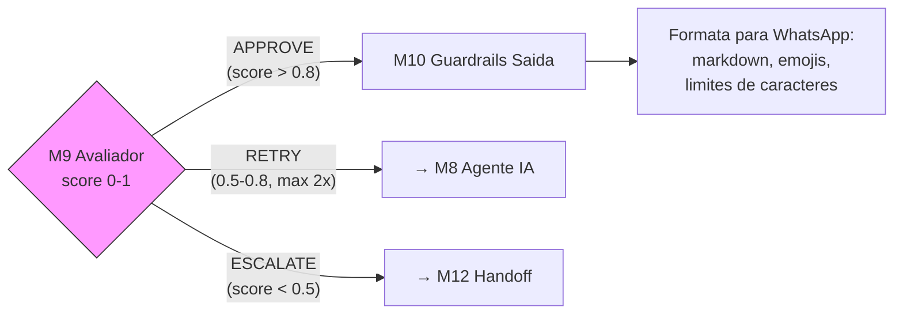
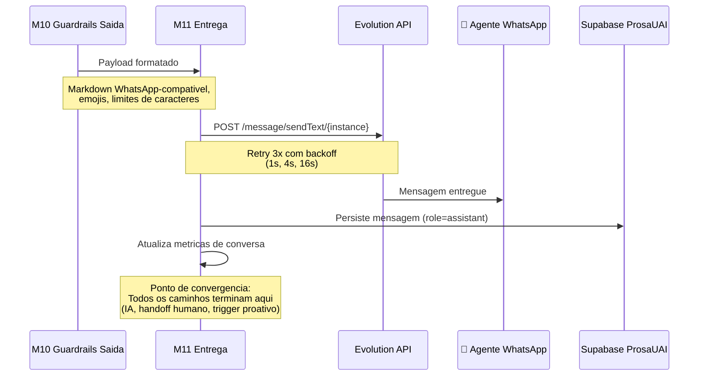
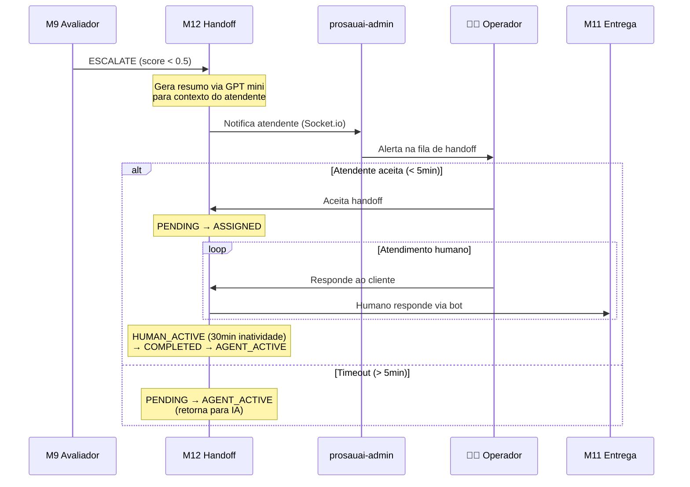
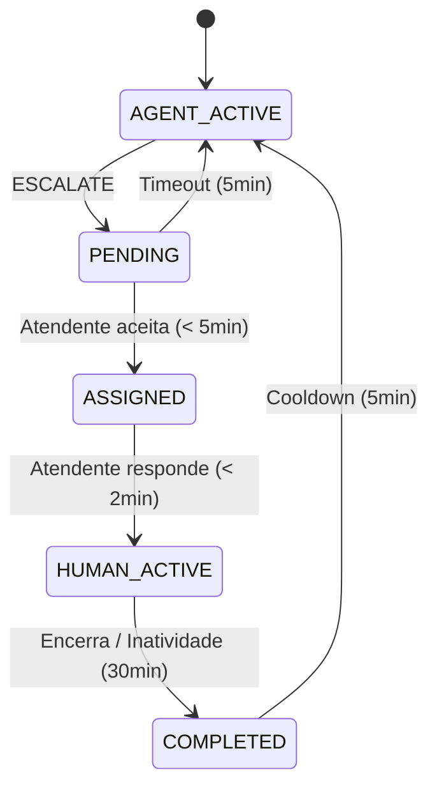
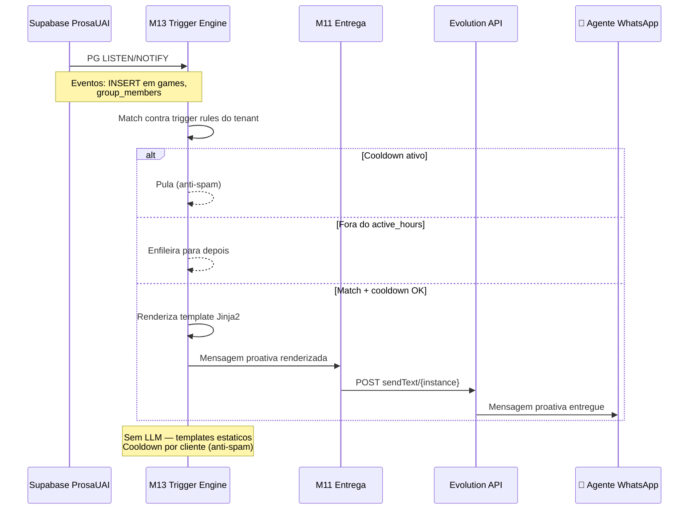
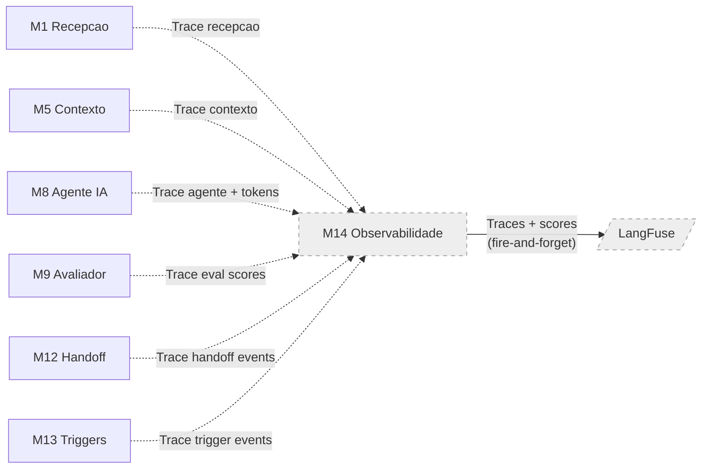

# Business Process — Pipeline Completo

Todos os caminhos da plataforma ProsaUAI: mensagem individual (1:1), grupo (@mention), handoff humano, triggers proativos. **14 modulos, 6 paths de roteamento, 3 decision points.**

> [→ Ver arquitetura de containers](../engineering/blueprint/#containers) | [→ Ver domain model](../engineering/domain-model/)

---

## Visao Geral do Pipeline

---

## Fases do Pipeline

### Fase 1: Entrada (Channel Inbound)

Recepcao, normalizacao e buffering de mensagens WhatsApp

### Fase 2: Decision Point #1 — Smart Router

5 caminhos possiveis de roteamento

**Caminhos:**
- **SUPPORT** → Pipeline completo para mensagem individual (1:1)
- **GROUP_RESPOND** → Mesmo pipeline, com contexto de grupo (@mention)
- **GROUP_SAVE_ONLY** → Salva mensagem no historico sem acionar LLM (zero custo)
- **GROUP_EVENT** → Evento de membership (welcome, saida de membro) — aciona trigger template sem LLM
- **HANDOFF_ATIVO** → Conversa ja escalada — bypass completo da IA, direto para atendente humano
- **IGNORE** → Duplicata detectada ou evento interno — descarta

### Fase 3: Pipeline Core (IA)

Gestao de cliente, contexto, guardrails, classificacao e agente IA

### Fase 4: Decision Point #3 — Avaliador de Qualidade

Aprovacao, retry ou escalacao para humano

**Criterios de decisao:**
- **APPROVE** (score > 0.8) → Resposta aprovada, segue para formatacao e entrega
- **RETRY** (score 0.5-0.8) → Volta para M8 Agente IA (maximo 2 tentativas antes de escalar)
- **ESCALATE** (score < 0.5 ou topico critico ou request explicito do usuario) → Handoff para humano

### Fase 5: Saida (Channel Outbound)

Entrega da resposta via Evolution API

### Fase 6: Handoff Humano

Maquina de estados para transferencia IA → humano

**State Machine do Handoff:**

### Fase 7: Triggers Proativos

Mensagens proativas baseadas em eventos — sem LLM

### Fase 8: Observabilidade (passiva)

Tracing distribuido e metricas de qualidade — fire-and-forget

**Stack de observabilidade:**
- **LangFuse**: Traces com spans por modulo (M1-M13)
- **DeepEval + Promptfoo**: Scores de eval (online + offline)
- **trace_id** = conversation_id (correlacao end-to-end)
- **Fire-and-forget**: falha na observabilidade NAO bloqueia o pipeline
- **Prompt versions**: source of truth no LangFuse

